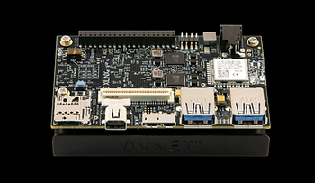
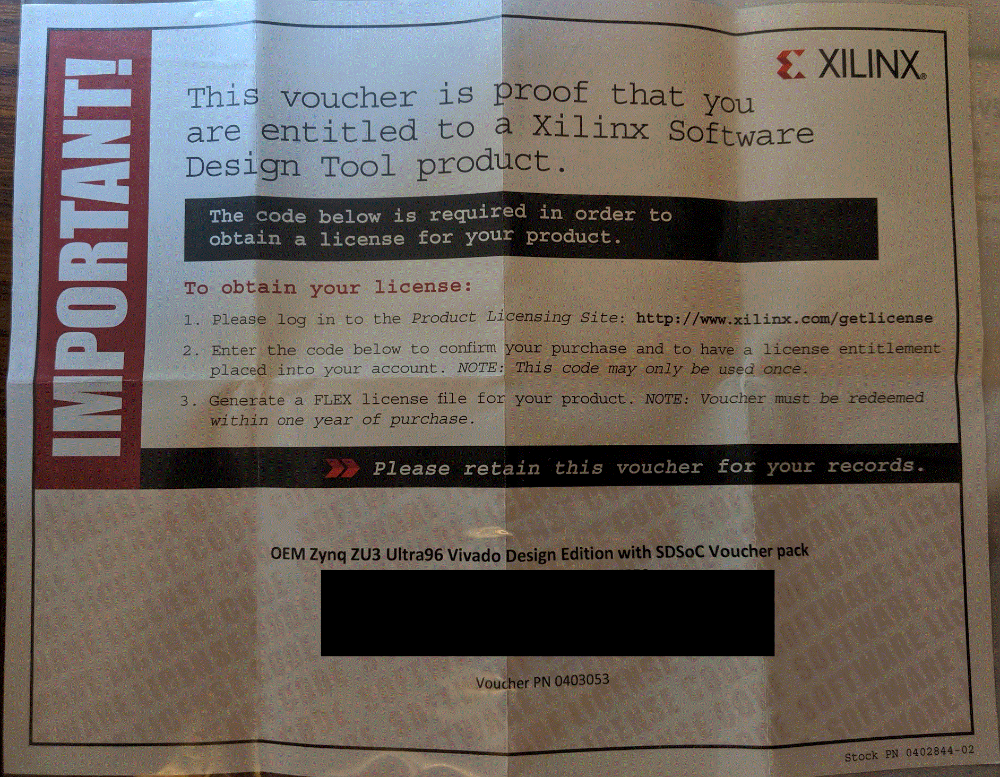

# Ultra96-V2 Hardware and Tools Initial Setup

1. If you do not already have an Avnet Account - create one. The Ultra96-V2 is an Avnet product.

2. Order (3) components from Avnet to have a usable Ultra96-V2 system with USB based JTAG and UART support: AES-ULTRA96-V2-G 

   AES-ACC-U96-JTAG 

   AES-ACC-U96-4APWR

3. If necessary, create an Xlilnx Acct. If you do not already have an acct, this can be done most easily by trying to download Vivado HLx 2019.1 at : [https://www.xilinx.com/support/download.html](https://www.xilinx.com/support/download.html) Attempt to download should trigger the Xilinx login or account creation.

4. If necessary install the Xilinx Vivado software suite. The Vivado software has two versions, Vivado HLx, which runs on your local machine, and Vivado Lab Edition which makes use of remote calls to Xilinx servers. The purchase of an Ultra96-V2 board includes a voucher for a license to enable the use of the Vivado HLx version. This procedure was developed using Vivado HLx 2019.1.3 (see note about 2019.1 next) though most of the Avnet documentation appears to have been written for 2018.2. The differences in this software appear to not impact the ability to follow the procedure(s). **Note:** You can download **Vivado 2019.1** at [<u>https://www.xilinx.com/member/forms/download/xef-vivado.html?filename=Xilinx_Vivado_SDK_Web_2019.1_0524_1430_Win64.exe</u>](https://www.xilinx.com/member/forms/download/xef-vivado.html?filename=Xilinx_Vivado_SDK_Web_2019.1_0524_1430_Win64.exe). **Note 2:** you do not need to use 2019.1.3 for this. If you need some help installing Vivado check out [https://www.centennialsoftwaresolutions.com/post/xilinx-2016-4-webpack-vivado-and-sdk-install-on-windows-7-sp1](https://www.centennialsoftwaresolutions.com/post/xilinx-2016-4-webpack-vivado-and-sdk-install-on-windows-7-sp1).

5. When opening the Vivado HLx application, the Application should prompt and open the _Manage Xilinx Licences_ interface. Unbox Ultra96-V2 and find the Xilinx License voucher contained. The License voucher should look like the image below and should be contained in the box with the AES-ULTRA96-V2-G product. Your individual key will be located where the black box is on the image below.

1.  Using the *Manage Xilinx Licenses* interface and the voucher, create a license file.  This license file will be mailed to a provided email.  Once again, using the *Manage Xilinx Licenses* interface, select all available Zynq UltraScale+ devices and any others based upon desire and available disk space. Apply the License to your Xilinx tools installation.

The support site with the most rich set of documents for the Ultra96 is given at zedboard.org. There appears to exist multiple mirrors of zedboard.org including ultra96.org and avnet.me. The remainder of the procedure will reference multiple tutorials available from the following URLs: http://zedboard.org/support/documentation/24166  http://zedboard.org/support/design/24166/156  

1. It may be necessary to create an account at [zedboard.org](http://zedboard.org/) to be able to access the support files for the Ultra96-V2.
2. The Xilinx software as downloaded and installed will only contain the Xilinx supported Board Definition Files (BDF). It is necessary to install the Avnet provided BDF for the  Ultra96-V2.  The first tutorial procedure will install the Avnet BDF for the Ultra96-V2.  
3. Download from Github the BDF provided by Avnet for the Ultra96-V2.  Follow the procedure for Installing given in the following file: http://zedboard.org/sites/default/files/documentations/Installing-Board-Definition-Files_v1_0.pdf The necessary files are located at: https://github.com/Avnet/bdf  Copy the BDF for the desired boards into your Vivado installation while you have no Xilinx tools open or active. To support the Ultra96-V2 only that directory need be copied into the \data\boards\board_files directory of the Vivado installation. 
4. Tutorial # 1 from Avnet http://zedboard.org/sites/default/files/design/01_Ultra96_Vivado_Intro_2018_2_01.zip This tutorial will create the Hardware Platform in Vivado If you encounter a problem in Step # 6 where selecting an RTL Project is not an available option - verify you are using Vivado HLx and not Vivado Lab Edition.  
5. Tutorial # 2 from Avnet http://zedboard.org/sites/default/files/design/02_Ultra96_Vivado_Hello_World_2018_2_01.zip This tutorial will create the software support BSP based upon the provided hardware (presumably created in Tutorial # 1) and allow the user to run custom *.c software.  After Step # 4 on Page 13, it is strongly advised that you open the HelloWorld.c file under the Hello_Ultra96 Application and change the Hello string in the print() function call to something personal and/or unique to provide confidence that you are running live software. It is advised that you use the Terminal contained in the Xilinx SDK, marginal results were observed using Putty. If you experience lockup with the Xilinx SDK, one technique which has resolved this is to use the RESET button (SW2) on the Ultra96-V2 which has in some situations brought life back to the Xilinx SDK.
6. At the completion of Tutorial [#2](https://www.centennialsoftwaresolutions.com/blog/hashtags/2) - you have verified a running Xilinx environment and a running Avnet Ultra96-V2 board. At this point your next step(s) depend upon your specific application. Other Avnet, Xilinx and Centennial Software Solutions tutorials exist to assist. 

OPTIONAL: The connection between the  ULTRA96-V2 and the ACC-U96-JTAG is subjectively fragile. The bottom of the Ultra-96-V2 has (4) threaded 4-40 fittings; the ACC-U96-JTAG has a single drill hole through the board for mechanical support.  These accommodations may be used to mount the combined assembly to a support plate for mechanical rigidity, as shown in the image below.

Some steps of this procedure are from memory, as it was desirable to not uninstall and  reinstall to develop the procedure, corrections or images/screen-captures from the process are greatly appreciated.  Any comments or improvements to this procedure are appreciated. Feel free to put suggested or requested changes in the comments and they will be incorporated after review.