# Upgrade Android Studio to 3.1 or Higher and Install Android SDK for API level 28 (Android 9.0)

This post demonstrates how to upgrade Android Studio to 3.1 or Higher and install Android SDK for API level 28 (Android 9.0).

**<u>Upgrade Android</u>**

1\. Start Android Studio

2\. Click (A) **Help** then (B) **Check for Updates**

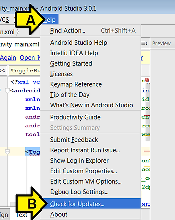

3\. Click **Update and Restart**

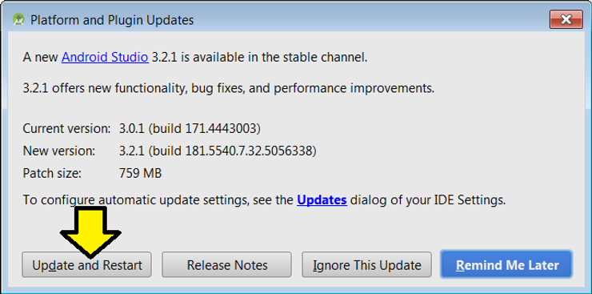

Note: the **Current version** and **New version** may be different

You should see:

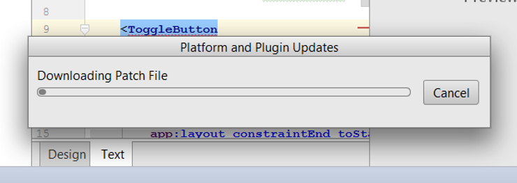

5\. Click **Yes** after the screen dims

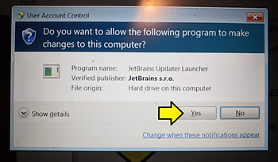

You should see:

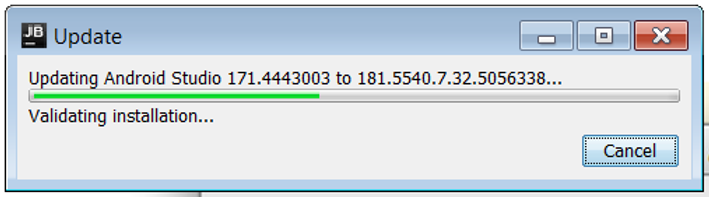

6\. Click **OK**

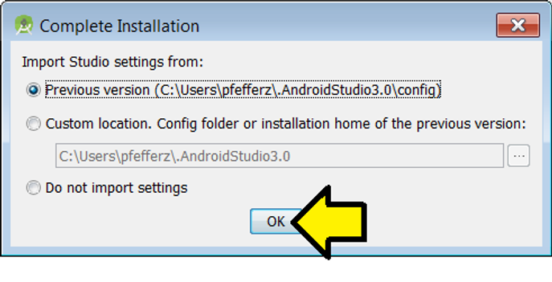

Android Studio will restart

**<u>Install Android SDK for API level 28 (Android 9.0)</u>**

1\. Click (A) **File** then (B) **Settings...**

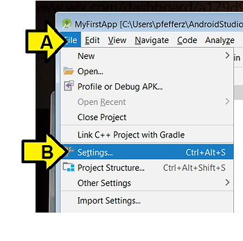

2\. Type SDK into the search window

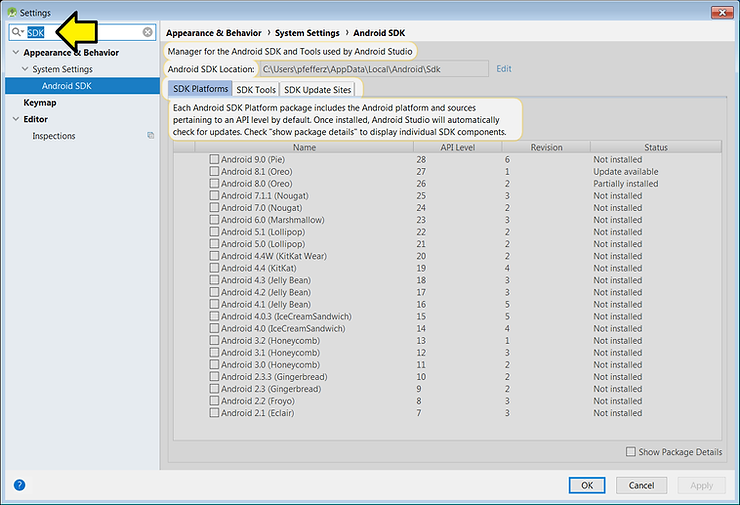

3\. (A) Click the **Android 9.0 (Pie)** checkbox and (B) click **Apply**

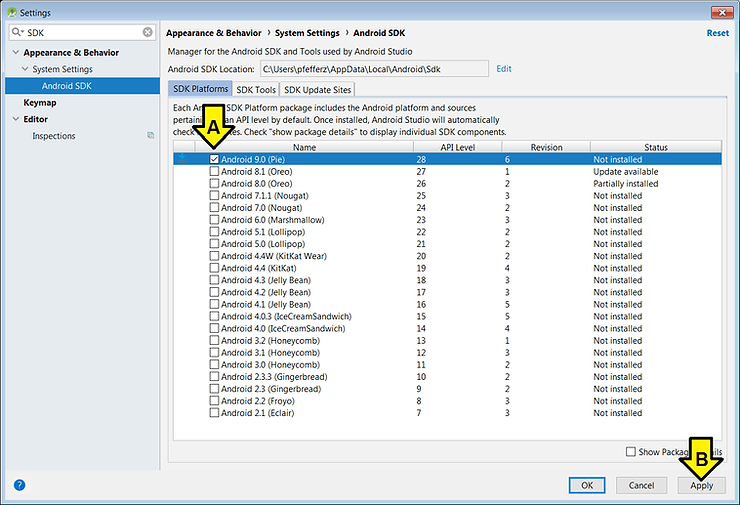

4\. Click **OK**

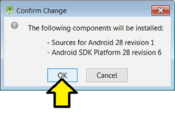

You see this window pop up

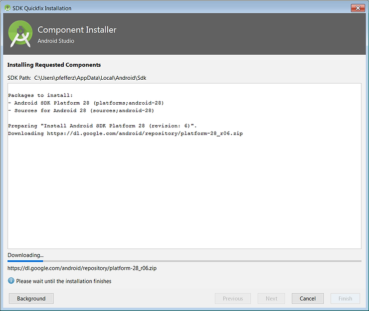

5\. Click **Finish**

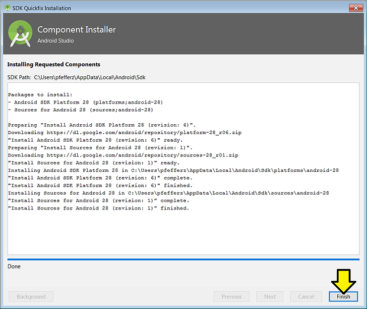

6\. Click **OK**

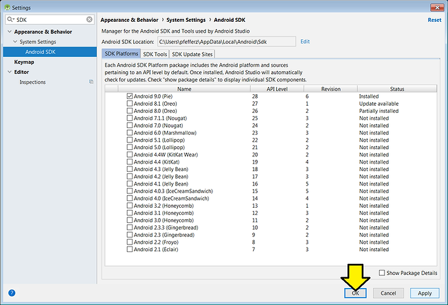

**<u>References</u>**

-   Android Studio icon from \[[<u>link</u>](https://upload.wikimedia.org/wikipedia/commons/thumb/3/34/Android_Studio_icon.svg/500px-Android_Studio_icon.svg.png)\]