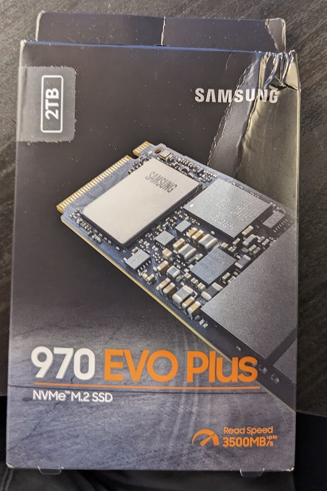

# Upgrading a Lenovo P52 M.2 MZ-VLB1T0B 1TB SSD to a 2TB Samsung 970 EVO Plus MZ-V782T0

This post covers upgrading a Lenovo P52 M.2 MZ-VLB1T0B 1TB SSD to a 2TB Samsung 970 EVO Plus MZ-V782T0, cloning the old disk to the new one, booting off the new one, and installing a second drive. It also lists links to Lenovo hardware maintenance documentation and links to a detailed listing of the P52.

## System Details

https://www.zachpfeffer.com/single-post/2020/08/24/new-lenovo-p52-thinkpad-system-information 

## Instructions for Hardware Drive Replacement

Follow the instructions to replace "M.2 solid-state drive" FRU @ "1030 Storage drive" in ThinkPad P52 Hardware Maintenance Manual \[[link](http://drive.google.com/file/d/1xdKgR5ywl4Pcc9cBkGfMPm1G8HlRoVBC/view?usp=sharing)\]

FRU stands for "Field Replacement Unit," see https://support.lenovo.com/us/en/solutions/ht118572-what-is-a-field-replacement-unit-fru-service-part .

## The Drive Being Replaced

We're replacing a Samsung **MZVLB1T0HBLR-000L7** (MZ-VLB1T0B) https://semiconductor.samsung.com/us/ssd/pc-ssd/pm981a/mzvlb1t0hblr-00-00-07/ 

Specification

Model: PM981a

Interface: PCIe 3.0 x4

Form Factor: M.2

Capacity: 1 TB

Sequential Read (128 KB): 3500 MB/s

Sequential Write (128 KB): 3000 MB/s

Random Read (4 KB): 580K IOPS

Random Write (4 KB): 500K IOPS

Product Status: Archived

## The Drive We're Installing

...with a **Samsung SSD 970 EVO Plus**

### Specs

https://www.samsung.com/us/computing/memory-storage/solid-state-drives/ssd-970-evo-plus-nvme-m-2-2-tb-mz-v7s2t0b-am/#specs

Model: MZ-V782T0

Type

Product Type

NVMe SSD

Storage Type

Internal

Interface

PCIe Gen 3.0 x4, NVMe 1.3

Read/Write Speeds

3,500/3,300 MB/s

Usage Application

Client PCs

Series

970 EVO Plus

Application

Consumer

Yes

Storage

Capacity

2,000GB (1GB=1 Billion byte by IDEMA) \* Actual usable capacity may be less (due to formatting, partitioning, operating system, applications or otherwise)

Key Features

Sequential Read Speed **(Same)**

Up to 3,500 MB/s \* Performance may vary based on system hardware & configuration

Sequential Write Speed **(300 MB/s faster)**

Up to 3,300 MB/s \* Performance may vary based on system hardware & configuration

Random Read Speed

Random Read (4KB, QD32): Up to 620,000 IOPS; Random Read (4KB, QD1): Up to 19,000 IOPS \* Performance may vary based on system hardware & configuration

Random Write Speed

Random Write (4KB, QD32): Up to 560,000 IOPS; Random Write (4KB, QD1): Up to 62,000 IOPS \* Performance may vary based on system hardware & configuration

Controller

In-house

NAND Flash

Samsung V-NAND 3-bit MLC

Cache Memory

Samsung 2GB Low Power DDR4 SDRAM

Trim Support (TRIM support helps the operating system organize data efficiently)

Supported

AES Encryption (Types of software and hardware encryption that is supported)

AES 256-bit Encryption (Class 0)TCG/Opal IEEE1667 (Encrypted drive)

Security

AES 256-bit Full Disk Encryption, TCG/Opal V2.0, Encrypted Drive (IEEE1667)

S.M.A.R.T. Support (Self-Monitoring, Analysis and Reporting Technology is a monitoring system that help the drive detect errors and reports reliability issues)

Supported

GC (Garbage Collection) (GC is similar to TRIM support which helps the drive organize data)

Auto Garbage Collection Algorithm

WWN Support

Not supported

Device Sleep Mode Support

Yes

Internal Storage (Drive is situated inside the device)

Samsung V-NAND 3-bit MLC

Temperature proof

Yes

NVMe (NVMe (Non-Volatile Memory Express) is an open logical-device interface specification for accessing non-volatile storage media attached via PCI Express bus.)

Yes

Gaming SSDs

Yes

M.2 2280

Yes

General

Average Power Consumption (system level) (Average during normal operations of the device, Actual power consumption may vary depending on system hardware & configuration)

\*Average: 6 W\*Maximum: 9 W (Burst mode)\* Actual power consumption may vary depending on system hardware & configuration

Power consumption (Idle) (Power consumption at an idle state)

Max. 30 mW \* Actual power consumption may vary depending on system hardware & configuration

Voltage (Amount of power require to operate the device)

3.3 V ± 5 % Allowable voltage

Reliability (MTBF) (Life span of the device measured in MTBF)

1.5 Million Hours Reliability (MTBF)

Environmental Specs

Operating Temperature

0 - 70 ℃ Operating Temperature

Shock (The amount of force the device can sustain before serious damage is caused)

1,500 G & 0.5 ms (Half sine)

Form Factor (The size, configuration or physical arrangement of drive)

Product

M.2 (2280)

Dimensions (W x H x D) (The size, configuration or physical arrangement of drive)

Product

3.16" x 0.87" x 0.09"

Weight (The size, configuration or physical arrangement of drive)

Product

0.3 oz.

Software

Management SW

Magician Software for SSD management

Warranty (The size, configuration or physical arrangement of drive)

Product

5-Year Limited Warranty or: 1200 TBW Limited Warranty

## Unboxing

Model: MZ-V782T0

Model Code: MZ-V7S2T0B/AM

## Installing

\# Remove the battery

\# Remove the cover

\# Make sure the drive is fully seated:

\# Reinstall the back cover and battery

\# Boot the computer

\# Make sure the drive shows up in the Device Manager (if you failed to seat it completly, it won't show up).

## Install the Support Tools

https://semiconductor.samsung.com/consumer-storage/support/tools/ 

\# Run the Samsung Migration tool

\# Update the Samsung tool to the latest version

## Do Data Migration From the Old Drive to the New

\# Close all applications

\# Clone

\# Clone progress

\# Boot from the new drive: Reboot, and press F12 during boot to enter the Windows Boot Manager:

\# Check the new drive in Windows Explorer

\# Check the drive in Samsung's tool:

\# Install the Second Drive

## Format The Second Drive

\# Open: Disk Management

\# Choose GPT

MBR vs. GPT: Which Should You Use for Your SSD?

[https://www.makeuseof.com/tag/mbr-vs-gpt/#:~:text=MBR%20vs.%20GPT%3A%20Which%20Is,newer%20and%20more%20reliable%20standard.](https://www.makeuseof.com/tag/mbr-vs-gpt/#:~:text=MBR vs. GPT%3A Which Is,newer and more reliable standard.) 

Should I use MBR or GPT when I intend to use both Ubuntu and Windows?

[https://askubuntu.com/questions/1364349/should-i-use-mbr-or-gpt-when-i-intend-to-use-both-ubuntu-and-windows#:~:text=Both%20Windows%20and%20Ubuntu%20support,sometimes%20get%20picky%20with%20MBR.](https://askubuntu.com/questions/1364349/should-i-use-mbr-or-gpt-when-i-intend-to-use-both-ubuntu-and-windows#:~:text=Both Windows and Ubuntu support,sometimes get picky with MBR.) 

Windows and GPT FAQ

https://learn.microsoft.com/en-us/windows-hardware/manufacture/desktop/windows-and-gpt-faq?view=windows-11 

\# Right-click. select

Done!

## This post covered upgrading a Lenovo P52 M.2 MZ-VLB1T0B 1TB SSD to a 2TB Samsung 970 EVO Plus MZ-V782T0.

## Issues that Popped Up

Adobe Acrobat failed to start. After logging into Adobe's account manager via Adobe Acrobat, I had to "log off" my machine and log back on. I found this issue when I tried to create a PDF from Chrome, and I got an error message. I had to close and relaunch Chrome to fix it.

## References

Lenovo icon clipped from

https://www.lenovo.com/us/en/?orgRef=https%253A%252F%252Fwww.google.com%252F