# Use ZC702 serial and JTAG in a VMWare Ubuntu 22.04.1 VM on VMware Workstation 16 Pro on Windows 10


This post shows how to use ZC702 serial and JTAG in a VMWare Ubuntu 22.04.1 VM on VMware Workstation 16 Pro running on Windows 10. It shows how to apply a fix to the VM's VMX file to enable USB devices to connect to the VM, how to configure Minicom to talk to the serial port, and how to configure the ZC702 board to enable Vivado to connect to the JTAG port via USB.

## Related Posts

Install Ubuntu 22.04.1 in VMware and Launch the Vivado 2023.1 Installer

https://www.centennialsoftwaresolutions.com/post/install-ubuntu-22-04-1-in-vmware-and-launch-the-vivado-2023-1-installer 

Install 2023.1 Vivado ML Enterprise On Ubuntu 22.04.1

https://www.centennialsoftwaresolutions.com/post/install-2023-1-vivado-ml-enterprise-on-ubuntu-22-04-1 

Run the Xilinx ZC702 Built-In Self-Test on Windows 10

https://www.centennialsoftwaresolutions.com/post/run-the-xilinx-zc702-built-in-self-test-on-windows-10 

## Check Versions

\# Get the Windows Version Windows

```
systeminfo /fo csv | ConvertFrom-Csv | select OS*, System*, Hotfix* | Format-List -Property 'OS Version'
# OS Version : 10.0.19045 N/A Build 19045
```

```
$PSVersionTable
# Name                           Value
# ----                           -----
# PSVersion                      5.1.19041.2673
# PSEdition                      Desktop
# PSCompatibleVersions           {1.0, 2.0, 3.0, 4.0...}
# BuildVersion                   10.0.19041.2673
# CLRVersion                     4.0.30319.42000
# WSManStackVersion              3.0
# PSRemotingProtocolVersion      2.3
# SerializationVersion           1.1.0.1
```

\# Check VMWare Version

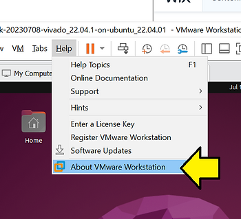

\# Version Summary

Ubuntu 22.04.1

VMware® Workstation 16 Pro 16.2.4 build-20089737

Windows 10 PSVersion: 10.0.19041.2673

## Edit VMX So USB Devices Can Connect to the VM

\# Locate the VMX file


\# Open "C:\\Users\\Zach Pfeffer\\Documents\\Virtual Machines\\vmwaredisk-20230708-vivado\_22.04.1-on-ubuntu\_22.04.01\\vmwaredisk-20230708-vivado\_22.04.1-on-ubuntu\_22.04.01.vmx"

\# Change:

usb.restrictions.defaultAllow = "FALSE"

To:

usb.restrictions.defaultAllow = "TRUE"

## Connect The Serial Port

\# Attach a USB hub to your computer

I used a Targus USB 3.0 4-port HUB model #: ACH124 (Avaialbe at https://www.amazon.com/Targus-4-Port-USB-3-0-ACH124US/dp/B00P937GQ4 )

\# Power off the ZC702

\# Connect a Mini-B USB cable to the JTAG module

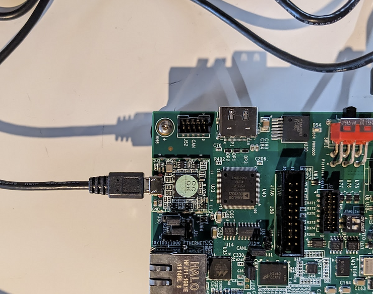

\# Power on the ZC702

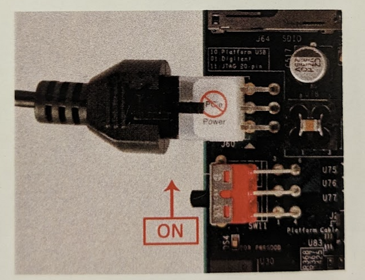

You should see:

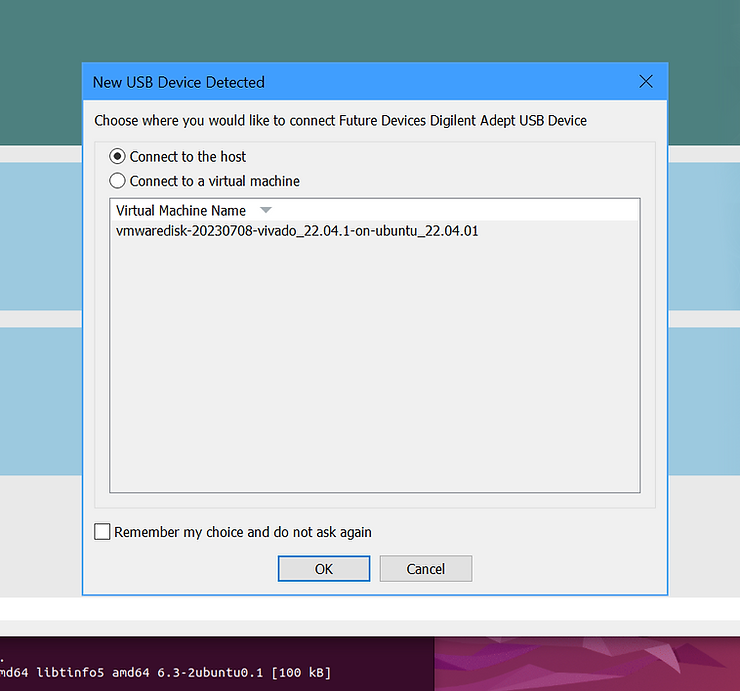

\# Select **Connect to a virtual machine**, select the **virtual machine,** and click **OK**

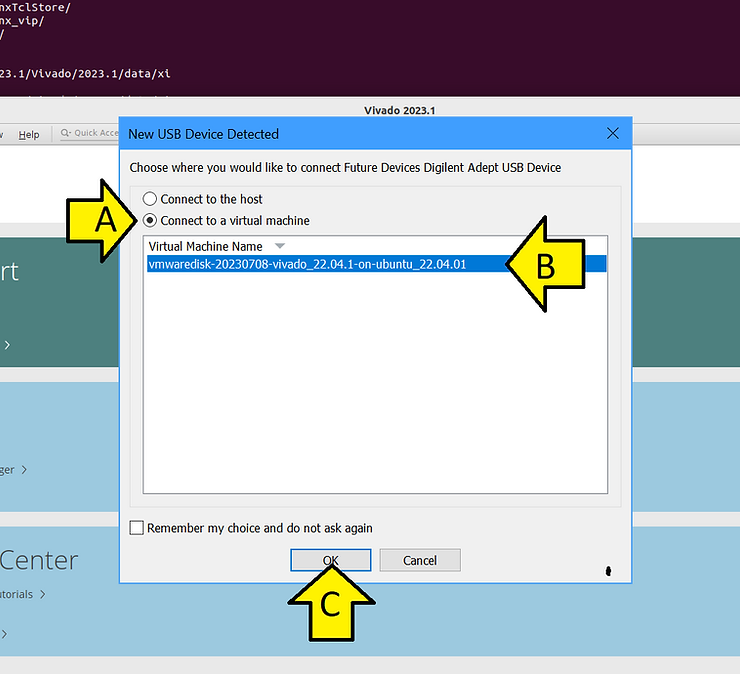

## Set Up Minicom to Test the Serial Port)

See this link for more explicit instructions:

https://www.centennialsoftwaresolutions.com/post/configure-minicom-for-a-usb-to-serial-converter 

\# Add demouser to dialout (use your username)

```
sudo usermod -a -G dialout demouser
```

\# Log out and back in

\# Check tty

```
sudo dmesg | grep ttyUSB
```

You should see:

```
[   51.667710] usb 3-2: cp210x converter now attached to ttyUSB0
[  627.308359] usb 3-4.1: FTDI USB Serial Device converter now attached to ttyUSB1
[  627.309684] usb 3-4.1: FTDI USB Serial Device converter now attached to ttyUSB2
```

\# Install

```
sudo apt-get install minicom
```

\# Set up

```
sudo minicom -s
```

\# Scroll to Serial port setup

Use:

```
A -    Serial Device      : /dev/ttyUSB0
B - Lockfile Location     : /var/lock
C -   Callin Program      :
D -  Callout Program      :
E -    Bps/Par/Bits       : 115200 8N1
F - Hardware Flow Control : No
G - Software Flow Control : No
H -     RS485 Enable      : No
I -   RS485 Rts On Send   : No
J -  RS485 Rts After Send : No
K -  RS485 Rx During Tx   : No
L -  RS485 Terminate Bus  : No
M - RS485 Delay Rts Before: 0
N - RS485 Delay Rts After : 0
```

\# Select **Save setup as dfl**

\# Select **Exit from Minicom**

\# Run

```
minicom
```

\# Press SW1

You should see:

```
********************************************************
********************************************************
**    Xilinx Zynq-7000 AP SoC ZC702 Evaluation Kit    **
********************************************************
********************************************************
Choose Feature to Test:
1: UART Test
2: LED Test
3: IIC Test
4: TIMER Test
5: SWITCH Test
6: SCUGIC Test
7: DCFG Test
8: DDR3 Memory Test
9: Interrupt Test
A: Watchdog Timer Test
0: Exit
```

## Open Hardware Manager and Connect to JTAG

\# Run Vivado and click Open Hardware Manager

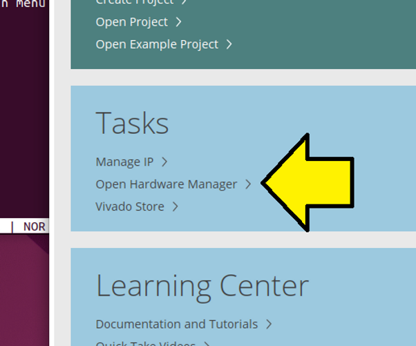

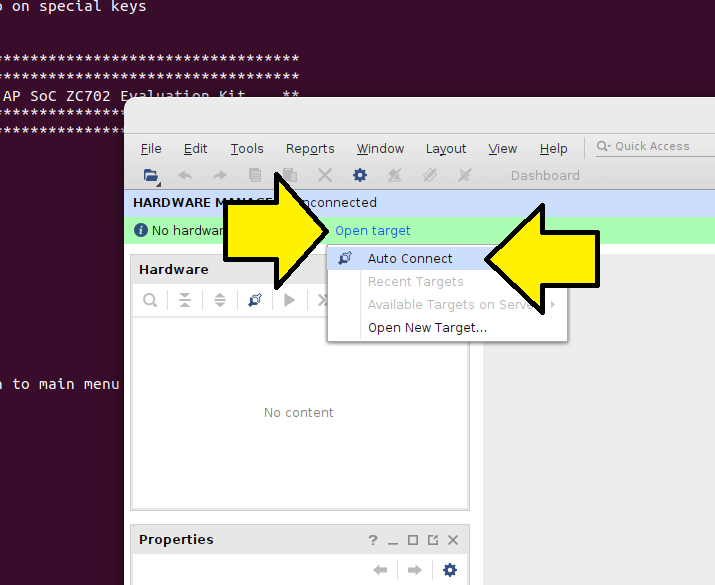

If you see this, its likely that SW10 is not set correctly or is still in its default:

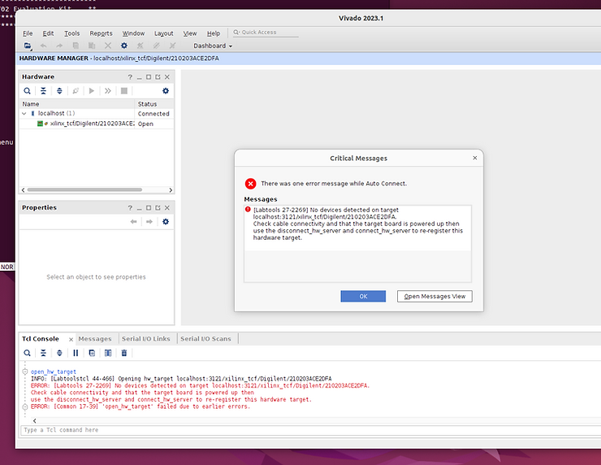

\# Turn off the ZC702

\# Switch SW10 to:

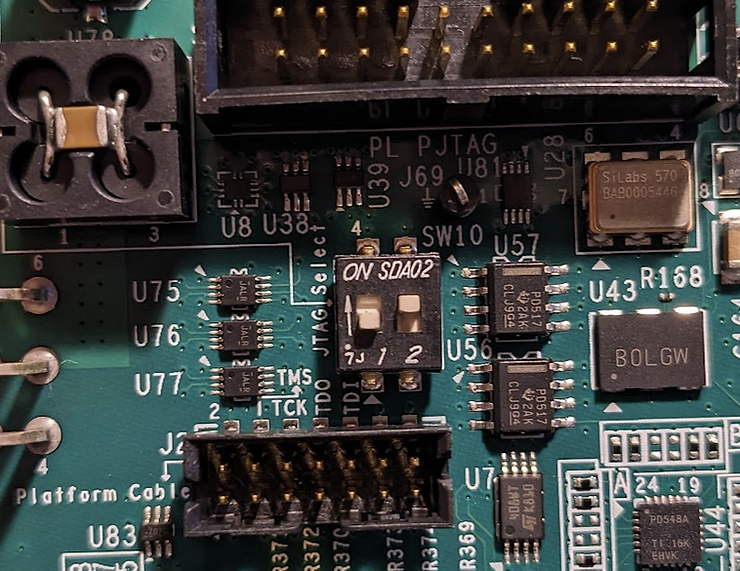

...per:

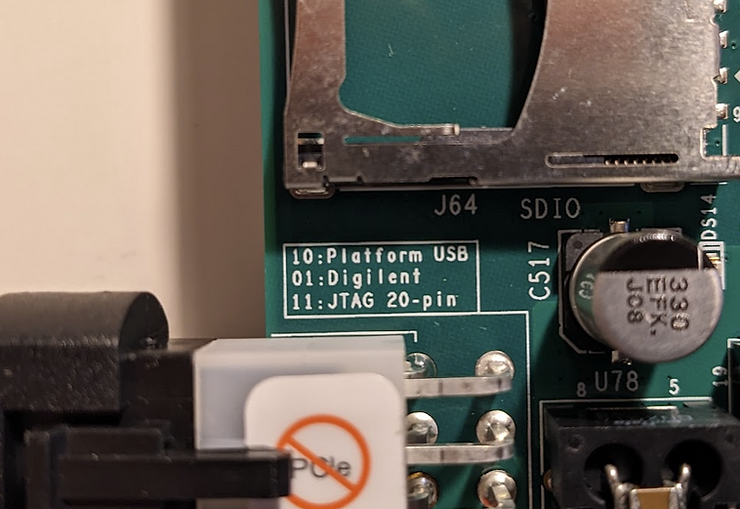

\# Turn on the ZC702

\# Connect the JTAG device to the VM

You should see:

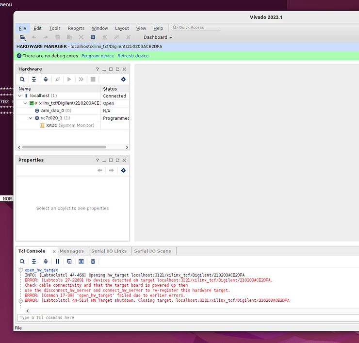

## Try readback\_hw\_device

\# In Vivado ...

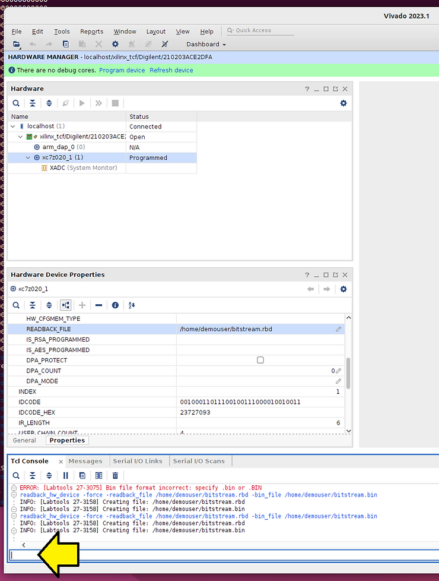

...run:

```
readback_hw_device -readback_file /home/demouser/bitstream.rbd -bin_file /home/demouser/bitstream.bin
```

You should see:

```
INFO: [Labtools 27-3158] Creating file: /home/demouser/bitstream.rbd
INFO: [Labtools 27-3158] Creating file: /home/demouser/bitstream.bin
```

The first part of bitstream.rbd:

```
00000000000000000000000000000000
00000000000000000000000000000000
00000000000000000000000000000000
00000000000000000000000000000000
00000000000000000000000000000000
00000000000000000000000000000000
00000000000000000000000000000000
00000000000000000000000000000000
00000000000000000000000000000000
00000000000000000000000000000000
00000000000000000000000000000000
00000000000000000000000000000000
00000000000000000000000000000000
00000000000000000000000000000000
00000000000000000000000000000000
```

### This post has shown how to use ZC702 serial and JTAG in a VMWare Ubuntu 22.04.1 VM on VMware Workstation 16 Pro on Windows 10.

## References

Xilinx UG926 Zynq-7000 All Programmable SoC: ZC702 Evaluation Kit and Video and Imaging Kit Getting Started Guide (ISE Design Suite 14.5)

https://docs.xilinx.com/v/u/4.0-English/UG926_Z7_ZC702_Eval_Kit 


All USB devices are greyed out

https://communities.vmware.com/t5/VMware-Workstation-Player/All-USB-devices-are-greyed-out/m-p/2878267/highlight/true#M38018