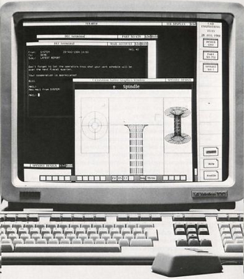

# Vim is Stuck!

This post lists Control-q which may un-stuck Vim. It also lists some history about the problem.

Try **Control + q**

If this worked, you pressed Control + s in a **terminal emulator** like GNOME Terminal.

In a terminal Control + s stops terminal output. Control + q restarts it.

**References**

-   Steve Oualline lists this on p156 of Vi IMproved-Vim ISBN: 0-7357-1001-5 available from Amazon at [link](http://www.amazon.com/Vi-iMproved-VIM-Steve-Oualline/dp/0735710015).
    
-   This [link](http://unix.stackexchange.com/questions/12107/how-to-unfreeze-after-accidentally-pressing-ctrl-s-in-a-terminal) from [unix.stackexchange.com](http://unix.stackexchange.com/questions/12107/how-to-unfreeze-after-accidentally-pressing-ctrl-s-in-a-terminal) also provides the answer and gives \_a\_ history about it.
    
-   The VAXstation 100 pic is a screen capture from [link](http://archive.org/stream/bitsavers_decgraphicn100TechnicalSummary1984_7882196/ED-26109-51_VAXstation_100_Technical_Summary_1984#page/n9/mode/2up)
    

**More Info**

-   Terminals from Wikipedia @ [link](http://en.wikipedia.org/wiki/Computer_terminal)
    
-   According to [this](http://en.wikipedia.org/wiki/GNOME_Terminal) Wikipedia article the GNOME Terminal emulates the xterm terminal emulator
    
-   According to [this](http://en.wikipedia.org/wiki/Xterm) Wikipedia article the xterm terminal emulator emulates the VAXStation 100 (VS100)
    
-   The VAXstation 100 USER'S GUIDE is [here](http://bitsavers.trailing-edge.com/pdf/dec/vax/vaxstation100/AA-N660A-TE_VAXstation_100_Users_Guide_Jun84.pdf)