# Vivado Constraint Wizard Step-by-Step

This post presents how to run the Vivado constraint wizard step-by-step. It presents steps from the Xilinx Quick Take video @ \[[<u>link</u>](https://youtu.be/UmQ0PUEaOuk)\] + additional info from Altera to help calculate the delays needed to create the constraints.

**<u>Versions Used</u>**

Vivado 2014.1

**<u>Contents</u>**

The Hard Part: Board Delays and Examining Circuits

UltraFast design Methodology

Part 1: Prepare to Run Timing

Part 2: Examine the Exiting Constraints and Timing Reports

Part 3: Create an Empty Constraint File for the Wizard

Part 4: Using the Constraint Wizard

**<u>The Hard Part: Board Delays and Examining Circuits</u>**

In addition to driving the tools, constraint analysis depends on entering accurate delays into the constraints. Application Note 366: **Understanding I/O Output Timing for Altera Devices** @ \[[<u>link</u>](https://www.intel.com/content/dam/www/programmable/us/en/pdfs/literature/an/an366.pdf)\] presents 3 methods to find board delays and tco (clock to data out):

1\. Use the default.

This is likely wrong because the tco listed in the datasheet will not be based on the loading of your board

2\. Hand PCB Delay Analysis (if you don't have access to IBIS or HSPICE models)

Use rule of thumb calculations to calculate the system tco based on the actual loading. Rule-of-thumb copper delay calculations (for example, 166 ps per inch for FR4 trace).

3\. I/O Model Simulation Analysis (the right way)

Simulate the output driver, transmission line, and input receiver using IBIS and HSPICE I/O models to predict the effects of the receiver, transmission lines, connectors, termination resistors, and so on on the output signal. Although these electrical models are predominantly

used for signal integrity analysis, they can provide valuable delay information through interconnects and transmission lines.

**<u>UltraFast design Methodology</u>**

Xilinx suggests users follow the “UltraFast design Methodology”:

1\. Define all the clocks that exist in your design

2\. Then **specify the interactions between these clocks**

3\. Next **constraint all your inputs and outputs**

4\. And finally, cautiously and sparingly add timing exceptions such as: false paths and multicycle paths

What this means practically, is that you're run the wizard multiple times. During the first run you'll uncheck the Input and Output Delays and just get the clocks worked out, then work on Input and Output delays in subsequent runs.

**<u>Part 1: Prepare to Run Timing</u>**

Step: Run synthesis (the timing constraint wizard operates on a gate-level netlist)

**<u>Part 2: Examine the Exiting Constraints and Timing Reports</u>**

Step 1: Click Open Synthesized Design

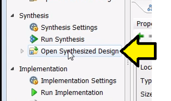

Step 2: Look at the existing constraints file (if any)

A. Click **Sources**

B. Expand **Constraints** and click on the **xdc** file

C. View the XDC file

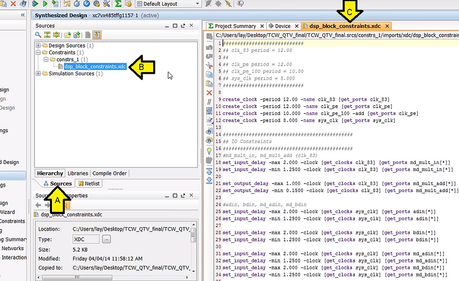

Step 3: Run **Report Timing Summary** to see what may need to be constrained to meet timing (and to check timing)

A. Click **Report Timing Summary**

B. Click **OK**

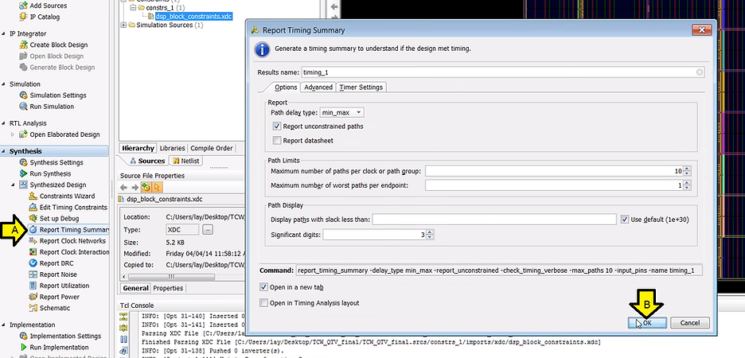

C. See that the design fails timing (negative slack means timing has failed, see \[[<u>link</u>](https://www.centennialsoftwaresolutions.com/blog/timing-analysis-concepts-terminology)\] for slack definition)

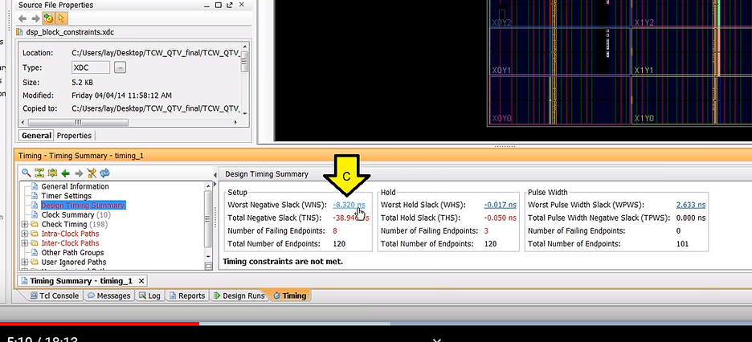

D. Examine each issue that the constraint wizard is supposed to clean up:

D1. no\_clock

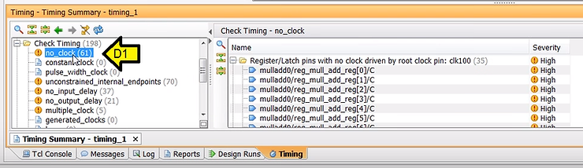

From \[[<u>link</u>](https://www.xilinx.com/support/documentation/sw_manuals/xilinx2018_2/ug949-vivado-design-methodology.pdf#page=155)\]: **no\_clock** is an "active clock pin that is not reached by a defined clock," i.e. you haven't defined a clock that reaches the pin or a generated clock hasn't reached the pin

D2. unconstrained\_internal\_endpoints

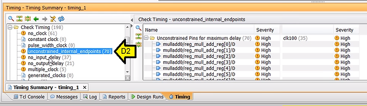

From \[[<u>link</u>](https://www.xilinx.com/support/documentation/sw_manuals/xilinx2018_2/ug949-vivado-design-methodology.pdf#page=155)\]: **unconstrained\_internal\_endpoints** is an "all the data input pins of sequential cells that have a timing check relative to a clock but the clock has not been defined," i.e. you need to define the clock input of a register.

Note: if **no\_clock** & **unconstrained\_internal\_endpoints** both return 0 "timing analysis coverage will be high \[[<u>link</u>](https://www.xilinx.com/support/documentation/sw_manuals/xilinx2018_2/ug949-vivado-design-methodology.pdf#page=155)\]."

D3. no\_input\_delay

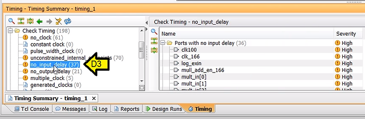

D4. no\_output\_delay

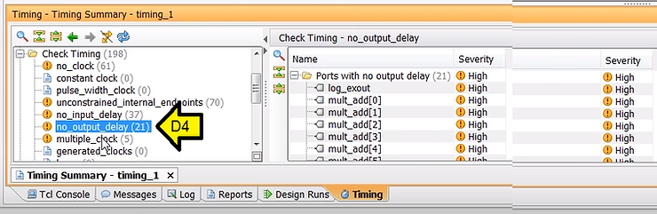

D5. multiple\_clock

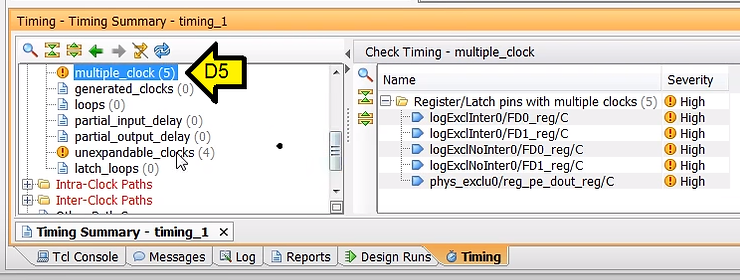

From \[[<u>link</u>](https://www.xilinx.com/support/documentation/sw_manuals/xilinx2018_2/ug949-vivado-design-methodology.pdf#page=168)\] **multiple\_clock** "identifies the clock pins that are reached by more than one clock and a set\_clock\_groups or set\_false\_path constraint has not already been defined between these clocks."

D6. unexpandable\_clocks

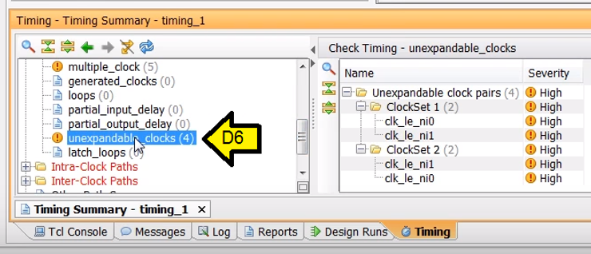

From \[[<u>link</u>](https://www.xilinx.com/support/documentation/sw_manuals/xilinx2018_2/ug949-vivado-design-methodology.pdf#page=167)\] **unexpandable\_clocks** do not share a common period within 1000 cycles.

Step 4: Run **Report Timing Summary** to look at all the clock domain crossings (CDCs); a definition of a CDC can be found at \[[<u>link</u>](https://filebox.ece.vt.edu/~athanas/4514/ledadoc/html/pol_cdc.html)\]

A. Click **Report Clock Interactions**

B. Click **OK**

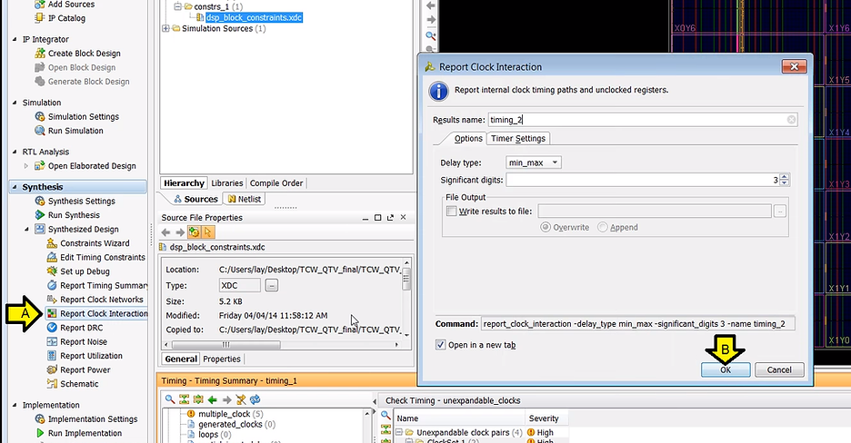

C. Safe CDC example

D. Unsafe CDC example (Xilinx cannot identify the circuit or there is no explicit circuit synchronizing 2 clock domains)

E. Exists in the existing constraint file (see \[[<u>link</u>](https://www.xilinx.com/support/documentation/sw_manuals/xilinx2018_2/ug949-vivado-design-methodology.pdf)\] for what **set\_max\_delay -datapath\_only,** see \[TBD\] for a discussion of when to use **set\_clock\_groups, set\_false\_path**, and **set\_max\_delay -datapath\_only**)

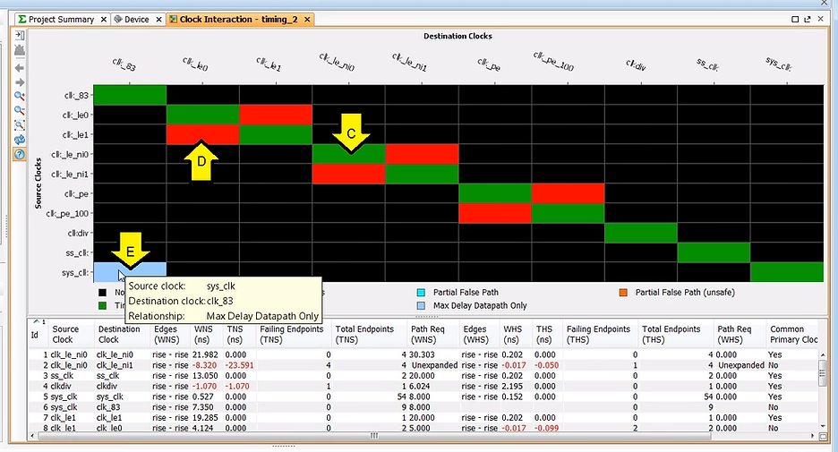

**<u>Part 3: Create an Empty Constraint File for the Wizard</u>**

Step 1: Create an empty a target constraint file

A. Click **Add Sources**

B. Click (or leave selected) **Add or Create Constraints**

C. Click **Next**

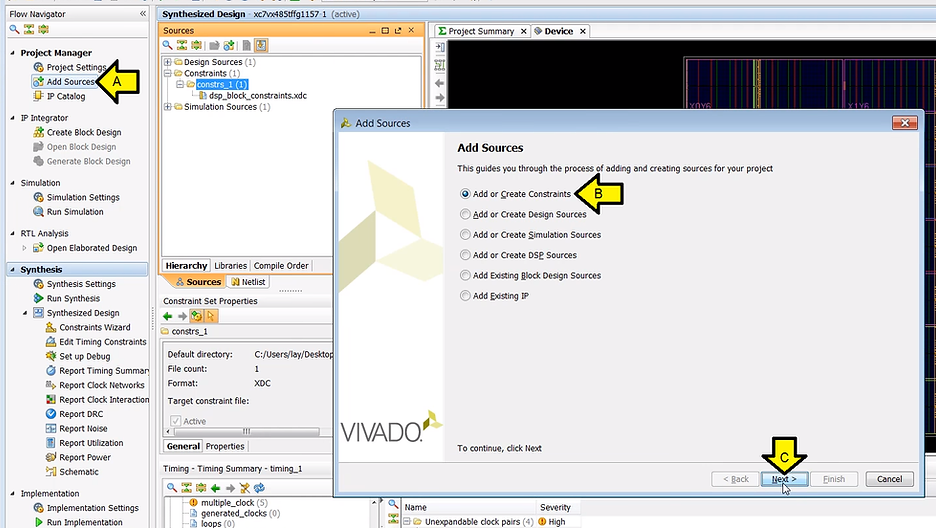

Step 2:

A. Ensure **XDC** is selected

B. Name it **top** (the file will be named top.xdc)

C. Leave **<Local to Project>** for the **File location**

D. Click **OK**

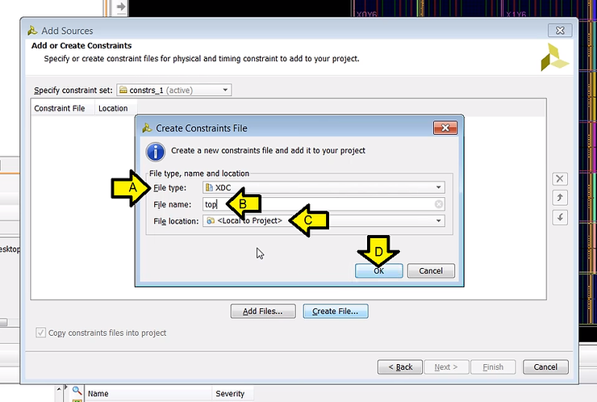

E. Click **Finish**

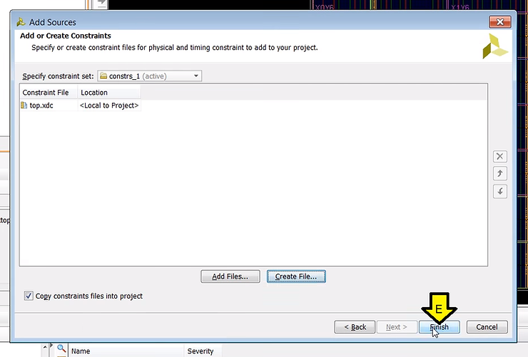

F. Update the synthesized design (if needed)

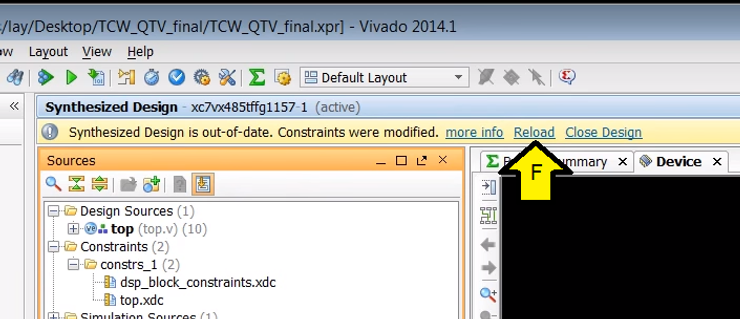

G. Set top.xdc as **target**

G1. Click Sources

G2. Right-click top.xdc

G3. Click **Set as Target Constraint File**

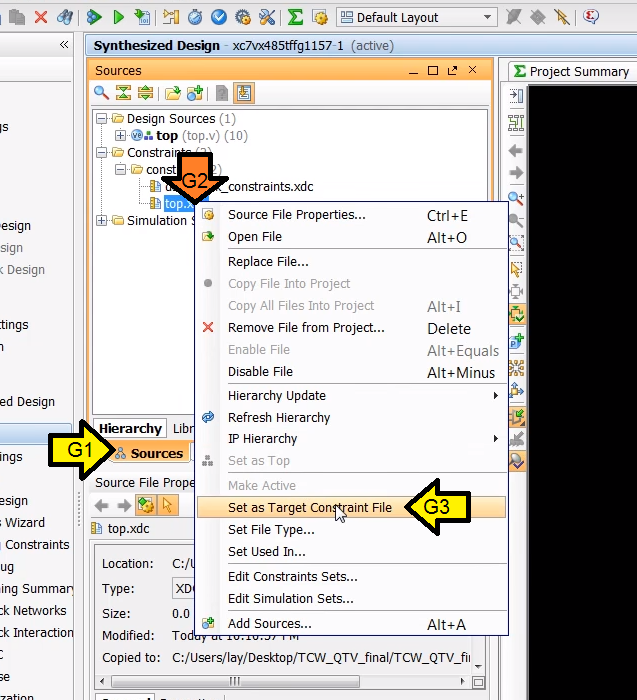

H ...and set processing order as **Normal**

H1. Click **top.xdc (target)**

H2. Click **Properties**

H3. Click to expand the window

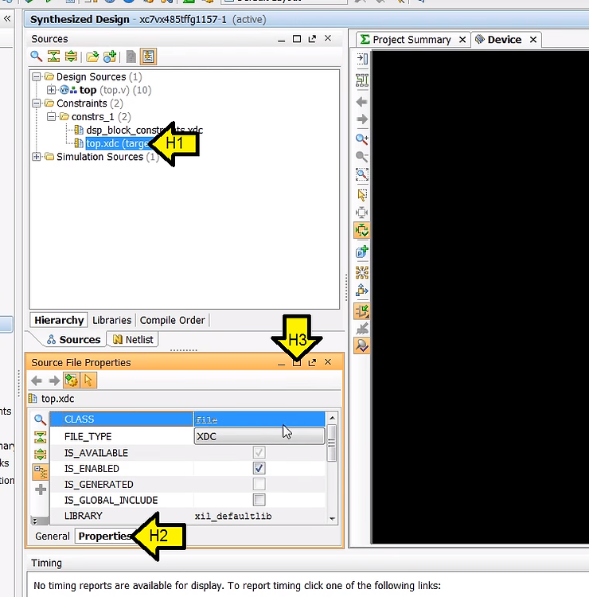

H4. Set PROCESSING ORDER to NORMAL

H5. Minimize window

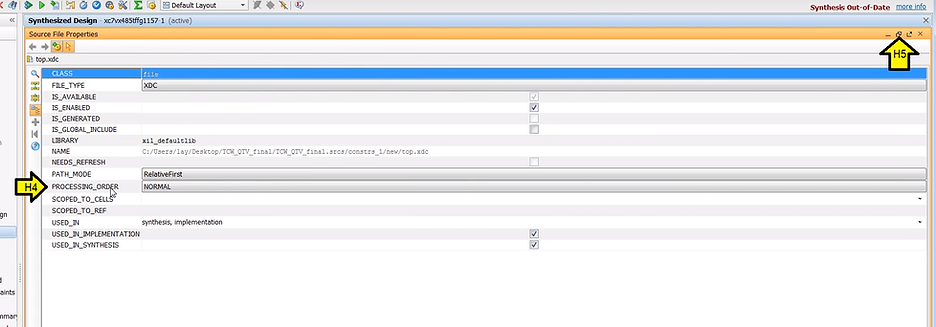

**<u>Part 4: Using the Constraint Wizard</u>**

Step 1: Start the Constraint Wizard

A. Click **Constraints Wizard**

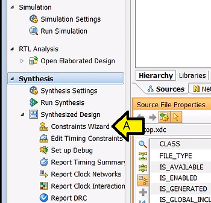

B. Click **Next**

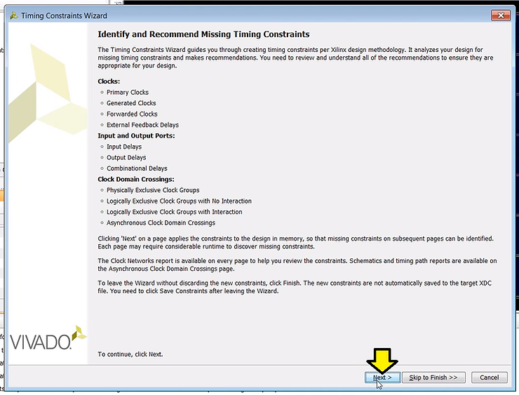

Step 2: Fill in the period of the <u>Primary Clocks</u>

A. **Fill in period or freq (required**), name (optional) and rise and fall times if not 50%

B. Look at the Tcl Command Preview

C. Click Next to issue the Tcl commands for the in-memory design

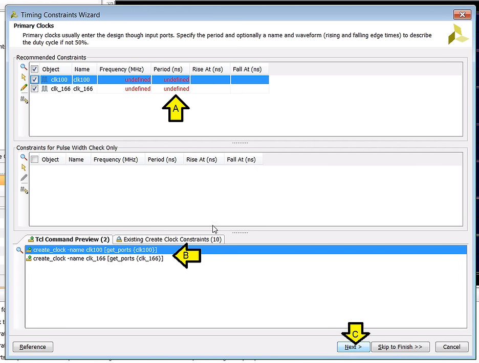

Tip 1: Select all constraints by clicking the **Select All** button:

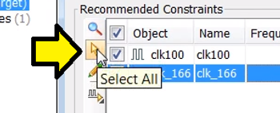

Tip 2: Enter/edit the same value for all selected:

A. After selecting (**select all** with Tip 1 above), click the **Pencil Icon**

B. Fill in **values**

C. Click **OK**

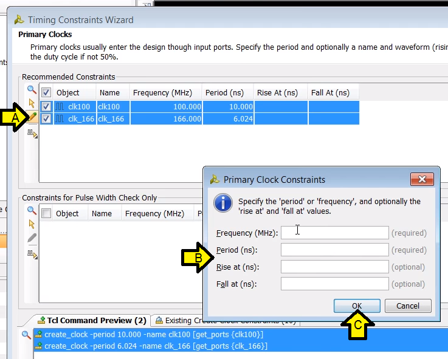

Tip 3: Generate a **Clock Network Report** to "show the clock network in detail tree view" \[[<u>link</u>](https://www.xilinx.com/support/documentation/sw_manuals/xilinx2018_2/ug949-vivado-design-methodology.pdf#page=190)\]

A. Click **Clock Icon**

B. Click **Report Clock Networks...**

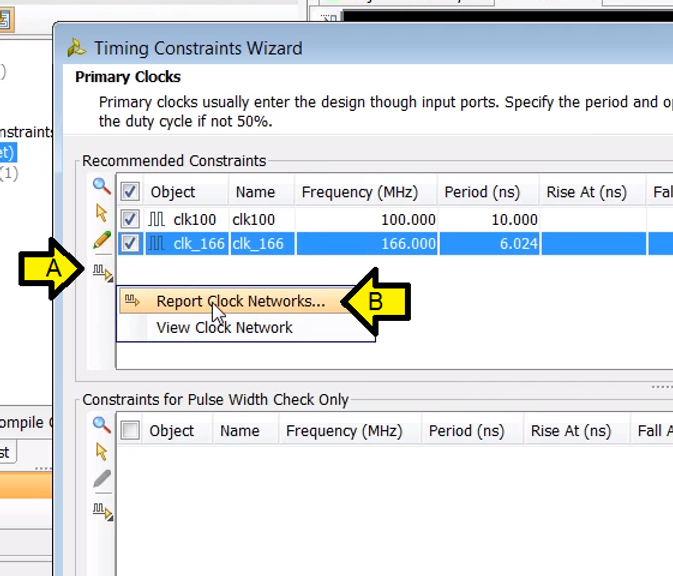

C. Click **OK**

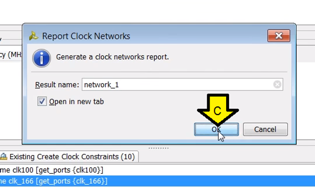

D. Click **Expand** to more easily see the clocks that exist in the design

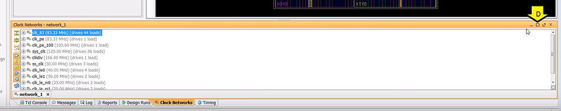

E. Expand **Unconstrained** to...

F. ...see the clocks that will be constrained when you click **Next:** on the **Primary Clock** wizard page

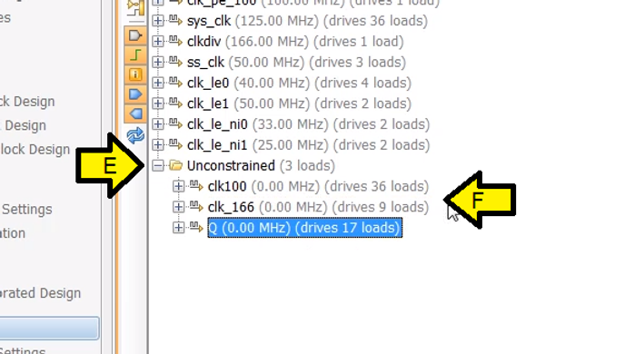

G. Minimize **Clock Network Report**

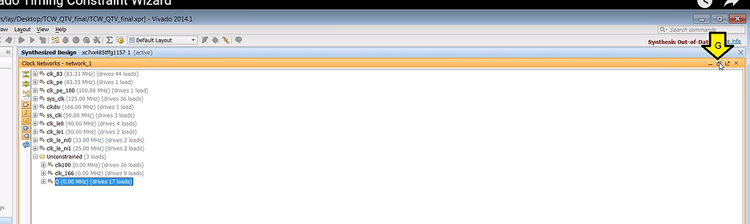

H. Click the **X** to exit the **Clock Network Report**

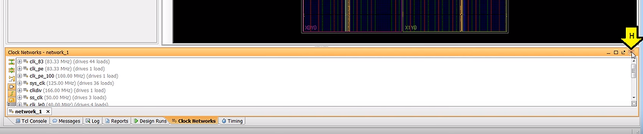

Step 3: Define missing <u>Generated Clock</u> parameters.

Note: Vivado automatically creates generated clocks produced by MMCM/PLLs. This step of the wizard only identifies generated clock from user logic.

A. Examine the circuit (in this case the circuit divides by two) and enter in the divide-by

B. Click **Next**

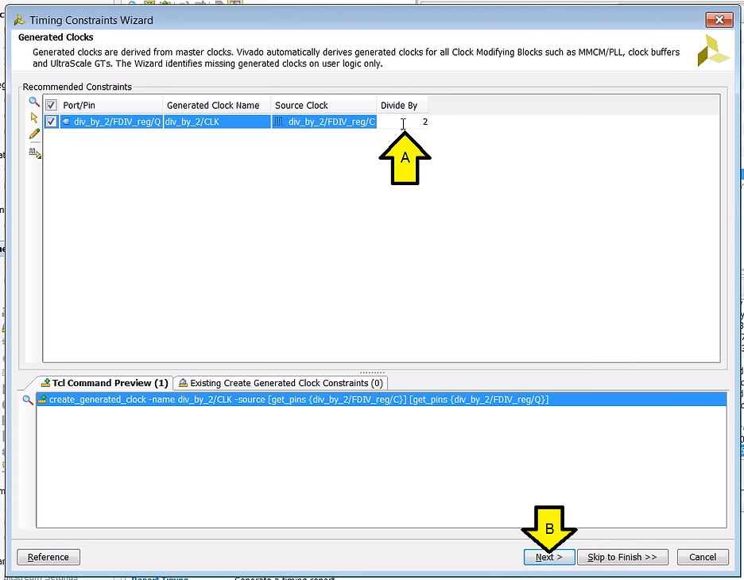

Step 4: Examine and verify the <u>Forwarded Clock</u> constraints

Note: A forwarded clock is a generated clock that is sent to an output port, it is typically used for source synchronous interfaces.

A. Examine the circuit and update the recommend constraint if needed

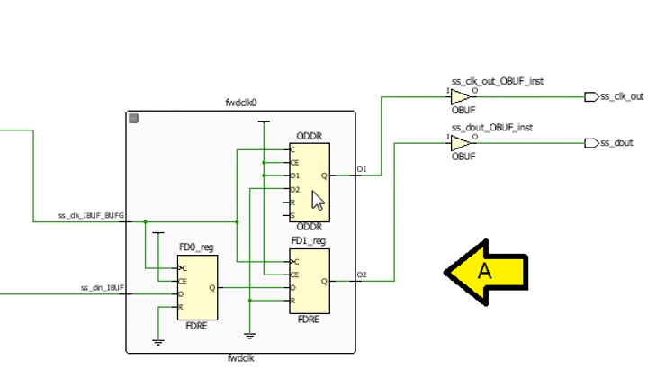

Note: In this case, the clock that triggers the data, in parallel, launches the capture clock.

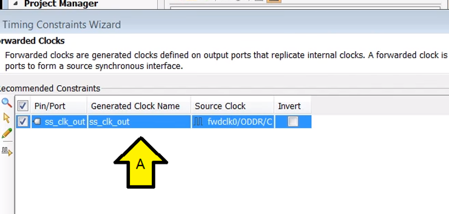

Note: In this case the flop is not inverting

B. Click **Next**

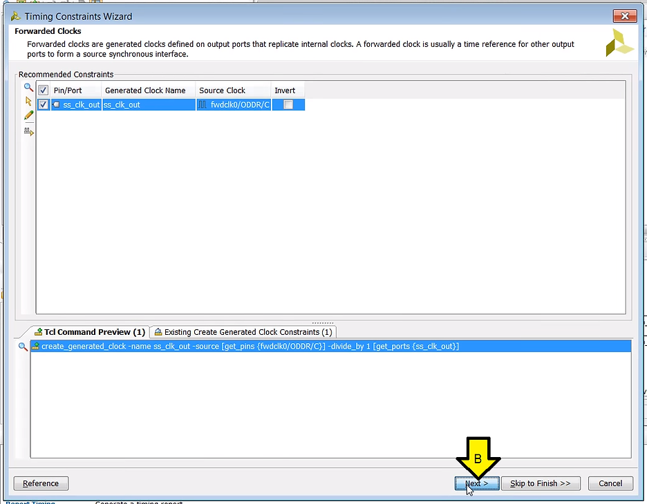

Step 5: Examine <u>External Feedback Delays</u> of any MMCMs or PLLs

Note: these feedback lines are used as compensation for internal PLLs

A. Calculate, estimate or measure the minimum and maximum board delays from the output port to the input port presented by the Wizard (recall that the Wizard knows what the delays are inside the chip but it does not know what the delays are outside the chip - which is why we need to sety constraints up at all).

B. Enter the **Min Delay (ns)** and **Max Delay (ns)**

C. Click **Next**

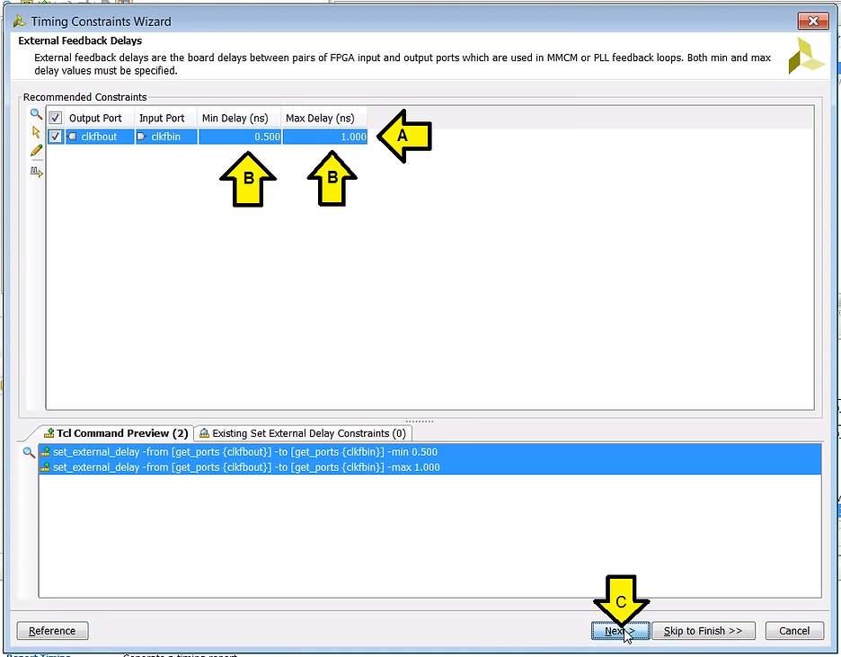

Step 6: Enter <u>Input Delay</u> parameters: system vs. source synchronous, alignment, data rate and edge, the min and max tco and min and max trace delay

Note: You can set the Input Delays later by unchecking all the check boxes and clicking next (this may be useful if you're following the UltraFast Design methodology).

A. Set the Recommended Constraints

B. Set the Delay Parameters

C. Click Apply after each setting to apply the Delay Parameter for that setting and run a validation

Note 2: notice how the red question mark goes away after clicking apply

D. Click Next to apply the constraints to the in-memory design

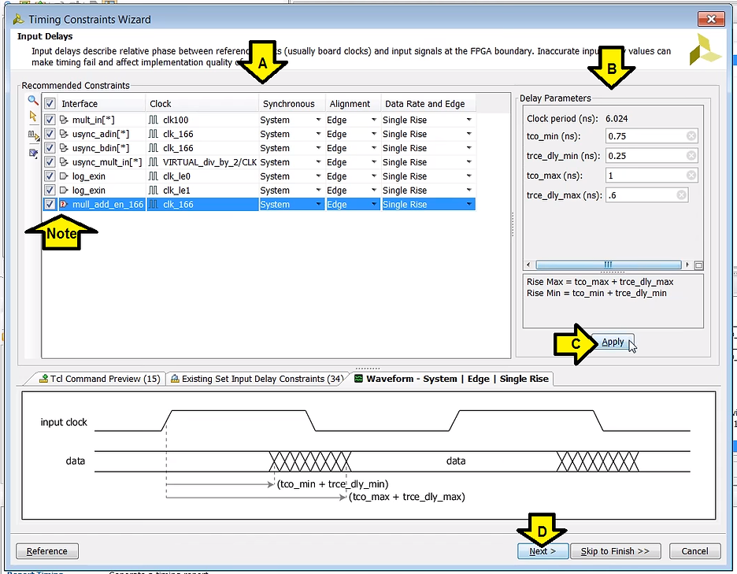

Tip 1: Use the filter to help fill out all constraints:

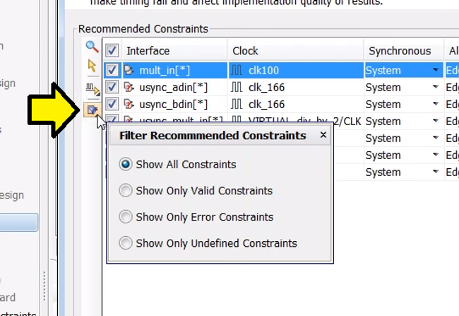

Step 7: Enter <u>Output Delay </u> parameters: system vs. source synchronous, alignment, data rate and edge, the min and max tco and min and max trace delay

Note: You can set the Output Delays later by unchecking all the check boxes and clicking next (this may be useful if you're following the UltraFast Design methodology).

A. Set the Recommended Constraints

B. Set the Delay Parameters

C. Click Apply after each setting to apply the Delay Parameter for that setting and run a validation

D. Click Next to apply the constraints to the in-memory design

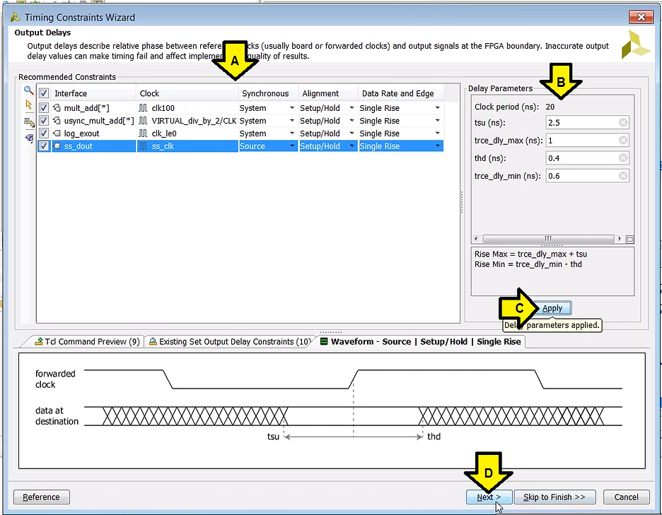

Step 8: Set <u>Combinational Delays</u> (paths that enter and exit the FPGA without entering any sequential elements).

Question: Xilinx says that it knows the delays in the chip, why can't it figure out these paths?

Answer: these are not paths inside the FPGA, these are constraints outside of it that are timed in reference to a clock that is also outside the FPGA. This external clock is called a "virtual clock" and the delays are in reference to this virtual clock. This means that there \_are\_ sequential circuits that launch signals that will enter the FPGA with respect to a clock and sequential circuits that will latch the signals that leave the FPGA with respect to a clock outside of the FPGA. Therefore these constraints ensure that the FPGA routes the signals to meet the set up and hold times of the larger system.

A. Select all (or skip if you just need to fill out a few)

B. Edit selected

C. Fill in values

D. Click **OK**

E. Click **Next**

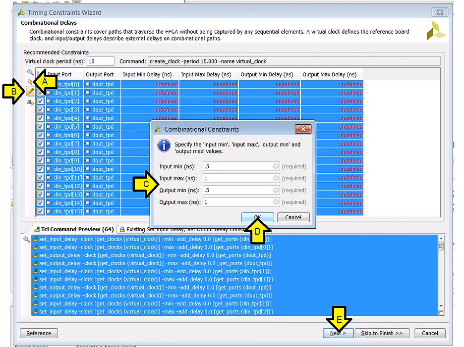

Step 9: Set <u>Physically Exclusive Clock Groups</u> (only one clock can be active at a time create a physically exclusive clock group)

A. Examine the wizards suggestions on physically exclusive clocks

B. If you agree with the wizard click **Next**

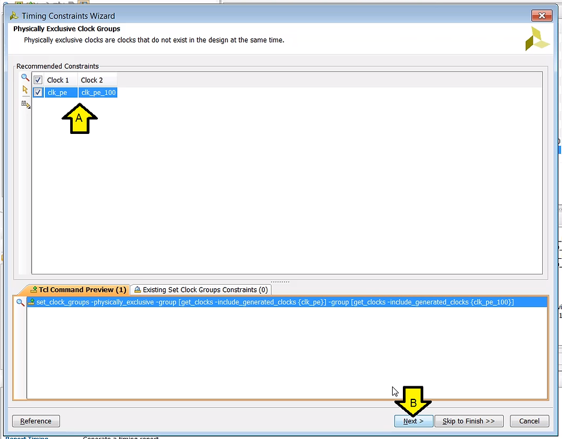

Step 10: Set <u>Logically Exclusive Clock Groups with No Interactions</u> (example a mux of two clocks, only one can be logically used at one time)

Note: When there are no timing paths between the clocks entering a mux and the clock exiting the mux, then Xilinx suggest a logically exclusive clock group.

A. Examine the wizards suggestions on logically exclusive clocks with no interactions

B. If you agree with the wizard click **Next**

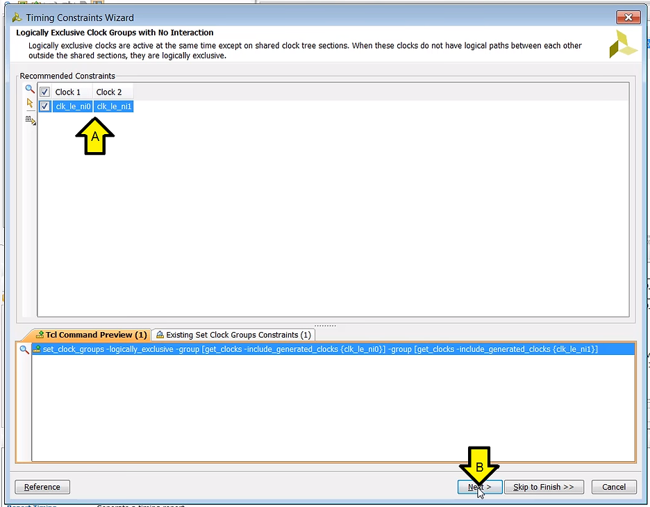

Step 11: Set <u>Logically Exclusive Clock Groups with Interactions</u> (clocks that are active at the same time except on shared clock trees).

Note: In this case there is interaction between the input clocks and the clock propagating through the mux, the the wizard will create two generated clocks at the output of the mux and set them logically exclusive.

A. Examine the wizards suggestions on logically exclusive clocks with interactions

B. If you agree with the wizard click **Next**

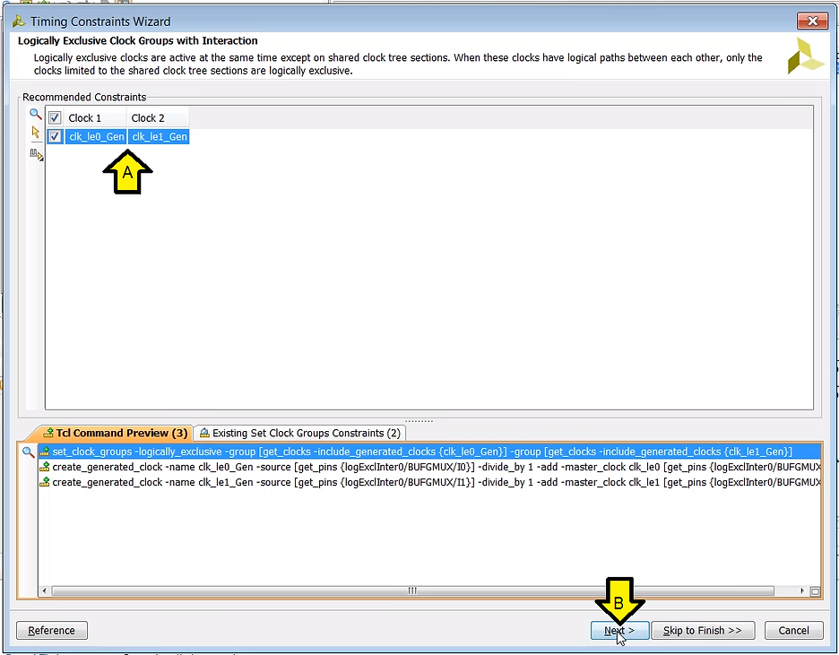

Step 12: Constrain clock-domain-crossings (CDCs) aka Asynchronous Clock Domain Crossings

Note: these can be difficult to analyze.

Note 2: You need to set the ASYNC\_REG property to ensure proper placement

From \[link\] Do not replicate registers used for synchronizing signals that cross clock domains. The presence of the **ASYNC\_REG** attribute on these registers prevents the tool from replicating these registers.

From \[[<u>link</u>](https://www.xilinx.com/support/documentation/sw_manuals/xilinx2018_2/ug949-vivado-design-methodology.pdf#page=130)\] By setting **ASYNC\_REG**\=TRUE on the synchronizer registers, all

registers are placed in a single SLICE

From \[[<u>link</u>](https://www.xilinx.com/support/documentation/sw_manuals/xilinx2018_2/ug949-vivado-design-methodology.pdf#page=133)\] The clock domain crossing (CDC) circuits in the design directly impact design reliability. You can design your own circuits, but the Vivado Design Suite must recognize the circuit and you must apply the **ASYNC\_REG** attributes correctly. Xilinx provides XPMs to ensure correct circuit design, including:

• Driving specific features in place\_design that reduce mean time between failures

(MTBF) on synchronization circuits.

• Ensuring recognition by report\_synchronizer\_mtbf.

• Avoiding report\_cdc errors and warnings, which typically show up late in the design

cycle when iterations are longer.

TIP: For CDC violations that can be safely ignored, you can use the waiver mechanism to waive the violations. For details, see this link in the Vivado Design Suite User Guide: Design Analysis and Closure Techniques (UG906) \[[<u>link</u>](https://www.xilinx.com/support/documentation/sw_manuals/xilinx2018_2/ug906-vivado-design-analysis.pdf)\].

A CDC circuit is required when crossing between two asynchronous clocks or when attempting to relax timing between two synchronous clocks by adding false path constraints. When using XPMs, you can select a single-bit or a multi-bit bus to cross between the domains.

From \[[<u>link</u>](https://www.xilinx.com/support/documentation/sw_manuals/xilinx2018_2/ug906-vivado-design-analysis.pdf#page=290)\]: Synchronizer registers must have their ASYNC\_REG property set to TRUE in order to preserve the cells through any logic optimization during synthesis and implementation, and to optimize their placement for the best mean time between failure (MTBF) statistics.

TODO: a whole post on ASYNC\_REG

A. Check that the ASYNC\_REG property has been set to ensure proper placement of synchronizer registers to reduce MTBF

B. Click on a link to see the path

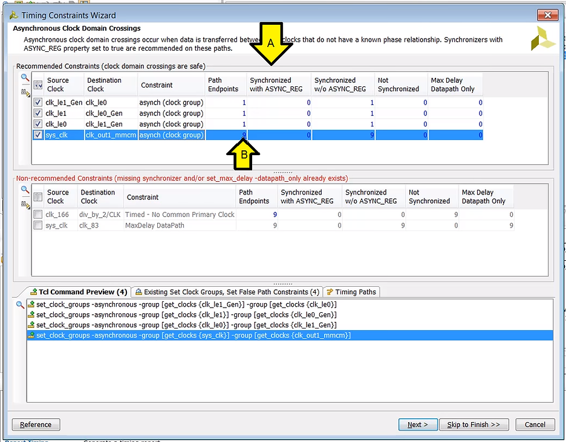

B1. In the lower table you'll see all the individual paths between the two clock domains and the depth of the synchronizer (how may flops are used to synchronize the clocks):

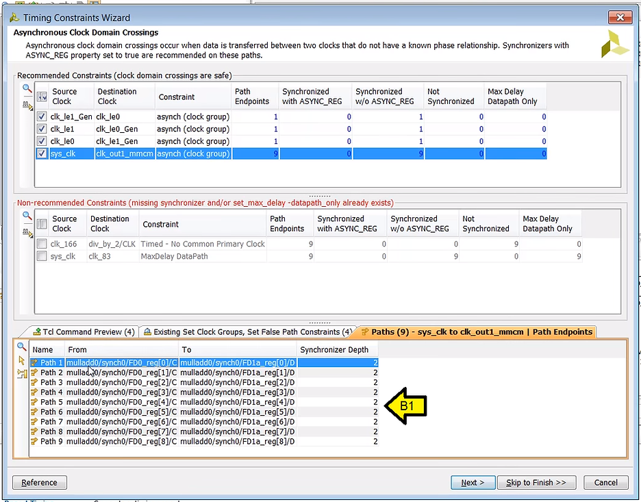

B2. To see the schematic of a path click on the path...

B3. ...then click on **Schematic**...

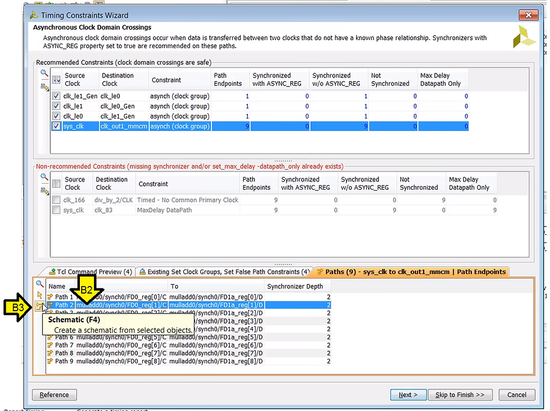

B4. ...to see the exact CDC

B5. ...and expand it by clicking on a pin...

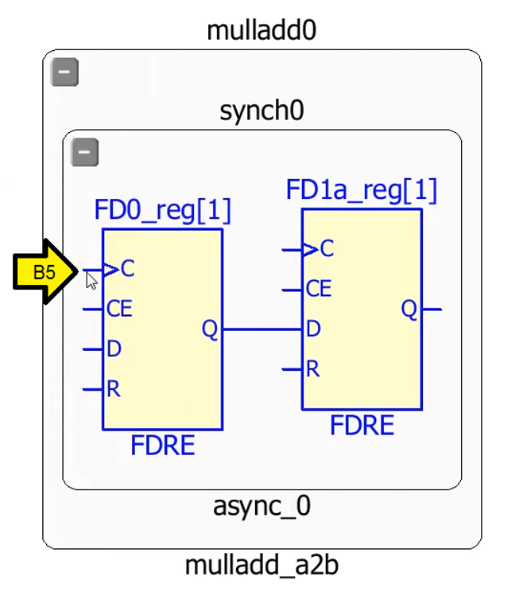

B6. ...and clicking on other pins to expand those ports...

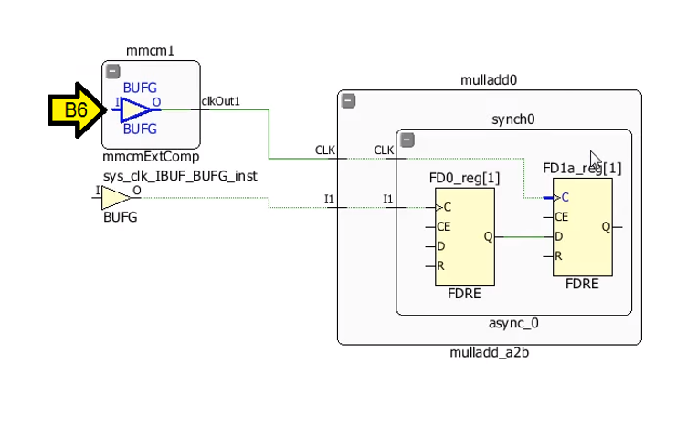

B7. ...continue to expand

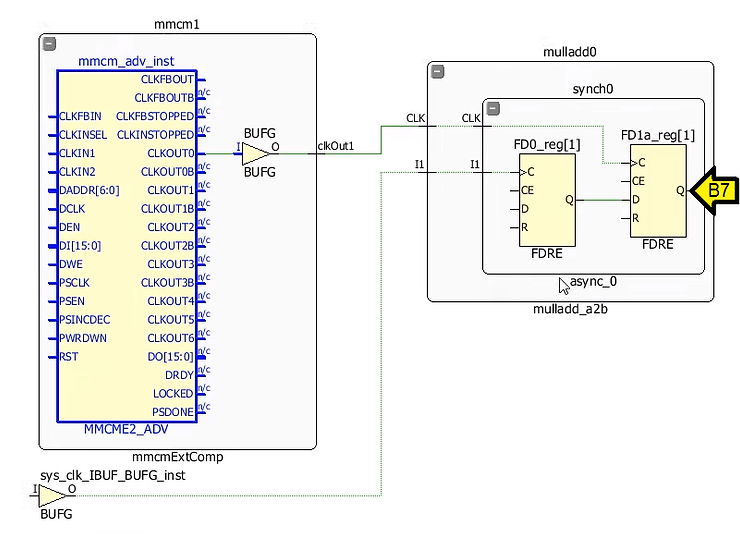

...expanded:

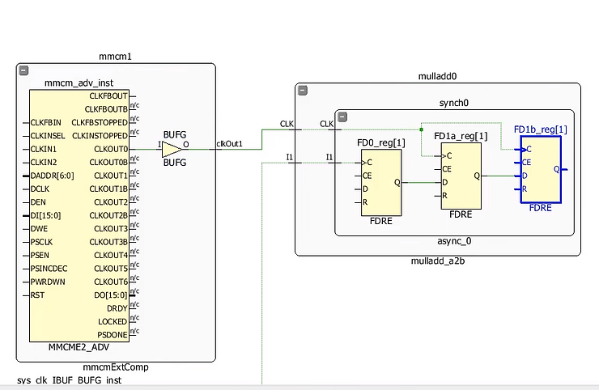

C. Look at the center to see all the CDCs that the wizard is not able to make suggestions for.

C1. One is constrained by another constraint

C2. One needs additional attention in RTL

D. Click Next

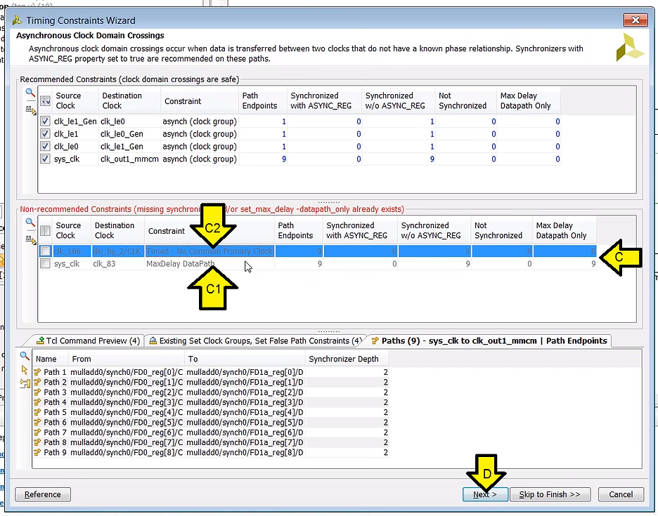

Step 13: Finish up

A. Click to see the constraints that were set

B. Click to run a report after clicking finish

C. Click Finish to complete the wizard

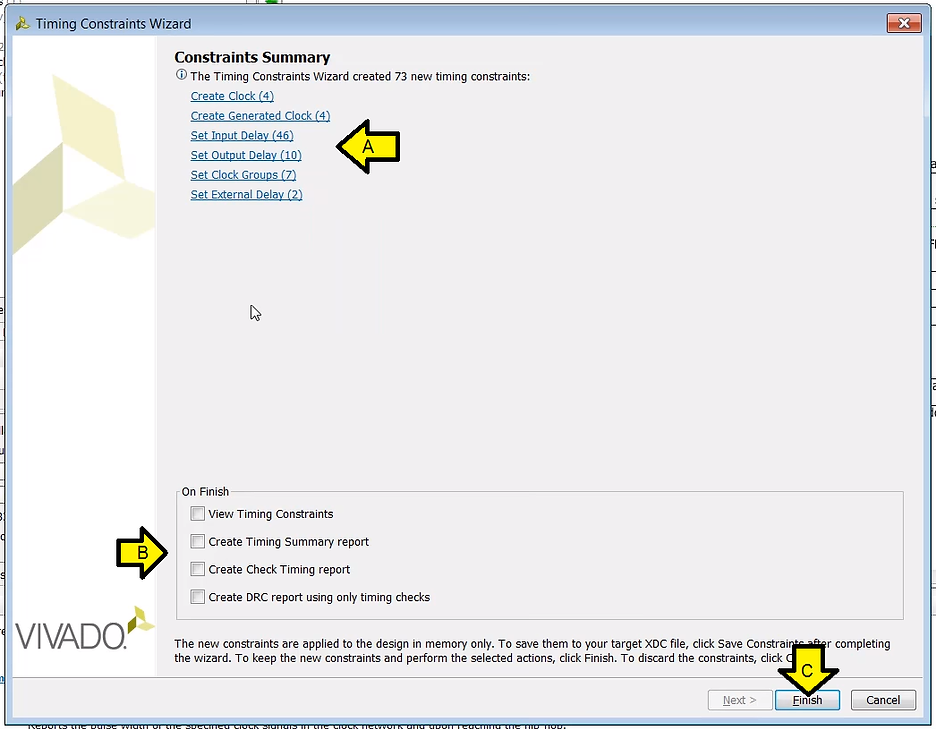

Step 14: Save the constraints to a file:

Note: Up till this point the constraints are just working on the in memory design, you must save them.

A. Click top.xdc

B. Click Save icon

C. Click OK

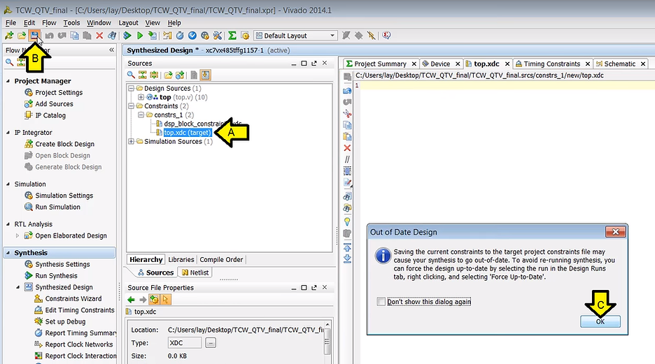

D. Click **Reload** ...

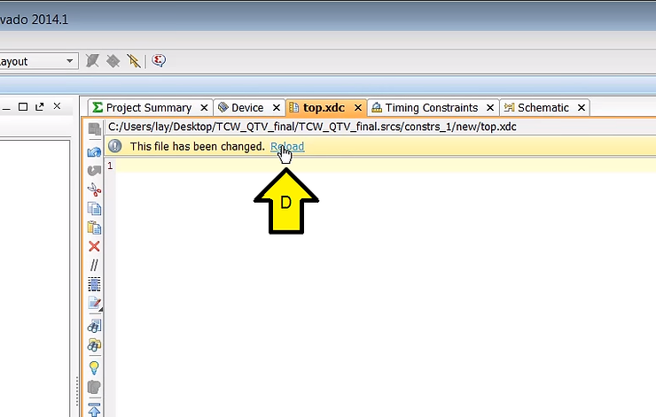

...to see all the constraints generated by the wizard in the file:

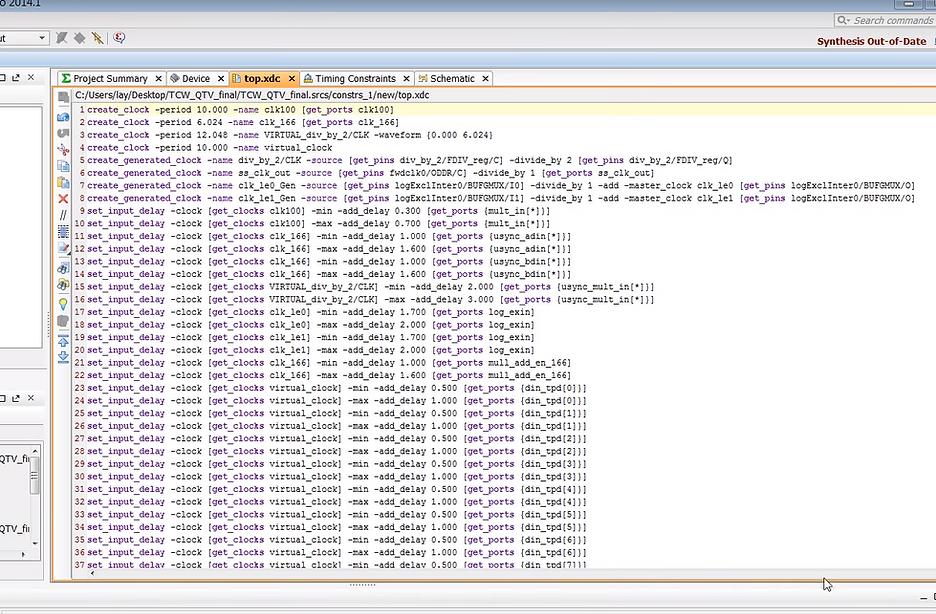

Step 15: Examine the timing summary to see if the design passes timing (positive slack):

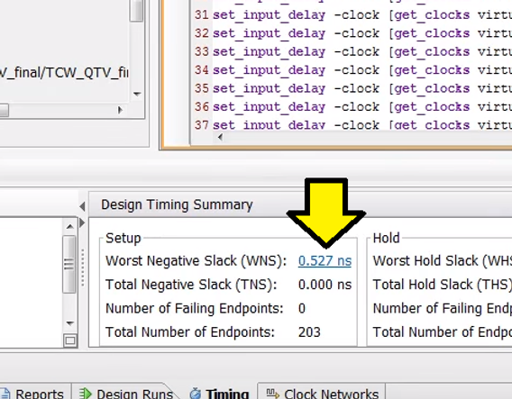

Step 16: Examine **Check Timing** warnings (if any)

A. Expand the **Design Timing Summary** window

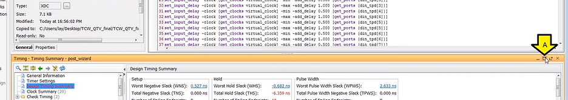

B. Expand Check Timing

C. Click no\_input\_delay (1)

D. Look at warning (this warning is okay because a false path constraint was set in the original XDC file)

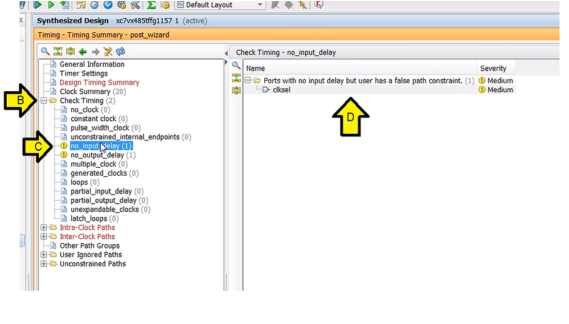

E. Click no\_output\_delay (1)

F. Look at warning (in this case there is a generated clock on the output pin for the source synchronous bus)

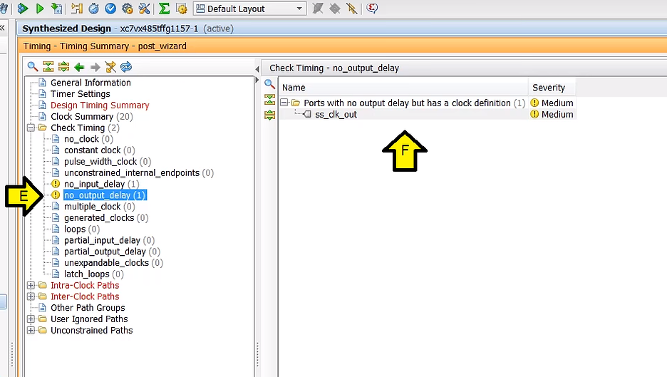

Step 17: Run Report Clock Interaction again

A. Click Report Clock Interaction

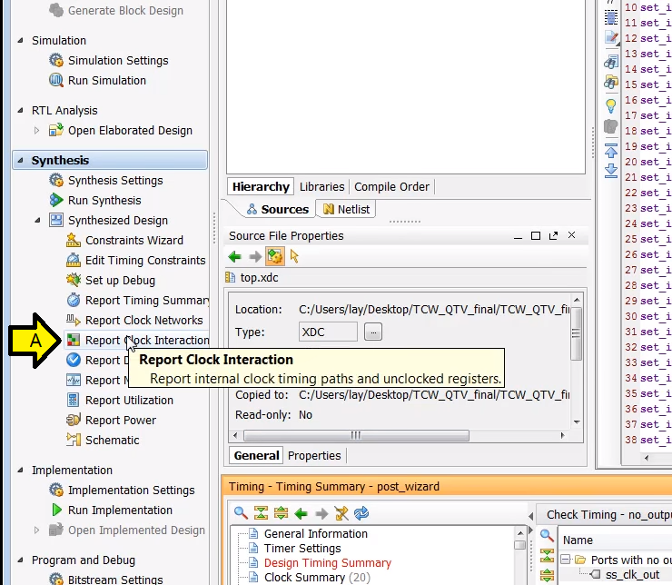

B. Click **OK**

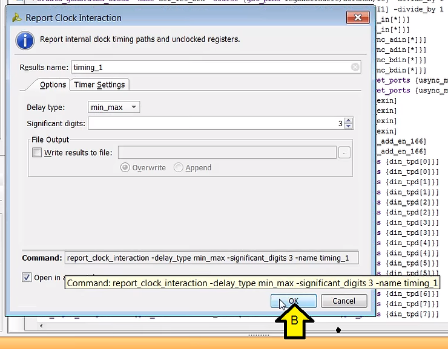

C. Look at the additional clocks that have been generated

D. The red box indicates an unsafe CDC (an RTL change will be needed to fix)

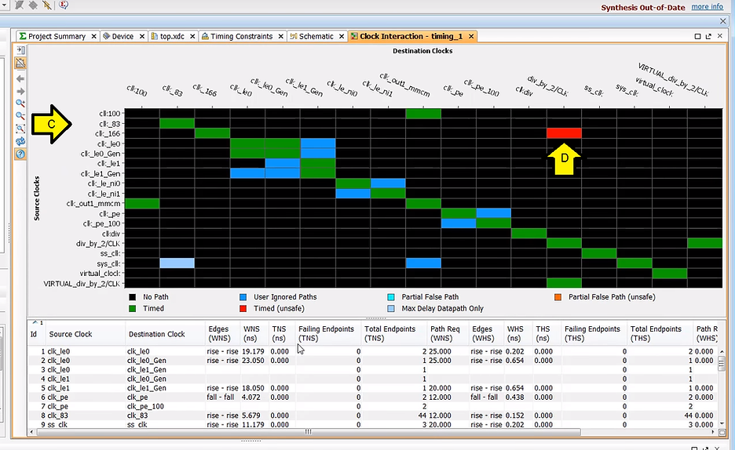

TODO: a whole post on Max Delay Datapath Only

**<u>References</u>**

-   Using the Vivado Timing Constraint Wizard Xilinx Quick Take video @ \[[<u>link</u>](https://youtu.be/UmQ0PUEaOuk)\]
    
-   UltraFast Design Methodology Guide (UG949) (v2018.2) @ \[[<u>link</u>](https://www.xilinx.com/support/documentation/sw_manuals/xilinx2018_2/ug949-vivado-design-methodology.pdf)\]
    
-   Vivado Design Suite User Guide: Design Analysis and Closure Techniques (UG906) (v2018.2) @ \[[<u>link</u>](https://www.xilinx.com/support/documentation/sw_manuals/xilinx2018_2/ug906-vivado-design-analysis.pdf)\]
    
-   Vivado Design Suite User Guide Using Constraints UG903 (v2018.2) June 6, 2018 \[[<u>link</u>](https://www.xilinx.com/support/documentation/sw_manuals/xilinx2018_2/ug903-vivado-using-constraints.pdf)\]
    
-   Xilinx logo found via [<u>https://twitter.com/xilinxinc</u>](https://twitter.com/xilinxinc) at \[[<u>link</u>](https://pbs.twimg.com/profile_images/535545777020338176/pEWdIYq__400x400.png)\]