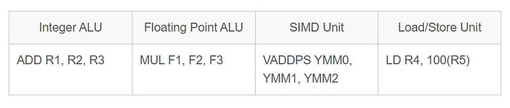

# VLIW, SIMD & VLIW/SIMD?

This post explores the meanings of VLIW (Very Long Instruction Word), SIMD (Single Instruction, Multiple Data), and VLIW/SIMD as used in a computing context. Examples are provided.

## Sections

-   [<u>What Do the Terms VLIW and SIMD Mean?</u>](https://www.centennialsoftwaresolutions.com/post/vliw-simd#viewer-tlmey15594)
    
-   [<u>VLIW and SIMD Characteristics</u>](https://www.centennialsoftwaresolutions.com/post/vliw-simd#viewer-fr3h425651)
    
-   [<u>VLIW and SIMD Advantages and Disadvantages</u>](https://www.centennialsoftwaresolutions.com/post/vliw-simd#viewer-cl7jv291184)
    
-   [<u>Hypothetical VLIW Instruction</u>](https://www.centennialsoftwaresolutions.com/post/vliw-simd#viewer-7rq83420)
    
-   [<u>Texas Instruments TMS320C6x VLIW DSP Instruction</u>](https://www.centennialsoftwaresolutions.com/post/vliw-simd#viewer-4cpvw95609)
    
-   [<u>x86 AVX SIMD Instruction</u>](https://www.centennialsoftwaresolutions.com/post/vliw-simd#viewer-x6khf38826)
    
-   [<u>ARM NEON SIMD Instruction</u>](https://www.centennialsoftwaresolutions.com/post/vliw-simd#viewer-bewol68454)
    
-   [<u>Hypothetical VLIW/SIMD Processor Instruction</u>](https://www.centennialsoftwaresolutions.com/post/vliw-simd#viewer-72z7h70582)
    
-   [<u>How much more efficient is a VLIW/SIMD processor (one that uses both VLIW and SIMD)?</u>](https://www.centennialsoftwaresolutions.com/post/vliw-simd#viewer-ia8sb5330)
    
-   [<u>Good Workloads for VLIW, SIMD, and VLIW/SIMD?</u>](https://www.centennialsoftwaresolutions.com/post/vliw-simd#viewer-0y6qs166582)
    

## What Do the Terms VLIW and SIMD Mean?

### VLIW (Very Long Instruction Word)

-   **What it is**: VLIW is a computing architecture that improves performance by executing multiple operations in a single clock cycle.
    
-   **How it works**: In a VLIW system, the compiler (a program that translates high-level code into machine code) groups multiple instructions into a single, long instruction word. Each part of this word corresponds to a different operation that can be executed in parallel by different CPU parts.
    
-   **Example**: Imagine you are preparing a large meal. Instead of doing each task (chopping vegetables, boiling water, grilling meat) one after another, you assign each task to different people who work simultaneously. In computing, VLIW allows the CPU to perform multiple operations simultaneously by packing them into one instruction.
    
-   **Use cases**: VLIW architectures are often used in digital signal processors (DSPs), embedded systems, and high-performance computing applications where parallelism can significantly enhance performance.  
    

### SIMD (Single Instruction, Multiple Data)

-   **What it is**: SIMD is a parallel computing method used to improve performance by simultaneously performing the same operation on multiple data points.
    
-   **How it works**: Imagine you have a large array of numbers and want to add 5 to each number. Instead of adding 5 to each number one at a time, SIMD allows you to simultaneously add 5 to multiple numbers in the array using a single instruction.
    
-   **Example**: Think of a factory assembly line where the same task (e.g., painting) is performed on multiple products simultaneously. This would be like applying the same mathematical operation to multiple data points simultaneously in computing.
    
-   **Use cases**: SIMD is commonly used in applications like multimedia processing (e.g., video, audio), scientific simulations, and graphics rendering, where the same operation needs to be repeated many times on large sets of data.  
    

### Critical Differences Between VLIW and SIMD

-   **VLIW** focuses on executing multiple operations simultaneously within a single instruction, leveraging instruction-level parallelism.
    
-   **SIMD** focuses on simultaneously applying the same operation to multiple data points, making it ideal for data-parallel tasks.  
    

### Summary of VLIW and SIMD Meanings

-   **VLIW**: Multiple instructions are bundled together and executed simultaneously.
    
-   **SIMD**: One instruction operates on multiple data points simultaneously.  
    

SIMD and VLIW aim to enhance computational efficiency and performance by leveraging parallelism but do so in different ways tailored to other tasks.

## VLIW and SIMD Characteristics

### VLIW Characteristics

-   **Parallel Execution**: All specified operations in the VLIW instruction are executed parallel, assuming no data dependencies or resource conflicts.
    
-   **Explicit Parallelism**: The compiler detects and schedules parallel operations rather than the hardware.
    
-   **Fixed Instruction Length**: Each VLIW instruction has a fixed length, which includes multiple operations for different functional units.  
    

### SIMD Characteristics

-   **Parallelism**: SIMD instructions process multiple data points in parallel, increasing performance for data-parallel tasks.
    
-   **Efficiency**: SIMD can significantly boost performance for tasks involving vector operations, such as graphics processing, digital signal processing, and scientific computations.
    
-   **Compactness**: By performing the same operation on multiple data points, SIMD reduces the number of instructions and memory accesses needed.
    

## VLIW and SIMD Advantages and Disadvantages

### VLIW Advantages

-   **Parallel Processing**:
    
-   **Increased Performance**: VLIW processors can execute multiple operations simultaneously within a single instruction, significantly speeding up tasks with parallelizable operations.
    
-   **Efficient Use of Resources**: VLIW architecture allows for better utilization of the CPU's resources by issuing multiple operations to different functional units in parallel.
    
-   **Compact Code**:
    
-   **Reduced Instruction Count**: VLIW instructions can encode multiple operations in a single instruction word, reducing the total number of instructions and improving code density.
    
-   **Simplified Loop Structures**: Operations that can be parallelized are explicitly encoded, potentially simplifying loop structures and reducing overhead.
    
-   **Energy Efficiency**:
    
-   **Lower Power Consumption**: Executing multiple operations simultaneously can be more power-efficient than performing the same operations sequentially, benefiting energy-constrained environments like mobile and embedded systems.
    
-   **Improved Throughput**:
    
-   **Higher Data Throughput**: VLIW can enhance data throughput by executing multiple instructions in parallel, benefiting applications like multimedia processing, scientific simulations, and signal processing.
    

### VLIW Disadvantages

-   **Data Dependency**:
    
-   **Limited to Parallel Data**: VLIW is most effective when operations can be executed independently. It is less useful for tasks with data dependencies that require sequential processing.
    
-   **Alignment and Memory Access**:
    
-   **Memory Alignment Requirements**: Efficient VLIW execution may require careful alignment and scheduling of operations, complicating data management and potentially reducing performance gains.
    
-   **Memory Bandwidth**: High memory bandwidth is often necessary to supply data to the multiple functional units in a VLIW processor, which may be a limiting factor.
    
-   **Complexity in Programming**:
    
-   **Manual Optimization**: Writing VLIW-optimized code can be complex, requiring sophisticated compiler support and a detailed understanding of the hardware.
    
-   **Portability Issues**: VLIW code may need to be recompiled or modified to run on different VLIW architectures, reducing portability and increasing maintenance effort.
    
-   **Hardware Limitations**:
    
-   **Instruction Slot Limitations**: The performance gains from VLIW are limited by the number of available instruction slots. Larger or more complex operations may require additional cycles to execute.
    
-   **Specialized Hardware**: VLIW relies on specialized hardware support, which may not be present in all processors, particularly older or lower-end models.
    
-   **Debugging and Maintenance**:
    
-   **Difficulty in Debugging**: VLIW code can be harder to debug due to its parallel nature and the complexity of managing multiple simultaneous operations.
    
-   **Maintenance Overhead**: Maintaining VLIW-optimized code can be challenging, especially if the codebase needs to support multiple hardware architectures or if new VLIW extensions are introduced.
    

### SIMD Advantages

-   **Parallel Processing**:
    
-   **Increased Performance**: SIMD can process multiple data points simultaneously, significantly speeding up tasks that involve large datasets or repetitive calculations.
    
-   **Efficient Use of Resources**: SIMD allows better utilization of the CPU's resources by executing the same operation on multiple pieces of data in parallel.
    
-   **Compact Code**:
    
-   **Reduced Instruction Count**: SIMD instructions can perform the same operation on multiple data points with a single instruction, reducing the total number of instructions and improving code density.
    
-   **Simplified Loop Structures**: Operations on arrays or vectors can be performed with fewer loop iterations, simplifying code and reducing overhead.
    
-   **Energy Efficiency**:
    
-   **Lower Power Consumption**: Performing multiple operations simultaneously can be more power-efficient than performing the same operations sequentially, which is particularly beneficial in mobile and embedded systems.
    
-   **Improved Throughput**:
    
-   **Higher Data Throughput**: SIMD can increase the data throughput for applications such as multimedia processing, scientific simulations, and cryptographic algorithms.
    

### SIMD Disadvantages

-   **Data Dependency**:
    
-   **Limited to Parallel Data**: SIMD is most effective when the same operation can be applied to multiple data points independently. It is less useful for tasks with data dependencies that require sequential processing.
    
-   **Alignment and Memory Access**:
    
-   **Memory Alignment Requirements**: SIMD instructions often require data to be aligned in memory, which can complicate data management and reduce the potential performance gains.
    
-   **Memory Bandwidth**: Efficient use of SIMD can require high memory bandwidth to supply data to the vector registers, which may be a limiting factor.
    
-   **Complexity in Programming**:
    
-   **Manual Optimization**: Writing SIMD-optimized code can be complex and may require low-level programming skills and detailed knowledge of the hardware.
    
-   **Portability Issues**: SIMD code may need to be rewritten or heavily modified to run on different hardware architectures, reducing portability and increasing maintenance effort.
    
-   **Hardware Limitations**:
    
-   **Limited Vector Length**: The performance gains from SIMD are limited by the width of the vector registers (e.g., 128-bit, 256-bit). Larger datasets may require additional instructions to process.
    
-   **Specialized Hardware**: SIMD relies on specialized hardware support in the CPU, which may not be present in all processors, especially older or lower-end models.
    
-   **Debugging and Maintenance**:
    
-   **Difficulty in Debugging**: SIMD code can be harder to debug due to its parallel nature and the complexity of vector operations.
    
-   **Maintenance Overhead**: Maintaining SIMD-optimized code can be challenging, especially if the codebase needs to support multiple hardware architectures or if new SIMD extensions are introduced.
    

## Hypothetical VLIW Instruction Example

A hypothetical VLIW processor has four functional units:

1.  Integer ALU (Arithmetic Logic Unit)
    
2.  Floating Point ALU
    
3.  Load/Store Unit
    
4.  Branch Unit
    

A VLIW instruction for this processor might look like this:

<table data-hook="TableComponent"><colgroup><col><col><col><col></colgroup><tbody><tr><td data-hook="table-plugin-cell">
Integer ALU
</td><td data-hook="table-plugin-cell">
Floating Point ALU
</td><td data-hook="table-plugin-cell">
Load/Store Unit
</td><td data-hook="table-plugin-cell">
Branch Unit
</td></tr><tr><td data-hook="table-plugin-cell">
ADD R1, R2, R3
</td><td data-hook="table-plugin-cell">
MUL F1, F2, F3
</td><td data-hook="table-plugin-cell">
LD R4, 100(R5)
</td><td data-hook="table-plugin-cell">
BEQ R1, R6, Label
</td></tr></tbody></table>

### Explanation:

-   **Integer ALU**: ADD R1, R2, R3
    
-   This operation adds the contents of registers R2 and R3 and stores the result in register R1.
    
-   **Floating Point ALU**: MUL F1, F2, F3
    
-   This operation multiplies the floating point values in registers F2 and F3 and stores the result in register F1.
    
-   **Load/Store Unit**: LD R4, 100(R5)
    
-   This operation loads the value from the memory address calculated by adding 100 to the contents of register R5 into register R4.
    
-   **Branch Unit**: BEQ R1, R6, Label
    
-   This operation checks if the contents of registers R1 and R6 are equal. If they are, it branches to the instruction at the location labeled Label.
    

## Texas Instruments TMS320C6x VLIW DSP Instruction

This real-world example is a VLIW instruction from the Texas Instruments TMS320C6x family of digital signal processors (DSPs). These processors are designed with a VLIW architecture, allowing multiple operations to be encoded in a single instruction word and executed in parallel.

The TMS320C6x DSP can execute up to eight operations in parallel within a single instruction cycle. Each instruction packet can contain up to eight 32-bit instructions.

### Example Instruction Packet

Here's an example of what an instruction packet might look like in a TMS320C6x VLIW DSP:

<table data-hook="TableComponent"><colgroup><col><col><col><col><col><col><col><col></colgroup><tbody><tr><td data-hook="table-plugin-cell">
Slot 0
</td><td data-hook="table-plugin-cell">
Slot 1
</td><td data-hook="table-plugin-cell">
Slot 2
</td><td data-hook="table-plugin-cell">
Slot 3
</td><td data-hook="table-plugin-cell">
Slot 4
</td><td data-hook="table-plugin-cell">
Slot 5
</td><td data-hook="table-plugin-cell">
Slot 6
</td><td data-hook="table-plugin-cell">
Slot 7
</td></tr><tr><td data-hook="table-plugin-cell">
ADD .S1 A1, A2, A3
</td><td data-hook="table-plugin-cell">
SUB .L1 B1, B2, B3
</td><td data-hook="table-plugin-cell">
MPY .M1 A4, A5, A6
</td><td data-hook="table-plugin-cell">
LDW .D1 *B4, A7
</td><td data-hook="table-plugin-cell">
STW .D2 A8, *B5
</td><td data-hook="table-plugin-cell">
NOP .S2
</td><td data-hook="table-plugin-cell">
NOP .L2
</td><td data-hook="table-plugin-cell">
B .S2 LABEL
</td></tr></tbody></table>

Explanation

-   **Slot 0**: ADD .S1 A1, A2, A3
    
-   This operation adds the contents of registers A2 and A3 and stores the result in register A1. It is assigned to the S1 functional unit.
    
-   **Slot 1**: SUB .L1 B1, B2, B3
    
-   Subtracts the contents of register B2 from B3, storing the result in register B1. This operation is assigned to the .L1 functional unit.
    
-   **Slot 2**: MPY .M1 A4, A5, A6
    
-   Multiplies the contents of registers A4 and A5, storing the result in register A6. This operation is assigned to the .M1 functional unit.
    
-   **Slot 3**: LDW .D1 \*B4, A7
    
-   It loads a word from the memory address pointed to by B4 into register A7. This operation is assigned to the D1 functional unit.
    
-   **Slot 4**: STW .D2 A8, \*B5
    
-   The word is stored in register A8 at the memory address pointed to by B5. This operation is assigned to the D2 functional unit.
    
-   **Slot 5**: NOP .S2
    
-   There is no operation for the .S2 functional unit, also called a "No Op."
    
-   **Slot 6**: NOP .L2
    
-   No operation for the .L2 functional unit.
    
-   **Slot 7**: B .S2 LABEL
    
-   Branches to the address labeled LABEL. This operation is assigned to the .S2 functional unit.
    

### Characteristics of the TMS320C6x VLIW Instruction

-   **Parallel Execution**: Up to eight parallel instructions can be executed using different functional units.
    
-   **Explicit Parallelism**: The compiler or assembly programmer specifies which operations can be executed in parallel.
    
-   **Functional Units**: The functional units (.S1, .L1, .M1, .D1, .D2, .S2, .L2) are specified in the instruction to indicate which unit will execute each operation.  
    

## x86 AVX SIMD Instruction

Consider an x86 architecture with AVX (Advanced Vector Extensions) instructions. AVX is an extension of the SIMD instruction set in x86 processors, allowing for operations on 256-bit wide registers, which can hold multiple single-precision floating-point numbers.

### Example Instruction: VADDPS

The VADDPS instruction adds packed single-precision floating-point values in two source registers and stores the result in the destination register.

-   **Syntax**: VADDPS ymm0, ymm1, ymm2
    

#### Explanation

-   **ymm0**: Destination register where the result will be stored.
    
-   **ymm1**: First source register containing packed single-precision floating-point values.
    
-   **ymm2**: Second source register containing packed single-precision floating-point values.
    

#### Operation

The VADDPS instruction adds corresponding elements from the ymm1 and ymm2 registers and stores the results in the ymm0 register.

#### Example with Values

Suppose ymm1 and ymm2 contain the following single-precision floating-point values:

-   **ymm1**: \[1.0, 2.0, 3.0, 4.0, 5.0, 6.0, 7.0, 8.0\]
    
-   **ymm2**: \[0.5, 1.5, 2.5, 3.5, 4.5, 5.5, 6.5, 7.5\]
    

After executing the VADDPS ymm0, ymm1, ymm2 instruction, the ymm0 register will contain:

-   **ymm0**: \[1.5, 3.5, 5.5, 7.5, 9.5, 11.5, 13.5, 15.5\]
    

## ARM NEON SIMD Instruction

### Example Instruction: VADD.I32

-   **Syntax**: VADD.I32 Q0, Q1, Q2
    
-   **Operation**: Adds 4 packed 32-bit integers in two source registers and stores the result in the destination register.
    

### Example with Values:

-   **Q1**: \[10, 20, 30, 40\]
    
-   **Q2**: \[1, 2, 3, 4\]
    

After executing the VADD.I32 Q0, Q1, Q2 instruction, the Q0 register will contain:

-   **Q0**: \[11, 22, 33, 44\]
    

## Hypothetical VLIW/SIMD Instruction

Consider a hypothetical processor that has both VLIW and SIMD capabilities. The instruction set might allow parallel operations on different types of data (VLIW) and also apply SIMD operations on vector data within each operation.

-   **Functional Units**:
    

1.  Integer ALU
    
2.  Floating Point ALU
    
3.  SIMD Unit
    
4.  Load/Store Unit
    

### Example Instruction Format

<table data-hook="TableComponent"><colgroup><col><col><col><col></colgroup><tbody><tr><td data-hook="table-plugin-cell">
Integer ALU
</td><td data-hook="table-plugin-cell">
Floating Point ALU
</td><td data-hook="table-plugin-cell">
SIMD Unit
</td><td data-hook="table-plugin-cell">
Load/Store Unit
</td></tr><tr><td data-hook="table-plugin-cell">
ADD R1, R2, R3
</td><td data-hook="table-plugin-cell">
MUL F1, F2, F3
</td><td data-hook="table-plugin-cell">
VADDPS YMM0, YMM1, YMM2
</td><td data-hook="table-plugin-cell">
LD R4, 100(R5)
</td></tr></tbody></table>

#### Explanation

-   **Integer ALU**: ADD R1, R2, R3
    
-   Adds the contents of register R2 and R3 and stores the result in register R1.
    
-   **Floating Point ALU**: MUL F1, F2, F3
    
-   Multiplies the floating point values in registers F2 and F3 and stores the result in register F1.
    
-   **SIMD Unit**: VADDPS YMM0, YMM1, YMM2
    
-   Performs SIMD addition of packed single-precision floating-point values in the YMM registers (AVX 256-bit registers), adding the values in YMM1 and YMM2 and storing the result in YMM0.
    
-   **Load/Store Unit**: LD R4, 100(R5)
    
-   Loads the value from memory address calculated by adding 100 to the contents of register R5 into register R4.
    

#### Detailed Breakdown

#### SIMD Operation within VLIW Context

##### SIMD Instruction: VADDPS

-   **Syntax**: VADDPS YMM0, YMM1, YMM2
    
-   **Operation**: Adds packed single-precision floating-point values in YMM1 and YMM2 registers and stores the result in YMM0.
    

##### Example Values for SIMD:

-   **YMM1**: \[1.0, 2.0, 3.0, 4.0, 5.0, 6.0, 7.0, 8.0\]
    
-   **YMM2**: \[0.5, 1.5, 2.5, 3.5, 4.5, 5.5, 6.5, 7.5\]
    

After executing VADDPS YMM0, YMM1, YMM2:

-   **YMM0**: \[1.5, 3.5, 5.5, 7.5, 9.5, 11.5, 13.5, 15.5\]
    

#### Hypothetical VLIW/SIMD Processor Instruction Summary

This VLIW/SIMD instruction allows the processor to:

1.  Perform an integer addition.
    
2.  Execute a floating-point multiplication.
    
3.  Conduct a SIMD addition of eight single-precision floating-point values.
    
4.  Load a value from memory.
    

All these operations happen in parallel, leveraging VLIW and SIMD principles to maximize computational efficiency. This combination is potent in DSPs and other specialized processors where maximizing parallelism and throughput is critical.

## How much more efficient is a VLIW/SIMD processor (one that uses both VLIW and SIMD)?

A processor that leverages both VLIW and SIMD can achieve significant efficiency improvements. Still, the exact gain depends on the specific workload and how well it can exploit both types of parallelism. Here's a general overview of the potential efficiency improvements:

### VLIW Efficiency Gains

-   **Instruction-Level Parallelism**: VLIW can increase efficiency by executing multiple independent instructions simultaneously. This is particularly effective for workloads with a mix of different operations that can be parallelized.
    
-   **Compiler Optimization**: VLIW relies on the compiler to bundle instructions effectively, so the efficiency gain depends on how well the compiler can organize instructions without dependencies into a single long instruction word.
    
-   **Speedup**: VLIW's speedup can be significant, particularly in scenarios with high instruction-level parallelism. If a VLIW processor can execute four instructions simultaneously, it can theoretically offer up to a 4x speedup for suitable tasks.
    

### SIMD Efficiency Gains

-   **Data-Level Parallelism**: SIMD can significantly speed up tasks that involve large, uniform data sets. For example, vector processing, multimedia applications, and scientific simulations can see performance boosts from SIMD because they perform the same operations on multiple data points simultaneously.
    
-   **Speedup**: The speedup from SIMD can be roughly proportional to the number of data elements processed in parallel. For instance, if a SIMD unit processes 8 data elements simultaneously, it can offer an 8x speedup for data-parallel tasks.
    

### Combined VLIW and SIMD, aka VLIW/SIMD Efficiency

-   **Synergistic Gains**: A processor that uses both SIMD and VLIW can leverage both data-level and instruction-level parallelism. This means it can simultaneously perform multiple operations on multiple data points, maximizing resource utilization.
    
-   **Theoretical Efficiency**: In ideal conditions, where data and instruction parallelism are fully exploited, the combined speedup can be multiplicative. For example, if SIMD provides an 8x speedup and VLIW provides a 4x speedup, the combined effect could be up to 32x for perfectly parallelizable workloads. However, achieving this theoretical maximum requires workloads that are highly amenable to both types of parallelism, and practical limitations like memory bandwidth, compiler efficiency, and hardware constraints often reduce the achievable gains.
    

### Practical Considerations With VLIW/SIMD

-   **Workload Characteristics**: The actual efficiency gain depends heavily on the nature of the workload. Highly parallelizable tasks will benefit more than those with inherent serial dependencies.
    
-   **Compiler and Hardware Support**: Effective compiler support is crucial for VLIW efficiency, while robust hardware support for SIMD and VLIW is necessary to realize potential gains.
    
-   **Memory Bandwidth and Latency**: These can become bottlenecks, limiting the speedup achieved through parallelism.
    

### Summary of the Efficiency of VLIW/SIMD Processor

A processor with SIMD and VLIW, a VLIW/SIMD processor can improve efficiency, potentially offering significant speedups for well-suited workloads. The actual performance gain will vary, but the improvements can be considerable for highly parallel tasks, often an order of magnitude or more than traditional scalar processors.

## Good Workload for VLIW, SIMD, and VLIW/SIMD

### Workloads Suitable for VLIW

VLIW (Very Long Instruction Word) is suitable for tasks that can benefit from executing multiple independent instructions simultaneously. These workloads leverage instruction-level parallelism.

-   **Digital Signal Processing (DSP)**:
    
    -   **Telecommunications**: Encoding and decoding signals, modulation and demodulation.
        
    -   **Audio and Video Codecs**: Compression and decompression algorithms.
    
-   **Embedded Systems**:
    
    -   **Automotive**: Real-time control systems, sensor data processing.
        
    -   **IoT Devices**: Complex control algorithms, sensor fusion.
    
-   **Control Systems**:
    
    -   **Industrial Automation**: Real-time control and monitoring.
        
    -   **Robotics**: Motion planning, sensor integration.
    
-   **Compilers and Interpreters**:
    
    -   **Static Analysis**: Optimization and transformation of code during compilation.
        
    -   **Dynamic Translation**: Just-in-time compilation, binary translation.
        

### Workloads Suitable for SIMD

SIMD (Single Instruction, Multiple Data) is ideal for tasks that involve repetitive operations on large data sets. These workloads benefit from SIMD's parallel processing capabilities by simultaneously applying the same operation across multiple data points.

-   **Multimedia Processing**:
    
    -   **Image Processing**: Operations like filtering, transformations, and enhancements.
        
    -   **Video Processing**: Encoding, decoding, and applying filters.
        
    -   **Audio Processing**: Signal processing tasks such as equalization, compression, and noise reduction.
        

-   **Scientific Computing**:
    
    -   **Matrix Operations**: Multiplication, addition, inversion, and other linear algebra operations.
        
    -   **Simulations**: Physics simulations, molecular dynamics, weather modeling.
        

-   **Graphics Rendering**:
    
    -   **3D Graphics**: Vertex transformations, shading, texture mapping.
        
    -   **Game Development**: Physics calculations, particle effects.
        

-   **Data Analysis**:
    
    -   **Big Data Processing**: Operations on large datasets, such as filtering, aggregation, and statistical analysis.
        
    -   **Machine Learning**: Vectorized operations in training algorithms and inference.  
    
-   **Cryptography**: Operations on large data blocks.
    

### Workloads Suitable for Combined SIMD and VLIW

A processor that leverages SIMD and VLIW can benefit the most from workloads that can exploit data- and instruction-level parallelism. These are typically complex and highly parallelizable tasks.

-   **High-Performance Computing (HPC)**:
    
    -   **Scientific Simulations**: Large-scale simulations involving both complex calculations and large datasets.
        
    -   **Climate Modeling**: Combining data processing with complex computational algorithms.
    
-   **Advanced Machine Learning**:
    
    -   **Deep Learning**: Training and inference with neural networks, leveraging parallelism in matrix operations and complex instruction sequences.
        
    -   **Big Data Analytics**: Complex analytics involving data processing and intricate algorithmic computations.
    
-   **Computer Vision**:
    
    -   **Object Detection and Recognition**: Parallel image data processing with complex decision-making algorithms.
        
    -   **Augmented Reality**: Real-time image processing combined with sensor data fusion.
    
-   **Financial Modeling**:
    
    -   **Risk Analysis**: Large-scale simulations involving parallel market data processing and complex mathematical models.
        
    -   **Algorithmic Trading**: High-frequency trading algorithms require data processing and fast, complex decision-making.
        

### Summary of Good Workloads for VLIW, SIMD, and VLIW/SIMD

-   **SIMD** is best for repetitive, data-parallel tasks like multimedia processing, scientific computing, graphics rendering, and data analysis.
    
-   **VLIW** is best for tasks with high instruction-level parallelism, such as DSP, embedded systems, control systems, and compilers.
    
-   **Combined SIMD and VLIW** are best for complex, highly parallelizable tasks like HPC, advanced machine learning, computer vision, and financial modeling.
    

Processors leveraging VLIW and SIMD, aka VLIW/SIMD, can maximize efficiency and performance for workloads that can take advantage of both types of parallelism.