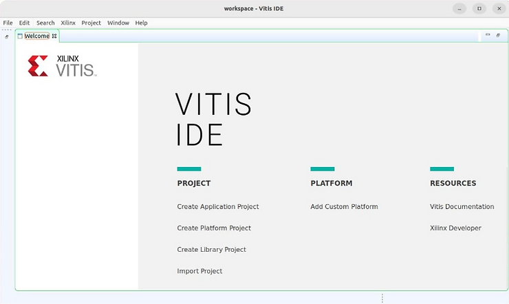

# What does a9-linaro-pre-build-step do?

This post answers, "**What does a9-linaro-pre-build-step do?**" and provides additional information that may help debuggers.

## a9-linaro-pre-build-step

### Functionality

Create a GCC Spec file named Xilinx.spec in Vitis/2022.1/bin/ containing:

```
*startfile:
crti%O%s crtbegin%O%s
```

### Purpose

Override the built-in GCC spec string, **startfile**, to specify the path to the specific crti.o and crtbegin.o object files (and crtend.o and crtn.o) for GCC to include at the start of the link. With this file the gcc driver calls:

```
ld -o output_file Vitis/2022.1/gnu/aarch32/lin/gcc-arm-none-eabi/aarch32-xilinx-eabi/usr/lib/crti.o Vitis/2022.1/gnu/aarch32/lin/gcc-arm-none-eabi/aarch32-xilinx-eabi/usr/lib/crtbegin.o</span></strong><span> … -lgcc Vitis/2022.1/gnu/aarch32/lin/gcc-arm-none-eabi/aarch32-xilinx-eabi/usr/lib/crtend.o Vitis/2022.1/gnu/aarch32/lin/gcc-arm-none-eabi/aarch32-xilinx-eabi/usr/lib/crtn.o
```

...instead of the default:

```
ld -o output_file crti.o crtbegin.o … -lgcc crtend.o crtn.o
```

### Related Information

-   **crti.o**: contains the initial runtime setup code, including the definitions for the .init and .fini sections.
    
-   **crtbegin.o**: marks the beginning of the constructors and destructors section and sets up the environment for their execution.
    
-   **a9**: is shorthand for Cortex-A9. It implies that **a9-linaro-pre-build-step** is only used when compiling ARM code for the [<u><span>Zynq-7000</span></u>](https://www.amd.com/en/products/adaptive-socs-and-fpgas/soc/zynq-7000.html), because this is the only chip that contains an "a9." It also implies **aarch32**, ARM Architecture 32-bit, and these toolchains:  
    
    -   gnu/aarch32/lin/gcc-arm-none-eabi/
        
    -   gnu/aarch32/lin/gcc-arm-linux-gnueabi/  
        

### Read More At

-   GCC Spec files: [<u><span>https://gcc.gnu.org/onlinedocs/gcc/Spec-Files.html</span></u>](https://gcc.gnu.org/onlinedocs/gcc/Spec-Files.html)
    
-   crti.o & crtbegin.o (and crtend.o crtn.o): [<u><span>https://gcc.gnu.org/onlinedocs/gccint/Initialization.html</span></u>](https://gcc.gnu.org/onlinedocs/gccint/Initialization.html)
    

### Additional Details:

-   **Path**: Vitis/2022.1/bin/
    
-   **File Type**: POSIX shell script, ASCII text executable
    
-   **Wraps**: Nothing
    
-   **Wrapped File Type**: N/A
    
-   **First Copyright Date**: None listed.
    
-   **Last Copyright Date**: N/A
    
-   **Present In**: 2022.1, 2023.1 (likely more, will add more after checking)  
    

