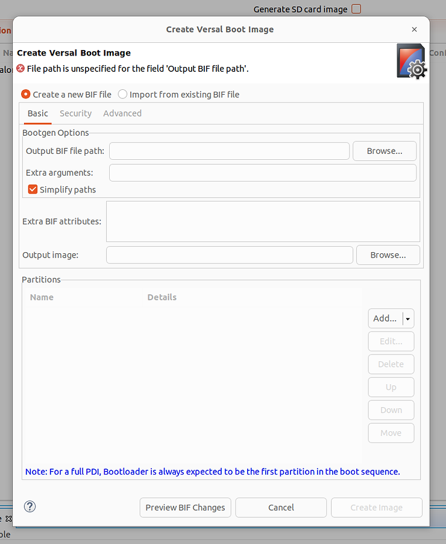

# What does BIF stand for? What does PDI stand for? Describe the "Create Versal Boot Image Screen" v2023.1

This post answers what BIF stands for (Boot Image Format) and what PDI stands for (Programmable Device Image). It also lists links to documents describing the BIF and the PDI and Create Versal Boot Image Screen from Vitis v2023.1. I wrote it as a quick reference.

## What does BIF stand for? What does PDI stand for?

-   **BIF**
    
    -   Stands for:
        
        -   **Boot Image Format**
        
    -   Defined and described at
        
        -   [<u>https://docs.amd.com/r/en-US/ug1283-bootgen-user-guide/Boot-Image-Format-BIF</u>](https://docs.amd.com/r/en-US/ug1283-bootgen-user-guide/Boot-Image-Format-BIF)
    
-   **PDI**
    
    -   Stands for:
        
        -   **Programmable Device Image**
        
    -   Defined and described at:
        
        -   [<u>https://docs.amd.com/r/en-US/ug1283-bootgen-user-guide/Versal-Adaptive-SoC-Use-Cases</u>](https://docs.amd.com/r/en-US/ug1283-bootgen-user-guide/Versal-Adaptive-SoC-Use-Cases)
            

## Create Versal Image Screen v2023.1

## Version Info

Vitis IDE v2023.1.0 (64-bit)

SW Build 3860322 on 2023-05-04-06:32:46