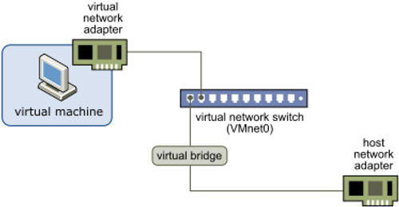

# What is a Bridged Adapter?

This post answers the question, what is a Bridged Adapter?

A bridged adapter is a network configuration mode used in virtual machines to allow them to be part of the same network as the host machine. When you set a virtual machine's network adapter to "bridged," the VM essentially gets its own IP address on the same local network as the host as if it were a physical machine connected to the same network.

### How a Bridged Adapter Works:

-   **Direct Network Access**: The VM's virtual network adapter is connected directly to the host machine's physical network adapter. This allows the VM to communicate with other devices on the same local network, including other VMs, physical machines, and network services like printers and servers.
    
-   **IP Address Assignment**: The VM can obtain an IP address from the network's DHCP server, just like any other device on the network. Alternatively, you can assign a static IP address to the VM.
    
-   **Network Visibility**: Other devices on the network can see and interact with the VM as if it were another physical device on the network. This is useful for tasks such as file sharing, running network services, or testing network configurations.
    

### Benefits of Using a Bridged Adapter:

-   **Full Network Integration**: The VM can fully participate in the local network, making it suitable for development, testing, and running network services.
    
-   **Direct Communication**: The VM can directly communicate with other devices on the same network, simplifying network setups and troubleshooting.
    
-   **Independent IP Address:** The VM gets its own IP address, which can help in scenarios where multiple services must be tested or run simultaneously without IP conflicts.
    

### Example Use Case:

Suppose you have a home network with a router, several computers, and a printer. By setting your VM's network adapter to bridged mode, your VM can get an IP address from the router and interact with the other computers and the printer on your network, just like any physical device would. This setup is handy for:

-   **Network Testing**: Testing network configurations or software that requires network communication.
    
-   **Service Hosting**: Running services (e.g., web servers, file servers) that need to be accessible from other devices on the network.
    
-   **Remote Access**: Accessing the VM from other devices on the same network without additional network configuration.
    

### How to Configure a Bridged Adapter:

-   **VirtualBox:**
    
    -   Open the VM settings.
        
    -   Go to the "Network" section.
        
    -   Select "Bridged Adapter" from the "Attached to" dropdown menu.
        
    -   Choose the appropriate physical network adapter from the "Name" dropdown menu.  
    
-   **VMware**:
    
    -   Open the VM settings.
        
    -   Go to the "Network Adapter" section.
        
    -   Select "Bridged" under the "Network connection" options.  
        

### Considerations:

-   Network Security: Since the VM is fully visible on the network, ensure proper security measures (e.g., firewalls, secure passwords) are in place.
    
-   IP Address Conflicts: Ensure the VM gets a unique IP address to avoid conflicts with other devices on the network.
    
-   Network Bandwidth: The VM will share the host's network connection, which might impact network performance if the VM generates significant traffic.
    

Using a bridged adapter allows your VM to integrate seamlessly into your local network, providing flexibility and ease of management.

## References

-   VMWare Bridged Diagram clipped from [<u>https://docs.vmware.com/en/VMware-Workstation-Pro/17/com.vmware.ws.using.doc/GUID-BAFA66C3-81F0-4FCA-84C4-D9F7D258A60A.html</u>](https://docs.vmware.com/en/VMware-Workstation-Pro/17/com.vmware.ws.using.doc/GUID-BAFA66C3-81F0-4FCA-84C4-D9F7D258A60A.html)