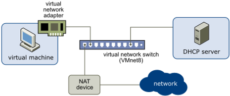

# What is NAT mode?

This post answers the question, "What is NAT mode?"

## What does it mean when a network adapter is in "NAT mode?"

An adapter in NAT (Network Address Translation) mode is a network configuration for virtual machines that allows them to access external networks (like the internet) through the host machine's network connection. However, the VM remains isolated from the local network, providing security and simplicity.

### How NAT Mode Works:

1.  **Internal Network**: The VM is assigned an IP address in a private subnet by the virtualization software, not directly visible to the external network.
    
2.  **Address Translation**: When the VM tries to communicate with an external network (e.g., accessing a website), the virtualization software translates the VM's private IP address to the host's public IP address.
    
3.  **Port Forwarding**: Replies to the VM's requests are routed back through the host machine, which then forwards them to the appropriate VM based on the internal address and port number.
    

### Benefits of Using NAT Mode:

-   **Simplicity**: NAT mode requires minimal configuration, making it easy to set up and use.
    
-   **Security**: The VM is isolated from the host's local network, reducing the risk of network-based attacks from other devices on the same network.
    
-   **Internet Access**: The VM can access the internet using the host's network connection, suitable for tasks like browsing, downloading updates, and accessing online services.
    

### Limitations of NAT Mode:

-   **Limited Network Visibility**: Other devices on the local network cannot initiate connections to the VM. This can be a limitation if you need the VM to be accessible from other devices on the same network.
    
-   **Performance Overhead**: NAT adds some performance overhead due to the address translation process.
    
-   **Port Forwarding Setup**: To allow inbound connections to the VM (e.g., SSH or web server access), you need to configure port forwarding on the host machine.
    

### Example Use Case:

If you have a VM running a development environment that needs internet access to download packages and updates. Using NAT mode, the VM can access the internet through the host's connection without any additional network configuration. The VM remains secure and isolated from the rest of the local network.

### How to Configure NAT Mode:

-   **VirtualBox**:
    
    -   Open the VM settings.
        
    -   Go to the "Network" section.
        
    -   Select "NAT" from the "Attached to" dropdown menu.
    
-   **VMware**:
    
    -   Open the VM settings.  
        
    -   Go to the "Network Adapter" section.  
        
    -   Select "NAT" under the "Network connection" options.
        

### Example Configuration:

Suppose you have a VM running Ubuntu and want to access the internet. With NAT mode:

-   The VM gets a private IP address (e.g., 10.0.2.15) from the virtualization software.
    
-   When the VM accesses an external website, the request is sent to the host.
    
-   The host translates the VM's private IP address to the host's public IP address and forwards the request.
    
-   The response from the website goes to the host, which then translates the address back and sends the response to the VM.
    

### Port Forwarding in NAT Mode:

To allow external access to services running on the VM, set up port forwarding:

-   **VirtualBox**:
    
    -   Go to the "Network" section in the VM settings.
        
    -   Click on the "Advanced" dropdown, then "Port Forwarding."
        
    -   Add a new rule, specifying the host port and the guest port (e.g., forward host port 2222 to guest port 22 for SSH).
    
-   **VMware**:
    
    -   Edit the virtual network settings on the host.
        
    -   Add a port forwarding rule specifying the host and VM ports.
        

### Considerations:

-   **Network Performance**: Consider the slight performance impact due to NAT.
    
-   **Service Access**: If you need the VM to be accessible from other devices on the local network, consider using port forwarding or a different network mode (e.g., [<u>bridged adapter</u>](https://www.centennialsoftwaresolutions.com/post/what-is-nat-mode#viewer-sos87754)).
    

NAT mode is ideal for VMs that need internet access without being directly exposed to the local network, providing a balance between ease of use and security.

## References

-   VMWare NAT Configuration diagram from: [<u>https://docs.vmware.com/en/VMware-Workstation-Pro/17/com.vmware.ws.using.doc/GUID-89311E3D-CCA9-4ECC-AF5C-C52BE6A89A95.html</u>](https://docs.vmware.com/en/VMware-Workstation-Pro/17/com.vmware.ws.using.doc/GUID-89311E3D-CCA9-4ECC-AF5C-C52BE6A89A95.html)