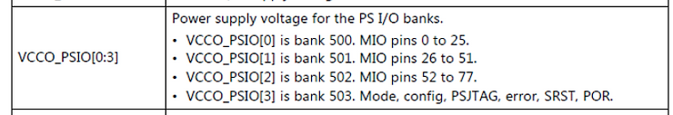
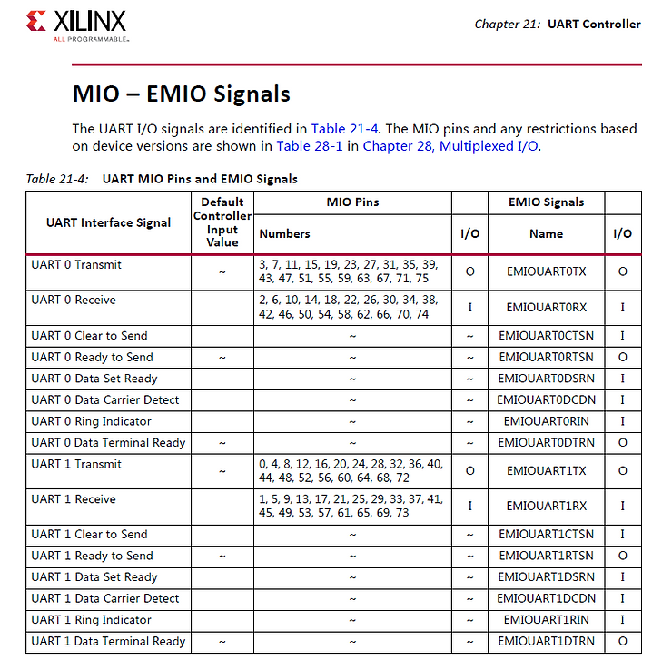
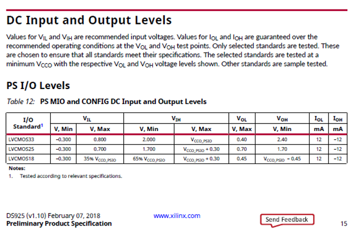
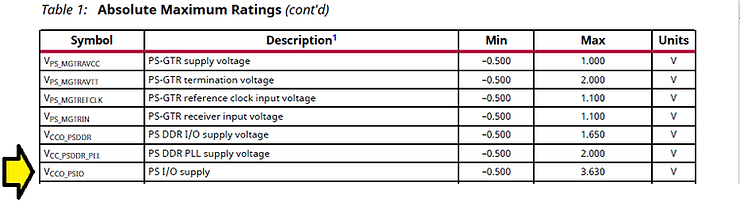
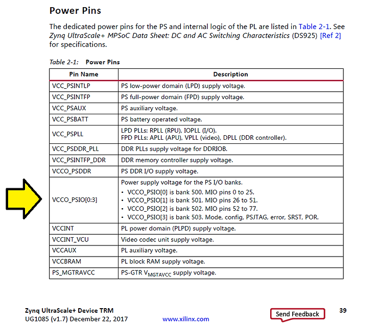

# What is the Voltage of the UART on my Zynq UltraScale+ MPSoC Board?

This post shows how to figure out the voltage of a UART connected to the PS of the Zynq UltraScale+ MPSoC. Figuring out the voltage of a UART connected to the PL would use similar steps.

**TL;DR**

Look at the schematic to see which MIO UART TX and RX are connected to. Consult this table. Find the corresponding VCC\_PSIO pin and what voltage its connected to. That's the voltage of your UART.

**Steps**

**1.** Examine your schematic and figure out which MIO (Multiplxed I/O) pins the UART is connected to.

For this walk through we'll assume that UART0 RX is connected to MIO74 and UART0 TX is connected to MIO75.

**2.** Cross check with the TRM or the table below. If the pins are in the this table you're hooked up to the PS UART.

p.599 Zynq UltraScale+ Device TRM [UG1085](http://www.xilinx.com/support/documentation/user_guides/ug1085-zynq-ultrascale-trm.pdf) (v1.7) December 22, 2017

**3.** Follow the pointer to the data sheet. The data sheet shows that the high voltage is VCCO\_PSIO or VCCO\_PSIO + 0.30 V depending on the I/O Standard:

The **MIO DC input and output levels** are listed on p15 of the Zynq UltraScale+ MPSoC Data Sheet: DC and AC Switching Characteristics ([DS925](http://www.xilinx.com/support/documentation/data_sheets/ds925-zynq-ultrascale-plus.pdf)) and here:

**4.** Find the VCCO\_PSIO symbol in table 1 to figure out its spec:

**VCCO\_PSIO** is listed in Table 1 on page 2 and here:

**5.** Go back to the TRM and find the supply pins:

The PS I/O supplies are connected to VCCO\_PSIO\[0:3\] as seen in Table 2-1: Power Pins on p39 of the TRM:

Since UART0 RX is connected to MIO74 and UART0 TX is connected to MIO75 we're in **bank 502** and we're connected to the **VCCO\_PSIO\[2\]** power pin.

**6.** Find VCCO\_PSIO\[2\] on the schematic and see what its connected to. **That's the voltage of the UART**.

**References**

-   Zynq UltraScale+ Device TRM [UG1085](http://www.xilinx.com/support/documentation/user_guides/ug1085-zynq-ultrascale-trm.pdf) (v1.7) December 22, 2017
    
-   Zynq UltraScale+ MPSoC Data Sheet: DC and AC Switching Characteristics ([DS925](http://www.xilinx.com/support/documentation/data_sheets/ds925-zynq-ultrascale-plus.pdf))
    
-   Xilinx logo is from [https://twitter.com/xilinxinc](http://twitter.com/xilinxinc) at [link](http://pbs.twimg.com/profile_images/535545777020338176/pEWdIYq__400x400.png)
