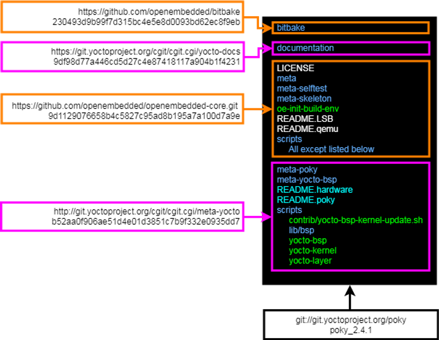

# What is Yocto Rocko 2.4.1?

This post shows what **Yocto Rocko 2.4.1** is. It gets **Yocto Rocko 2.4.1** from the links in **Yocto Project Quick Start** then builds up the same components from **OE-Core**, **meta-yocto** and **Bitbake**. Using this method it shows that **Yocto Rocko 2.4.1** is **OE-Core**, **meta-yocto** and **Bitbake** (and **yocto-docs**) and nothing else.

**Summary**

**Yocto Rocko 2.4.1** is: **OE-Core**, **meta-yocto** and **Bitbake** (and **yocto-docs** but **yocto-docs** contains no functionality) without 7 files.

gits @ SHAs

-   **OE-Core** from https://github.com/openembedded/openembedded-core.git @ **9d1129076658b4c5827c95ad8b195a7a100d7a9e**
    
-   **meta-yocto** from http://git.yoctoproject.org/cgit/cgit.cgi/meta-yocto @ **b52aa0f906ae51d4e01d3851c7b9f332e0935dd7**
    
-   **Bitbake** from https://github.com/openembedded/bitbake @ **230493d9b99f7d315bc4e5e8d0093bd62ec8f9eb**
    
-   **yocto-docs** from https://git.yoctoproject.org/cgit/cgit.cgi/yocto-docs @ **9df98d77a446cd5d27c4e87418117a904b1f4231**
    

Discards

These files are discarded from Bitbake:

-   classes/base.bbclass
    
-   conf/bitbake.conf
    
-   lib/bb/shell.py
    

These files are discarded from OE-Core:

-   meta/conf/bblayers.conf.sample
    
-   meta/conf/local.conf.sample
    
-   meta/conf/local.conf.sample.extended
    
-   meta/conf/site.conf.sample
    

Here's **git://git.yoctoproject.org/poky** at tag **poky\_2.4.1** + each sub component graphically:

What is OE-Core?

OE-Core is the **core** of OpenEmbedded, a build framework for embedded Linux. It allows "cross-compile" environments to be built on a host, e.g. you can build and use an ARM tool chain on an x86. It also has recipes that its maintainers think everyone needs.

What is Bitbake?

BitBake is a task execution engine written in Python. It runs shell and Python tasks in the right order as quickly as possible. BitBake reads recipes to get source and build a package. Common recipe "stuff" can be put into a class. BitBake also uses configuration files during the build to guide it.

What is meta-yocto?

meta-yocto is a set of recipes, configs, classes and layers for building common embedded platforms.

Suggestions

1. Ditch the term "Yocto" because it confuses people and just call the it the **OE-Core**, **meta-yocto** and **Bitbake** collection 
2. Checkout **OE-Core**, **meta-yocto**, **Bitbake** and **yocto-docs** to a top level directory - don't mix them together

Soapbox

Many embedded silicon manufactures are releasing support for their chips as Yocto recipes. System developers take these systems and try to do development, but Yocto is not meant to do system development, it is meant for a build engineer. Because of this, a system developer's change, compile and test loop is slower than it needs to be. In may cases 10x slower than it could be (devtool does not improve things much). From what I've seen, this cannot be fixed because Yocto was never built for system developers.

Why should you care? If you are actually trying to build a product, your development costs will be much greater because your silicon vendor has decided to give you a Yocto system. If you have the ability to negotiate with the silicon vendor, you should insist on a system development system that ensures that the change, compile and test loop is as fast as possible. You may also want to simply throw out the complexity, build your own build system for your product and get out the door while your competition is still trying to figure out what a recipe is.

**Details**

Figure out SHAs

From the **Yocto Project Quick Start** at [[link](http://www.yoctoproject.org/docs/2.4.1/yocto-project-qs/yocto-project-qs.html)], **Yocto Rocko 2.4.1** is **git://git.yoctoproject.org/poky** at tag **poky_2.4.1**.

Type **cd ~**

Type **mkdir yocto**

Type **cd yocto**

Type **git clone git://git.yoctoproject.org/poky**

You'll see:

remote: Counting objects: 423809, done.

remote: Compressing objects: 100% (100256/100256), done.

remote: Total 423809 (delta 316661), reused 423662 (delta 316516)

Receiving objects: 100% (423809/423809), 152.05 MiB | 1.80 MiB/s, done.

Resolving deltas: 100% (316661/316661), done.

Checking connectivity... done.

Type **cd poky**

Type **git checkout tags/yocto-2.4.1 -b poky_2.4.1**

Type **ls -1l** to get the contents:

total 48

drwxrwxr-x 6 zpfeffer zpfeffer 4096 Nov 26 01:19 bitbake

drwxrwxr-x 14 zpfeffer zpfeffer 4096 Nov 26 01:19 documentation

-rw-rw-r-- 1 zpfeffer zpfeffer 515 Nov 26 01:18 LICENSE

drwxrwxr-x 19 zpfeffer zpfeffer 4096 Nov 26 01:18 meta

drwxrwxr-x 5 zpfeffer zpfeffer 4096 Nov 26 01:18 meta-poky

drwxrwxr-x 8 zpfeffer zpfeffer 4096 Nov 26 01:18 meta-selftest

drwxrwxr-x 7 zpfeffer zpfeffer 4096 Nov 26 01:18 meta-skeleton

drwxrwxr-x 8 zpfeffer zpfeffer 4096 Nov 26 01:19 meta-yocto-bsp

-rwxrwxr-x 1 zpfeffer zpfeffer 1754 Nov 26 01:18 oe-init-build-env

lrwxrwxrwx 1 zpfeffer zpfeffer  30 Nov 26 01:18 README.hardware -> meta-yocto-bsp/README.hardware

-rw-rw-r-- 1 zpfeffer zpfeffer 1173 Nov 26 01:19 README.LSB

lrwxrwxrwx 1 zpfeffer zpfeffer  21 Nov 26 01:18 README.poky -> meta-poky/README.poky

-rw-rw-r-- 1 zpfeffer zpfeffer 529 Nov 26 01:18 README.qemu

drwxrwxr-x 8 zpfeffer zpfeffer 4096 Nov 26 01:19 scripts

The git log can be used to show the commits of OE-Core, meta-yocto and Bitbake that were used to create Yocto Rocko 2.4.1:

Type **cd ~**

Type **cd yocto**

Type **cd poky**

Type **git log**

The last **OE-Core** commit:

commit c2b641c8a0c4fd71fcb477d788a740c2c26cddce

Author: Richard Purdie <richard.purdie@linuxfoundation.org>

Date:  Thu Dec 7 12:26:34 2017 +0000

  build-appliance-image: Update to rocko head revision

 

  (From OE-Core rev: 9d1129076658b4c5827c95ad8b195a7a100d7a9e)

 

  Signed-off-by: Richard Purdie <richard.purdie@linuxfoundation.org>

The last **meta-yocto** commit:

commit ab4310e7b8eb086e6a04f088e1f6e9e1ebf1b390

Author: Richard Purdie <richard.purdie@linuxfoundation.org>

Date:  Thu Dec 7 12:25:15 2017 +0000

  poky: Update to version 2.4.1

 

  (From meta-yocto rev: **b52aa0f906ae51d4e01d3851c7b9f332e0935dd7**)

 

  Signed-off-by: Richard Purdie <richard.purdie@linuxfoundation.org>

The last **Bitbake** commit:

commit 1c61ba0a3f89959ad9668c83826e3b0011afd1d0

Author: Richard Purdie <richard.purdie@linuxfoundation.org>

Date:  Wed Nov 8 14:04:50 2017 +0000

  bitbake: tinfoil: Ensure we clean up loggers

 

  This is primarily paranoid but ensure we remove any loggers we setup

  either directly or indirectly so the initial state is restored after

  we exit.

 

  (Bitbake rev: **230493d9b99f7d315bc4e5e8d0093bd62ec8f9eb**)

 

  Signed-off-by: Richard Purdie <richard.purdie@linuxfoundation.org>

  (cherry picked from commit af7d63b1f76fd3f7fa92ed15ae61ca47d9e13472)

  Signed-off-by: Armin Kuster <akuster808@gmail.com>

  Signed-off-by: Richard Purdie <richard.purdie@linuxfoundation.org>

Build the Release

Type **cd ~/yocto**

Type **mkdir pokysynth**

Type **cd pokysynth**

Type **git clone https://github.com/openembedded/openembedded-core.git**

You'll see:

Cloning into 'openembedded-core'...

remote: Enumerating objects: 478, done.

remote: Counting objects: 100% (478/478), done.

remote: Compressing objects: 100% (286/286), done.

remote: Total 333534 (delta 269), reused 294 (delta 192), pack-reused 333056

Receiving objects: 100% (333534/333534), 128.04 MiB | 3.77 MiB/s, done.

Resolving deltas: 100% (228699/228699), done.

Checking connectivity... done.

Type **cd openembedded-core**

Type **git checkout 9d1129076658b4c5827c95ad8b195a7a100d7a9e**

You'll see:

Note: checking out '9d1129076658b4c5827c95ad8b195a7a100d7a9e'.

You are in 'detached HEAD' state. You can look around, make experimental

changes and commit them, and you can discard any commits you make in this

state without impacting any branches by performing another checkout.

If you want to create a new branch to retain commits you create, you may

do so (now or later) by using -b with the checkout command again. Example:

 git checkout -b <new-branch-name>

HEAD is now at 9d11290... build-appliance-image: Update to rocko head revision

Type **cd ..**

Type **git clone http://git.yoctoproject.org/cgit/cgit.cgi/meta-yocto**

You'll see:

Cloning into 'meta-yocto'...

Checking connectivity... done.

Type **cd meta-yocto**

Type **git checkout b52aa0f906ae51d4e01d3851c7b9f332e0935dd7**

You'll see:

Note: checking out 'b52aa0f906ae51d4e01d3851c7b9f332e0935dd7'.

You are in 'detached HEAD' state. You can look around, make experimental

changes and commit them, and you can discard any commits you make in this

state without impacting any branches by performing another checkout.

If you want to create a new branch to retain commits you create, you may

do so (now or later) by using -b with the checkout command again. Example:

 git checkout -b <new-branch-name>

HEAD is now at b52aa0f... poky: Update to version 2.4.1

Type **cd ..**

Type **git clone https://github.com/openembedded/bitbake**

You'll see:

Cloning into 'bitbake'...

remote: Enumerating objects: 165, done.

remote: Counting objects: 100% (165/165), done.

remote: Compressing objects: 100% (88/88), done.

remote: Total 50791 (delta 110), reused 98 (delta 77), pack-reused 50626

Receiving objects: 100% (50791/50791), 17.95 MiB | 3.81 MiB/s, done.

Resolving deltas: 100% (35432/35432), done.

Checking connectivity... done.

Type **cd bitbake/**

Type **git checkout 230493d9b99f7d315bc4e5e8d0093bd62ec8f9eb**

You'll see:

Note: checking out '230493d9b99f7d315bc4e5e8d0093bd62ec8f9eb'.

You are in 'detached HEAD' state. You can look around, make experimental

changes and commit them, and you can discard any commits you make in this

state without impacting any branches by performing another checkout.

If you want to create a new branch to retain commits you create, you may

do so (now or later) by using -b with the checkout command again. Example:

 git checkout -b <new-branch-name>

HEAD is now at 230493d... tinfoil: Ensure we clean up loggers

Type **cd ..**

In Each Dir

zpfeffer@z:~/yocto$ **ls -1l pokysynth/openembedded-core/**

total 36

-rw-rw-r-- 1 zpfeffer zpfeffer 515 Nov 26 01:29 LICENSE

drwxrwxr-x 19 zpfeffer zpfeffer 4096 Nov 26 01:30 meta

drwxrwxr-x 8 zpfeffer zpfeffer 4096 Nov 26 01:29 meta-selftest

drwxrwxr-x 7 zpfeffer zpfeffer 4096 Nov 26 01:29 meta-skeleton

-rwxrwxr-x 1 zpfeffer zpfeffer 1754 Nov 26 01:30 oe-init-build-env

-rw-rw-r-- 1 zpfeffer zpfeffer 809 Nov 26 01:29 README

-rw-rw-r-- 1 zpfeffer zpfeffer 1173 Nov 26 01:31 README.LSB

-rw-rw-r-- 1 zpfeffer zpfeffer 529 Nov 26 01:29 README.qemu

drwxrwxr-x 8 zpfeffer zpfeffer 4096 Nov 26 01:31 scripts

zpfeffer@z:~/yocto$ **ls -1l pokysynth/meta-yocto/**

total 16

-rw-rw-r-- 1 zpfeffer zpfeffer 545 Nov 26 01:32 LICENSE

drwxrwxr-x 5 zpfeffer zpfeffer 4096 Nov 26 01:32 meta-poky

drwxrwxr-x 8 zpfeffer zpfeffer 4096 Nov 26 01:33 meta-yocto-bsp

lrwxrwxrwx 1 zpfeffer zpfeffer  30 Nov 26 01:32 README.hardware -> meta-yocto-bsp/README.hardware

lrwxrwxrwx 1 zpfeffer zpfeffer  21 Nov 26 01:32 README.poky -> meta-poky/README.poky

drwxrwxr-x 4 zpfeffer zpfeffer 4096 Nov 26 01:33 scripts

zpfeffer@z:~/yocto$ **ls -1l pokysynth/bitbake/**

total 92

-rw-rw-r-- 1 zpfeffer zpfeffer  365 Nov 26 01:34 AUTHORS

drwxrwxr-x 2 zpfeffer zpfeffer 4096 Nov 26 01:34 bin

-rw-rw-r-- 1 zpfeffer zpfeffer 16501 Nov 26 01:34 ChangeLog

drwxrwxr-x 2 zpfeffer zpfeffer 4096 Nov 26 01:34 classes

drwxrwxr-x 2 zpfeffer zpfeffer 4096 Nov 26 01:34 conf

drwxrwxr-x 3 zpfeffer zpfeffer 4096 Nov 26 01:34 contrib

-rw-rw-r-- 1 zpfeffer zpfeffer 17987 Nov 26 01:34 COPYING

drwxrwxr-x 5 zpfeffer zpfeffer 4096 Nov 26 01:34 doc

-rw-rw-r-- 1 zpfeffer zpfeffer  849 Nov 26 01:34 HEADER

drwxrwxr-x 10 zpfeffer zpfeffer 4096 Nov 26 01:34 lib

-rw-rw-r-- 1 zpfeffer zpfeffer  935 Nov 26 01:34 LICENSE

-rw-rw-r-- 1 zpfeffer zpfeffer  195 Nov 26 01:34 MANIFEST.in

-rw-rw-r-- 1 zpfeffer zpfeffer 1296 Nov 26 01:34 README

-rw-rw-r-- 1 zpfeffer zpfeffer  45 Nov 26 01:34 toaster-requirements.txt

-rw-rw-r-- 1 zpfeffer zpfeffer 2887 Nov 26 01:34 TODO

Diff Each

Type **cd ~**

Type **cd yocto**

drwxrwxr-x 6 zpfeffer zpfeffer 4096 Nov 26 01:19 bitbake

zpfeffer@z:~/yocto$ **diff -r poky/bitbake pokysynth/bitbake**

Only in pokysynth/bitbake: classes

Only in pokysynth/bitbake: conf

Only in pokysynth/bitbake: .git

Only in pokysynth/bitbake: .gitignore

Only in poky/bitbake/lib/bb: shell.py

Only in pokysynth/bitbake: MANIFEST.in

Only in pokysynth/bitbake: TODO

Of these files:

Only in pokysynth/bitbake: classes

Only contains **classes/base.bbclass**

**This file is thrown out and openembedded-core's base.bbclase is used:**

diff -q ./poky/meta/classes/base.bbclass ./pokysynth/openembedded-core/meta/classes/base.bbclass

**No diff**

zpfeffer@z:~/yocto$ diff -qs ./poky/meta/classes/base.bbclass ./pokysynth/bitbake/classes/base.bbclass

**Files ./poky/meta/classes/base.bbclass and ./pokysynth/bitbake/classes/base.bbclass differ**

Only in pokysynth/bitbake: conf

Only contains **bitbake.conf**

**This file is thrown out and openembedded-core's base.bbclase is used:**

zpfeffer@z:~/yocto$ diff -q ./poky/meta/conf/bitbake.conf ./pokysynth/openembedded-core/meta/conf/bitbake.conf

**No diff**

zpfeffer@z:~/yocto$ diff -q ./poky/meta/conf/bitbake.conf ./pokysynth/bitbake/conf/bitbake.conf

**Files ./poky/meta/conf/bitbake.conf and ./pokysynth/bitbake/conf/bitbake.conf differ**

Only in poky/bitbake/lib/bb: shell.py

**Not included in Yocto.**

drwxrwxr-x 14 zpfeffer zpfeffer 4096 Nov 26 01:19 documentation

This directory is not in **OE-Core**, **meta-yocto** and **Bitbake**.

You can get the documentation tree in https://git.yoctoproject.org/cgit/cgit.cgi/yocto-docs

Type **cd ~/yocto/pokysynth**

Type **git clone https://git.yoctoproject.org/cgit/cgit.cgi/yocto-docs**

Type **cd yocto-docs**

Type **git checkout tags/yocto-2.4.1 -b poky_2.4.1**

Type **cd ~/yocto**

Type **diff -rq poky/documentation pokysynth/yocto-docs/documentation**

You'll see many differences:

Files poky/documentation/bsp-guide/bsp-guide.xml and pokysynth/yocto-docs/documentation/bsp-guide/bsp-guide.xml differ

Files poky/documentation/dev-manual/dev-manual-common-tasks.xml and pokysynth/yocto-docs/documentation/dev-manual/dev-manual-common-tasks.xml differ

Files poky/documentation/dev-manual/dev-manual.xml and pokysynth/yocto-docs/documentation/dev-manual/dev-manual.xml differ

Files poky/documentation/kernel-dev/kernel-dev.xml and pokysynth/yocto-docs/documentation/kernel-dev/kernel-dev.xml differ

Files poky/documentation/Makefile and pokysynth/yocto-docs/documentation/Makefile differ

Files poky/documentation/mega-manual/figures/sdk-title.png and pokysynth/yocto-docs/documentation/mega-manual/figures/sdk-title.png differ

Files poky/documentation/mega-manual/mega-manual.xml and pokysynth/yocto-docs/documentation/mega-manual/mega-manual.xml differ

Files poky/documentation/poky.ent and pokysynth/yocto-docs/documentation/poky.ent differ

Files poky/documentation/profile-manual/profile-manual.xml and pokysynth/yocto-docs/documentation/profile-manual/profile-manual.xml differ

Files poky/documentation/ref-manual/introduction.xml and pokysynth/yocto-docs/documentation/ref-manual/introduction.xml differ

Files poky/documentation/ref-manual/migration.xml and pokysynth/yocto-docs/documentation/ref-manual/migration.xml differ

Files poky/documentation/ref-manual/ref-development-environment.xml and pokysynth/yocto-docs/documentation/ref-manual/ref-development-environment.xml differ

Files poky/documentation/ref-manual/ref-features.xml and pokysynth/yocto-docs/documentation/ref-manual/ref-features.xml differ

Files poky/documentation/ref-manual/ref-manual.xml and pokysynth/yocto-docs/documentation/ref-manual/ref-manual.xml differ

Files poky/documentation/ref-manual/ref-variables.xml and pokysynth/yocto-docs/documentation/ref-manual/ref-variables.xml differ

Files poky/documentation/ref-manual/usingpoky.xml and pokysynth/yocto-docs/documentation/ref-manual/usingpoky.xml differ

Files poky/documentation/sdk-manual/sdk-manual.xml and pokysynth/yocto-docs/documentation/sdk-manual/sdk-manual.xml differ

Files poky/documentation/toaster-manual/toaster-manual.xml and pokysynth/yocto-docs/documentation/toaster-manual/toaster-manual.xml differ

Files poky/documentation/tools/mega-manual.sed and pokysynth/yocto-docs/documentation/tools/mega-manual.sed differ

Files poky/documentation/yocto-project-qs/yocto-project-qs.xml and pokysynth/yocto-docs/documentation/yocto-project-qs/yocto-project-qs.xml differ

This implies that the **documentation** tree is not at **poky_2.4.1**

Looking at the git log shows the commit listed:

Type **cd ~/yocto/poky**

Type **git log**

Search for "yocto-docs"

commit 514a808f21c37b6ad704ce397bb2740ecc9a93bc

Author: Scott Rifenbark <srifenbark@gmail.com>

Date:  Thu Oct 26 09:20:49 2017 -0700

  ref-manual: Updates to "Image Generation" section.

 

  Fixed wording on how the OpenEmbedded build system dynamically

  generates do_image_* tasks as needed during image generation.

 

  (From yocto-docs rev: **9df98d77a446cd5d27c4e87418117a904b1f4231**)

 

  Signed-off-by: Scott Rifenbark <srifenbark@gmail.com>

  Signed-off-by: Richard Purdie <richard.purdie@linuxfoundation.org>

Type **cd ~/yoco**

Type **cd pokysynth/yocto-docs/**

Type **git checkout 9df98d77a446cd5d27c4e87418117a904b1f4231**

Type **cd ~/yocto**

Type **diff -rq poky/documentation pokysynth/yocto-docs/documentation**

**No diff**

Type **cd ~/yocto/pokysynth/yocto-docs**

Type **git tag --contains 9df98d77a446cd5d27c4e87418117a904b1f4231**

You should see

yocto-2.4.1

yocto-2.4.2

yocto-2.4.3

yocto-2.5

This means that the documentation commit used in **2.4.1** is also valid for **2.4.2**, **2.4.3** and **2.5** (Sumo).

-rw-rw-r-- 1 zpfeffer zpfeffer 515 Nov 26 01:18 LICENSE

zpfeffer@z:~/yocto$ **diff -u poky/LICENSE pokysynth/openembedded-core/LICENSE**

**No diff**

drwxrwxr-x 19 zpfeffer zpfeffer 4096 Nov 26 01:18 meta

zpfeffer@z:~/yocto$ **diff -r poky/meta pokysynth/openembedded-core/meta**

Only in pokysynth/openembedded-core/meta/conf: bblayers.conf.sample

Only in pokysynth/openembedded-core/meta/conf: local.conf.sample

Only in pokysynth/openembedded-core/meta/conf: local.conf.sample.extended

Only in pokysynth/openembedded-core/meta/conf: site.conf.sample

drwxrwxr-x 5 zpfeffer zpfeffer 4096 Nov 26 01:18 meta-poky

zpfeffer@z:~/yocto$ **diff -ru poky/meta-poky pokysynth/meta-yocto/meta-poky**

diff -ru poky/meta-poky/README.poky pokysynth/meta-yocto/meta-poky/README.poky

--- poky/meta-poky/README.poky  2018-11-26 01:18:45.648361000 -0700

+++ pokysynth/meta-yocto/meta-poky/README.poky  2018-11-26 01:32:13.884361000 -0700

@@ -22,7 +22,7 @@

 

 OpenEmbedded-Core is a layer containing the core metadata for current versions

 of OpenEmbedded. It is distro-less (can build a functional image with

-DISTRO = "nodistro") and contains only emulated machine support.

+DISTRO = "") and contains only emulated machine support.

 

 For information about OpenEmbedded, see the OpenEmbedded website:

   http://www.openembedded.org/

drwxrwxr-x 8 zpfeffer zpfeffer 4096 Nov 26 01:18 meta-selftest

zpfeffer@z:~/yocto$ **diff -ru poky/meta-selftest pokysynth/openembedded-core/meta-selftest/**

**No diff**

drwxrwxr-x 7 zpfeffer zpfeffer 4096 Nov 26 01:18 meta-skeleton

zpfeffer@z:~/yocto$ **diff -ru poky/meta-skeleton/ pokysynth/openembedded-core/meta-skeleton/**

**No diff**

drwxrwxr-x 8 zpfeffer zpfeffer 4096 Nov 26 01:19 meta-yocto-bsp

zpfeffer@z:~/yocto$ **diff -ru poky/meta-yocto-bsp/ pokysynth/meta-yocto/meta-yocto-bsp/**

**No diff**

-rwxrwxr-x 1 zpfeffer zpfeffer 1754 Nov 26 01:18 oe-init-build-env

zpfeffer@z:~/yocto$ **diff -ru poky/oe-init-build-env pokysynth/openembedded-core/oe-init-build-env**

**No diff**

lrwxrwxrwx 1 zpfeffer zpfeffer  30 Nov 26 01:18 README.hardware -> meta-yocto-bsp/README.hardware

zpfeffer@z:~/yocto$ **diff -u poky/meta-yocto-bsp/README.hardware pokysynth/meta-yocto/meta-yocto-bsp/README.hardware**

**No diff**

-rw-rw-r-- 1 zpfeffer zpfeffer 1173 Nov 26 01:19 README.LSB

zpfeffer@z:~/yocto$ **diff -u poky/README.LSB pokysynth/openembedded-core/README.LSB**

**No diff**

lrwxrwxrwx 1 zpfeffer zpfeffer  21 Nov 26 01:18 README.poky -> meta-poky/README.poky

zpfeffer@z:~/yocto$ **diff -u poky/README.poky pokysynth/meta-yocto/meta-poky/README.poky** 

--- poky/README.poky  2018-11-26 01:18:45.648361000 -0700

+++ pokysynth/meta-yocto/meta-poky/README.poky  2018-11-26 01:32:13.884361000 -0700

@@ -22,7 +22,7 @@

 

 OpenEmbedded-Core is a layer containing the core metadata for current versions

 of OpenEmbedded. It is distro-less (can build a functional image with

-DISTRO = "nodistro") and contains only emulated machine support.

+DISTRO = "") and contains only emulated machine support.

 

 For information about OpenEmbedded, see the OpenEmbedded website:

   http://www.openembedded.org/

-rw-rw-r-- 1 zpfeffer zpfeffer 529 Nov 26 01:18 README.qemu

zpfeffer@z:~/yocto$ **diff -u poky/README.qemu pokysynth/openembedded-core/README.qemu**

**No diff**

drwxrwxr-x 8 zpfeffer zpfeffer 4096 Nov 26 01:19 scripts

This one is a little more complicated.

**poky/scripts/** is mainly **pokysynth/openembedded-core/scripts/**, but also contains 5 other files:

zpfeffer@z:~/yocto$ **diff -ru poky/scripts pokysynth/openembedded-core/scripts/**

Only in poky/scripts/contrib: yocto-bsp-kernel-update.sh

Only in poky/scripts/lib: bsp

Only in poky/scripts: yocto-bsp

Only in poky/scripts: yocto-kernel

Only in poky/scripts: yocto-layer

Here are the 5 files:

Only in poky/scripts/contrib: yocto-bsp-kernel-update.sh

zpfeffer@z:~/yocto$ find pokysynth -name yocto-bsp-kernel-update.sh

pokysynth/meta-yocto/scripts/contrib/yocto-bsp-kernel-update.sh

zpfeffer@z:~/yocto$ **diff poky/scripts/contrib/yocto-bsp-kernel-update.sh pokysynth/meta-yocto/scripts/contrib/yocto-bsp-kernel-update.sh**

**No diff**

Only in poky/scripts/lib: bsp

zpfeffer@z:~/yocto$ **diff -ru poky/scripts/lib/bsp pokysynth/meta-yocto/scripts/lib/bsp**

**No diff**

Only in poky/scripts: yocto-bsp

zpfeffer@z:~/yocto$ **diff -ru poky/scripts/yocto-bsp pokysynth/meta-yocto/scripts/yocto-bsp**

**No diff**

Only in poky/scripts: yocto-kernel

zpfeffer@z:~/yocto$ **diff -ru poky/scripts/yocto-kernel pokysynth/meta-yocto/scripts/yocto-kernel**

**No diff**

Only in poky/scripts: yocto-layer

zpfeffer@z:~/yocto$ **diff -ru poky/scripts/yocto-layer pokysynth/meta-yocto/scripts/yocto-layer**

**No diff**

**Reference**

- Git Pro Tip: How to List Tags that Contain a Commit with Git at [[link](http://roadfiresoftware.com/2012/06/git-pro-tip-how-to-list-tags-that-contain-a-commit-with-git/)] 
- Yocto releases at [[link](http://wiki.yoctoproject.org/wiki/Releases)] 
- 2.4.1 Yocto Project Mega_Manual at [[link](http://www.yoctoproject.org/docs/2.4.1/mega-manual/mega-manual.html)] 
- OpenEmbedded at [[link](http://www.openembedded.org/wiki/Main_Page)] 
- OpenEmbedded-Core at [[link](http://www.openembedded.org/wiki/OpenEmbedded-Core)] 
- BitBake User Manual at [[link](http://www.yoctoproject.org/docs/current/bitbake-user-manual/bitbake-user-manual.html#intro)] 
- Yocto logo from [[link](http://www.yoctoproject.org/wp-content/uploads/2017/08/YoctoProject_StyleGuide.pdf)]