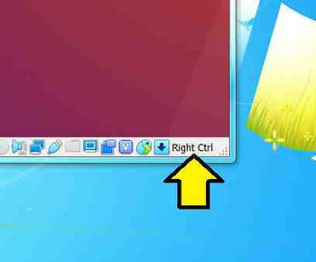

# What key is the Host key in Oracle's VirtualBox on Windows, Mac and Linux

This short post answers the question, "What key is the Host key in Oracle's VirtualBox on Windows, Mac, and Linux?"

## What Key is the Host Key in Oracle's VirtualBox on Windows, Mac, and Linux

<u>Windows and Linux Host</u>

The **right Ctrl key** is the **Host key** on a Windows and Linux host

<u>Mac Host</u>

The **left Command key** is the **Host key** on a Mac host

<u>GUI</u>

The **Host key** is also presented in the lower right corner of the window running the VM:

This post covered what key is the Host Key in Oracle's VirtualBox on Windows, Mac, and Linux.

## <u>Reference</u>

1.9.2. Capturing and Releasing Keyboard and Mouse in the Oracle® VM VirtualBox® User Manual at \[[<u>link</u>](https://www.virtualbox.org/manual/UserManual.html)\]