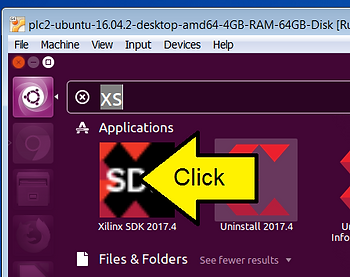

# What runs when I click the "Xilinx SDK 2017.4" icon in Ubuntu?


This post shows how to figure out what runs when you click on the "Xilinx SDK 2017.4" in Ubuntu 16.04.2.

**Steps**

To figure out what happens when you click here:



1\. Change to your home directory

```
cd ~
```

2\. Change to the directory that holds the .desktop files

```
cd .local/share/applications
```

3\. Open **Xilinx SDK 2017.4\_1521588724262.desktop**

```
vi Xilinx\ SDK\ 2017.4_1521588724262.desktop
```

or

```
cat Xilinx\ SDK\ 2017.4_1521588724262.desktop
```

```
.desktop 
[Desktop Entry]
Encoding=UTF-8
Type=Application
Name=Xilinx SDK 2017.4
Comment=Xilinx SDK 2017.4
Icon=/hdd/opt/Xilinx/SDK/2017.4/data/sdk/images/sdk_logo.png
Exec=/hdd/opt/Xilinx/SDK/2017.4/bin/xsdk 
```

5\. If you run xsdk the SDK will boot as if you clicked on it.

6\. xsdk also accepts these command line options:

```
pfefferz@plc2:~$ /hdd/opt/Xilinx/SDK/2017.4/bin/xsdk --help

Display Options:
  -help
	Help -- just display this message and quit.
  -version
	Display Version and quit.

  -batch
	SDK Tcl Batch Mode.

  -wait
	Wait for SDK to complete.

Options:
  -workspace <Workspace location>
	Specify the Workspace directory for SDK projects
  -hwspec <hardware specification file>
	Specify the XML file to load.
  -bit <bitstream file>
	Specify the Bitsteam file to use for programming FPGA
  -bmm <bmm file>
	Specify the BMM file to use for BRAM initialization
  -batch -source <tcl script file>
	Specify tcl Script file to executee all commands in SDK batch mode
  {-lp <repository_path>}
	Add <repository_path> to the list of Driver/OS/Library search directories.
  -eclipseargs <eclipse arguments>
	Any other arguments that should be passed to Eclipse.
	This should follow all other SDK arguments.
  -vmargs <java vm arguments>
	Any other arguments that should be passed to Java VM.
	This should follow all other SDK arguments.
```

**References**

-   [HTML escape](http://www.freeformatter.com/html-escape.html)
    
-   [How can I edit/create new launcher items in Unity by hand?](http://askubuntu.com/questions/13758/how-can-i-edit-create-new-launcher-items-in-unity-by-hand?utm_medium=organic&utm_source=google_rich_qa&utm_campaign=google_rich_qa)