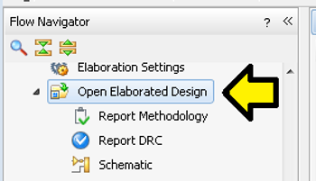
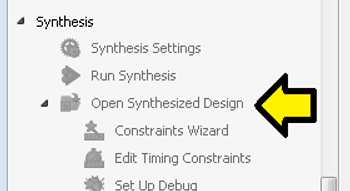
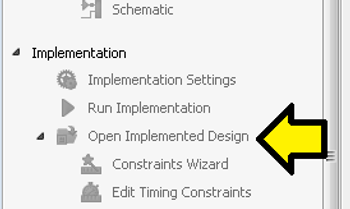

# Where are the Vivado I/O Planning Tools?

This post lists the answer to where the Vivado I/O Planning tools are.

The I/O Planning option can be seen in both the **Tools** menu and the **Layout** menu after you click on:

**Open Elaborated Design**

**Open Synthesized Design**

**Open Implemented Design**

**<u>References</u>**

-   AR# 55734 Vivado - I cannot see I/O planning in the window layout pull-down list \[[<u>link</u>](https://www.xilinx.com/support/answers/55734.html)\]
    
-   Xilinx logo found via [<u>https://twitter.com/xilinxinc</u>](https://twitter.com/xilinxinc) at \[[<u>link</u>](https://pbs.twimg.com/profile_images/535545777020338176/pEWdIYq__400x400.png)\]