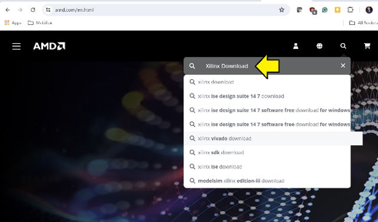
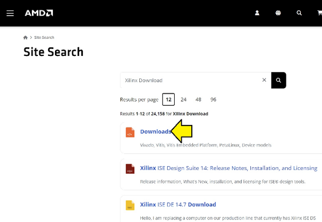
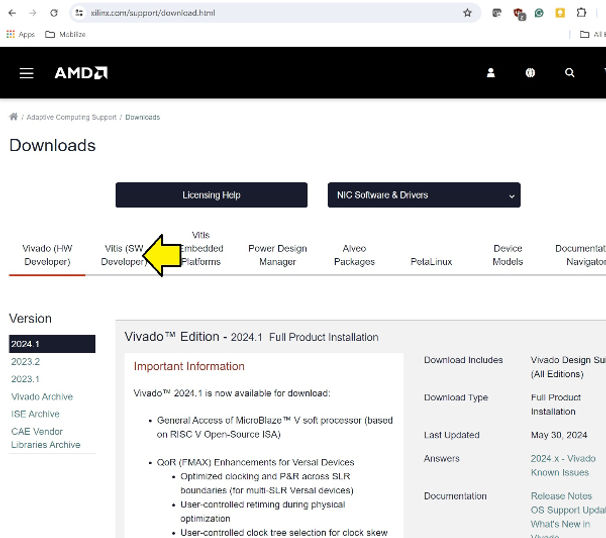
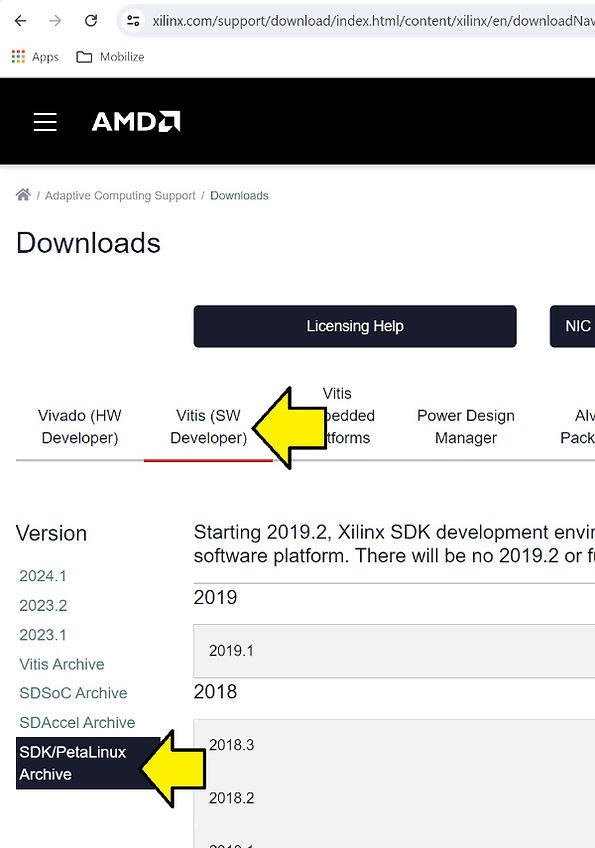
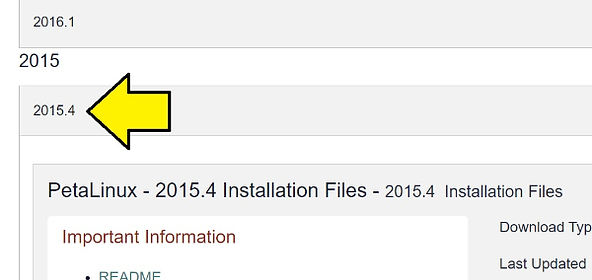
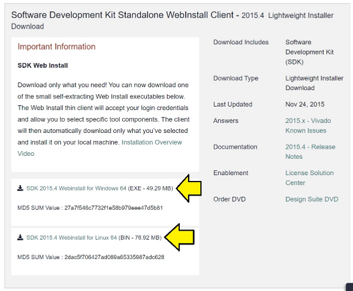
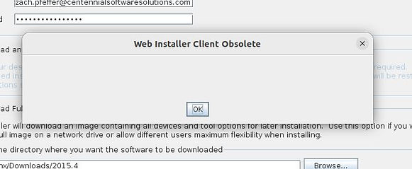
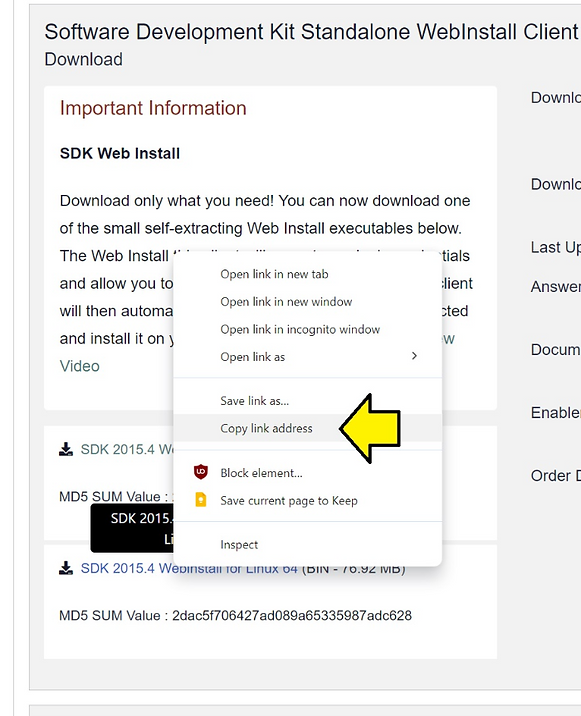

# Where can I get the 2015.4 Xilinx SDK?

This post answers the question, "Where can I get the 2015.4 Xilinx SDK?" These steps were created and verified on July 8th, 2024.

Click [<u>here</u>](https://www.centennialsoftwaresolutions.com/post/where-can-i-get-the-20154-xilinx-sdk#viewer-eompv909) to go directly to the links. Note that you'll need to use the workaround [<u>below</u>](https://www.centennialsoftwaresolutions.com/post/where-can-i-get-the-20154-xilinx-sdk#viewer-fz0sd160602).

## Where can I get the 2015.4 Xilinx SDK?

### Steps

1\. Go to [<u>amd.com</u>](http://amd.com/) and search for **Xilinx Download**

2\. Select **Downloads**

Link pictured: [https://www.amd.com/en/search/site-search.html#q=Xilinx%20Download](https://www.amd.com/en/search/site-search.html#q=Xilinx Download)

3\. Click **Vitis (SW Developer)**

Link pictured: https://www.xilinx.com/support/download.html

4\. Select **Vitis (SW Developer) and SDK/PetaLinux Archive**

Link pictured:

https://www.xilinx.com/support/download/index.html/content/xilinx/en/downloadNav/vitis/archive-sdk.html

5\. Scroll down

6\. Scroll down again

## All links for SDK 2015.4

You'll need a login. Click on the link or select https://www.amd.com/en/registration/create-account.html?custtarg=aHR0cHM6Ly9hY2NvdW50LmFtZC5jb20vZW4vZm9ybXMvZG93bmxvYWRzL3hlZi5odG1sP2ZpbGVuYW1lPVhpbGlueF9TREtfMjAxNS40XzExMThfMl9XaW42NC5leGU=

## Workaround **Web Installer Client Obsolete**

If you try to use a Web Installer older than 3 years, you'll get an error message:

So these links won't work. However, you will need the filename from the link.

Don't click on the link, **Copy the link address**

For Windows its:

https://www.xilinx.com/member/forms/download/xef.html?filename=Xilinx_SDK_2015.4_1118_2_Win64.exe

For Linux its:

[https://www.xilinx.com/member/forms/download/xef.html?filename=](https://www.xilinx.com/member/forms/download/xef.html?filename=Xilinx_SDK_2015.4_1118_2_Lin64.bin)[Xilinx_SDK_2015.4_1118_2](https://www.xilinx.com/member/forms/download/xef.html?filename=Xilinx_SDK_2015.4_1118_2_Lin64.bin)[_Lin64.bin](https://www.xilinx.com/member/forms/download/xef.html?filename=Xilinx_SDK_2015.4_1118_2_Lin64.bin)

Now take the first part of the filename [Xilinx_SDK_2015.4_1118_2](https://www.xilinx.com/member/forms/download/xef.html?filename=Xilinx_SDK_2015.4_1118_2_Lin64.bin) and construct this link:

[https://www.xilinx.com/member/forms/download/xef.html?filename=](https://www.xilinx.com/member/forms/download/xef.html?filename=Xilinx_Vivado_SDK_2015.4_1118_2.tar.gz)[Xilinx_Vivado_SDK_2015.4_1118_2](https://www.xilinx.com/member/forms/download/xef.html?filename=Xilinx_Vivado_SDK_2015.4_1118_2.tar.gz)[.tar.gz](https://www.xilinx.com/member/forms/download/xef.html?filename=Xilinx_Vivado_SDK_2015.4_1118_2.tar.gz)

This file ^^^ has both the Windows and Linux installer and is 10.4 GB.

Or use the AMD link:

https://account.amd.com/en/forms/downloads/xef.html?filename=Xilinx_SDK_2015.4_1118_2.tar.gz

## Software Development Kit Standalone WebInstall Client - 2015.4  Lightweight Installer Download Text

### Important Information

**SDK Web Install**

Download only what you need! You can now download one of the small self-extracting Web Install executables below.  The Web Install thin client will accept your login credentials and allow you to select specific tool components. The client will then automatically download only what you’ve selected and install it on your local machine. [Installation Overview Video](https://www.xilinx.com/video/hardware/vivado-design-suite-installation-overview.html)

vvvv Where can I get the 2015.4 Xilinx SDK? Here! vvvv

-   [SDK 2015.4 Webinstall for Windows 64](https://www.xilinx.com/member/forms/download/xef.html?filename=Xilinx_SDK_2015.4_1118_2_Win64.exe) (EXE - 49.29 MB) MD5 SUM Value : 27a7f546c7732f1e58b979eee47d5b81
    
-   [SDK 2015.4 Webinstall for Linux 64](https://www.xilinx.com/member/forms/download/xef.html?filename=Xilinx_SDK_2015.4_1118_2_Lin64.bin) (BIN - 76.92 MB) MD5 SUM Value : 2dac5f706427ad089a65335987adc628
    

Download Includes

-   Software Development Kit (SDK)
    

Download Type

-   Lightweight Installer Download
    

Last Updated

-   Nov 24, 2015
    

Answers

-   [2015.x - Vivado Known Issues](https://www.xilinx.com/support/answers/63/6353/63538.html) < this link doesn't work, use [<u>https://support.xilinx.com/s/article/63538?language=en_US</u>](https://support.xilinx.com/s/article/63538?language=en_US)
    

Documentation

-   [2015.4 - Release Notes](https://www.xilinx.com/content/dam/xilinx/support/documents/sw_manuals/xilinx2015_4/ug973-vivado-release-notes-install-license.pdf)
    

Enablement

-   [License Solution Center](https://www.xilinx.com/support/licensing_solution_center.html)
    

Order DVD

-   [Design Suite DVD](https://www.xilinx.com/support/answers/37/3789/37891.html)