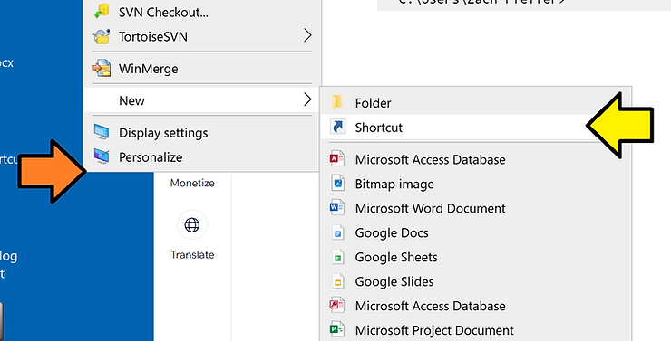
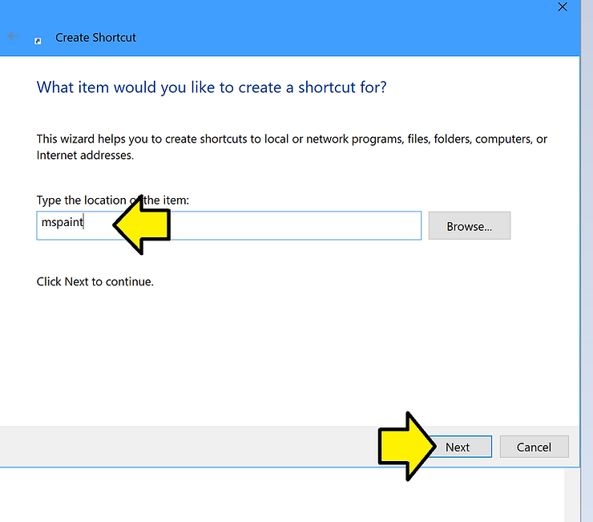
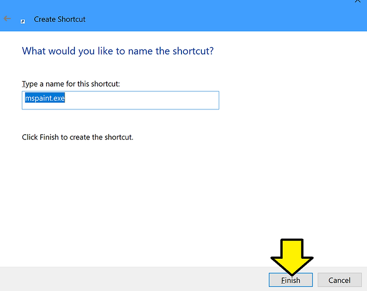

# Where is Paint on Windows 10?


Paint is located at **C:\\Windows\\System32\\mspaint.exe** on Windows 10

The rest of this post shows how to answer the question, Where is **Paint** on **Windows 10**?

## **<u><span>Steps</span></u>**

\# Launch Run:

Windows Key + r

\# Type in the Run box:

```
cmd /k where mspaint
```

\# You'll see the location:

```
C:\Windows\System32\mspaint.exe


C:\Users\Zach Pfeffer>
```

## **<u><span>Exact Version</span></u>**

Microsoft Windows \[Version 10.0.19045.3570\]

(from the first line of a new cmd.exe window)

## **<u><span>Additional</span></u>**

### **Add a Paint shortcut to the Desktop**

\# **Right-click** on the **desktop** and select **New > Shortcut**



\# Enter **mspaint** and click **Next**



\# Click **Finish**



### **Get cmd Help**

```
cmd /?
```

cmd Help:

```
Starts a new instance of the Windows command interpreter

CMD [/A | /U] [/Q] [/D] [/E:ON | /E:OFF] [/F:ON | /F:OFF] [/V:ON | /V:OFF]
    [[/S] [/C | /K] string]

/C      Carries out the command specified by string and then terminates
/K      Carries out the command specified by string but remains
/S      Modifies the treatment of string after /C or /K (see below)
/Q      Turns echo off
/D      Disable execution of AutoRun commands from registry (see below)
/A      Causes the output of internal commands to a pipe or file to be ANSI
/U      Causes the output of internal commands to a pipe or file to be
        Unicode
/T:fg   Sets the foreground/background colors (see COLOR /? for more info)
/E:ON   Enable command extensions (see below)
/E:OFF  Disable command extensions (see below)
/F:ON   Enable file and directory name completion characters (see below)
/F:OFF  Disable file and directory name completion characters (see below)
/V:ON   Enable delayed environment variable expansion using ! as the
        delimiter. For example, /V:ON would allow !var! to expand the
        variable var at execution time.  The var syntax expands variables
        at input time, which is quite a different thing when inside of a FOR
        loop.
/V:OFF  Disable delayed environment expansion.

Note that multiple commands separated by the command separator '&amp;&amp;'
are accepted for string if surrounded by quotes.  Also, for compatibility
reasons, /X is the same as /E:ON, /Y is the same as /E:OFF and /R is the
Press any key to continue . . .
```

cmd is also documented here:

https://learn.microsoft.com/en-us/windows-server/administration/windows-commands/cmd 

## **<u><span>References</span></u>**

Windows 10 logo adapted from commons.wikimedia.org @ \[[<u><span>link</span></u>](https://commons.wikimedia.org/wiki/File:Windows_10_Logo.svg)\]