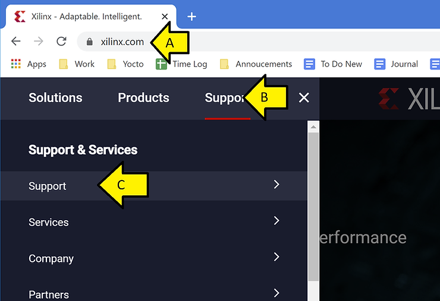
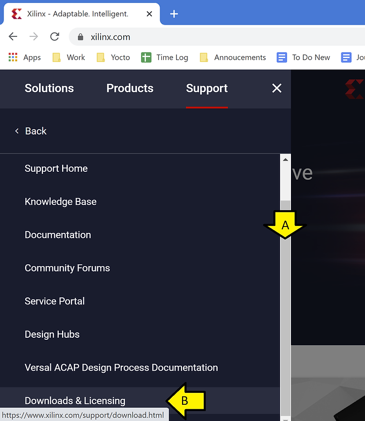
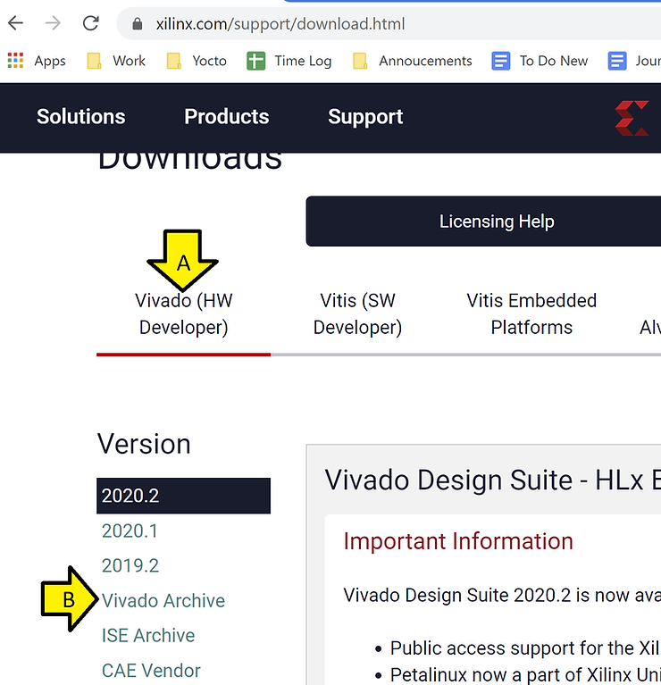
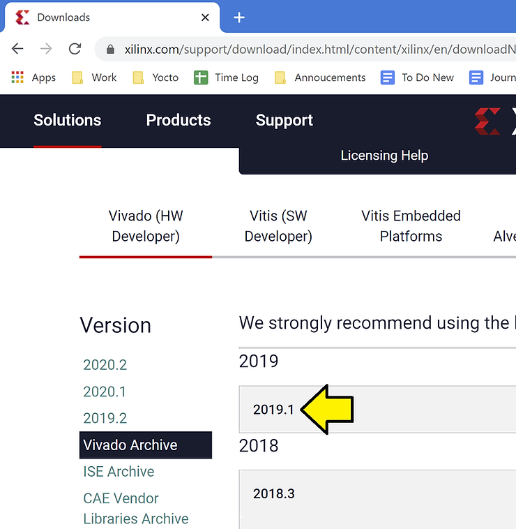
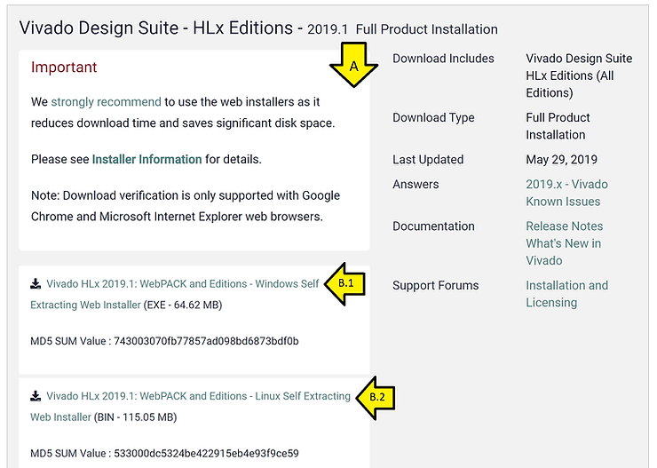

# Where is Vivado 2019.1?

This post shows how to navigate from [<u>xilinx.com</u>](http://xilinx.com/) to Vivado 2019.1 as of Dec 19th, 2020. The links found are also listed.

Note: You need an account to download Vivado. Create one at https://login.xilinx.com/ 

Step [#1](https://www.centennialsoftwaresolutions.com/blog/hashtags/1): (A) Go to [<u>xilinx.com,</u>](http://xilinx.com/) (B) Click **Support**, (C) Click **Support** (again)

Step [#2](https://www.centennialsoftwaresolutions.com/blog/hashtags/2): (A) **Scroll down** and (B) click **Downloads & Licensing**

Step [#3](https://www.centennialsoftwaresolutions.com/blog/hashtags/3): (A) Click **Vivado (HW Developer)**, (B) Click **Vivado Archive**

Step [#4](https://www.centennialsoftwaresolutions.com/blog/hashtags/4): Click **2019.1**

Step [#5](https://www.centennialsoftwaresolutions.com/blog/hashtags/5): (A) Scroll down, (B.1) Click **Windows** installer or (B.2) **Linux** Installer

Here's the info with all the links:

> Vivado Design Suite - HLx Editions - 2019.1  Full Product Installation

> Important 
>
> We [strongly recommend](https://forums.xilinx.com/t5/Adaptable-Advantage-Blog/Best-way-to-download-Xilinx-Design-Tools/ba-p/816995) to use the web installers as it reduces download time and saves significant disk space. Please see [**Installer Information**](https://www.xilinx.com/support/installer/installer-info-2019-1.html) for details. Note: Download verification is only supported with Google Chrome and Microsoft Internet Explorer web browsers.

>  [Vivado HLx 2019.1: WebPACK and Editions - Windows Self Extracting Web Installer](https://www.xilinx.com/member/forms/download/xef-vivado.html?filename=Xilinx_Vivado_SDK_Web_2019.1_0524_1430_Win64.exe) (EXE - 64.62 MB) MD5 SUM Value : 743003070fb77857ad098bd6873bdf0b

>  [Vivado HLx 2019.1: WebPACK and Editions - Linux Self Extracting Web Installer](https://www.xilinx.com/member/forms/download/xef-vivado.html?filename=Xilinx_Vivado_SDK_Web_2019.1_0524_1430_Lin64.bin) (BIN - 115.05 MB) MD5 SUM Value : 533000dc5324be422915eb4e93f9ce59 Download Verification [Digests](https://www.xilinx.com/support/download/2019-1/Xilinx_Vivado_SDK_Web_2019.1_0524_1430_Lin64.bin.digests) [Signature](https://www.xilinx.com/support/download/2019-1/Xilinx_Vivado_SDK_Web_2019.1_0524_1430_Lin64.bin.sig) [Public Key](https://www.xilinx.com/support/download/2019-1/xilinx-master-signing-key.asc)

>  [Vivado HLx 2019.1: All OS installer Single-File Download](https://www.xilinx.com/member/forms/download/xef-vivado.html?filename=Xilinx_Vivado_SDK_2019.1_0524_1430.tar.gz) (TAR/GZIP - 21.39 GB) MD5 SUM Value : 47388a71dc5962a4b8d76e752928616e Download Verification [Digests](https://www.xilinx.com/support/download/2019-1/Xilinx_Vivado_SDK_2019.1_0524_1430.tar.gz.digests) [Signature](https://www.xilinx.com/support/download/2019-1/Xilinx_Vivado_SDK_2019.1_0524_1430.tar.gz.sig) [Public Key](https://www.xilinx.com/support/download/2019-1/xilinx-master-signing-key.asc)

**Reference**

The Xilinx graphic is from [[link](http://pbs.twimg.com/profile_images/535545777020338176/pEWdIYq__400x400.png)] 