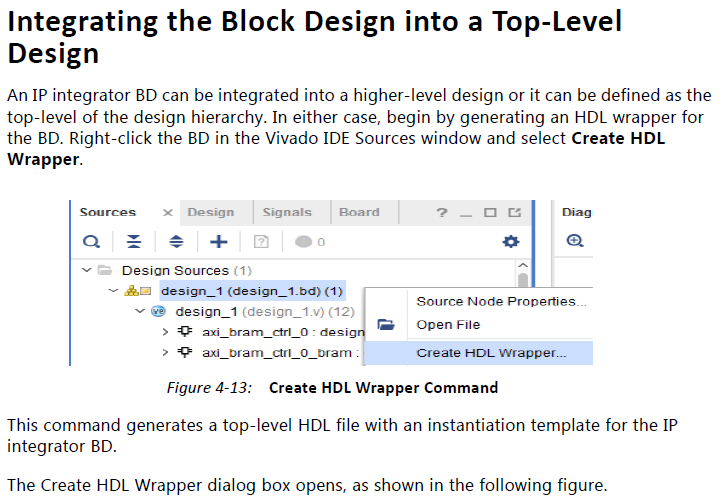
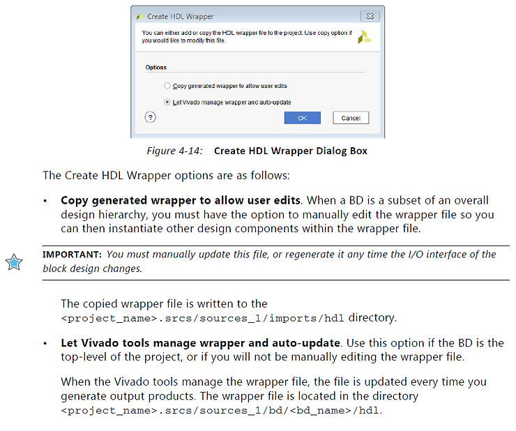
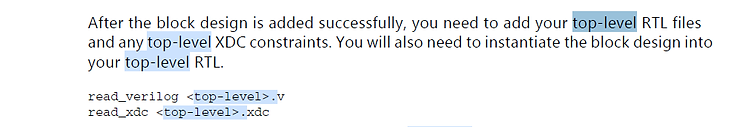
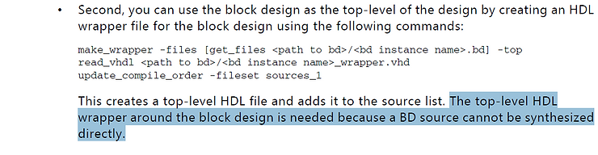

# Why do I need to run "Create HDL Wrapper..."

This post lists why a Vivado IP integrator a block diagram must be wrapped in an HDL wrapper, short answer: "because a BD (block design) cannot be synthesized directly."

In Vivado IP integrator a block diagram must be wrapped in an HDL wrapper.

Why?

From **Designing IP Subsystems Using IP Integrator** on p149 Xilinx provides this answer:

"The top-level HDL wrapper around the block design is needed because a BD (block design) source cannot be synthesized directly."

**<u>Supporting Documentation</u>**

_UG994 p.83_

_UG994 p.84_

_UG994 p.149_

_UG994 p.149_

**<u>References</u>**

-   Designing IP Subsystems Using IP Integrator UG994 (v2017.4) \[[<u>link</u>](http://www.xilinx.com/support/documentation/sw_manuals/xilinx2017_4/ug994-vivado-ip-subsystems.pdf)\]
    
-   Xilinx logo found via [<u>https://twitter.com/xilinxinc</u>](https://twitter.com/xilinxinc) at \[[<u>link</u>](https://pbs.twimg.com/profile_images/535545777020338176/pEWdIYq__400x400.png)\]