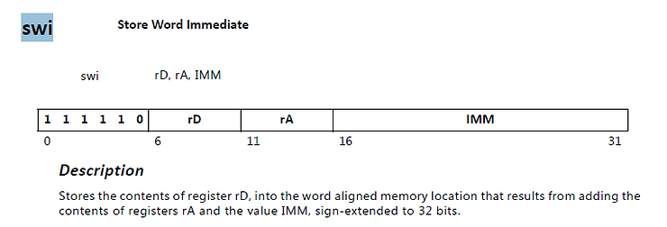

# Why don't I see PMUFW XPfw_Printfs: A Debug Story


This post list my debug of why I don't see XPfw\_Print() output from PMUFW included in PetaLinux Tools 2017.4.

**TL;DR**

There's no UART output because the PS UART is not on when I load PMUFW.

**Related**

[Rebuild PMUFW and load it](http://www.zachpfeffer.com/single-post/Rebuild-PMUFW-and-load-it)

**Symptom**

I don't see this print from XPfw\_Main():

```
XStatus XPfw_Main(void)
{
        XStatus Status;

        /* Start the Init Routine */
        XPfw_Printf(DEBUG_PRINT_ALWAYS,"PMU Firmware %s\t%s   %s\r\n",
                        ZYNQMP_XPFW_VERSION, __DATE__, __TIME__);
```

File:

```
$PETALINUX_PROJS_DIR/$PETALINUX_PROJ_NAME/components/plnx_workspace/pmufw/pmu-firmware/src/xpfw_main.c
```

**Hypothesis 1**

I don't see XPfw\_Printf because there's a missing DEBUG define

Info

Where is XPfw\_Printf?

Grep:

```
components/plnx_workspace/pmufw/pmu-firmware/src$ grep XPfw_Printf *
```

Output:

```
xpfw_core.c:	XPfw_Printf(DEBUG_DETAILED,"Scheduler State: %s\r\n",
xpfw_core.c:	XPfw_Printf(DEBUG_DETAILED,"Scheduler Ticks: %lu\r\n",
xpfw_core.c:	XPfw_Printf(DEBUG_DETAILED,
xpfw_debug.h:#define XPfw_Printf(DebugType,...)\
xpfw_error_manager.c:			XPfw_Printf(DEBUG_DETAILED,"Warning: XPfw_EmInit: Failed to "
xpfw_interrupts.c:	XPfw_Printf(DEBUG_ERROR,"Error: NullHandler Triggered!\r\n");
xpfw_interrupts.c:	XPfw_Printf(DEBUG_DETAILED,"PMU RAM Correctable ECC occurred!\r\n");
xpfw_interrupts.c:		XPfw_Printf(DEBUG_DETAILED,"Warning: Failed to dispatch Event ID:"
```

Relevant Lines in **xpfw\_debug.h**:

```
/**
 * Debug levels for PMUFW
 */
#define DEBUG_PRINT_ALWAYS (0x00000001U) /* Unconditional messages */
#define DEBUG_ERROR (0x00000002U) /* Error messages */
#define DEBUG_DETAILED (0x00000004U) /* More debug information */

#if defined(XPFW_DEBUG_DETAILED)
#define XPfwDbgCurrentTypes ((DEBUG_DETAILED) | (DEBUG_ERROR) |\
                (DEBUG_PRINT_ALWAYS))
#elif defined(XPFW_DEBUG_ERROR)
#define XPfwDbgCurrentTypes ((DEBUG_ERROR) | (DEBUG_PRINT_ALWAYS))
#elif defined(XPFW_PRINT)
#define XPfwDbgCurrentTypes (DEBUG_PRINT_ALWAYS)
#else
#define XPfwDbgCurrentTypes (0U)
#endif

#define XPfw_Printf(DebugType,...)\
        if(((DebugType) & XPfwDbgCurrentTypes) != (u8)XST_SUCCESS){xil_printf(__VA_ARGS__);}
```

Test Hypothesis 1

Are XPFW\_DEBUG\_DETAILED, XPFW\_DEBUG\_ERROR and XPFW\_PRINT?

Method

Use [#error](https://www.centennialsoftwaresolutions.com/blog/hashtags/error)'s in the code and recompile. See link for how to recompile PMUFW.

```
/**
 * Debug levels for PMUFW
 */
#define DEBUG_PRINT_ALWAYS (0x00000001U) /* Unconditional messages */
#define DEBUG_ERROR (0x00000002U) /* Error messages */
#define DEBUG_DETAILED (0x00000004U) /* More debug information */

#if defined(XPFW_DEBUG_DETAILED)
#error "DEBUG: XPFW_DEBUG_DETAILED defined"
#define XPfwDbgCurrentTypes ((DEBUG_DETAILED) | (DEBUG_ERROR) |\
                (DEBUG_PRINT_ALWAYS))
#elif defined(XPFW_DEBUG_ERROR)
#error "DEBUG: XPFW_DEBUG_ERROR defined"
#define XPfwDbgCurrentTypes ((DEBUG_ERROR) | (DEBUG_PRINT_ALWAYS))
#elif defined(XPFW_PRINT)
#error "DEBUG: XPFW_PRINT defined"
#define XPfwDbgCurrentTypes (DEBUG_PRINT_ALWAYS)
#else
#error "DEBUG: No debug print define"
#define XPfwDbgCurrentTypes (0U)
#endif

#define XPfw_Printf(DebugType,...)\
        if(((DebugType) & XPfwDbgCurrentTypes) != (u8)XST_SUCCESS){xil_printf(__VA_ARGS__);}
```

Compile

```
bitbake pmu-firmware -c compile -C compile
```

Compile Output

```
| Building '/pmu-firmware'
| 00:15:41 **** Build of configuration Release for project pmu-firmware ****
| ERROR: pmu-firmware compile failed.
| make all
| Building file: ../src/idle_hooks.c
| Invoking: MicroBlaze gcc compiler
| mb-gcc -Wall -O2 -c -fmessage-length=0 -MT"src/idle_hooks.o" -Os -flto -ffat-lto-objects -I../../pmu-firmware_bsp/psu_pmu_0/include -mlittle-endian -mxl-barrel-shift -mxl-pattern-compare -mcpu=v9.2 -mxl-soft-mul -Wl,--no-relax -ffunction-sections -fdata-sections -MMD -MP -MF"src/idle_hooks.d" -MT"src/idle_hooks.o" -o "src/idle_hooks.o" "../src/idle_hooks.c"
| In file included from ../src/xpfw_default.h:41:0,
|                  from ../src/pm_common.h:40,
|                  from ../src/idle_hooks.c:37:
| ../src/xpfw_debug.h:82:2: error: #error "DEBUG: XPFW_PRINT defined"
|  #error "DEBUG: XPFW_PRINT defined"
|   ^~~~~
| make: *** [src/subdir.mk:183: src/idle_hooks.o] Error 1
| 
| 00:15:42 Build Finished (took 1s.494ms)
| 
| Invoking scanner config builder on project
| WARNING: /home/pfefferz/plprj4/mtd_board/build/tmp/work/plnx_aarch64-xilinx-linux/pmu-firmware/2017.4+gitAUTOINC+77448ae629-r0/temp/run.do_compile.13665:1 exit 1 from 'exit 1'
| ERROR: Function failed: do_compile (log file is located at /home/pfefferz/plprj4/mtd_board/build/tmp/work/plnx_aarch64-xilinx-linux/pmu-firmware/2017.4+gitAUTOINC+77448ae629-r0/temp/log.do_compile.13665)
ERROR: Task (/home/pfefferz/tools/opt/pkg/petalinux/components/yocto/source/aarch64/layers/meta-xilinx-tools/recipes-bsp/pmu/pmu-firmware_git.bb:do_compile) failed with exit code '1'
NOTE: Tasks Summary: Attempted 317 tasks of which 316 didn't need to be rerun and 1 failed.

Summary: 1 task failed:
  /home/pfefferz/tools/opt/pkg/petalinux/components/yocto/source/aarch64/layers/meta-xilinx-tools/recipes-bsp/pmu/pmu-firmware_git.bb:do_compile
Summary: There were 2 WARNING messages shown.
Summary: There were 2 ERROR messages shown, returning a non-zero exit code.
```

Who defines XPFW\_PRINT?

Its not defined on the command line, no -DXPFW\_PRINT

Grep

```
grep XPFW_PRINT *
```

Output

```
pfefferz@plc2:~/plprj4/mtd_board/components/plnx_workspace/pmufw/pmu-firmware/src$ grep XPFW_PRINT *
xpfw_config.h:#define XPFW_PRINT_VAL (1U)
xpfw_config.h:#if XPFW_PRINT_VAL
xpfw_config.h:#define XPFW_PRINT
xpfw_debug.h:#elif defined(XPFW_PRINT)
xpfw_debug.h:/* #error "DEBUG: XPFW_PRINT defined" */
```

Defined in xpfw\_config.h

```
/* PMUFW print levels */
#define XPFW_PRINT_VAL (1U)
#define XPFW_DEBUG_ERROR_VAL (0U)
#define XPFW_DEBUG_DETAILED_VAL (0U)
```

Which is included in xpfw\_default.h as seen here

Grep

```
grep xpfw_config.h *
```

Output

```
xpfw_default.h:#include "xpfw_config.h"
```

...which was referenced in the debug output.

Hypothesis 1 Conclusion

Hypothesis 1 is not true. There is a define that should allow me to see DEBUG\_PRINT\_ALWAYS.

**Hypothesis 2**

I never get to the print.

Method

Use an infinite loop before the print and break in with xsct over JTAG.

Change:

```
int SPIN = 1;

XStatus XPfw_Main(void)
{
        XStatus Status;

        while(SPIN);

        /* Start the Init Routine */
```

Recompile

```
bitbake pmu-firmware -c compile -C compile
```

```
pfefferz@plc2:~/plprj4/mtd_board/build$ find $PETALINUX -name "readelf"
/home/pfefferz/tools/opt/pkg/petalinux/tools/linux-i386/microblaze-xilinx-elf/microblaze-xilinx-elf/bin/readelf
```

Add the path to it to PATH in a local window:

```
export PATH=/home/pfefferz/tools/opt/pkg/petalinux/tools/linux-i386/microblaze-xilinx-elf/microblaze-xilinx-elf/bin:$PATH
```

Check it:

```
pfefferz@plc2:~/build$ which readelf
/home/pfefferz/tools/opt/pkg/petalinux/tools/linux-i386/microblaze-xilinx-elf/microblaze-xilinx-elf/bin/readelf
```

Run it, look at xsct output

```
pfefferz@plc2:~/build$ objdump -SD /home/pfefferz/plprj4/mtd_board/components/plnx_workspace/pmufw/pmu-firmware/Release/pmu-firmware.elf | grep -A20 XPfw_Main
ffdc723c <XPfw_Main>:
ffdc723c:	b8000000 	bri	0		// ffdc723c

ffdc7240 <XPfw_IpiTrigger>:
ffdc7240:	10c50000 	addk	r6, r5, r0
ffdc7244:	b000ffdd 	imm	-35
ffdc7248:	30a02e28 	addik	r5, r0, 11816
```

Find XPfw\_Main

In xsct

Run **targets**

```
targets                                                                         
xsct%   1  PS TAP                                                               
     2  PMU
        3  MicroBlaze PMU (External debug request)
     4  PL
  5* PSU
     6  RPU (Reset)
        7  Cortex-R5 #0 (RPU Reset)
        8  Cortex-R5 #1 (RPU Reset)
     9  APU (L2 Cache Reset)
       10  Cortex-A53 #0 (APU Reset)
       11  Cortex-A53 #1 (APU Reset)
       12  Cortex-A53 #2 (APU Reset)
       13  Cortex-A53 #3 (APU Reset)
```

Read the registers

```
xsct% rrd                                                                       
 r0: 00000000   r1: ffdd3f58   r2: ffdd0a20   r3: fffffff8   r4: 00000000       
 r5: 00000003   r6: ffdd2f54   r7: ffdd2f54   r8: 00000010   r9: 00000000
r10: 00000000  r11: ffdd2f54  r12: 00000000  r13: ffdd0a20  r14: ffd02f24
r15: ffdc87a0  r16: 00000000  r17: 00000000  r18: 00000000  r19: 00000000
r20: 00000000  r21: 00000000  r22: 00000000  r23: 00000000  r24: 00000000
r25: 00000000  r26: 00000000  r27: 00000000  r28: 00000000  r29: 00000000
r30: 00000000  r31: 00000000   pc: ffdc723c  msr: 00000106  ear: 00000000
esr: 00000000  btr: ffdc723c  slr: ffdd2f54  shr: ffdd3f58  dcr: 00000009
dsr: 01010000
```

The PC matches the bri line from above. So that shows we can get to this line of code.

Do I get into the print, does the print do anything?

Look for any XPfw\_Printf's

```
pfefferz@plc2:~/build$ objdump -SD /home/pfefferz/plprj4/mtd_board/components/plnx_workspace/pmufw/pmu-firmware/Release/pmu-firmware.elf | grep -A20 XPfw_Printf
```

Empty! Weird.

If I remove the spin loop, will the XPfw\_Printf's still be present?

Yes:

```
pfefferz@plc2:~/build$ objdump -D /home/pfefferz/plprj4/mtd_board/components/plnx_workspace/pmufw/pmu-firmware/Release/pmu-firmware.elf | grep -A20 XPfw_Main
ffdc723c <XPfw_Main>:
ffdc723c:	b000ffdc 	imm	-36
ffdc7240:	3100cb7c 	addik	r8, r0, -13444
ffdc7244:	b000ffdc 	imm	-36
ffdc7248:	30e0cb88 	addik	r7, r0, -13432
ffdc724c:	b000ffdc 	imm	-36
ffdc7250:	30c0cb94 	addik	r6, r0, -13420
ffdc7254:	b000ffdc 	imm	-36
ffdc7258:	30a0cb9c 	addik	r5, r0, -13412
ffdc725c:	3021ffd8 	addik	r1, r1, -40
ffdc7260:	f9e10000 	swi	r15, r1, 0
ffdc7264:	fa61001c 	swi	r19, r1, 28
ffdc7268:	fac10020 	swi	r22, r1, 32
ffdc726c:	b0000000 	imm	0
ffdc7270:	b9f42a84 	brlid	r15, 10884	// ffdc9cf4 <xil_printf>
```

Start stepping into prints

_Set a breakpoint on 0xffdc7270_

To set the breakpoint:

Enumerate targets

```
targets                                                                         
xsct%   1  PS TAP                                                               
     2  PMU
        3  MicroBlaze PMU (External debug request)
     4  PL
  5* PSU
     6  RPU (Reset)
        7  Cortex-R5 #0 (RPU Reset)
        8  Cortex-R5 #1 (RPU Reset)
     9  APU (L2 Cache Reset)
       10  Cortex-A53 #0 (APU Reset)
       11  Cortex-A53 #1 (APU Reset)
       12  Cortex-A53 #2 (APU Reset)
       13  Cortex-A53 #3 (APU Reset)
```

Select the PMU and dump registers

```
xsct% targets 3                                                                 
xsct% rrd                                                                       
 r0: 00000000   r1: ffdd3f58   r2: ffdd0a20   r3: fffffff8   r4: 00000000       
 r5: 00000003   r6: ffdd2f54   r7: ffdd2f54   r8: 00000010   r9: 00000000
r10: 00000000  r11: ffdd2f54  r12: 00000000  r13: ffdd0a20  r14: ffd02f24
r15: ffdc87a0  r16: 00000000  r17: 00000000  r18: 00000000  r19: 00000000
r20: 00000000  r21: 00000000  r22: 00000000  r23: 00000000  r24: 00000000
r25: 00000000  r26: 00000000  r27: 00000000  r28: 00000000  r29: 00000000
r30: 00000000  r31: 00000000   pc: ffdc723c  msr: 00000106  ear: 00000000
esr: 00000000  btr: ffdc723c  slr: ffdd2f54  shr: ffdd3f58  dcr: 00000009
dsr: 01010000
```

Set the breakpoint

```
xsct% bpadd -addr 0xffdc7270 -type hw                                           
0                                                                               
xsct% Info: Breakpoint 0 status:
   target 3: {All hardware breakpoints are allocated}
```

Hmm... can't set a hardware breakpoint, set a software breakpoint instead:

```
xsct% bpadd -addr 0xffdc7270 -type sw                                           
1                                                                               
xsct% Info: Breakpoint 1 status:
   target 3: {Address: 0xffdc7270 Type: Software}
```

Reset unit via external power suppy

```
outp 0
outp 1
```

Continue setting breakpoints until the the UART FIFO gets written

See the breakpoint on 0xffdc7270, the call to xil\_printf, get hit

```
xsct% Info: MicroBlaze PMU (target 3) Stopped at 0xffdc7270 (Breakpoint)
xsct% bpstatus                                                                  
wrong # args: should be "bpstatus id"
xsct% bpstatus 0                                                                
target 3: HitCount 0 Address 0xffdc7270 Size 1 Error {All hardware breakpoints are allocated}

xsct% bpstatus 1                                                                
target 3: HitCount 1 Address 0xffdc7270 Size 1 BreakpointType Software
```

Step one instruction

```
xsct% stpi                                                                      
Info: MicroBlaze PMU (target 3) Stopped at 0xffdc9cf4 (Step)                    
xsct% dis                                                                       
ffdc9cf4: addk          r3 , r5 , r0    
```

Look at the backtrace

```
xsct% bt                                                                        
    0  0xffdc9cf4                                                               
    1  0xffdc7278
    2  0xffdc8b20
```

Step one instruction and disassemble

```
xsct% stpi                                                                      
Info: MicroBlaze PMU (target 3) Stopped at 0xffdc9cf8 (Step)                    
xsct% dis                                                                       
ffdc9cf8: swi           r5 , r1 , 4  
```

Correlate addresses with instructions

```
pfefferz@plc2:~/build$ objdump -D /home/pfefferz/plprj4/mtd_board/components/plnx_workspace/pmufw/pmu-firmware/Release/pmu-firmware.elf | grep -A40 \<xil_printf\>:
...
ffdc9cf4 <xil_printf>:
ffdc9cf4:	10650000 	addk	r3, r5, r0
ffdc9cf8:	f8a10004 	swi	r5, r1, 4
ffdc9cfc:	f8c10008 	swi	r6, r1, 8
ffdc9d00:	f8e1000c 	swi	r7, r1, 12
ffdc9d04:	f9010010 	swi	r8, r1, 16
ffdc9d08:	f9210014 	swi	r9, r1, 20
ffdc9d0c:	f9410018 	swi	r10, r1, 24
ffdc9d10:	3021ffb4 	addik	r1, r1, -76
ffdc9d14:	fac10040 	swi	r22, r1, 64
ffdc9d18:	f9e10000 	swi	r15, r1, 0
ffdc9d1c:	fa61003c 	swi	r19, r1, 60
ffdc9d20:	fae10044 	swi	r23, r1, 68
ffdc9d24:	fb010048 	swi	r24, r1, 72
ffdc9d28:	32c10054 	addik	r22, r1, 84
ffdc9d2c:	f8a10038 	swi	r5, r1, 56
ffdc9d30:	be030040 	beqid	r3, 64		// ffdc9d70
ffdc9d34:	e9e10000 	lwi	r15, r1, 0
ffdc9d38:	e0a30000 	lbui	r5, r3, 0
ffdc9d3c:	90a50060 	sext8	r5, r5
ffdc9d40:	be05002c 	beqid	r5, 44		// ffdc9d6c
ffdc9d44:	aa650025 	xori	r19, r5, 37
ffdc9d48:	be130040 	beqid	r19, 64		// ffdc9d88
ffdc9d4c:	30800020 	addik	r4, r0, 32
ffdc9d50:	b0000000 	imm	0
ffdc9d54:	b9f40350 	brlid	r15, 848	// ffdca0a4 <outbyte>
```

Set a breakpoint on outbyte, continued, dissemble, look at the backtrace

```
xsct% bpadd -addr 0xffdca0a4 -type sw                                           
2                                                                               
xsct% Info: Breakpoint 2 status:
   target 3: {Address: 0xffdca0a4 Type: Software}
xsct% con                                                                       
xsct% Info: MicroBlaze PMU (target 3) Stopped at 0xffdca0a4 (Breakpoint)        
xsct% bplist                                                                    
ID        Enabled   Location            Status                                  
==        =======   ========            ======              
0         1         0xffdc7270          target 3: {Error {All hardware breakp
                                        oints are allocated}}
1         1         0xffdc7270          target 3: {Address 0xffdc7270 HitCoun
                                        t 1}                
2         1         0xffdca0a4          target 3: {Address 0xffdca0a4 HitCoun
                                        t 1}                
xsct% dis                                                                       
ffdca0a4: andi          r6 , r5 , 255                                           

xsct% bt                                                                        
    0  0xffdca0a4                                                               
    1  0xffdc9d5c
    2  0xffdc7278
    3  0xffdc8b20
xsct% stpi                                                                      
Info: MicroBlaze PMU (target 3) Stopped at 0xffdca0a8 (Step)                    
xsct% dis                                                                       
ffdca0a8: imm           -256    
```

Correlate addresses with instructions

```
pfefferz@plc2:~/build$ objdump -D /home/pfefferz/plprj4/mtd_board/components/plnx_workspace/pmufw/pmu-firmware/Release/pmu-firmware.elf | grep -A40 \<outbyte\>:
ffdca0a4 <outbyte>:
ffdca0a4:	a4c500ff 	andi	r6, r5, 255
ffdca0a8:	b000ff00 	imm	-256
ffdca0ac:	30a00000 	addik	r5, r0, 0
ffdca0b0:	3021fffc 	addik	r1, r1, -4
ffdca0b4:	f9e10000 	swi	r15, r1, 0
ffdca0b8:	b000ffff 	imm	-1
ffdca0bc:	b9f4ffcc 	brlid	r15, -52	// ffdca088 <XUartPs_SendByte>
ffdca0c0:	80000000 	or	r0, r0, r0
ffdca0c4:	e9e10000 	lwi	r15, r1, 0
ffdca0c8:	b60f0008 	rtsd	r15, 8
ffdca0cc:	30210004 	addik	r1, r1, 4
```

Get the address

```
pfefferz@plc2:~/build$ objdump -D /home/pfefferz/plprj4/mtd_board/components/plnx_workspace/pmufw/pmu-firmware/Release/pmu-firmware.elf | grep -A40 \<XUartPs_SendByte\>:
ffdca088 <XUartPs_SendByte>:
ffdca088:	3085002c 	addik	r4, r5, 44
ffdca08c:	e8640000 	lwi	r3, r4, 0
ffdca090:	a4630010 	andi	r3, r3, 16
ffdca094:	bc23fff8 	bnei	r3, -8		// ffdca08c
ffdca098:	f8c50030 	swi	r6, r5, 48
ffdca09c:	b60f0008 	rtsd	r15, 8
ffdca0a0:	80000000 	or	r0, r0, r0
```

```
xsct% bpadd -addr 0xffdca088 -type sw                                           
3                                                                               
xsct% Info: Breakpoint 3 status:
   target 3: {Address: 0xffdca088 Type: Software}
xsct% con                                                                       
xsct% Info: MicroBlaze PMU (target 3) Stopped at 0xffdca088 (Breakpoint)        
xsct% dis                                                                       
ffdca088: addik         r4 , r5 , 44                                            

xsct% bt                                                                        
    0  0xffdca088                                                               
    1  0xffdca0c4
    2  0xffdc9d5c
    3  0xffdc7278
    4  0xffdc8b20
xsct% stpi                                                                      
Info: MicroBlaze PMU (target 3) Stopped at 0xffdca08c (Step)                    
xsct% dis                                                                       
ffdca08c: lwi           r3 , r4 , 0                                             

xsct% stpi                                                                      
Info: MicroBlaze PMU (target 3) Stopped at 0xffdca090 (Step)                    
xsct% rrd                                                                       
 r0: 00000000   r1: ffdd4580   r2: ffdd10c0   r3: 00000000   r4: ff00002c       
 r5: ff000000   r6: 00000050   r7: ffdccb88   r8: ffdccb7c   r9: 00000000
r10: 00000000  r11: ffdd35f4  r12: 00000000  r13: ffdd10c0  r14: ffd02f24
r15: ffdca0bc  r16: 00000000  r17: 00000000  r18: 00000000  r19: 00000075
r20: 00000000  r21: 00000000  r22: ffdd45d8  r23: 00000000  r24: 00000000
r25: 00000000  r26: 00000000  r27: 00000000  r28: 00000000  r29: 00000000
r30: 00000000  r31: 00000000   pc: ffdca090  msr: 00000106  ear: 00000000
esr: 00000000  btr: ffdca088  slr: ffdd35f4  shr: ffdd45f8  dcr: 00000009
dsr: 01010000
```

Set a breakpoint on the instruction that actually writes to the UART hardware ands continue until you get to that line

```
xsct% bpadd -addr 0xffdca094 -type sw                                           
4                                                                               
xsct% Info: Breakpoint 4 status:
   target 3: {Address: 0xffdca094 Type: Software}
xsct% con                                                                       
xsct% Info: MicroBlaze PMU (target 3) Stopped at 0xffdca094 (Breakpoint)        
xsct% dis                                                                       
ffdca094: bnei          r3 , -8           ; addr=0xffdca08c                     

xsct% rrd                                                                       
 r0: 00000000   r1: ffdd4580   r2: ffdd10c0   r3: 00000000   r4: ff00002c       
 r5: ff000000   r6: 00000050   r7: ffdccb88   r8: ffdccb7c   r9: 00000000
r10: 00000000  r11: ffdd35f4  r12: 00000000  r13: ffdd10c0  r14: ffd02f24
r15: ffdca0bc  r16: 00000000  r17: 00000000  r18: 00000000  r19: 00000075
r20: 00000000  r21: 00000000  r22: ffdd45d8  r23: 00000000  r24: 00000000
r25: 00000000  r26: 00000000  r27: 00000000  r28: 00000000  r29: 00000000
r30: 00000000  r31: 00000000   pc: ffdca094  msr: 00000106  ear: 00000000
esr: 00000000  btr: ffdca088  slr: ffdd35f4  shr: ffdd45f8  dcr: 00000009
dsr: 01810000

xsct% stpi                                                                      
Info: MicroBlaze PMU (target 3) Stopped at 0xffdca098 (Step)                    
xsct% rrd                                                                       
 r0: 00000000   r1: ffdd4580   r2: ffdd10c0   r3: 00000000   r4: ff00002c       
 r5: ff000000   r6: 00000050   r7: ffdccb88   r8: ffdccb7c   r9: 00000000
r10: 00000000  r11: ffdd35f4  r12: 00000000  r13: ffdd10c0  r14: ffd02f24
r15: ffdca0bc  r16: 00000000  r17: 00000000  r18: 00000000  r19: 00000075
r20: 00000000  r21: 00000000  r22: ffdd45d8  r23: 00000000  r24: 00000000
r25: 00000000  r26: 00000000  r27: 00000000  r28: 00000000  r29: 00000000
r30: 00000000  r31: 00000000   pc: ffdca098  msr: 00000106  ear: 00000000
esr: 00000000  btr: ffdca088  slr: ffdd35f4  shr: ffdd45f8  dcr: 00000009
dsr: 01010000

xsct% dis                                                                       
ffdca098: swi           r6 , r5 , 48       
```

Decode swi r6, r5, 48 with the Registers



r6 (rD) is 0x50

r5 (rA) is 0xff000000

IMM is 48 or 0x30

Replacing text: Store 0x50 (Ascii 'P') to 0xff000030

The P comes from "PMU Firm...":

```
XStatus XPfw_Main(void)
{
        XStatus Status;

        /* Start the Init Routine */
        XPfw_Printf(DEBUG_PRINT_ALWAYS,"PMU Firmware %s\t%s   %s\r\n",
                        ZYNQMP_XPFW_VERSION, __DATE__, __TIME__);
```

0xff000030 is the TX FIFO of UART 0

Try reading and writing to of ff000030 from xsct

```
xsct% mrd 0xff000000                                                            
Memory read error at 0xFF000000. Invalid address                                
xsct% mwr 0xff000030 0x50                                                       
Memory write error at 0xFF000030. Invalid address   
```

Bingo!

There is no output because the UART is not on at this point! I'm loading the PMUFW first with:

```
connect -url tcp:localhost:3121

targets -set -nocase -filter {name =~ "*PSU*"}
stop
rst -system
after 2000

targets -set -nocase -filter {name =~ "*PMU*"}
stop
rst -system
after 2000

targets -set -nocase -filter {name =~ "*PSU*"}
stop
rst -system
after 2000

mwr 0xFFCA0038 0x1ff

targets -set -nocase -filter {name =~ "*MicroBlaze PMU*"}
dow /home/pfefferz/build/out/pmufw.elf
after 2000
con
```

And the other systems are reporting:

```
xsct% targets                                                                   
  1  PS TAP                                                                     
     2  PMU
        3* MicroBlaze PMU (Step)
     4  PL
  5  PSU
     6  RPU (Reset)
        7  Cortex-R5 #0 (RPU Reset)
        8  Cortex-R5 #1 (RPU Reset)
     9  APU (L2 Cache Reset)
       10  Cortex-A53 #0 (APU Reset)
       11  Cortex-A53 #1 (APU Reset)
       12  Cortex-A53 #2 (APU Reset)
       13  Cortex-A53 #3 (APU Reset)
```

So I either need to wait longer to see these prints, print them to UART1 or figure out something else.

**References**

-   The Xilinx graphic is from [link](http://pbs.twimg.com/profile_images/535545777020338176/pEWdIYq__400x400.png)
    
-   MicroBlaze Processor Reference Guide UG984 (v2018.1) April 4, 2018 @ [link](http://www.xilinx.com/support/documentation/sw_manuals/xilinx2018_1/ug984-vivado-microblaze-ref.pdf)
    
-   ASCII Table @ [link](http://phanderson.com/C/ascii.html)
    
-   UART0 register spec @ [link](http://www.xilinx.com/html_docs/registers/ug1087/uart___tx_rx_fifo.html)