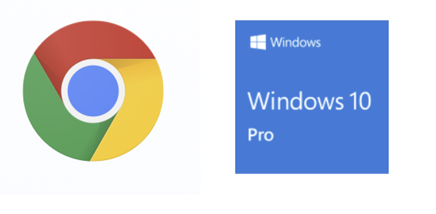

# Win 10 Window Placement Mgmt, Chrome Zoom, & Chrome Tab Keyboard Shortcut Collection

This post lists keyboard shortcuts to move windows in Windows 10, zoom Chrome windows, and switch Chrome tabs. I wrote it to have all this info in one spot.

## Windows 10 Window Management

-   Alt+Tab: Open task switcher.
    
-   Windows+Tab: Open Task View.
    
-   Windows+Down Arrow: Minimize window.
    
-   Windows+Up Arrow: Maximize window.
    
-   Windows+M: Minimize all windows.
    
-   Windows+D: Display desktop.
    
-   Windows+Home: Minimize all windows except the active one.
    
-   Windows+Shift+M: Restore all minimized windows.
    
-   Windows+Shift+Up Arrow: Stretch window to the top and bottom of the screen.
    
-   Windows+Left Arrow: Maximize the window on the left side of the screen.
    
-   Windows+Right Arrow: Maximize the window on the right side of the screen.
    
-   **Windows+Left Arrow or Right Arrow then Up Arrow or Down Arrow: Place a window into the upper or lower quadrant.**
    
-   Windows+Right Arrow: Maximize the window on the right side of the screen.
    
-   Windows+Shift+Left or Right Arrow: Move a window from one monitor to another.
    
-   **Alt + F4: Close a window**
    

## Chrome Zoom

<u>Make everything larger:</u>

-   **Windows and Linux: Press Ctrl and +.**
    
-   Mac: Press ⌘ and +.
    
-   Chrome OS: Press Ctrl and +.
    

<u>Make everything smaller:</u>

-   **Windows and Linux: Press Ctrl and -.**
    
-   Mac: Press ⌘ and -.
    
-   Chrome OS: Press Ctrl and -.
    

<u>Use full-screen mode:</u>

-   **Windows and Linux: Press F11.**
    
-   Mac: Press ⌘ + Ctrl + f.
    
-   Chrome OS: At the top of your keyboard, press the full screen key Full screen hides tabs and launchers. This key is also called F4.
    

## Chrome keyboard shortcuts

-   Tab and window shortcuts
    
-   Action Shortcut
    
-   Open a new window Ctrl + n
    
-   Open a new window in Incognito mode Ctrl + Shift + n
    
-   Open a new tab, and jump to it Ctrl + t
    
-   Reopen previously closed tabs in the order they were closed Ctrl + Shift + t
    
-   Jump to the next open tab Ctrl + Tab or Ctrl + PgDn
    
-   Jump to the previous open tab Ctrl + Shift + Tab or Ctrl + PgUp
    
-   **Jump to a specific tab Ctrl + 1 through Ctrl + 8**
    
-   **Jump to the rightmost tab Ctrl + 9**
    
-   Open your home page in the current tab Alt + Home
    
-   Open the previous page from your browsing history in the current tab Alt + Left arrow
    
-   Open the next page from your browsing history in the current tab Alt + Right arrow
    
-   Close the current tab Ctrl + w or Ctrl + F4
    
-   Close the current window Ctrl + Shift + w or Alt + F4
    
-   Minimize the current window Alt + Space then n
    
-   Maximize the current window Alt + Space then x
    
-   Quit Google Chrome Alt + f then x
    

## References

-   <u>How to Rearrange Windows with Keyboard Shortcuts on Windows 10</u> by Benj Edwards at \[[<u>link</u>](https://www.howtogeek.com/661249/how-to-rearrange-windows-with-keyboard-shortcuts-on-windows-10/)\]
    
-   <u>Change text, image, and video sizes (zoom)</u> by Google at \[[<u>link</u>](https://support.google.com/chrome/answer/96810?co=GENIE.Platform%3DDesktop&hl=en)\]
    
-   <u>Chrome keyboard shortcuts</u> by Google at \[[<u>link</u>](https://support.google.com/chrome/answer/157179?co=GENIE.Platform%3DDesktop&hl=en&oco=0#zippy=%2Ctab-and-window-shortcuts)\]
    
-   Keyboard shortcuts in Windows 10, Windows 8.1, and Windows 7 by Microsoft at \[[<u>link</u>](https://support.microsoft.com/en-us/windows/keyboard-shortcuts-in-windows-dcc61a57-8ff0-cffe-9796-cb9706c75eec)\]
    
-   Chrome logo clipped from \[[<u>link</u>](https://www.google.com/chrome/?brand=FKPE&geo=US&gclsrc=aw.ds&&gclid=Cj0KCQiAvP6ABhCjARIsAH37rbQLPTnRw_tmnPwI3ZdBUiuJ_BJG1TSAzfyoAwKtlZ7ZXtfRSCWYTaEaAg_pEALw_wcB)\]
    
-   Windows 10 Pro logo clipped from \[[<u>link</u>](https://www.microsoft.com/en-us/store/buy/interstitial/DF77X4D43RKT/DG7GMGF0DVNL/48DN/Windows10?lineitemid=3ab1d9ef-8f99-4697-ba5e-110aab9c2126&atc=true&navigationhint=interstitial&p=DF77X4D43RKT-48DN-DG7GMGF0DVNL,c-Windows10&route=interstitial)\]
    
-   Link to post \[[<u>link</u>](https://www.zachpfeffer.com/single-post/win-10-window-placement-mgmt-chrome-zoom-chrome-tab-keyboard-shortcut-collection)\]
    

## Related

-   Gmail shortcuts @ \[[<u>link</u>](https://support.google.com/mail/answer/6594?co=GENIE.Platform%3DDesktop&hl=en#zippy=%2Ccompose-chat%2Cjumping%2Cthreadlist-selection%2Cnavigation%2Capplication%2Cactions%2Cformatting-text%2Changouts)\]