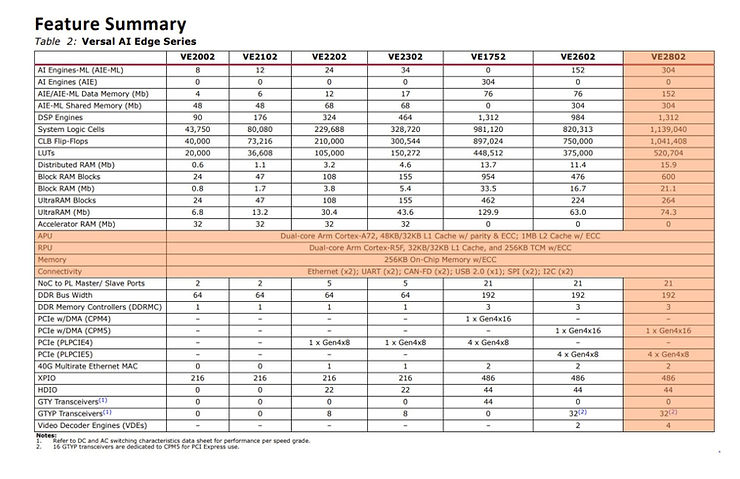

# XCVE2802-2MSEVSVH1760 At-A-Glance

## XCVE2802-2MSEVSVH1760 At-A-Glance

This post is an XCVE2802-2MSEVSVH1760 at-a-glance. This part is featured on the AMD Versal™ AI Edge Series VEK280 Evaluation Kit (EK-VEK280-PP-G) [https://www.xilinx.com/products/boards-and-kits/vek280.html](https://www.xilinx.com/products/boards-and-kits/vek280.html) and lists XCVE2802-2MSEVSVH1760 info and links to key information and documents.

Click [ https://www.centennialsoftwaresolutions.com/post/xcvc1902-1msevsva2197-decoded ] if you need a XCVC1902-1MSEVSVA2197 at-a-glance, This part is featured on the first Versal™ AI Core series evaluation kit (it actually uses a XCVC1902-*<u>2</u>*MSEVSVA2197) 

It includes:

-   XCVE2802-2MSEVSVH1760 <u>&nbsp;Ordering Information Decode</u>
    
-   XCVE2802-2MSEVSVH1760 <u>Resources</u>
    
-   XCVE2802-2MSEVSVH1760 <u>Maximum I/O</u>
    
-   XCVE2802-2MSEVSVH1760 <u>I/O Overview</u>
    
-   XCVE2802-2MSEVSVH1760 <u>Voltage</u>
    
-   XCVE2802-2MSEVSVH1760 <u>Vivado Part Number</u>
    
-   XCVE2802-2MSEVSVH1760 <u>Physical Layout</u>
    
-   XCVE2802-2MSEVSVH1760 <u>PL System Perspective</u>
    
-   XCVE2802-2MSEVSVH1760 <u>Boot</u>
    
-   XCVE2802-2MSEVSVH1760 <u>Software Development</u>
    

## XCVE2802-2MSEVSVH1760 <u> Ordering Information Decode</u>

From Figure 3: Versal Device Ordering Information

https://docs.xilinx.com/v/u/en-US/ds950-versal-overview#page=35 

## XCVE2802-2MSEVSVH1760 <u>Resources</u>

From Table 2: Versal AI Edge Series https://docs.xilinx.com/v/u/en-US/ds950-versal-overview#page=3

## XCVE2802-2MSEVSVH1760 <u>Maximum I/O</u>

From Table 3: Versal AI Edge Series: Device-Package Combinations and Maximum I/O  https://docs.xilinx.com/v/u/en-US/ds950-versal-overview#page=4

-   XPIO DDR: 186
    
-   XPIO DDR+PL: 300
    
-   HDIO (high-density I/O): 44
    
-   MIO (multiplex I/O): 78
    
    -   [<u>https://docs.xilinx.com/r/en-US/am011-versal-acap-trm/Multiplexed-I/O-Signals-and-Pins</u>](https://docs.xilinx.com/r/en-US/am011-versal-acap-trm/Multiplexed-I/O-Signals-and-Pins)
    
-   GTY: 0
    
    -   Versal ACAP GTY and GTYP Transceivers Architecture Manual (AM002) @ [<u>https://docs.xilinx.com/r/en-US/am002-versal-gty-transceivers</u>](https://docs.xilinx.com/r/en-US/am002-versal-gty-transceivers)
        
        -   GTY Description @ [<u>https://docs.xilinx.com/r/en-US/am002-versal-gty-transceivers/Features</u>](https://docs.xilinx.com/r/en-US/am002-versal-gty-transceivers/Features)
        
    -   26.5625 Max Gb/s, 1.2 Min Gb/s , [<u>https://www.xilinx.com/support/documents/data_sheets/ds957-versal-ai-core.pdf#page=58</u>](https://www.xilinx.com/support/documents/data_sheets/ds957-versal-ai-core.pdf#page=58)
    
-   GTYP: 32
    

## XCVE2802-2MSEVSVH1760 <u>I/O Overview</u>

From [https://docs.xilinx.com/v/u/en-US/ds950-versal-overview#page%20=28](https://docs.xilinx.com/v/u/en-US/ds950-versal-overview#page =28) 

## XCVE2802-2MSEVSVH1760 <u>Voltage</u>

From: https://www.xilinx.com/support/documents/data_sheets/ds957-versal-ai-core.pdf#page=7 (DS957)

The specified portion of the Vivado design tools device selection code includes speed grade (-3, <u>\-2</u>, -1), operating voltages (HP, MP, MHP, MM, LP, LHP, LLI), temperature grade, (-i, <u>\-e</u>, -m), and maximum static power screen (<u>\-S</u>, -L).

From: https://docs.xilinx.com/v/u/en-US/ds950-versal-overview#page=33 (DS950)

## XCVE2802-2MSEVSVH1760 <u>Vivado Part Number</u>

From Table:  Available Speed Grades and Operating Voltages https://docs.xilinx.com/r/en-US/ds958-versal-ai-edge/Available-Speed-Grades-and-Operating-Voltages 

<u>The XCVE2802-2MSEVSVH1760 Vivado Part # is xcve2802-vsvh1760-2MP-e-S (Vivado 2022.1)</u>

\=

## XCVE2802-2MSEVSVH1760 <u>Physical Layout</u>

From https://docs.xilinx.com/v/u/en-US/ds950-versal-overview#page=12 

From https://docs.xilinx.com/r/en-US/am011-versal-acap-trm/PL-Block-Diagram 

## XCVE2802-2MSEVSVH1760 <u>PL System Perspective</u>

## XCVE2802-2MSEVSVH1760 <u>Boot</u>

https://docs.xilinx.com/r/en-US/am011-versal-acap-trm/Non-Secure-Boot-Flow 

https://docs.xilinx.com/r/en-US/am011-versal-acap-trm/Secure-Boot-Flow 

## XCVE2802-2MSEVSVH1760 <u>Software Development</u>

https://docs.xilinx.com/r/en-US/ug1304-versal-acap-ssdg 

## <u>References To Items Used In This Post</u>

Logo from https://library.amd.com/media/ (requires a password)

## <u>Related Information</u>

### _2023.2 Installation Summary_

https://www.xilinx.com/support/download/index.html/content/xilinx/en/downloadNav/vivado-design-tools.html

AMD Unified Installer for FPGAs & Adaptive SoCs 2023.2 SFD (TAR/GZIP - 103.92 GB)

MD5 SUM Value : 64d64e9b937b6fd5e98b41811c74aab2