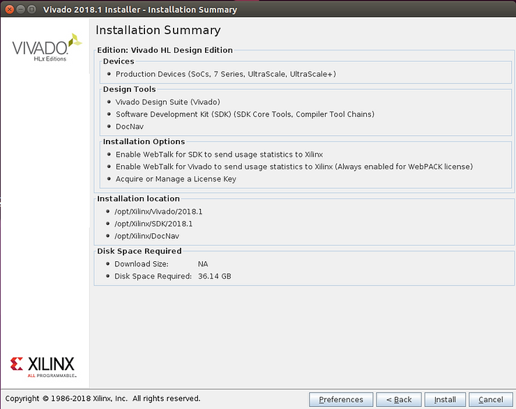

# Xilinx 2018.1

This post lists suggestions, requirements and download links for Vivado, SDK and PetaLinuxTools 2018.1.

**Summary**

-   You'll download 24 GB of installers to work with the ZC706 on Linux
    
-   Vivado (16.89 GB) + SDK WebInstall (100.53 MB) + the full SDK install (1.22 GB)+ PetaLinux Tools (6.21 GB) + ZC706 (106.62MB)
    
-   You can elect to download the entire SDK installer before your install it
    
-   @ 2 MB/sec it takes about 1 hour
    
-   SDK uses 9.04 GB of diskspace (+ the 100.53 MB + 1.22 GB installation)
    
-   Which OS Should I Use?
    
-   Choose Ubuntu Linux 16.04.3 to run PetaLinux Tools, Vivado and the SDK
    
-   Download **64-bit PC (AMD64) desktop image** from \[[link](http://old-releases.ubuntu.com/releases/16.04.3/ubuntu-16.04.3-desktop-amd64.iso)\] (1.48 GB)
    
-   All 16.04.3 downloads are at: [http://old-releases.ubuntu.com/releases/16.04.3/](http://old-releases.ubuntu.com/releases/16.04.3/)
    
-   How should I configure my VM?
    
-   6 GB RAM
    
-   200 GB VMDK Disk
    
-   Name: project-ubuntu-16.04.3-desktop-amd64-6GB-RAM-200GB-Disk
    
-   Download VirtualBox @ 5.2.12 at \[[link](http://download.virtualbox.org/virtualbox/5.2.12/VirtualBox-5.2.12-122591-Win.exe)\], the Extension Pack at \[[link](http://download.virtualbox.org/virtualbox/5.2.12/Oracle_VM_VirtualBox_Extension_Pack-5.2.12.vbox-extpack)\]
    
-   Documentation
    
-   The user manual is at \[[link](http://download.virtualbox.org/virtualbox/5.2.12/UserManual.pdf)\] \[[html](http://www.virtualbox.org/manual)\]
    
-   Comment on Requirements
    
-   I've run 2017.4 on an Oracle VirtualBox VM with 4 GB of memory on a machine described at \[[link](http://www.zachpfeffer.com/single-post/2017/01/28/New-T460-System-Information)
    

**All Downloads**

-   At \[[link](http://www.xilinx.com/support/download/index.html/content/xilinx/en/downloadNav/vivado-design-tools.html)\]
    
-   Vivado, SDK, PetaLinux Tools, SDSoC, SDAccel, ISE, Device Models and CAE Vendor Library
    

**Vivado + SDK + PetaLinux Tools Documentation**

-   UG1165 (v2018.1) April 4, 2018, Zynq-7000 All Programmable SoC: Embedded Design Tutorial, A Hands-On Guide to Effective Embedded System Design at \[[link](http://www.xilinx.com/support/documentation/sw_manuals/xilinx2018_1/ug1165-zynq-embedded-design-tutorial.pdf)\] (validated with 2017.3 but reported to work with newer versions)
    

**Vivado 2018.1**

-   At \[[link](http://www.xilinx.com/support/download/index.html/content/xilinx/en/downloadNav/vivado-design-tools/2018-1.html)\]
    
-   Vivado HLx 2018.1: All OS installer Single-File Download (TAR/GZIP - 16.89 GB) at \[[link](http://www.xilinx.com/member/forms/download/xef.html?filename=Xilinx_Vivado_SDK_2018.1_0405_1.tar.gz)[\]](http://www.xilinx.com/member/forms/download/xef.html?filename=Xilinx_Vivado_SDK_2018.1_0405_1.tar.gz)
    
-   Documentation
    
-   UG973 (v2018.1) April 12, 2018, Vivado Design Suite User Guide, Release Notes, Installation,and Licensing at \[[link](http://www.xilinx.com/support/documentation/sw_manuals/xilinx2018_1/ug973-vivado-release-notes-install-license.pdf)\]
    

**Embedded Development 2018.1**

-   At \[[link](http://www.xilinx.com/support/download/index.html/content/xilinx/en/downloadNav/embedded-design-tools/2018-1.html)\]
    
-   SDK
    
-   SDK 2018.1 WebInstall for Windows 64 (EXE - 51.18 MB) at \[[link](http://www.xilinx.com/member/forms/download/xef.html?filename=Xilinx_SDK_2018.1_0405_1_Win64.exe)\]
    
-   SDK 2018.1 WebInstall for Linux 64 (BIN - 100.53 MB) at \[[link](http://www.xilinx.com/member/forms/download/xef.html?filename=Xilinx_SDK_2018.1_0405_1_Lin64.bin)\]
    
-   Documentation
    
-   Using Xilinx SDK at \[[link](http://www.xilinx.com/html_docs/xilinx2018_1/SDK_Doc/index.html)\]
    
-   PetaLinux Tools
    
-   PetaLinux 2018.1 Installer (TAR/GZIP - 6.21GB) at \[[link](http://www.xilinx.com/member/forms/download/xef.html?filename=petalinux-v2018.1-final-installer.run)\]
    
-   Documentation
    
-   Embedded Desing Hub - PetaLinux Tools at \[[link](http://www.xilinx.com/support/documentation-navigation/design-hubs/dh0016-petalinux-tools-hub.html)\]
    
-   UG1144 (v2018.1) April 18, 2018, PetaLinux Tools Documentation, Reference Guide at \[[link](http://www.xilinx.com/support/documentation/sw_manuals/xilinx2018_1/ug1144-petalinux-tools-reference-guide.pdf)\]
    
-   UG1157 (v2018.1) April 18, 2018, PetaLinux Tools Documentation, PetaLinux Command Line Reference at \[[link](http://www.xilinx.com/support/documentation/sw_manuals/xilinx2018_1/ug1157-petalinux-tools-command-line-guide.pdf)\]
    
-   Zynq-7000
    
-   ZC702 BSP (BSP - 104.74MB) at \[[link](http://www.xilinx.com/member/forms/download/xef.html?filename=xilinx-zc702-v2018.1-final.bsp)\]
    
-   ZC706 BSP (BSP - 106.62MB) at \[[link](http://www.xilinx.com/member/forms/download/xef.html?filename=xilinx-zc706-v2018.1-final.bsp)\]
    
-   ZED BSP (BSP - 106.52MB) at \[[link](http://www.xilinx.com/member/forms/download/xef.html?filename=avnet-digilent-zedboard-v2018.1-final.bsp)\]
    
-   AC701 BSP (BSP - 570.73MB) at \[[link](http://www.xilinx.com/member/forms/download/xef.html?filename=xilinx-ac701-v2018.1-final.bsp)\]
    
-   KCU105 BSP (BSP - 354.09MB) at \[[link](http://www.xilinx.com/member/forms/download/xef.html?filename=xilinx-kcu105-axi-full-v2018.1-final.bsp)\]
    
-   KC705 BSP (BSP - 529.09MB) at \[[link](http://www.xilinx.com/member/forms/download/xef.html?filename=xilinx-kc705-v2018.1-final.bsp)\]
    
-   Zynq UltraScale+ MPSoC
    
-   ZCU102 BSP (prod-silicon) (BSP - 598.21MB) at \[[link](http://www.xilinx.com/member/forms/download/xef.html?filename=xilinx-zcu102-v2018.1-final.bsp)\]
    
-   ZCU102 ZU9 ES2 Rev 1.0 BSP (BSP - 598.28MB) at \[[link](http://www.xilinx.com/member/forms/download/xef.html?filename=xilinx-zcu102-zu9-es2-rev1.0-v2018.1-final.bsp)\]
    
-   ZCU104 BSP (BSP - 1.17GB) at \[[link](http://www.xilinx.com/member/forms/download/xef.html?filename=xilinx-zcu104-v2018.1-final.bsp)\]
    
-   ZCU106 BSP (BSP - 1.15GB) at \[[link](http://www.xilinx.com/member/forms/download/xef.html?filename=xilinx-zcu106-v2018.1-final.bsp)\]
    

**Additional Info**

Vivado, PetaLinux Tools and SDK System Requirements

-   PetaLinux Tools 2018.1 runs on (as stated)
    
-   Ubuntu Linux 16.04.3 (64-bit) and other Linux distros
    
-   CPU Speed
    
-   2 GHz CPU clock or equivalent (minimum of 8 cores)
    
-   RAM
    
-   8 GB RAM (recommended minimum for Xilinx tools)
    
-   HDD
    
-   100 GB free
    
-   Vivado 2018.1 runs on
    
-   Ubuntu Linux 16.04.3 LTS (64-bit) and other Linux distros
    
-   RAM
    
-   Requirements at \[[link](http://www.xilinx.com/products/design-tools/vivado/memory.html)\]
    
-   Example
    
-   For the XC7Z045-2FFG900 C SoC on the ZC706 Vivado typically needs 3 GB, Max 5 GB
    
-   Note: Unless you need a bigger part, you may be better off using a smaller part because builds complete more quickly, there are less memory requirements, etc...
    
-   SDK 2018.1 runs on
    
-   Ubuntu Linux 16.04.2 LTS (64-bit)
    
-   I suspect it also runs on 16.04.3
    
-   Windows 7 SP1 (64-bit), Windows 8.1 (64-bit), Windows 10 Pro (64-bit)
    
-   CPU Speed
    
-   2.2 GHz minimum or higher; Hyper-threading (HHT) or Multi-core recommended.
    
-   Processor
    
-   Intel Pentium 4, Intel Core Duo, or Xeon Processors; SSE2 minimum
    
-   RAM
    
-   2 GB or higher
    

**Install Size**

36.14 GB were required to install Vivado HL Design Edition and the SDK on Linux

**Reference**

-   The Xilinx graphic is from \[[link](http://pbs.twimg.com/profile_images/535545777020338176/pEWdIYq__400x400.png)\]