# Xilinx FPGA OpenCL Vector Addition WIP

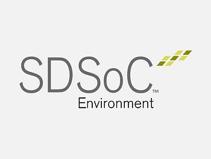

Warning

This post is a work in progress.

Everything works until you see:

## **<u>!!!Problem!!!</u>**

Using SDx 2018.2.

**<u>Supported Boards</u>**

This example states that it runs on **Zynq UltraScale+ MPSoC** on the **ZCU102** board (available for $2,495.00 \[[<u>here</u>](https://www.xilinx.com/products/boards-and-kits/ek-u1-zcu102-g.html)\]) and the **Zynq UltraScale+ MPSoC EV** of the **ZCU104** (available for $895.00 \[[<u>here</u>](https://www.xilinx.com/products/boards-and-kits/zcu104.html)\]) and **ZCU106** (available for $1,995.00 \[[<u>here</u>](https://www.xilinx.com/products/boards-and-kits/zcu106.html)\]).

**<u>Prerequisites</u>**

-   You have a ZCU102
    
-   You have install SDSoC 2018.2 - see \[[<u>instructions</u>](https://www.centennialsoftwaresolutions.com/blog/lab-1-sdsoc-build-and-load)\] if you need help installing SDSoC 2018.2
    

**<u>Steps</u>**

1\. Make sure you have **git**

Type **sudo apt-get install git**

2\. (A) Click the **New Project** drop down then (B) click **SDx Project...**

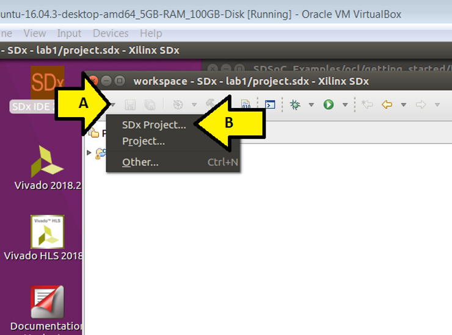

3\. Leave the **Application** radio button selected and click **Next >**

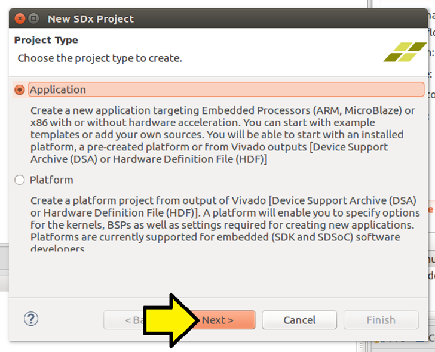

4\. (A) Name the project **vectoradd** and (B) click **Next >**

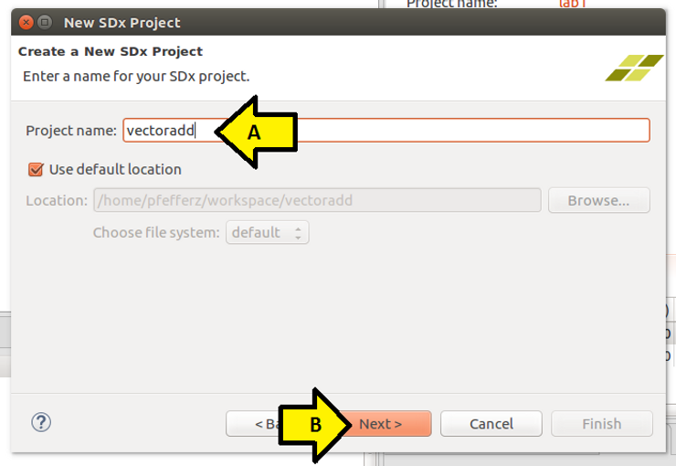

5\. (A) Select the **ZCU102** and (B) click **Next >**

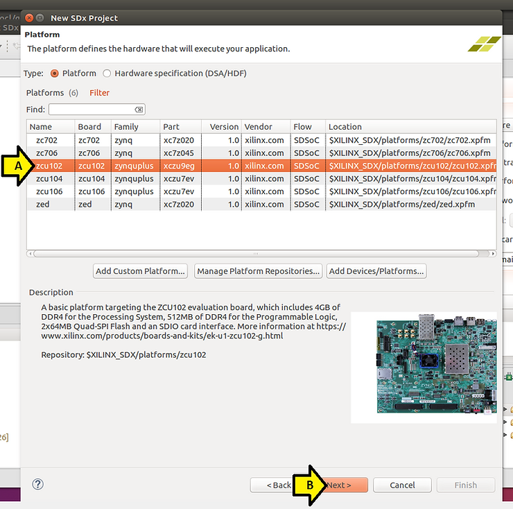

6\. Accept the defaults on the **System configuration** page and click **Next >**

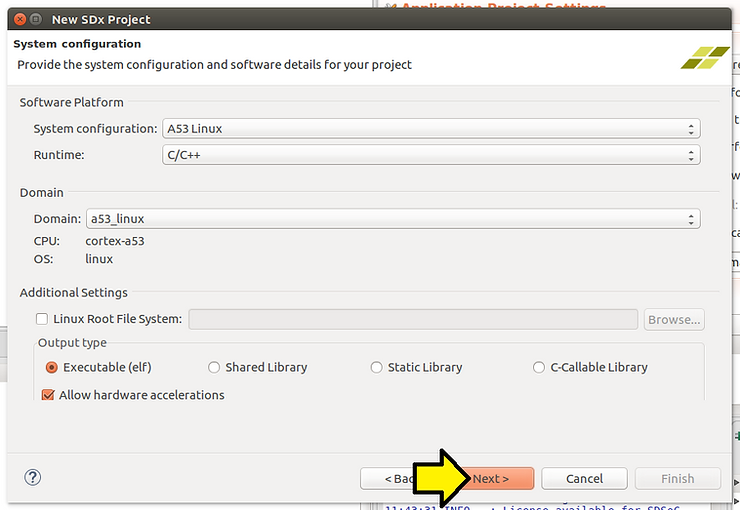

7\. Click **SDx Examples...**

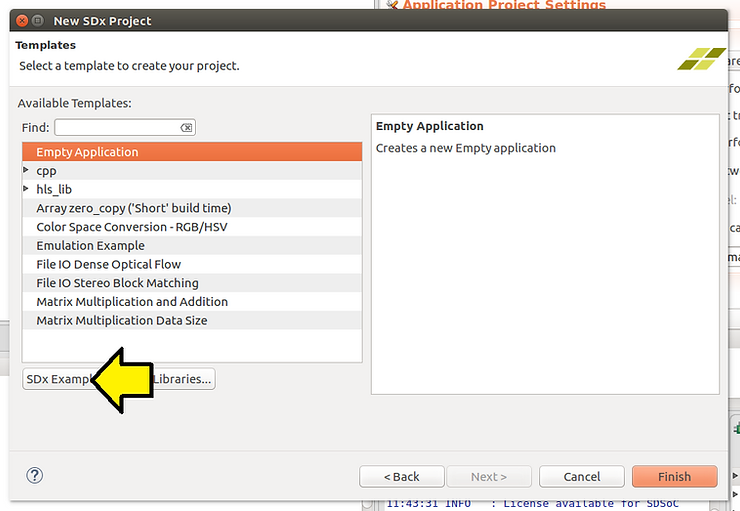

_Warning!!! Before you do the next step, you must have git installed. If you do not, close SDx, install it (see above for the command, relaunch SDx and follow the instructions to here)_

8\. Click the **Download** button

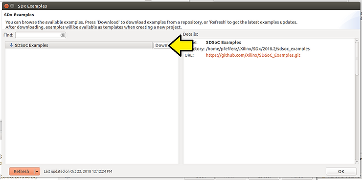

You should see:

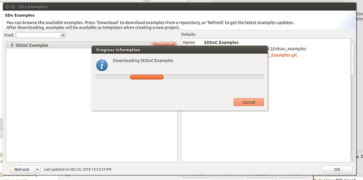

...and:

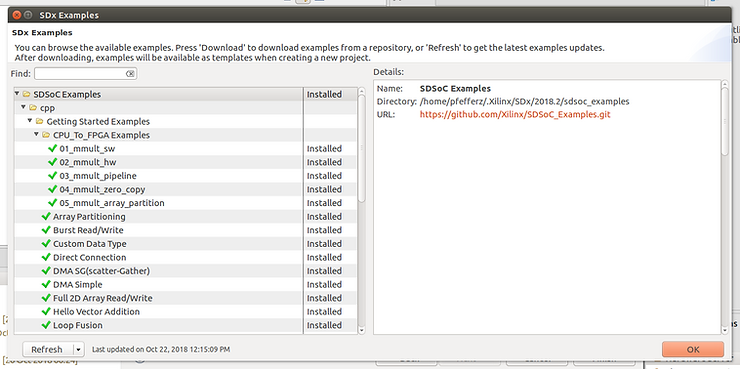

9\. (A) Scroll down, (B) select **Vector Addition (CL)** and (C) click **OK**

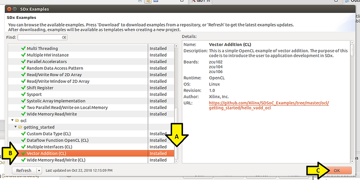

10\. Click **Finish**

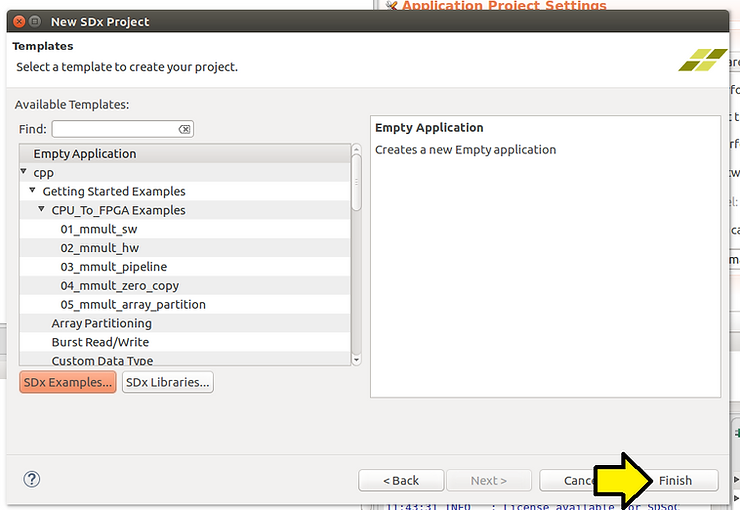

## **<u>!!!Problem!!!</u>**

Step 11 does not work, project will not build

11\. (A) Click **vectoradd** the (B) click the **hammer icon** to build

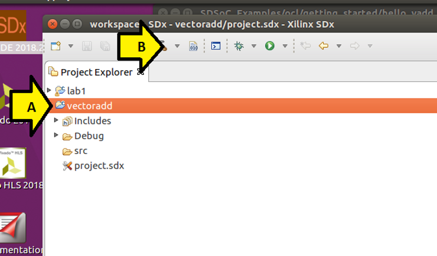

Problem:

Out of the box you'll get:

make: \*\*\* No rule to make target 'clean'. Stop. vectoradd C/C++ Problem

**<u>Workaround 1 (didn't work)</u>**

To work around this (A) right click on **vectoradd** and (B) click **C/C++ Build Settings**

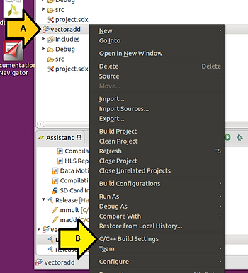

(A) Click Settings then (B) remove **sdsoc\_make\_clean Debug**

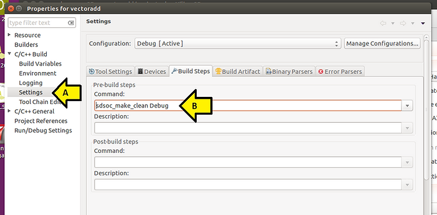

...then click **OK**

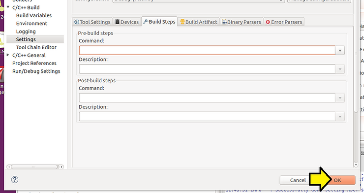

**<u>Workaround 2 (didn't work)</u>**

(A) Click **C/C++ Build** then (B) click the **Clean** checkbox off

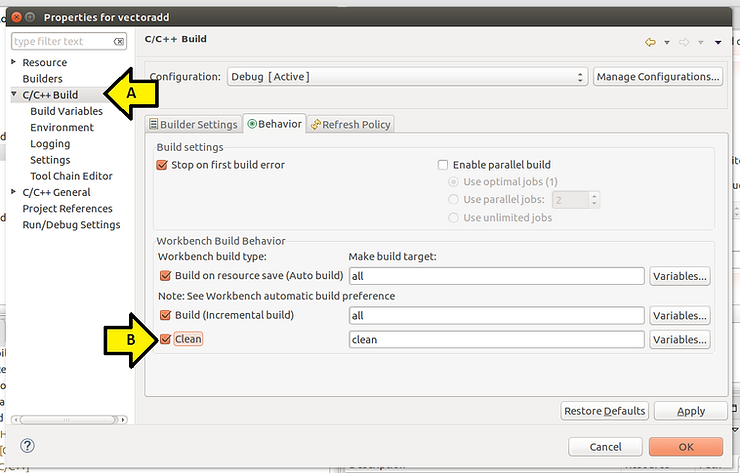

After clicking it off, click OK:

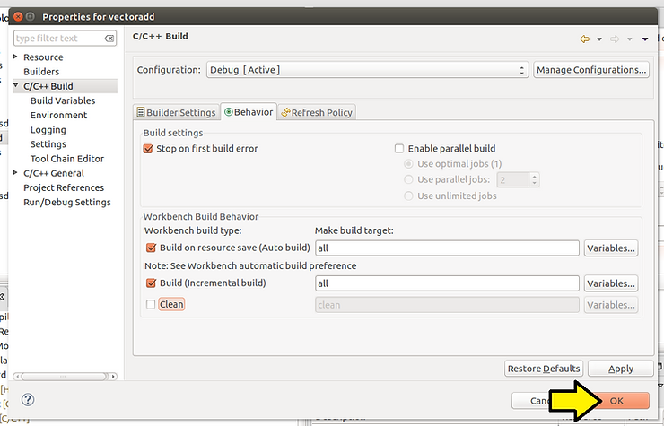

**<u>References</u>**

-   An example from Xilinx of performing vector addition using OpenCL at \[[<u>link</u>](https://github.com/Xilinx/SDSoC_Examples/tree/master/ocl/getting_started/hello_vadd_ocl)\]
    
-   SDSoC logo from \[[<u>link</u>](https://www.origin.xilinx.com/content/xilinx/en/products/boards-and-kits/ek-u1-zcu102-g/_jcr_content/mainParsys/xilinxtabs2/tab-hardware/xilinxcolumns_325b/column2/xilinxincludedproduc.img.jpg/1528405722461.jpg)\]
    

**<u>Notes</u>**

**Difference between the Zynq UltraScale+ MPSoC (CG and EG) and the Zynq UltraScale+ MPSoC EV**

The ZCU102 has a Zynq UltraScale+ MPSoC **EG**, the ZCU104 and ZCU106 have **Zynq UltraScale+ MPSoC EV**'s.

From \[[<u>link</u>](https://www.xilinx.com/products/silicon-devices/soc/zynq-ultrascale-mpsoc.html#productAdvantages)\] the EV is the EG + "an integrated H.264 / H.265 video codec capable of simultaneous encode and decode up to 4Kx2K (60fps)"