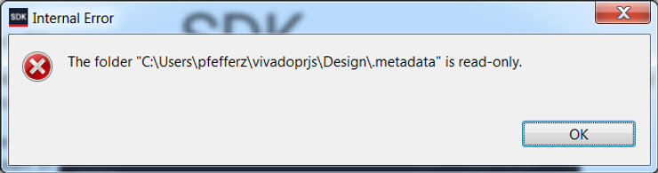
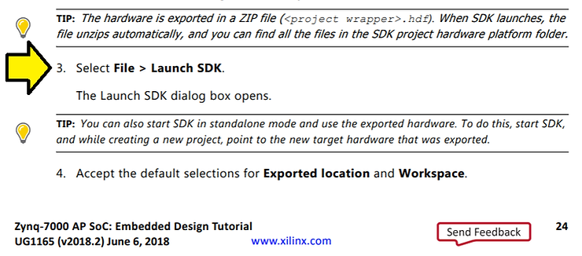

# Xilinx SDK Internal Error: The folder "C:\....\.metadata" is read-only


This post discusses the Xilinx SDK **Internal Error**: The folder "C:\\....\\.metadata" is read-only.

**<u><span>Quick Workaround</span></u>**

Remove spaces in your paths and keep your path to 260.

The **subst** \[[<u><span>doc</span></u>](https://docs.microsoft.com/en-us/windows-server/administration/windows-commands/subst)\] command can be used to shorten paths.

**<u><span>Version</span></u>**

Found this using Vivado 2018.2 and the built in 2018.2 SDK available at \[[<u><span>link</span></u>](https://www.xilinx.com/support/download/index.html/content/xilinx/en/downloadNav/vivado-design-tools/2018-2.html)\].

**<u><span>Discussion</span></u>**

After following **Example Project: Creating a New Embedded Project with Zynq SoC** in the **Zynq-7000 AP SoC: Embedded Design Tutorial** @ \[[<u><span>link</span></u>](https://www.xilinx.com/support/documentation/sw_manuals/xilinx2018_2/ug1165-zynq-embedded-design-tutorial.pdf)\] I got this error:



...on **3\. Select File > Launch SDK** on page 24:



I had named my Vivado directory:

**C:\\Users\\pfefferz\\vivadoprjs\\Design for ZC702 Rev 1.1**

**<u><span>Online Resources</span></u>**

Googling this issue:

-   **Spaces in file/folder names** @ \[[<u><span>link</span></u>](https://forums.xilinx.com/t5/Design-Entry/Spaces-in-file-folder-names/td-p/146016)\] from 2011, [<u><span>radix99</span></u>](https://forums.xilinx.com/t5/user/viewprofilepage/user-id/22776), a Visitor, says, "they say don't use spaces"
    
-   **issues relating exporting the hardware to SDK** @ \[[<u><span>link</span></u>](https://forums.xilinx.com/t5/Welcome-Join/issues-relating-exporting-the-hardware-to-SDK/m-p/512437#M12746)\] from 2014, [<u><span>aher</span></u>](https://forums.xilinx.com/t5/user/viewprofilepage/user-id/66228), a Xilinx Employee, says, "please remove all spaces"
    
-   **Vivado 2018.2 and spaces in file name sof folder names under windows 10** @ \[[<u><span>link</span></u>](https://forums.xilinx.com/t5/Design-Entry/Vivado-2018-2-and-spaces-in-file-name-sof-folder-names-under/td-p/887217)\] from 2018, [<u><span>hemangd</span></u>](https://forums.xilinx.com/t5/Design-Entry/Vivado-2018-2-and-spaces-in-file-name-sof-folder-names-under/m-p/888134#M18148), a moderator says, "consult UG895 available @ \[[<u><span>link</span></u>](https://www.xilinx.com/support/documentation/sw_manuals/xilinx2018_2/ug895-vivado-system-level-design-entry.pdf)\]"
    
-   **(related) Windows path length issues: any plans to fix?** (AR#60856) @ \[[<u><span>link</span></u>](https://forums.xilinx.com/t5/General-Technical-Discussion/Windows-path-length-issues-any-plans-to-fix/td-p/700883)\] from 2016, [<u><span>bwiec</span></u>](https://forums.xilinx.com/t5/user/viewprofilepage/user-id/25558), a Xilinx Employee, says "Yes, we are aware of this issue and I know the software teams have been working on it."
    

**<u><span>Vivado Docs</span></u>**

In the 2018.2 version of UG895 @ \[[<u><span>link</span></u>](https://www.xilinx.com/support/documentation/sw_manuals/xilinx2018_2/ug895-vivado-system-level-design-entry.pdf)\] the section called **Vivado Naming Conventions** on page 125 lists:

Introduction

The following are the required naming conventions when working with the Vivado® Design

Suite. Failing to follow these naming conventions might introduce potential risk to the

design or the tool, and cause unpredictable behavior in the design flow.

-   Source files names must start with a letter (A-Z, a-z) and must contain only alphanumeric characters (A-Z, a-z, 0-9) and underscores (\_).
    
-   Output files names must start with a letter (A-Z, a-z) and must contain only alphanumeric characters (A-Z, a-z, 0-9) and underscores (\_).
    
-   Project names must start with a letter (A-Z, a-z) and must contain only alphanumeric characters (A-Z, a-z, 0-9) and underscores (\_).
    
-   Project directory names must start with a letter (A-Z, a-z) and should contain only alphanumeric characters (A-Z, a-z, 0-9), tilde (~) and underscores (\_).
    

CAUTION! The Windows operating system has a 260 character limit for path lengths which can affect the Vivado tools. To avoid this issue, use the shortest possible names and directory locations when creating projects, defining IP or managed IP projects, or creating block designs.

The following characters are not supported for **project**, **file**, or **directory** names:

-   ! # $ % ^ & \* ( ) \` ; < > ? , \[ \] { } ' " |
    
-   tab (\\t)
    
-   return (\\r)
    
-   new line (\\n)
    
-   / or \\ (As part of the directory or file name rather than as a path delimiter)
    

The following character is not supported for directory names:

-   . (dot as terminal character)
    

The following character is not supported for file or project names:

-   @
    

Note: In the Vivado IDE, the @ character is not supported for new file or project names. The Vivado IDE does allow an existing file on disk that uses the @ character to be added to a project. The Vivado IDE can open a project that includes the @ character in the project name. Using the Tcl Console, you can create a project with a name that contains the @ character.

**IMPORTANT: Spaces in directory and file names are supported by the Windows operating system. However, you should avoid using spaces in order to preserve portability of the project or files between the Windows and Linux operating systems.**

The Vivado Design Suite supports the use of forward slashes (/) as path delimiters for both

Windows and Linux platforms. Backslashes (\\) are allowed as path delimiters on the

Windows platform only.

Any characters not explicitly mentioned above are not supported for project, file, or

directory names.

_Comment_

The **IMPORTANT note in bold** about spaces in **bold** does not say spaces are not supported.

**<u><span>SDK Docs</span></u>**

I don't see any mention of naming conventions in the 2018.2 SDK online docs @ \[[<u><span>link</span></u>](https://www.xilinx.com/html_docs/xilinx2018_2/SDK_Doc/)\]

**<u><span>Eclipse Docs</span></u>**

SDK 2018.2 on Windows uses the Eclipse configuration @ \[[<u><span>link</span></u>](https://docs.google.com/document/d/1LTFNmB2tLr9XwgVL2HCiqqNVlwaaGZhEC3DIrAreuE8/edit?usp=sharing)\]. Is this an Eclipse issue?

**<u><span>More Debug</span></u>**

In Vivado the following message is listed:

```
INFO: [Vivado 12-393] Launching SDK...
INFO: [Vivado 12-417] Running xsdk -workspace C:/Users/pfefferz/vivadoprjs/Design for ZC702 Rev 1.1/Design for ZC702 Rev 1.1.sdk -hwspec C:/Users/pfefferz/vivadoprjs/Design for ZC702 Rev 1.1/Design for ZC702 Rev 1.1.sdk/Top_wrapper.hdf
INFO: [Vivado 12-3157] SDK launch initiated. Please check console for any further messages.
```

It looks like this may simply be passing the workspace path without quotes, but when I tried calling the same with quotes:

```
C:\Users\pfefferz>C:\Xilinx\SDK\2018.2\bin\xsdk -workspace "C:/Users/pfefferz/vivadoprjs/Design for ZC702 Rev 1.1/Design for ZC702 Rev 1.1.sdk" -hwspec "C:/User
s/pfefferz/vivadoprjs/Design for ZC702 Rev 1.1/Design for ZC702 Rev 1.1.sdk/Top_wrapper.hdf"

****** Xilinx Software Development Kit
****** SDK v2018.2 (64-bit)
  **** SW Build 2258646 on Thu Jun 14 20:03:12 MDT 2018
    ** Copyright 1986-2018 Xilinx, Inc. All Rights Reserved.

Launching SDK with command C:\Xilinx\SDK\2018.2\eclipse\win64.o\eclipse.exe -data C:/Users/pfefferz/vivadoprjs/Design for ZC702 Rev 1.1/Design for ZC702 Rev 1.1
.sdk -vmargs -Dcom.xilinx.sdk.args.hwspec=C:/Users/pfefferz/vivadoprjs/Design for ZC702 Rev 1.1/Design for ZC702 Rev 1.1.sdk/Top_wrapper.hdf -Xms64m -Xmx4G &

C:\Users\pfefferz>
```

I also got the same error.

I also tried:

```
C:\Users\pfefferz>set WORKSPACE="\"C:/Users/pfefferz/vivadoprjs/Design for ZC702 Rev 1.1/Design for ZC702 Rev 1.1.sdk\""

C:\Users\pfefferz>set HWSPEC="\"C:/Users/pfefferz/vivadoprjs/Design for ZC702 Rev 1.1/Design for ZC702 Rev 1.1.sdk/Top_wrapper.hdf\""

C:\Users\pfefferz>C:\Xilinx\SDK\2018.2\bin\xsdk -workspace %WORKSPACE% -hwspec %HWSPEC%

****** Xilinx Software Development Kit
****** SDK v2018.2 (64-bit)
  **** SW Build 2258646 on Thu Jun 14 20:03:12 MDT 2018
    ** Copyright 1986-2018 Xilinx, Inc. All Rights Reserved.

Launching SDK with command C:\Xilinx\SDK\2018.2\eclipse\win64.o\eclipse.exe -data "C:/Users/pfefferz/vivadoprjs/Design for ZC702 Rev 1.1/Design for ZC702 Rev 1.
1.sdk" -vmargs -Dcom.xilinx.sdk.args.hwspec="C:/Users/pfefferz/vivadoprjs/Design for ZC702 Rev 1.1/Design for ZC702 Rev 1.1.sdk/Top_wrapper.hdf" -Xms64m -Xmx4G
&
```

...this launched the SDK, but when the SDK runs Initializing s/w repositories I get the following in the SDK Log:

```
19:13:34 INFO	: Registering command handlers for SDK TCF services
19:13:34 INFO	: Launching XSCT server: xsct.bat -interactive C:\Users\pfefferz\vivadoprjs\Design for ZC702 Rev 1.1\Design for ZC702 Rev 1.1.sdk\temp_xsdb_launch_script.tcl
19:13:34 ERROR	: (XSDB Server)invalid command name "%"
    while executing
"% Total    % Received % Xferd  Average Speed   Time    Time     Time  Current"
    (file "C:\Users\pfefferz\vivadoprjs\Design" line 1)


19:16:32 ERROR	: Timed out. 180 seconds have elapsed while waiting for XSCT server to launch.
19:16:32 INFO	: Launching XSCT server: xsct.bat -interactive C:\Users\pfefferz\vivadoprjs\Design for ZC702 Rev 1.1\Design for ZC702 Rev 1.1.sdk\temp_xsdb_launch_script.tcl
19:16:34 ERROR	: (XSDB Server)invalid command name "%"
    while executing
"% Total    % Received % Xferd  Average Speed   Time    Time     Time  Current"
    (file "C:\Users\pfefferz\vivadoprjs\Design" line 1)
```

**<u><span>Conclusion &amp; Guidance</span></u>**

Just from the small debug I did I saw that there are probably many places where the SDK cannot handle paths with spaces. Therefore I would suggest, as other have, of not using spaces and keep paths to 260 chars.

Tip: you can you the **subst DRIVE: PATH** CMD to shorten paths.

Happy Vivado and SDKing!

**<u><span>References</span></u>**

-   Xilinx logo found via [<u><span>https://twitter.com/xilinxinc</span></u>](https://twitter.com/xilinxinc) at \[[<u><span>link</span></u>](https://pbs.twimg.com/profile_images/535545777020338176/pEWdIYq__400x400.png)\]