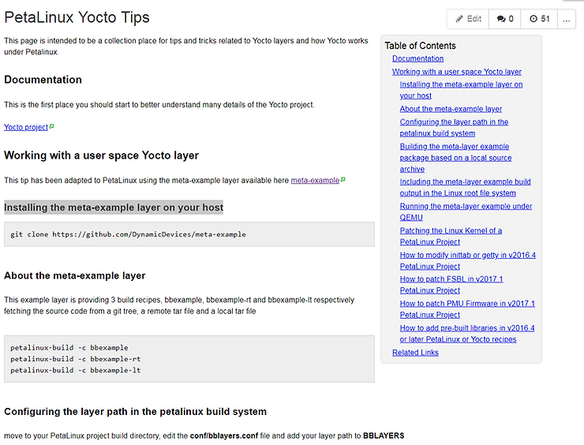
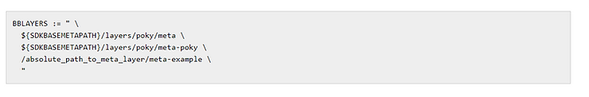

# Xilinx's Wiki Instructions to Add Yocto Layer Fail with PetaLinux Tools 2017.4


This post lists an error I got while following the instructions for "Installing the meta-example layer on your host" listed on the "PetaLinux Yocto Tips" at [http://www.wiki.xilinx.com/PetaLinux+Yocto+Tips](http://www.wiki.xilinx.com/PetaLinux+Yocto+Tips).

**TL;DR**

The "Installing the meta-example layer on your host" instructions listed on the "PetaLinux Yocto Tips" at http://www.wiki.xilinx.com/PetaLinux+Yocto+Tips as of Mar 24 2018 @ 9:18 AM (MDT) did not work for me with PetaLinux 2017.4.

In addition, the wiki's instructions conflict with an advisement given in a file the wiki says to edit.

**Steps**

1\. Clone the repo:

```
git clone https://github.com/DynamicDevices/meta-example
```

2\. Edit bblayers.conf:

```
vi ./build/conf/bblayers.conf
```

3\. Add the path to meta-example:

```
/home/pfefferz/plprjs2/zcu102qemu/meta-example \
```

4\. Source the PetaLinux Tools environment and build bbexample:

```
LOCALTOOLS=$HOME/tools
source $LOCALTOOLS/opt/pkg/petalinux/settings.sh
source $HOME/set_petalinux_env.sh
which make
which petalinux-create

pfefferz@plc2:~/plprjs2/zcu102qemu$ petalinux-build -c bbexample
```

5\. Got the following error:

pfefferz@mach:~/plprjs2/zcu102qemu$ petalinux-build -c bbexample 

[INFO] building bbexample


[INFO] sourcing bitbake


INFO: bitbake bbexample


Loading cache: 100% |####################################| Time: 0:00:05


Loaded 3256 entries from dependency cache.


Parsing recipes: 100% |##################################| Time: 0:00:10


Parsing of 2466 .bb files complete (2432 cached, 34 parsed). 3259 targets, 225 skipped, 0 masked, 0 errors.

ERROR: Nothing PROVIDES 'bbexample'

Summary: There was 1 ERROR message shown, returning a non-zero exit code.


ERROR: Failed to build bbexample


webtalk failed:PetaLinux statistics:extra lines detected:notsent_nofile!


webtalk failed:Failed to get PetaLinux usage statistics!

6\. Looked at build/conf/bblayers.conf and found that it had been regenerated as it warned at the top of the file:

```
# WARNING: this configuration has been automatically generated and in
# most cases should not be edited. If you need more flexibility than
# this configuration provides, it is strongly suggested that you set
# up a proper instance of the full build system and use that instead.
```

**A Screenshot of the Instructions**





**Reference**

Find all the bugs image found at [link](http://www.semiwiki.com/forum/content/4685-synopsys-software-integrity-find-all-bugs.html).