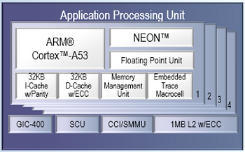
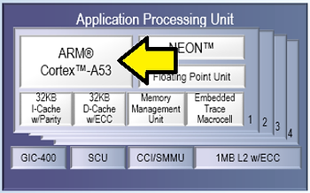
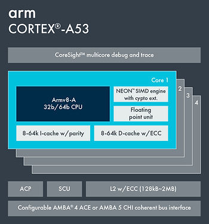
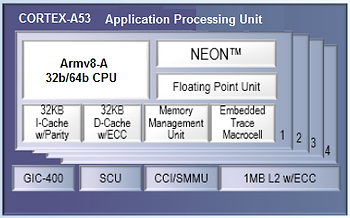

# Xilinx's Zynq UltraScale+ MPSoC Diagrams are Wrong

This post presents a bug in the Zynq UltraScale+ MPSoC diagrams at [xilinx.com](http://www.xilinx.com/).

All of the diagrams on the [Zynq UltraScale+ MPSoC Product Landing Page](http://www.xilinx.com/products/silicon-devices/soc/zynq-ultrascale-mpsoc.html) share a common problem.

Here's the Application Processing Unit excerpt from a larger block diagram at [link](http://www.xilinx.com/content/dam/xilinx/imgs/products/zynq/zynq-eg-block.PNG):

Look at where they put the ARM Cortex-A53 text:

Are there 4 ARM Cortex-A53's? There are not. There is \_one\_ Cortex-A53 with four cores that contain one Armv8-A CPU each.

Arm documents the Cortex-A53 more accurately at the Cortex-A53 [site](http://developer.arm.com/products/processors/cortex-a/cortex-a53):

So the diagram from Xilinx should look like:

Xilinx makes the same mistake with the R cores as well.

**Reference**

**Find all the bugs** image found at [link](http://www.semiwiki.com/forum/content/4685-synopsys-software-integrity-find-all-bugs.html).