# ZC702 BIST Switch and Jumper Setting

This post shows what each switch and jumper should be set to, to correctly run BIST on the ZC702.

**<u>Default Switch Settings</u>**

**SW10**

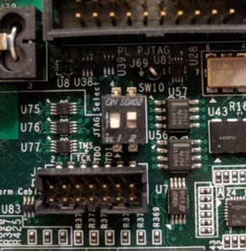

**SW11**

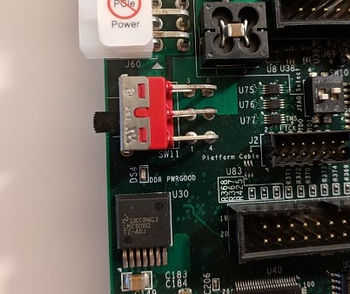

**SW12**

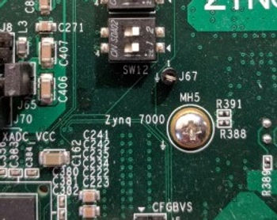

**SW15**

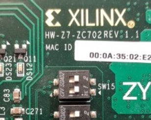

**SW16** (BIST is in Quad SPI, set of Quad SPI)

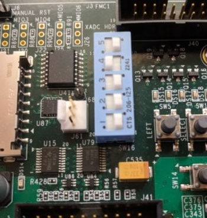

**<u>Default Jumper Settings</u>**

**J5**

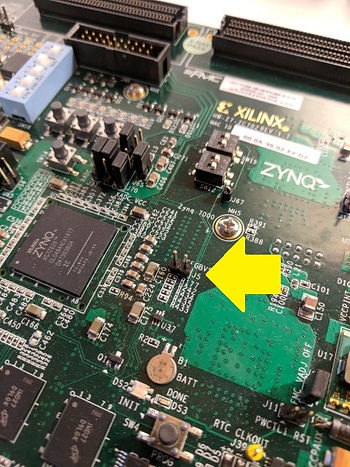

**J6**

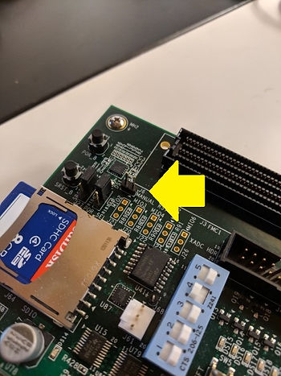

**J7**

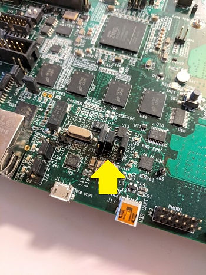

**J8**

**J9**

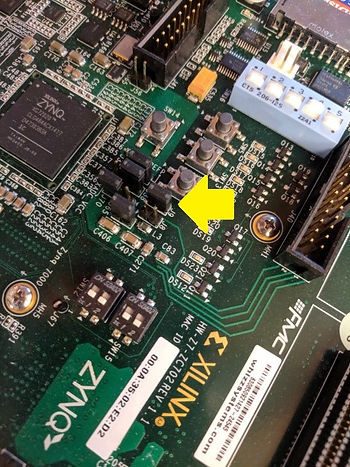

**J10**

**J11**

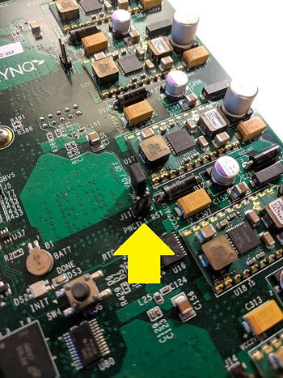

**J12**

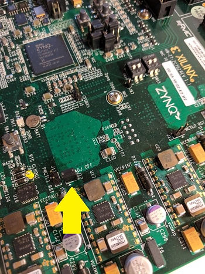

**J13**

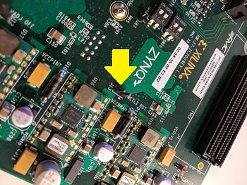

**J14**

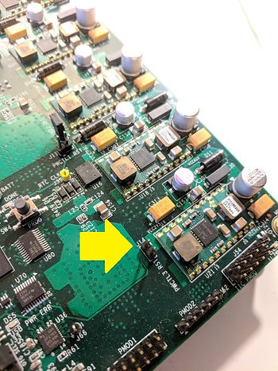

**J15**

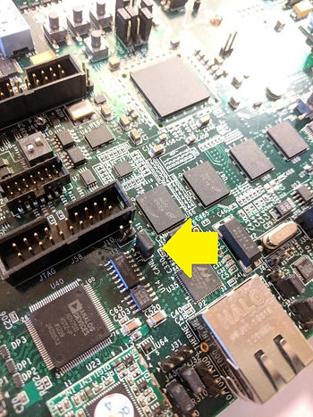

**J27**

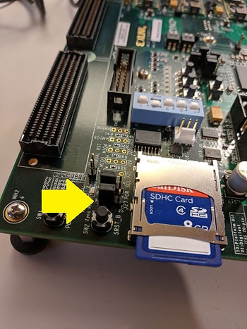

**J28**

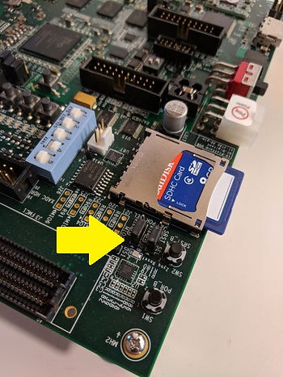

**J30**

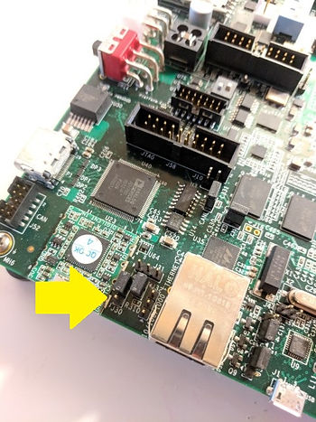

**J31**

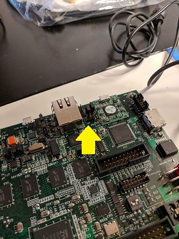

**J32**

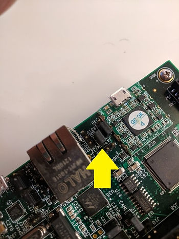

**J33**

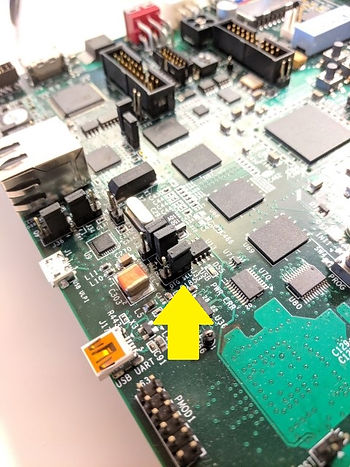

**J34**

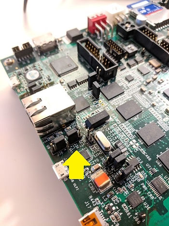

**J35**

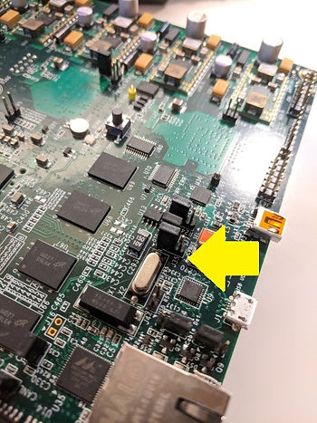

**J36**

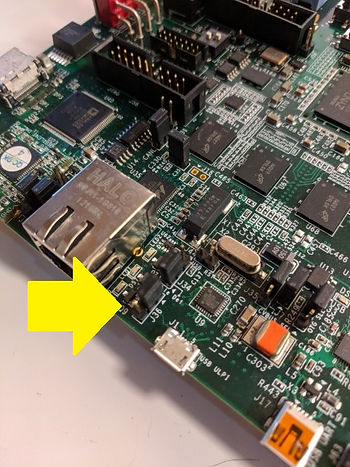

**J37**

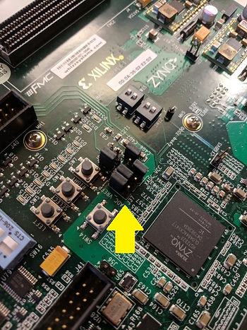

**J38**

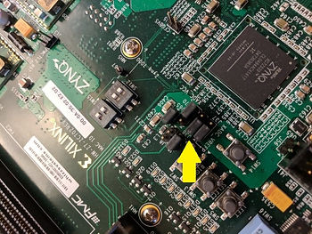

**J43**

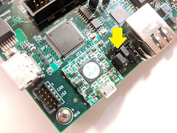

**J44**

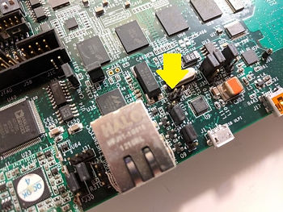

**J53**

**J56**

**J65**

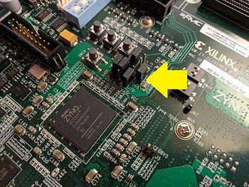

**J70**

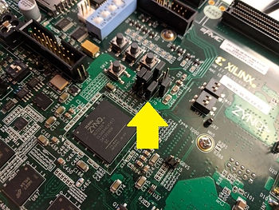

**<u>References</u>**

-   <u>Zynq-7000 All Programmable SoC:ZC702 Evaluation Kit and Video and Imaging Kit (Vivado Design Suite 2013.3)</u> at \[[<u>link</u>](https://www.xilinx.com/support/documentation/boards_and_kits/zc702_zvik/2013_4/UG926_Z7_ZC702_Eval_Kit.pdf)\]
    
-   Xilinx logo found via [<u>https://twitter.com/xilinxinc</u>](https://twitter.com/xilinxinc) at \[[<u>link</u>](https://pbs.twimg.com/profile_images/535545777020338176/pEWdIYq__400x400.png)\]