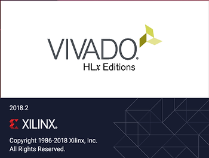
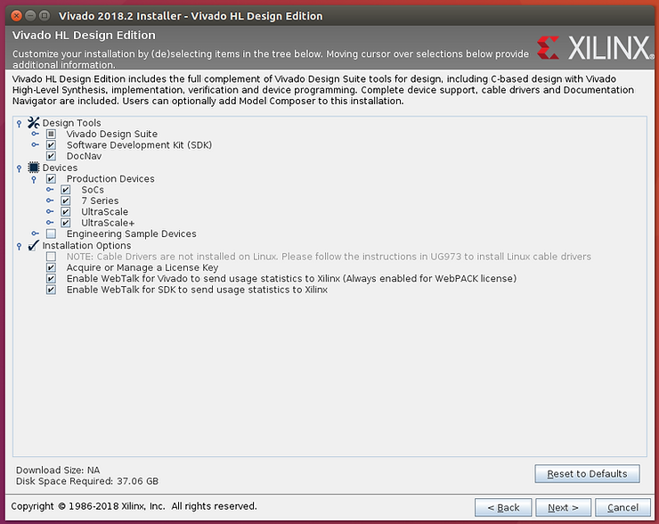
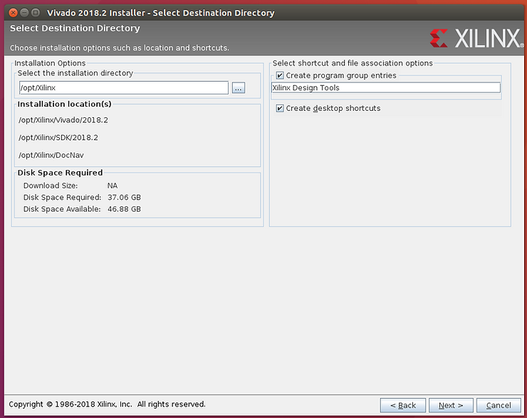
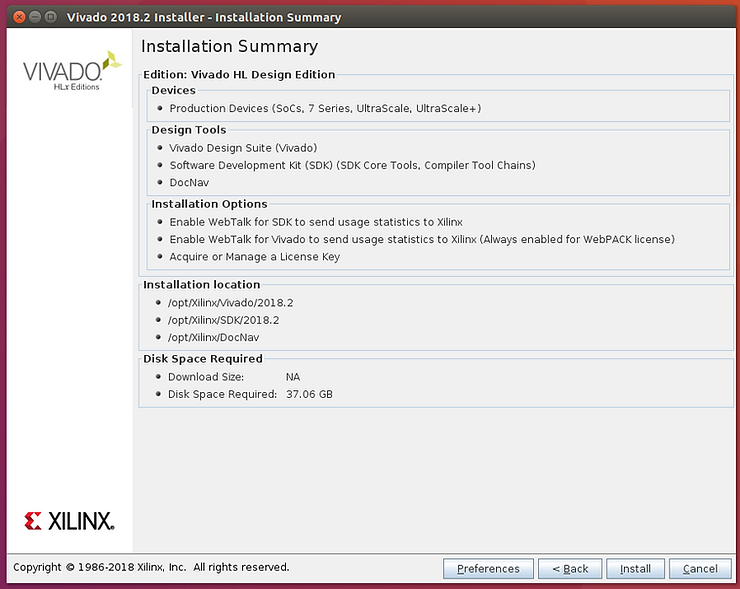
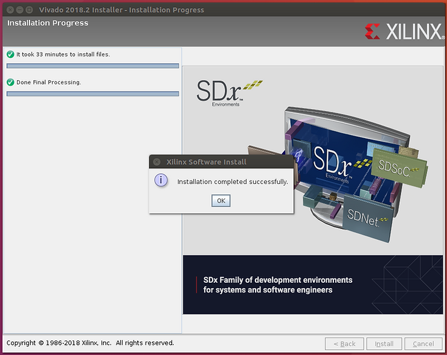
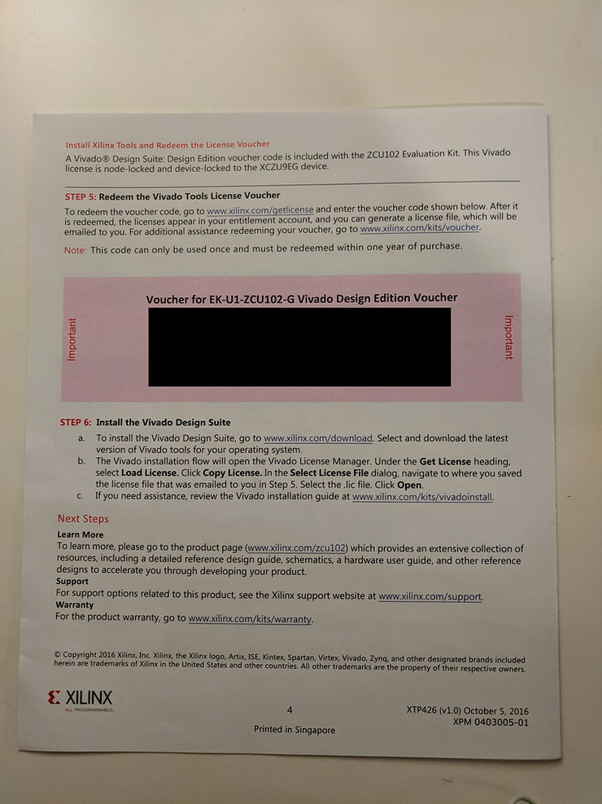
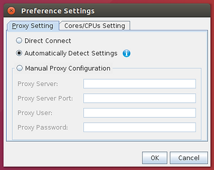
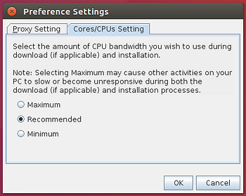

# ZCU102 Development Using 2018.2 on a Linux VM Running on Windows: Part 1

This post is part 1 of a series that contains everything you need to develop software for the ZCU102 using a Linux VM running on Windows 7.

Part 1 Covers:

-   The steps for installing an Ubuntu 16.04.3 ISO on a Oracle VirualBox VM and
    
-   Installing Xilinx Vivado 2018.2
    

Part 2 @ \[[<u>link</u>](https://www.centennialsoftwaresolutions.com/blog/zcu102-development-using-2018-2-on-a-linux-vm-running-on-windows-part-2)\] Covers:

-   Installing PetaLinux 2018.2 onto the Ubuntu 16.04.3 VM,
    
-   Building a custom image for the ZCU102's A53 cores and
    
-   Running the image on to the board over JTAG
    

**Versions Used**

-   VirtualBox Version 5.2.12 r122591 (Qt5.6.2)
    
-   Machine and Windows version used at \[[<u>link</u>](http://www.zachpfeffer.com/single-post/2017/01/28/New-T460-System-Information)\]
    

**Before You Start**

-   Click \[[<u>here</u>](http://www.zachpfeffer.com/single-post/ZCU102-Unboxing)\] to ensure you have all of the hardware included in the ZCU102 kit.
    
-   Click \[[<u>here</u>](http://www.zachpfeffer.com/single-post/ZCU102-Evaluation-Kit-Quick-Start-Guide-Walkthrough)\] to make sure the hardware is okay by running the Built-In Self Test (BIST)
    
-   Click \[[<u>here</u>](http://www.zachpfeffer.com/single-post/Xilinx-20182-Software-Tool-Installation-Overview-and-Assessment)\] for an overview of the Xilinx 2018.2: size of components, links, etc. Some of these details are listed below as well.
    

**Create and Configure the VM**

1\. Create an Ubuntu 16.04.3 virtual machine in VirtualBox with 5 GB (5120 MB) or RAM and 100 GB of disk (see Note 1 about sizing below - you'll need 15 GB, use a dynamically allocated VMDK).

-   Follow the instructions at \[[<u>link</u>](http://www.zachpfeffer.com/single-post/2017/02/15/Installing-the-64-bit-PC-AMD64-desktop-image-of-Ubuntu-16041-LTS-Xenial-Xerus-in-Oracle-VM-VirtualBox-5114-running-in-Windows-7-Professional-Service-Pack-1-CurrentBuild-7601-on-a-ThinkPad-T460-model-20FNCTO1WW-with-an-IntelR-CoreTM-i7-6600U-CPU)\], but use a Ubuntu 16.04.3 ISO (1.5 GB) at \[[<u>link</u>](http://old-releases.ubuntu.com/releases/16.04.3/ubuntu-16.04.3-desktop-amd64.iso)\].
    
-   Install Guest Additions using instructions at \[[<u>link</u>](https://www.centennialsoftwaresolutions.com/blog/enable-copy-paste-between-windows-7-and-ubuntu-16-04-3-on-oracle-vm-virtualbox)\].
    
-   Use the name **project-ubuntu-16.04.3-desktop-amd64-5GB-RAM-100GB-Disk** for the VM.
    

2\. Boot the VM and type **sudo apt-get update** then type **sudo apt-get install python3 dos2unix iproute2 gawk xvfb git make net-tools libncurses5-dev tftpd lib32z1 libssl-dev flex bison libselinux1 gnupg wget diffstat chrpath socat xterm autoconf libtool tar unzip texinfo zlib1g-dev gcc-multilib build-essential libsdl1.2-dev libglib2.0-dev libsdl-dev build-essential gcc-multilib glib2.0 automake screen pax gzip libtool-bin zlib1g:i386**

-   This step downloads an additional 237 MB (after the downloads from the Guest Addition step above).
    

3\. Type **sudo apt-get install vim cscope**

**Install Google Chrome on Ubuntu VM**

1\. In Ubuntu, install Google Chrome by launching **Firefox**, browsing to [<u>chrome.google.com</u>](http://chrome.google.com/), clicking **DOWNLOAD CHROME** and selecting **64 bit .deb (For Debian/Ubuntu)**.

2\. Leave **Open with Software Install (default)** selected and click the **OK** button.

3\. When the **Ubuntu Software** window pops up click the **Install** button.

**Disable Screen Off When Inactive in Ubuntu**

1\. Click **Settings > Brightness & Lock**

2\. Set **Turn screen off when inactive for:** to Never

3\. Close the Brightness & Lock window

**Get the Components**

**Note**: You'll need to accept the U.S. Government Export Approval terms using your log in to download the components.

1\. Type **cd**

2\. Type **mkdir ~/xpkgs** (download the components to ~/xpkgs)

3\. Download Vivado 2018.2 (17.1 GB) at \[[<u>link</u>](https://www.xilinx.com/member/forms/download/xef.html?filename=Xilinx_Vivado_SDK_2018.2_0614_1954.tar.gz)\]. Vivado 2018.2 also contains the SDK.

4\. Download PetaLinux Tools 2018.2 (6.15 GB) at \[[<u>link</u>](https://www.xilinx.com/member/forms/download/xef.html?filename=petalinux-v2018.2-final-installer.run)\].

5\. Download the ZCU102 BSP (prod-silicon) (599.59 MB) at \[[<u>link</u>](https://www.xilinx.com/member/forms/download/xef.html?filename=xilinx-zcu102-v2018.2-final.bsp)\].

**Prepare an Install Directory**

**Note:** the steps prepare a directory that all users can read, write and execute. See \[[<u>link</u>](https://www.g-loaded.eu/2005/11/08/the-use-of-the-uppercase-x-in-chmod/)\] for what the capital **X** means.

1\. In the terminal type **sudo mkdir -p /opt/Xilinx**

2\. In the terminal type **sudo chmod -R a+rwX /opt/Xilinx**

**Install Vivado and the SDK**

**Note:** the **tar -xvzf** step (2.) took my VM about 5 min to execute. The expanded directory from the tar.gz file is 18G. Recall that this file is 17.1 Gcd XiB. After the **tar -xvzf** command runs, the original 17.1 GB file will still present. This means you need 2x the space to work with the installation files.

**Note:** this info is not in the "2018.2 Vivado Design Suite User Guide: Release Notes, Installation, and Licensing" guide.

1\. Type **cd ~/xpkgs**

2\. Type **tar -xvzf Xilinx\_Vivado\_SDK\_2018.2\_0614\_1954.tar.gz**

3\. Type **cd Xilinx\_Vivado\_SDK\_2018.2\_0614\_1954**

4\. Type **./xsetup**

You'll see the following:

...then:

**Note:** I have no idea what additional library is required when installing on Ubuntu 16.04.3 LTS: 64-bit. This information is not given in the 2018.2 Vivado Design Suite User Guide: Release Notes, Installation, and Licensing.

5\. Click **Next >** on the **Vivado 2018.2 Installer - Welcome** screen.

6\. Click all 3 of the **I Agree** boxes and click **Next >** on the **Vivado 2018.2 Installer - Accept License Agreements** screen.

7\. Click the **Vivado HL Design Edition** radio button and click **Next >** on the **Vivado 2018.2 Installer - Select Edition to Install** screen (see Note 4 for adding additional tools and devices after installing)

8\. Accept the defaults on the **Vivado 2018.2 Installer - Vivado HL Design Edition** screen and click **Next >**.

9\. Accept the defaults on the **Vivado 2018.2 Installer - Select Destination Directory** screen and click **Next >**.

10\. Click **Install** on the **Vivado 2018.2 Installer - Installation Summary** screen.

11\. At the end you'll see a pop up that says: Installation completed successfully. Click **Ok**.

**Licensing**

There is a node-locked and a XCZU9EG device-locked Vivado Design Suite: Design Edition voucher code included with the ZCU102 Evaluation Kit. The license appears to work up until 2018.06 (the Version Limit). This implies it will work for the 2018.3 and 2018.4 releases.

There are some tips on installing an evaluation license at \[[<u>link</u>](http://www.zachpfeffer.com/single-post/Installing-20174-Vivado-and-SDK-on-Linux)\].

**Remove Vivado Installation Files**

The Vivado installation files consume 36 GB. To erase them:

1\. Type **cd ~/xpkgs/**

2\. Type **rm Xilinx\_Vivado\_SDK\_2018.2\_0614\_1954.tar.gz**

3\. Type **rm -rf Xilinx\_Vivado\_SDK\_2018.2\_0614\_1954/**

**<u>Notes</u>**

1\. Re: sizing the VM

The ZCU102 contains an Zynq UltraScale XCZU9EG-2FFVB1156 (info from \[[<u>link</u>](https://www.xilinx.com/products/boards-and-kits/ek-u1-zcu102-g.html#hardware)\]). From \[[<u>link</u>](http://www.zachpfeffer.com/single-post/Xilinx-20182-Software-Tool-Installation-Overview-and-Assessment)\] Vivado will typically use 10 GB of RAM and a maximum of 15 GB of RAM. I've sized my instance at 5 GB since I only have 12 GB of total system RAM. Things will work with 5 GB, but will be slow.

2\. Supported operating systems for Vivado 2018.2 are:

\- Windows 7.1: 64-bit

\- Windows 10 Professional versions 1709 and 1803: 64-bit

\- Red Hat Enterprise Linux 6.6-6.9: 64-bit

\- Red Hat Enterprise Linux 7.2-7.4: 64-bit

\- CentOS Linux 6.6-6.9: 64-bit

\- CentOS Linux 7.2-7.4: 64-bit

\- SUSE Enterprise Linux 11.4: 64-bit

\- SUSE Enterprise Linux 12.3: 64-bit

\- Ubuntu Linux 16.04.3 LTS: 64-bit - **Additional library installation required**

According to the 2018.2 SDK documentation at \[[<u>link</u>](https://www.xilinx.com/html_docs/xilinx2018_2/SDK_Doc/index.html)\] under **Getting Started with Xilinx SDK** > **System Requirements** at \[[<u>link</u>](https://www.xilinx.com/html_docs/xilinx2018_2/SDK_Doc/xsct/intro/xsct_system_requirements.html)\] the supported OS's are:

-   Windows 7 **SP1**: 64-bit
    
-   **Windows 8.1: 64-bit**
    
-   Windows 10 Pro: 64-bit
    
-   Red Hat Enterprise Linux 6.6-6.9: 64-bit
    
    -   Red Hat Enterprise Linux 7.0-7.1: 64-bit
    
-   CentOS Linux 6.7-6.8: 64-bit
    
    -   CentOS Linux 7.2-7.**3**: 64-bit
    
-   SUSE Linux Enterprise 11.4: 64-bit
    
    -   SUSE Linux Enterprise 12.**2**: 64-bit
    
-   Ubuntu Linux 16.04.**2** LTS: 64-bit
    

And PetaLinux Tools 2018.2 at \[[<u>link</u>](https://www.xilinx.com/support/documentation/sw_manuals/xilinx2018_2/ug1144-petalinux-tools-reference-guide.pdf)\] is supported on:

-   Red Hat Enterprise Workstation/Server 7.2-7.4: 64-bit
    
-   CentOS 7.2, 7.3, 7.4: 64-bit
    
-   Ubuntu Linux 16.04.3: 64-bit
    

Here is the union of the OS's that the 2018.2 Vivado, SDK and PetaLinux Tools releases can run on as documented:

-   CentOS 7.3: 64-bit
    

3\. Clicking the Preferences button in the Vivado install brings up:

...and

4\. From page 31 of the Vivado Design Suite 2018.2 Release Notes

UG973 (v2018.2) July 23, 2018:

_Adding Additional Tools and Devices_

_You can incrementally add additional tools, devices or even upgrade Vivado editions_

_post-install. This is useful for users that have chosen to install a subset of devices and/or_

_tools._

_To add new tools or devices:_

_Launch_ **_Vivado > Help > Add Design Tools or Devices_**_._

_If you have installed the Vivado WebPACK or Design Edition, you are presented with the_

_option to upgrade the edition._

**<u>References</u>**

-   2018.2 Vivado Downloads Page at \[[<u>link</u>](https://www.xilinx.com/support/download/index.html/content/xilinx/en/downloadNav/vivado-design-tools/2018-2.html)\]
    
-   UG973 2018.2 Vivado Design Suite User Guide: Release Notes, Installation, and Licensing at \[[<u>link</u>](https://www.xilinx.com/support/documentation/sw_manuals/xilinx2018_2/ug973-vivado-release-notes-install-license.pdf)\]
    
-   Xilinx logo found via [<u>https://twitter.com/xilinxinc</u>](https://twitter.com/xilinxinc) at \[[<u>link</u>](https://pbs.twimg.com/profile_images/535545777020338176/pEWdIYq__400x400.png)\]