# ZCU102 Evaluation Kit Quick Start Guide Walkthrough

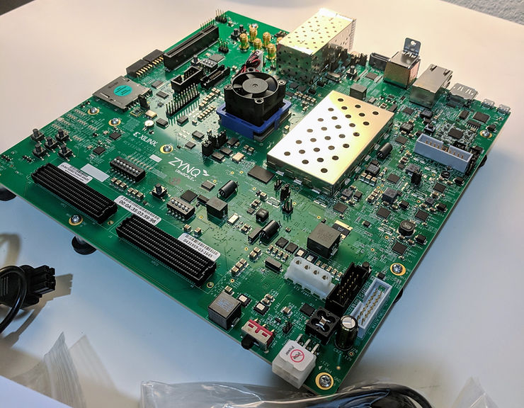

This post walks through the **Zynq UltraScale+ MPSoC ZCU102 Evaluation Kit** Quick Start Guide. It also contains videos of power on and re-running BIST.

Looking for help build software for Xilinx SoCs? Email [inquiries@centennialsoftwaresolutions.com](mailto:inquiries@centennialsoftwaresolutions.com?subject=I'm+looking+for+a+30-min+consult+on+building+software+for+Xilinx+SoCs+for+$99.00) **today** to schedule a 30-min consult for $99.00.

**STEP 1:** **Set Configuration Switches**

Set mode switch SW6 to QSPI32.

SW6 is here:

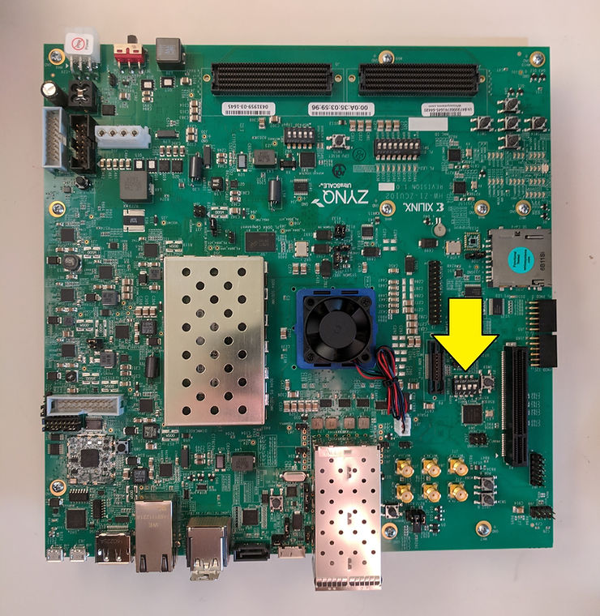

Set QSPI32 boot by switching the following pins on SW6:

-   Switch "**1**" towards the label: ON C&K SDA04
    
-   Switch "**2**" away from the label: ON C&K SDA04
    
-   Switch "**3**" towards the label: ON C&K SDA04
    
-   Switch "**4**" towards the label: ON C&K SDA04
    

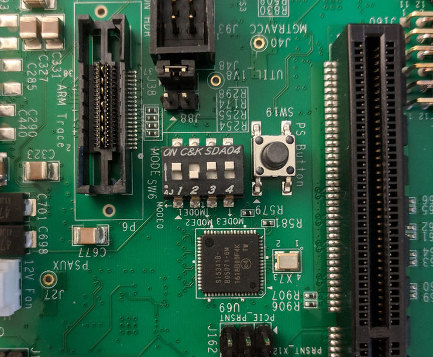

SW6 with labels and a schematic overlay:

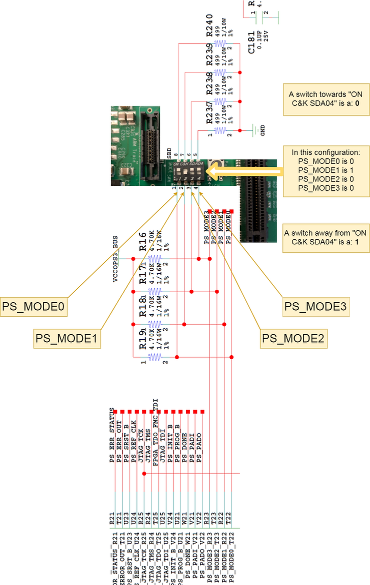

**STEP 2:** **Connect Power**

Plug the power supply into a power outlet with one of the included power cords.

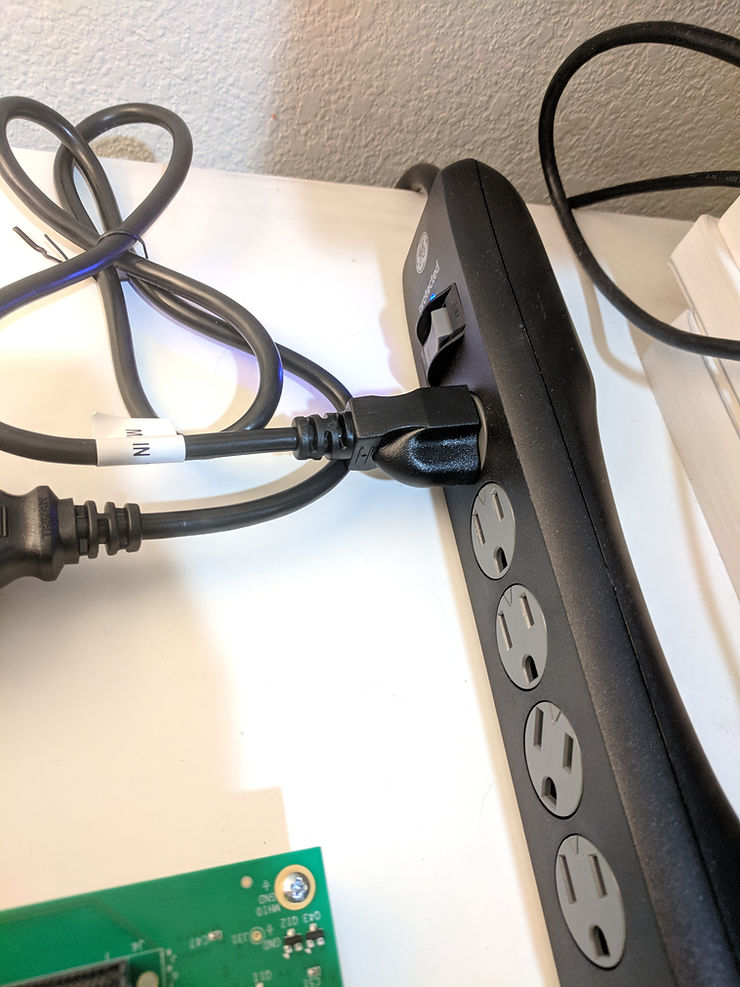

Connect the 6-pin power supply plug to J52.

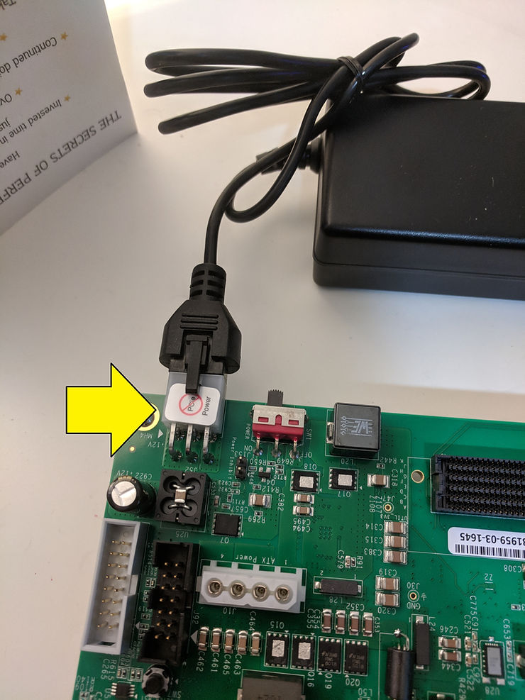

Turn on the board power with the SW1 slide switch.

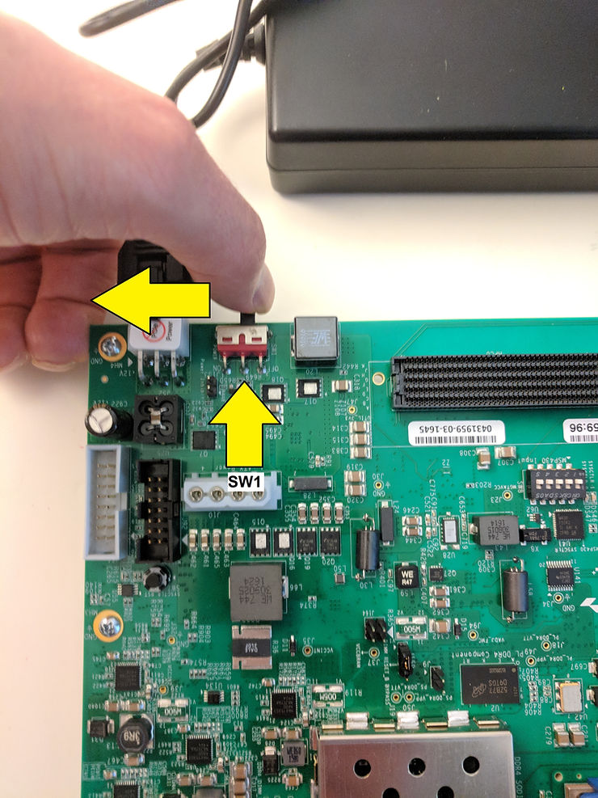

If the three rows of Power Good LEDs glow green, the power system is good.

If the DONE LED circled here glows green, the Zynq UltraScale+ device has configured successfully.

All the rails and the power tree

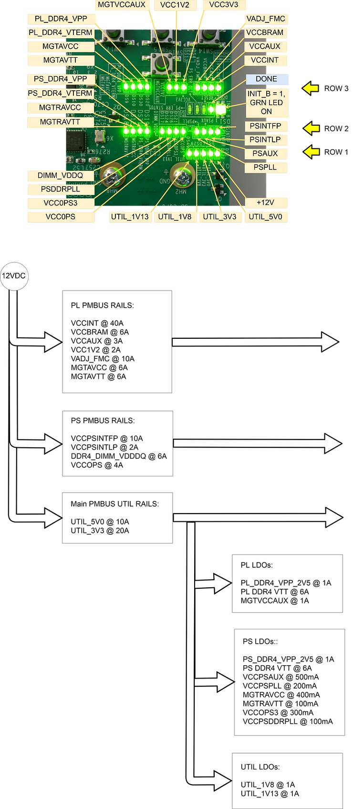

**STEP 3:** **Initialize Configuration**

The built-in self-test (BIST) automatically runs when booting from QSPI32.

A video of power on:

(video_unavalible)

Press SW4 to run the BIST again:

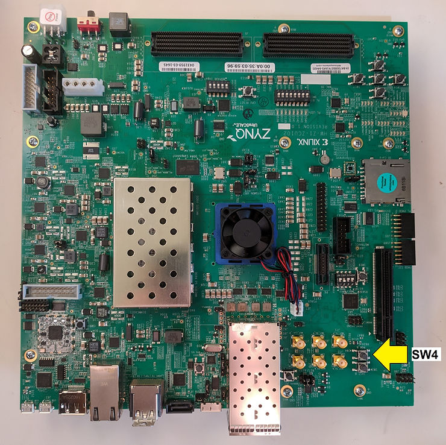

BIST running after boot (note the LEDs turning on right to left):

(video_unavalible)

**STEP 4:** **Run the Built-In Self-Test**

Pushing SW4 runs BIST. The following tests are automatically run:

-   Clock
    
-   BRAM
    
-   PL-DDR4
    
-   PS-DDR4
    
-   Flash
    
-   I2C
    

The test turns on its LED if it passes.

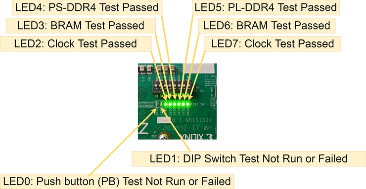

After the Clock, BRAM, PL-DDR4, PS-DDR4, Flash and I2C tests are run BIST waits for user input to run:

-   DIP
    
-   PB (push button)
    

BIST indicates the wait by flashing an LED that corresponds with the specific test.

Run the DIP switch test by flipping all the switches towards the label "ON C&K S D A0 8" then flipping them back.

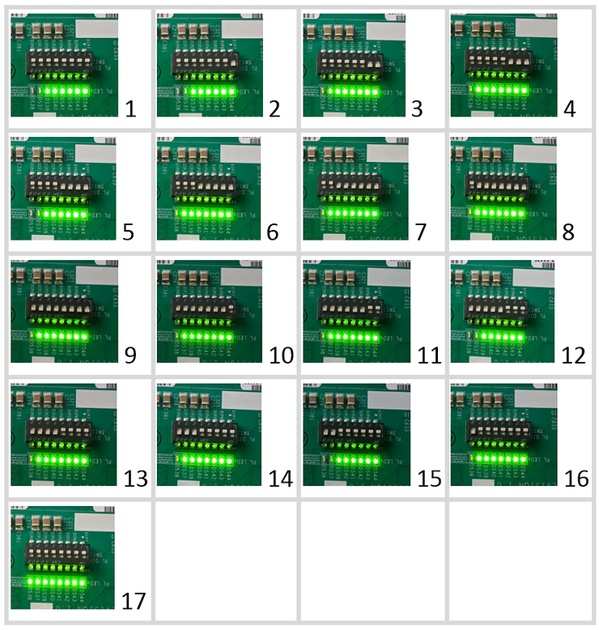

Run the push button (PB) test by pressing the N S E W buttons in any order followed by the middle button. The middle button must be pressed last.

Running the DIP switch test and the push button (PB) test:

(video_unavailable)

TBD: find out what the BIST tests actually do.

**Reference**

-   Zynq UltraScale+ MPSoC ZCU102 Evaluation Kit Quick Start Guide at \[[link](http://www.xilinx.com/support/documentation/boards_and_kits/zcu102/xtp426-zcu102-quickstart.pdf)\]
    
-   ZCU102 schematic and other docs at \[[link](http://www.xilinx.com/products/boards-and-kits/ek-u1-zcu102-g.html#documentation)\]