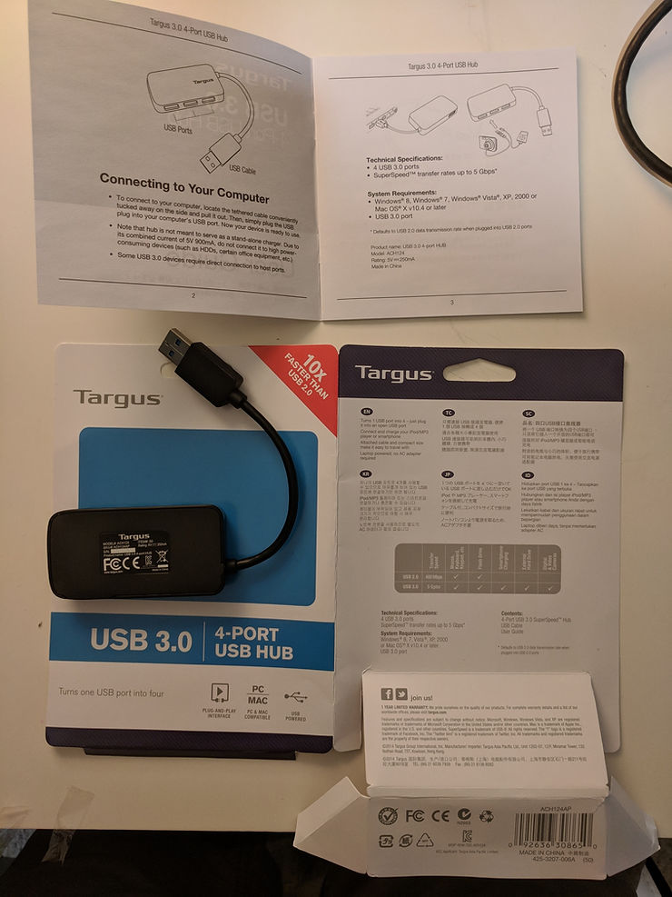

# ZCU102 Unboxing

This post shows an unboxing of the Zynq UltraScale+ MPSoC ZCU102 Evaluation Kit that contains the HW-Z1-ZCU102 Evaluation Board with a XCZU9EG-FFVB1156 Zynq UltraScale+ MPSoC.

**Contents**

The Zynq UltraSCALE+ Box

The Zynq UltraScale+ MPSoC ZCU102 Evaluation Kit **Quick Start Guide**

**Note**: On the box UltraScale+ is shown as UltraSCALE+, SCALE is in all caps. But in the Quick Start Guide its listed as UltraScale+, Scale is not in all caps.

Inside the **Quick Start Guide**

**Note**: there is a page on the back, that directs the user to download and install Vivado and gives them a voucher.

The Rev03 ZCU102 Board in a Static Bag

The Electrostatic Bag Sticker

The ZCU102

A Free Dongle

A card to get a free dongle for the Xilinx PowerTool. Here's the \[[link](http://www.maximintegrated.com/en/products/all-products/campaigns/xfest-14/a-powerful-combination/maxpowertool002-discount.html)\] listed on the package.

USB Hub

A Targus, Product name: USB 3.0 4-port HUB, MODEL#: ACH124. Link to buy @ Targus \[[link](http://www.targus.com/us/usb-30-4-port-hub)\]. Link to buy at Amazon \[[link](http://www.amazon.com/Targus-4-Port-USB-3-0-ACH124US/dp/B00P937GQ4)\].

**Note**: This hub does not say it supports Linux.

Ethernet USB 2.0 Cables

The HUB again.

6ft E189529 AWM 2835 24 AWG 60°C CAT.5e STP Cable. Here's a \[[link](http://www.makeuseof.com/tag/everything-you-need-to-know-about-ethernet-cables/)\] that describes **Everything You Need to Know About Ethernet Cables**.

2x Type A-MALE to Micro USB AB with markings E238846 AWM 2725 80°C 30V VW-1 28 AWG/IP AND 28 AWG/2C HIGH SPEED USB 2.0 CABLE CHINGLUNG

USB 3.0 and SD Card

A 6" AZCBL-USB-16001 Micro USB 3.0 Male to USB-A Female Cable

A SanDisk Ultra 48 MB/s Class 10 16 GB SD HCI SD Card

Power Supplies and Cabling

_Power Supply_

A L.T.E. LI TONE ELECTRONICS CO., LTD.

ITE ADAPTOR

MODEL: LTE66ES-S2-1

INPUT: 100-240V 50/60 Hz, 2A

OUTPUT: 12V 5A MAX: 60W

LISTED 35A9 E246759

_"US Plug" Power Supply Adapter_

SHEE LINE, SL-2, E99157, 10A 125V AC **male US plug** +

3' (UL) E88265 SVT 105°C 3x18AWG (0.824 mm²) 300V VW-1 I-SHEG CSA LL81924 **cable** +

SL-3 10A 125V AC SHEE LINE E9915 **female power supply plug**

_"European Plug" Power Supply Adapter_

CHIAO LIN 16A 250V AC CL-102 **male European plug** +

4' I-SHENG VDE KEMA-KEUR IEMMEQU HO5VV-F 3G 0.75 mm² 260227 IEC 53 3AZSL/75 4V-75 (75°C) 250/440V ORDINARY DUTY Q88228 **cable** +

CHIAO LIN CL-105 N/13314 10A 250v AC **power supply plug**

Approx: a "European 3 pin plug CEE7 Schuko to IEC 60320-C13" available from Amazon at \[[link](http://www.amazon.com/SF-Cable-European-Power-IEC320/dp/B006VZI686)\]

_"UK" Power Supply Adapter_

PHINO FUSED KM69214 BS1363/A PHP-330 **Indian plug** +

4' PHINO HO5VV-F 3G 0.75mm² VDE KEMA-KEUR IEMMEQU CEBEC GTSA-3 N18895 227 IEC 53 **cable** +

CHIAO LIN CL-105 N/13314 10A 250v AC **power supply plug**

Approx: a "Cable-Tex UK Plug to IEC Kettle Lead 2m Power Cord Cable PC Mains" available from Amazon at \[[link](http://www.amazon.com/Cable-Tex-Kettle-Power-Cable-Mains/dp/B003U798T4)\]

**References**

-   ZCU102 schematic and other docs at \[[link](http://www.xilinx.com/products/boards-and-kits/ek-u1-zcu102-g.html#documentation)\] cached version of the schematic at \[[link](http://drive.google.com/open?id=1Jdu4SXFbtDaOKSL-RcVfxy1TKh01E-Gh)\]
    
-   AC Power Plugs and Sockets Wikipedia \[[link](http://en.wikipedia.org/wiki/AC_power_plugs_and_sockets)\]
    

**Additional Info**

USB Connectors

The USB Type-A to Micro AB cables plug into J83 and J2:

The Micro USB 3.0 Cable plugs into J96:

Targus Packaging and Manual

