# Zynq-7000 + AXI Slave CDMA controller on a ZC702


This post lists step-by-step instructions for creating an AXI slave Central Data Management Access (CDMA) controller, integrating the slave into a Zynq-7000 system using Vivado, writing a driver that exercises the CDMA, and running everything on a ZC702. More commonly referred to as DMA, DMA's are useful for passing data between a CPU (in this case, the Processing System (PS)) and external peripherals. DMA allows the PS to be idle while transfers are happening, freeing up the PS to do other things, and access the data when it's convenient for the PS to do so. Use cases include reading/writing to memory, to a radio controller, HDMI, Serial Busses, etc.

As shown in the high-level diagram below, this design uses general-purpose AXI to interface the ARM A9 processor with the CDMA, and high-performance AXI to interface the CDMA with DDR memory on a ZC702 prototype board. Pseudo-random data is stored and read back in a two transaction CDMA transfer. The returned data is compared with the sent data to verify the CDMA transaction completed successfully.

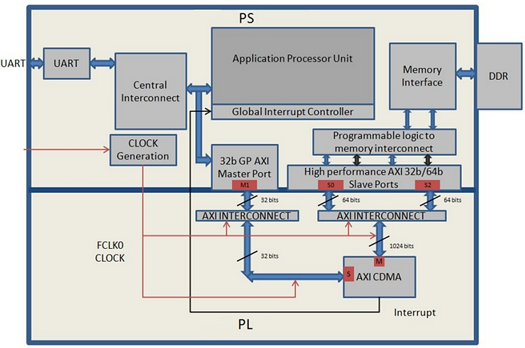

Credit: Xilinx

**<u><span>Versions Used</span></u>**

Xilinx Vivado 2018.2 & SDK 2018.2

ZC702 Rev 1.1

Windows 10 Professional v1909

**<u><span>Before you Start</span></u>**

Review the ZC702 JTAG and serial port set up instructions @ \[[link](https://www.centennialsoftwaresolutions.com/blog/set-up-the-jtag-and-serial-port-on-the-zc702)\]. These instructions are also reviewed below.

**<u><span>Contents</span></u>**

Part 1: Create the Vivado Project

Part 2: Create the Zynq-7000 in IP Integrator

Part 3: Create the CDMA AXI Slave and Concat IP blocks

Part 4: Connect the Interrupt Lines

Part 5: Configure the PS High Performance AXI buses

Part 6: Configure the CDMA

Part 7: Automate remaining connections

Part 8: Address configuration

Part 9: Create a Top-Level HDL Wrapper

Part 10: Synthesize and Generate the Bitstream

Part 11: Export the Design and Open the SDK

Part 12: Install the USB-to-UART Driver and Get the COM Assignment

Part 13: Configure the Board to Boot from JTAG, Connect it to the PC and Power it On

Part 14: Create the Test App and BSP

Part 15: Test Debug Run + Further Config

Part 16: Test the CDMA Module

**<u><span>Part 1: Create the Vivado Project</span></u>**

Step 1:

A: Press Start

B: Expand Xilinx Design Tools

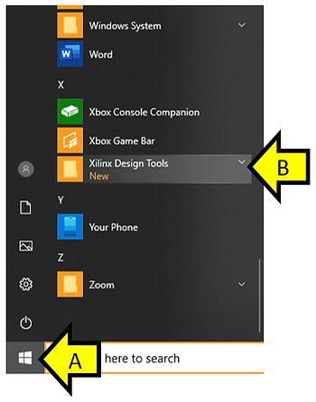

Step 2: Select Vivado 2018.2

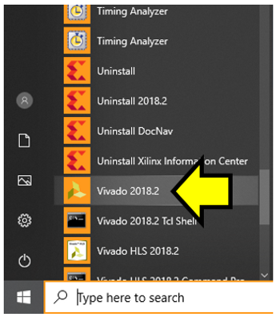

Step 3: Select **Create Project**

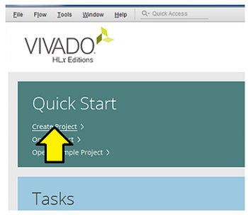

Step 4: Click Next

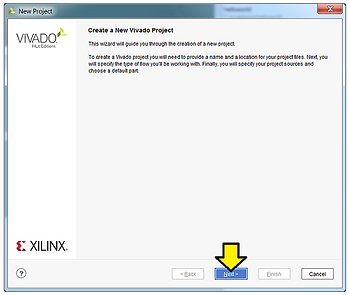

Step 5:

A: Set **Project name** to cdmaslave

B: Set **Project location** to C:/vivadoprjs (create C:/vivadoprjs if it doesn't exist)

C: Click the **Create project subdirectory** checkbox

D: Click **Next**

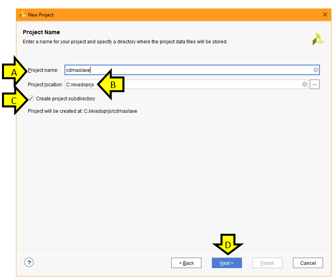

Step 6:

A. Select **RTL Project**

B. Check the **Do not specify sources at this time** check box

C. Click **Next**

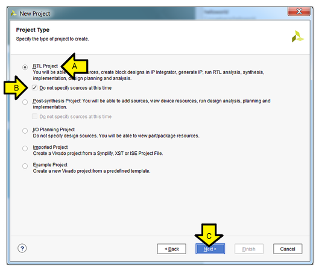

Step 7:

A. Click **Boards**

B. Type **ZC702**

C. Click on the **ZYNQ-7 ZC702 Evaluation Board** box

D. Click **Next**

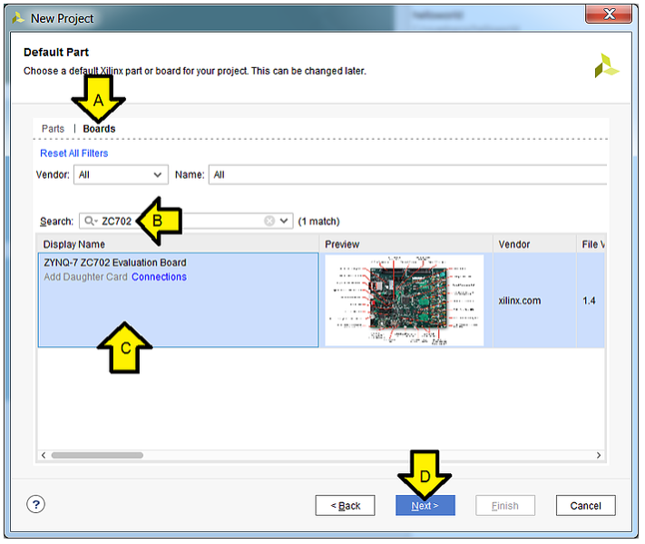

Step 8: Click **Finish**

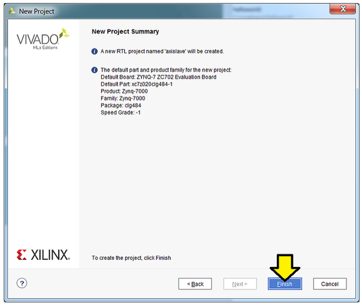

**<u><span>Part 2: Create the Zynq-7000 in IP Integrator</span></u>**

Step 1: Click **Create Block Design**

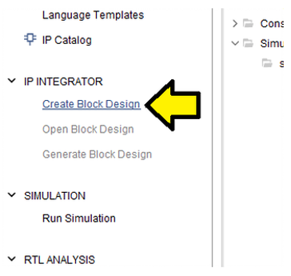

Step 2: Use defaults, click **OK**

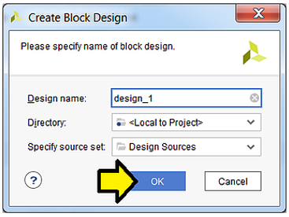

Step 3: Click **+**

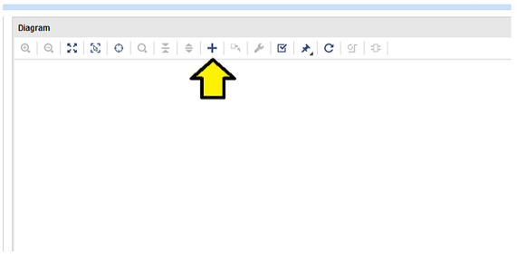

Step 4:

A. Type **Zynq**

B. Double-click on **ZYNQ7 Processing System**

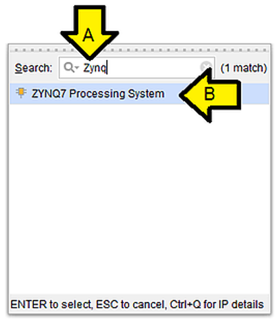

Step 5: Click **Run Block Automation**

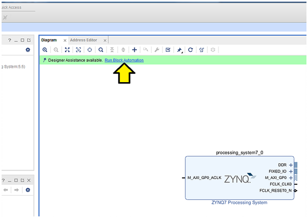

Step 6: Use defaults, click **OK**

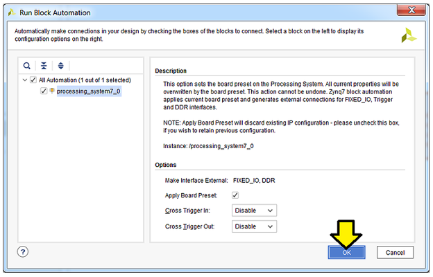

You should see:

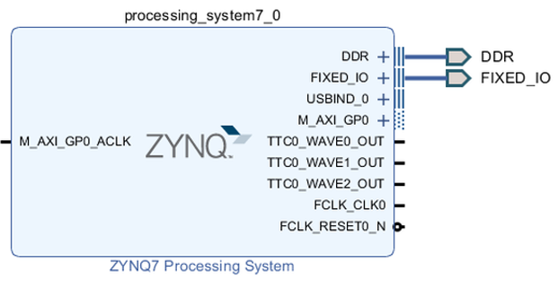

**<u><span>Part 3: Create the CDMA AXI Slave, Concat, and Timer IP blocks</span></u>**

Step 1: Click **+** again

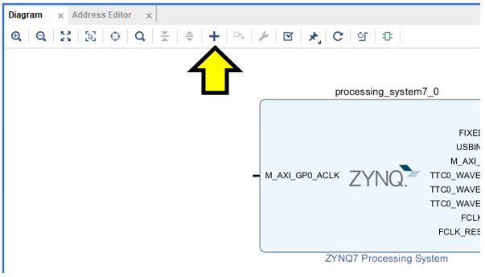

Step 2:

A. Type **CDMA**

B. Double-click on **AXI Central Direct Memory Access**

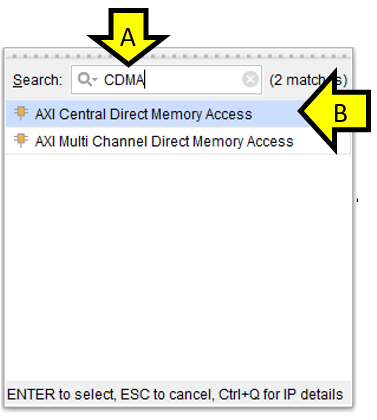

You should now see:

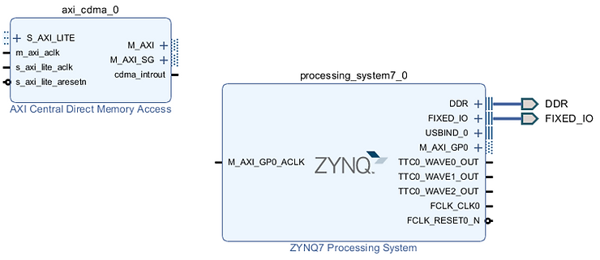

Step 3: Click **+** a third time

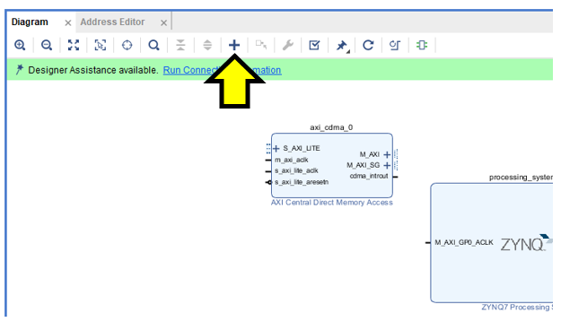

Step 4:

A. Type **concat**

B. Double-click on **Concat**

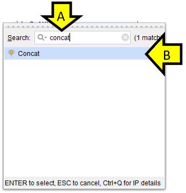

You should now see:

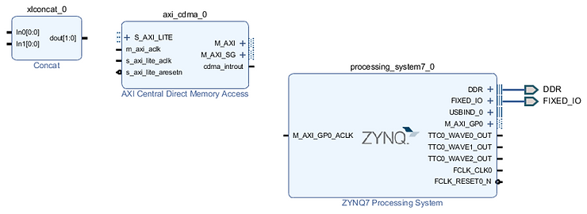

Step 5: Click **+** one final time

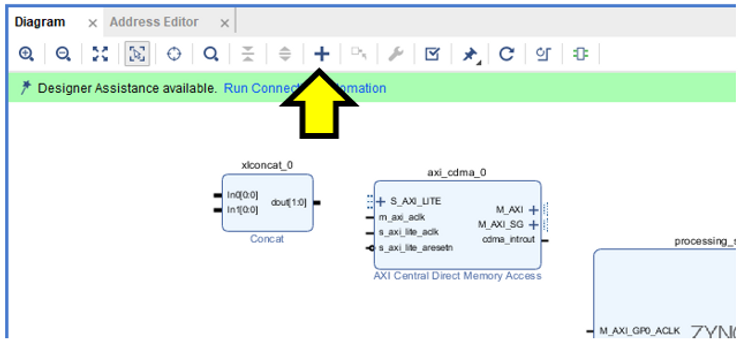

Step 6:

A. Type **timer**

B. Double-click on **AXI Timer**

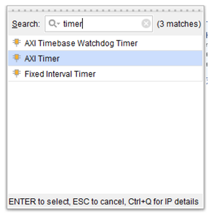

You should now see:

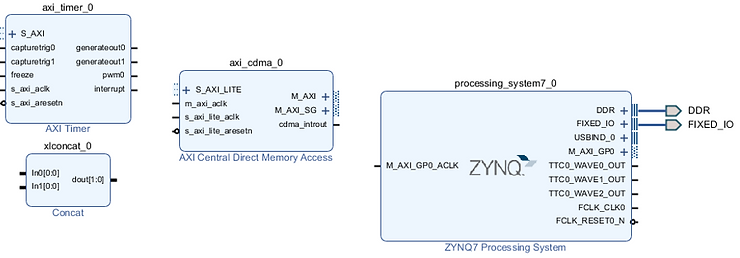

**<u><span>Part 4: Connect the Interrupt Lines</span></u>**

Step 1: Double click the ZYNQ block

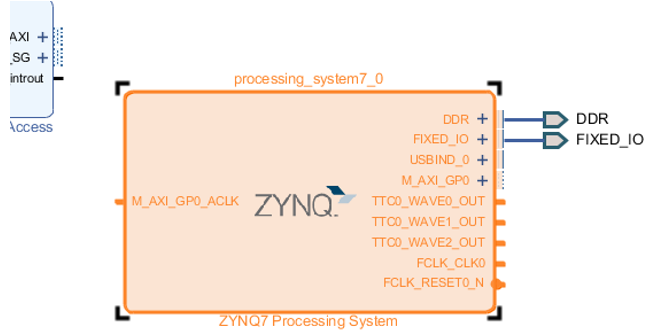

Step 2: Enable IRQ\_F2P\[15:0\]

A. Click **Interrupts**

B. Check the **Fabric Interrupts** checkbox

C. Expand the **Fabric Interrupts** drop-down

D. Expand the **PL-PS Interrupt Ports**

E. Check the **IRQ\_F2P\[15:0\] checkbox**

F. Click **OK**

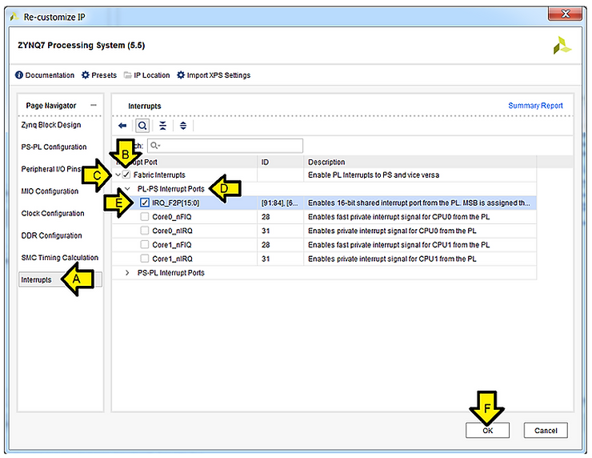

You should then see the IRQ\_F2P\[0:0\] port on Zynq:

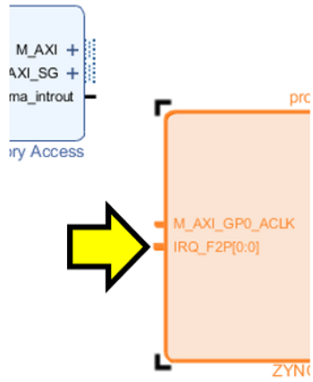

Step 3: Connect IRQ\_F2P\[0:0\] to xlconcat\_0 interrupt output

A: Click and hold mouse button on IRQ\_F2P\[0:0\]

B: Drag and release mouse button on xlconcat\_0 dout\[1:0\]

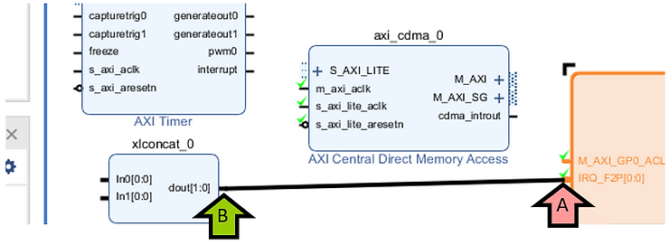

You should see:

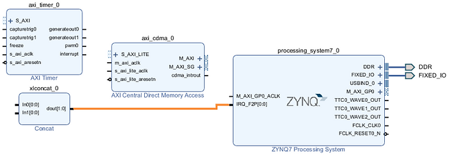

Step 4: Connect axi timer interrupt to concatenate block

A: Click and hold mouse button on axi\_timer\_0 interrupt

B: Drag and release mouse button on xlconcat\_0 In0\[0:0\]

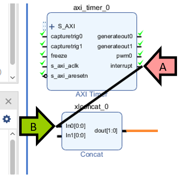

You should see:

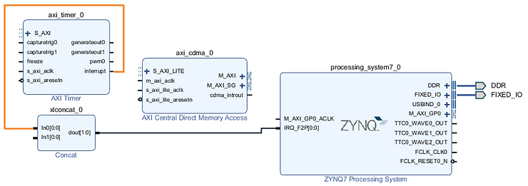

Step 5: Connect CDMA interrupt to concatenate block

A: Click and hold mouse button on axi\_cdma\_0 cdma\_introut

B: Drag and release mouse button on xlconcat\_0 In1\[0:0\]

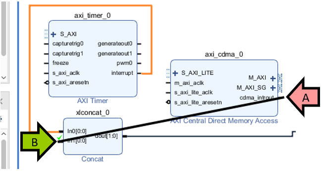

You should see:

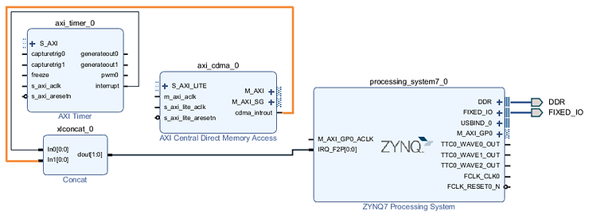

**<u><span>Part 5: Configure the PS High Performance AXI buses</span></u>**

Step 1: Double click the ZYNQ block

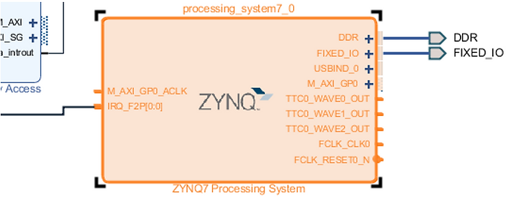

Step 2: Enable the High Performance AXI interfaces

A. Click **PS-PL Configuration**

B. Expand the **HP Slave AXI Interface** drop-down

C. Check the **S AXI HP0 Interface** checkbox

D. Check the **S AXI HP2 Interface** checkbox

E. Click **OK**

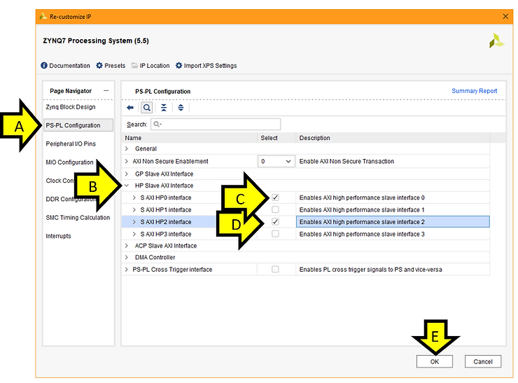

The PS7 should now look like this:

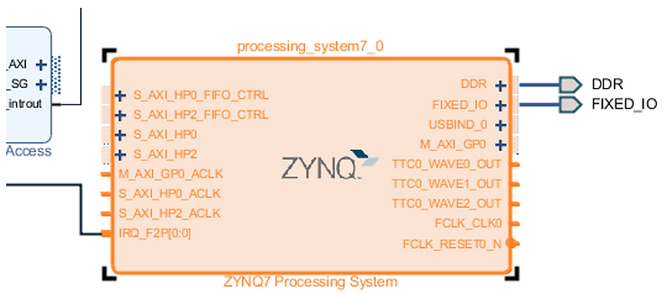

**<u><span>Part 6: Configure the CDMA</span></u>**

Step 1: Double click the CDMA

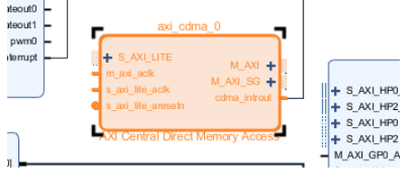

Step 2: Configure the CDMA

A: Uncheck **Enable Scatter Gather**

B: Set **Write/Read Data Width** to 1024

C: Set **Write/Read Burst Size** to 32

D: Click **OK**.

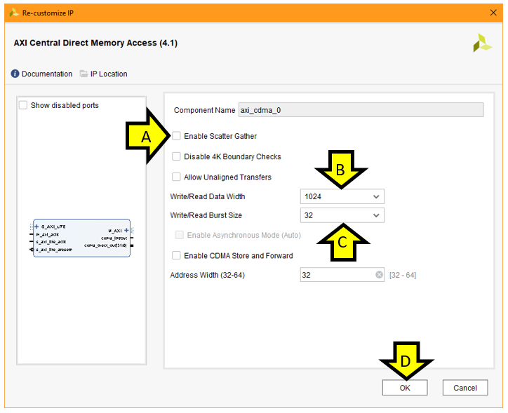

The CDMA IP block should now look like this:

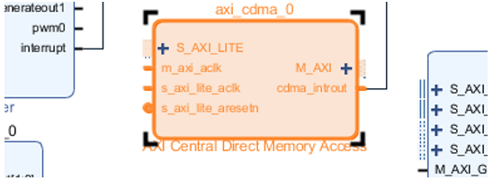

**<u><span>Part 7: Automate remaining connections</span></u>**

Step 1: Click **Run Connection Automation**

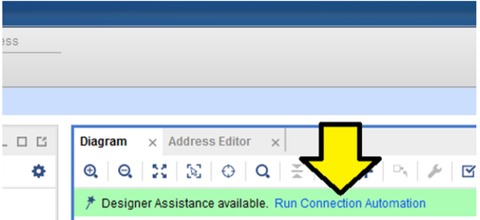

The completed diagram should now look as follows:

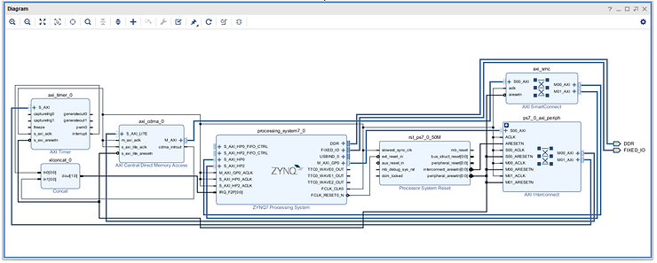

Step 2: Click **OK** to close the Critical Message. We will correct the address mapping in the next section.

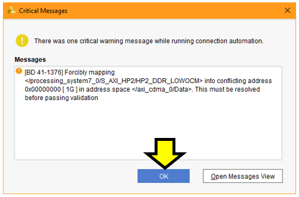

**<u><span>Part 8: Address configuration</span></u>**

Step 1: Select the **Address Editor** tab


Step 2: Adjust the high performance addresses

A: Expand **axi\_cdma\_0**

B: Expand **Data**

C: Adjust S\_AXI\_HP0 Offset Address to **0x2000\_0000**

D: Set S\_AXI\_HP0 Range to **256M**

E: Adjust S\_AXI\_HP2 Offset Address to **0x3000\_0000**

F: Set S\_AXI\_HP2 Range to **256M**

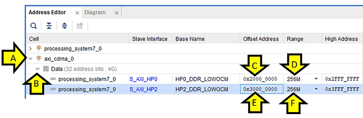

**<u><span>Part 9: Create a Top-Level HDL Wrapper</span></u>**

A. Click **Sources**

B. Right-click **design\_1 (design\_1.bd) (1)**

C. Click **Create HDL Wrapper...**

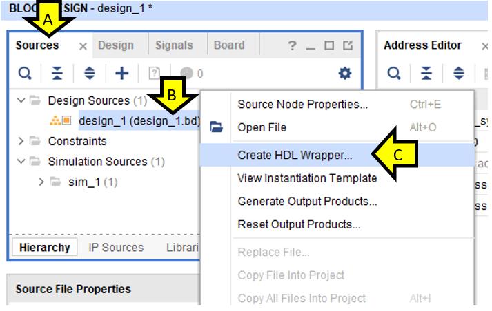

D. Leave Let Vivado manage wrapper and auto-update, click **OK**

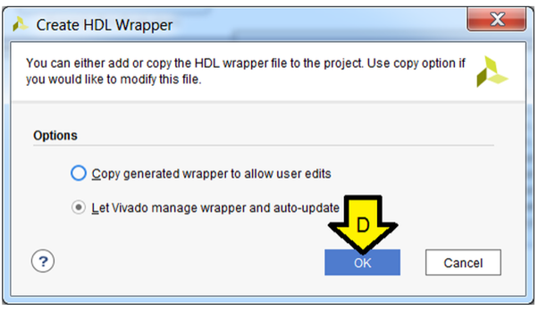

After a little time you should see:

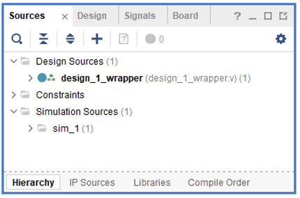

**<u><span>Part 10: Synthesize and Generate the Bitstream</span></u>**

Step 1: Click **Run Synthesis**

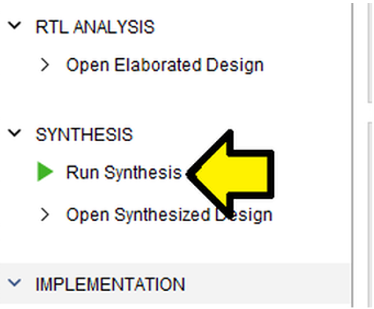

Step 2: Use defaults, click **OK**

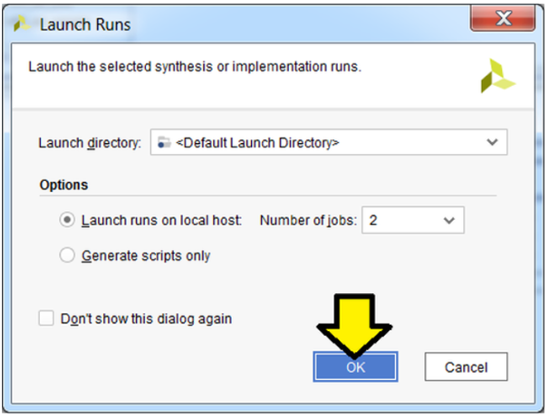

You'll see the status in the upper right corner.

A sample of the output:

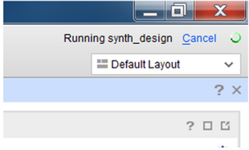

Step 3:

Wait approximately 10 min (using a custom built CPU with a Ryzen 5 2400G, M.2 SSD, and DDR4 Memory) until you see **Synthesis Complete** in the upper right corner...

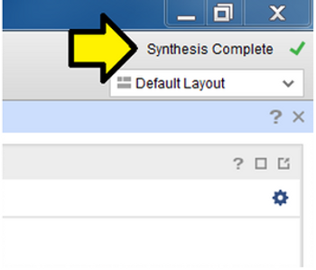

...and click **OK** to Run Implementation

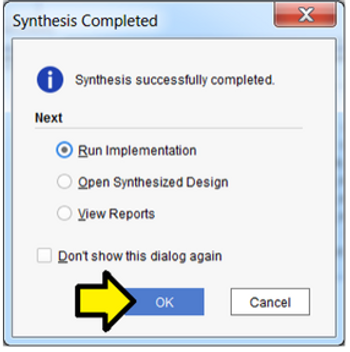

Step 4: Use defaults, click **OK**

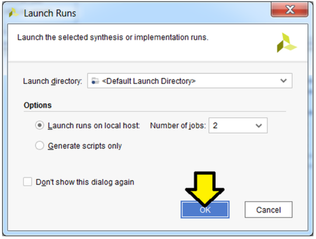

Again, you'll see status in the upper right:

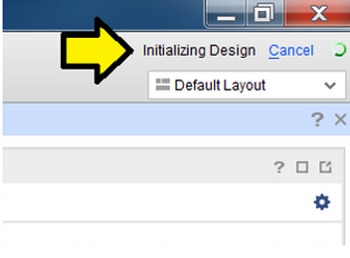

Step 5:

Wait approximately 10 min (using a custom built CPU with a Ryzen 5 2400G, M.2 SSD, and DDR4 Memory) until you see **Implementation Complete** in the upper right corner...

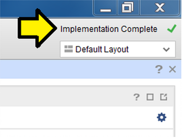

A. Select **Generate Bitstream**

B. Click **OK**

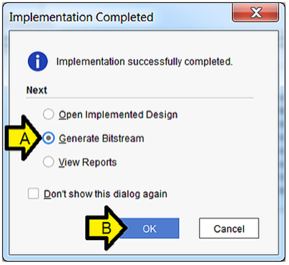

Step 6: Use defaults, click **OK**

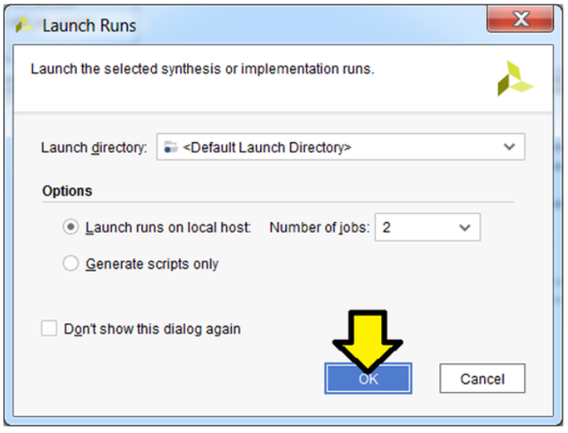

Again, you should see the status in the upper right:

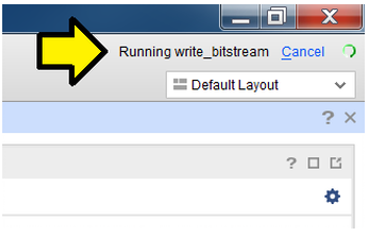

Step 7: Click **Cancel**

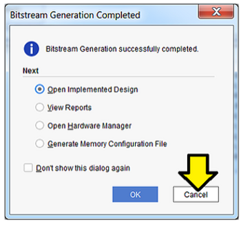

You may see this window pop-up:

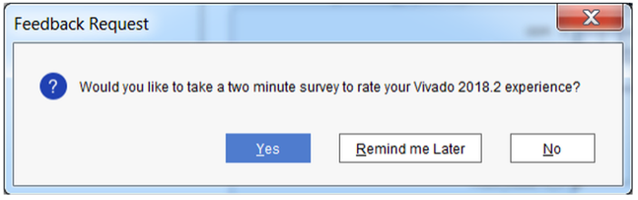

Feel free to send feedback, set a reminder or click **No**. If you click **No** you may see:

...click **OK** to dismiss.

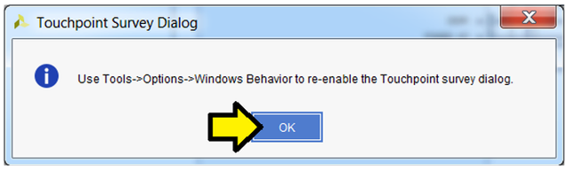

**<u><span>Part 11: Export the Design and Open the SDK</span></u>**

Step 1:

A. Click **File**

B. Click **Export**

C. Click **Export Hardware...**

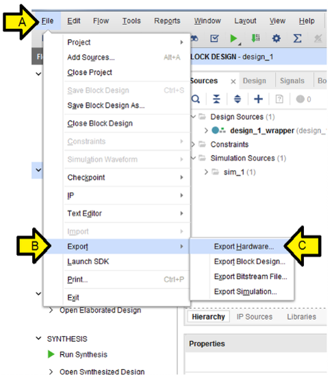

Step 2:

A. Click the **Include bitstream** checkbox

B. Click **OK**

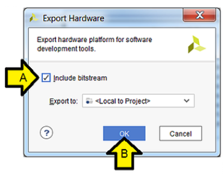

Step 3:

A. Click **File**

B. Click **Launch SDK**

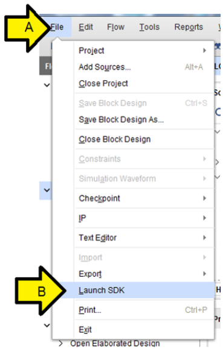

Note: you can open the workspace directly from the SDK by opening the SDK and specifying C:\\vivadoprjs\\cdmaslave\\cdmaslave.sdk as the workspace.

Step 4: Use defaults, click **OK**

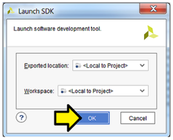

You should see:

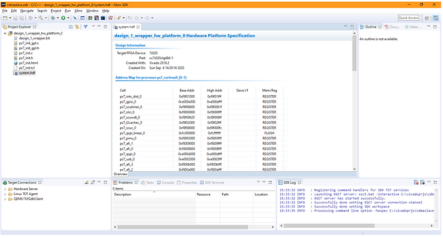

**<u><span>Part 12: Install the USB-to-UART Driver and Get the COM Assignment</span></u>**

Steps:

A. Goto \[[link](https://www.silabs.com/products/development-tools/software/usb-to-uart-bridge-vcp-drivers)\] for the Silicon Labs CP210x USB to UART Bridge VCP Drivers

B. Download and unzip the correct installer for your OS

C. Install the driver (I did not need to restart on Windows 10 Professional)

D. Right-click the **Windows Icon**

E. Click **Device Manager**

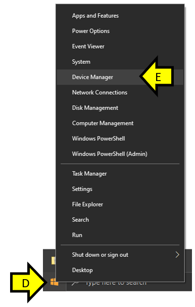

F. Expand the **Ports (COM & LPT)**

G. You should see **Silicon Labs CP210x USB to UART Bridge**

H. Note the COM port # (you'll need this later)

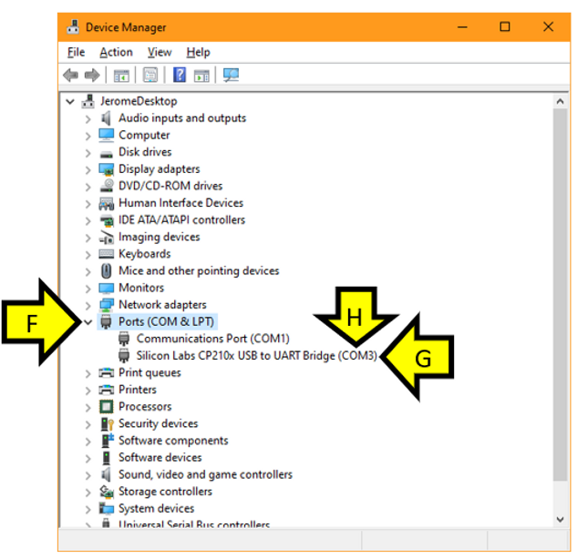

**<u><span>Part 13: Configure the Board to Boot from JTAG, Connect it to the PC and Power it On</span></u>**

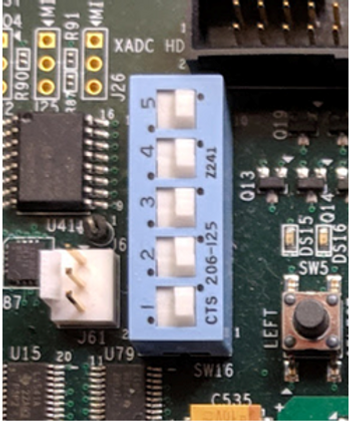

For the rest of the jumpers see the high-resolution photo of the board in the correct state at \[[link](https://photos.app.goo.gl/DddmM8T5QkTXwA7u5)\]. Step 2: Connect a **Micro-B to Type-A** (host connection) USB cable from U23 (Diglent USB JTAG interface) to the host PC

U23:

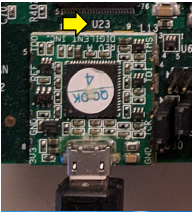

Micro-B connector:


Type-A connector:

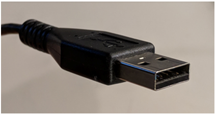

Step 3: Connect a **Mini-B to Type-A** (host connection) USB cable from J17 (CP2103GM USB-to\_UART Bridge) to the host PC.

J17:

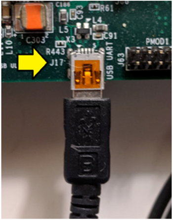

Mini-B connector:

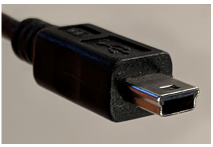

Type-A connector:

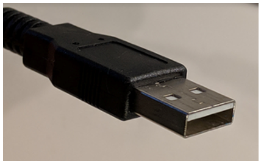

Step 4: Turn on the board

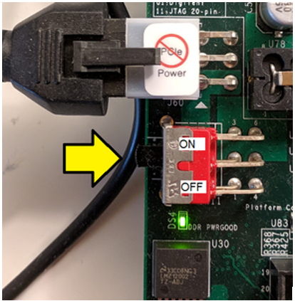

**<u><span>Part 14: Create the Test App and BSP</span></u>**

Step 1:

A. Click **File**

B. Click **New**

C. Click **Application Project**

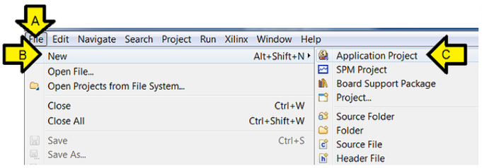

Step 2:

A. Type **testcdmaslave** into **Project name:**

B. Ensure the **Board Support Package: Create New** radio button is clicked and the name given is **testcdmaslave\_bsp**

C. Click **Next**

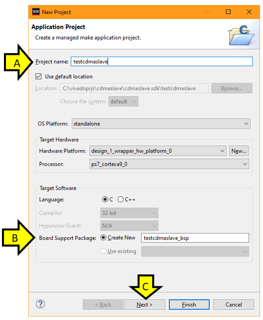

Step 3:

A. Click **Hello World**

B. Click **Finish**

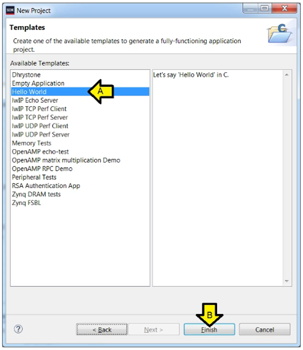

You should see:

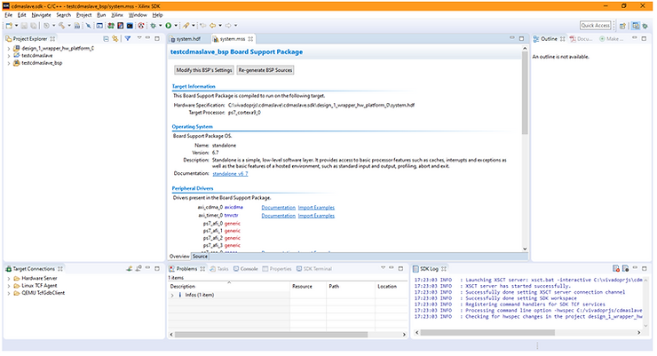

**<u><span>Part 15: Test Debug Run + Further Config</span></u>**

_These instructions allow_ debugging _to be set up more easily than entering the details manually. After running a debug session, the Debug Configuration is fixed up to reset the FPGA and program the bitstream. The debugger COM port is also configured so that output can be read and the steps to test it and see_ **_Hello World_** _are listed._

Step 1:

A. Right-click **testcdmaslave**

B. Click **Debug As**

C. Click **Launch on Hardware (System Debugger)**

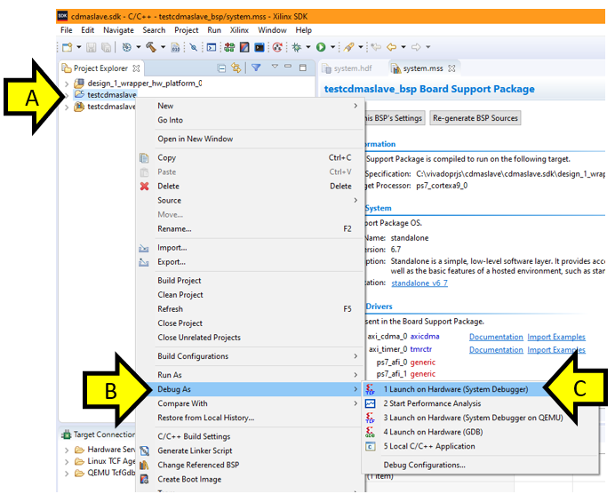

Step 2: Click **OK** (if you see this)

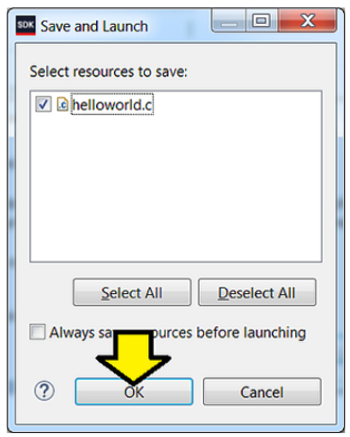

If you see this message click **Yes**. We'll handle this in the next part.

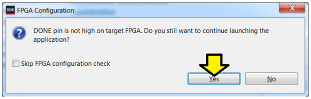

...click **Yes**.

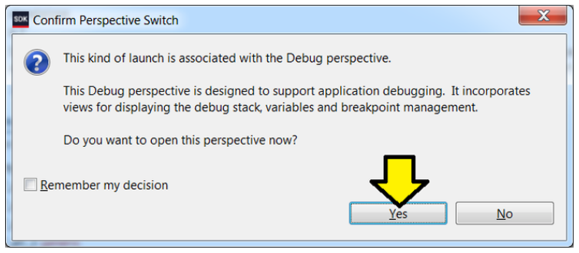

You should see the Debug Perspective display the code broken on init\_platform():

A. Debug context on main()

B. helloworld.c on init\_platform()

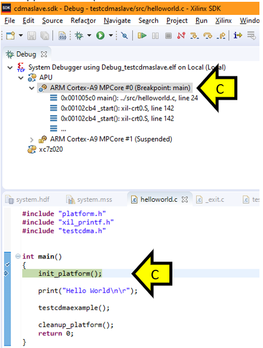

Step 3:

A. Click **Run**

B. Click **Debug Configurations...**

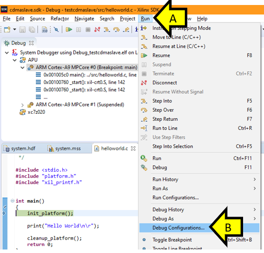

Step 4:

A. Ensure **System Debugger using Debug\_testaxislave on Local** is selected (it should be)

B. Click the **Reset entire system** checkbox

C. Click the **Program FPGA** checkbox

D. Click **Apply**

E. Click **Close**

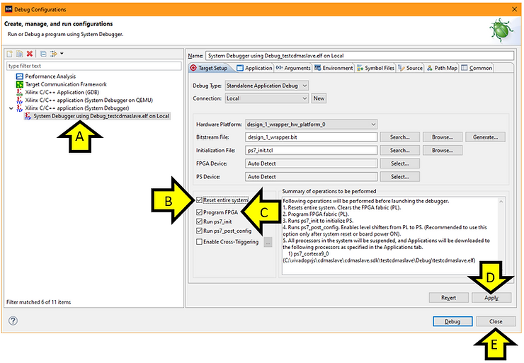

Step 5: Configure Debug View COM

A. Click **SDK Terminal**

B. Click the **'+'** (Connect to serial port.)

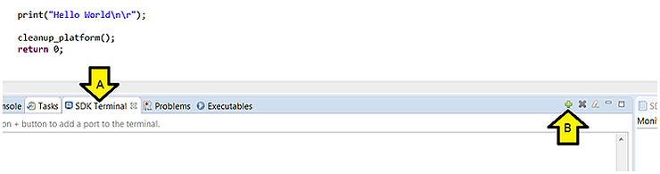

Step 6: Set Debug View COM settings

A. Enter the COM# from above

B. Click **OK**


You should see:

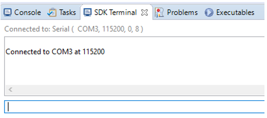

Step 7: Make sure you see **Hello World** on the console

A. Click on the bug

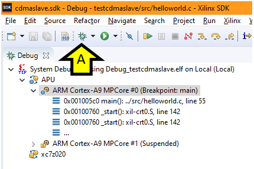

B. Click **OK**

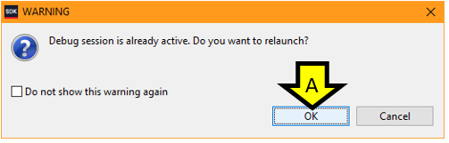

C. Wait for the system to hit the breakpoint on main()

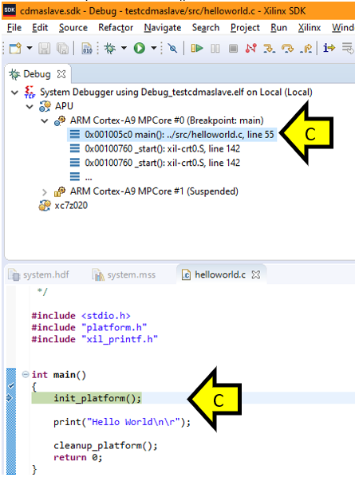

D. Click **Resume**


E. Wait until you see exit():

F. Click on **SDK Terminal**

G. Observe **Hello World**

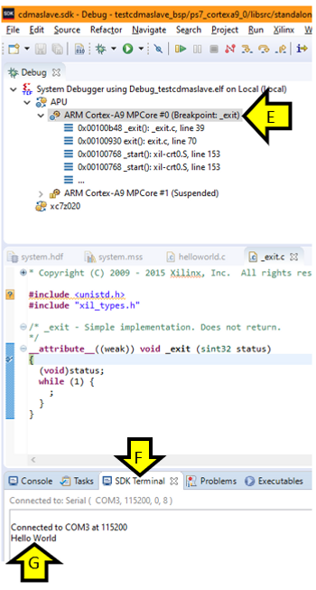

**<u><span>Part 16: Test the CDMA Module</span></u>**

Step 1: Click on the **C/C++** view

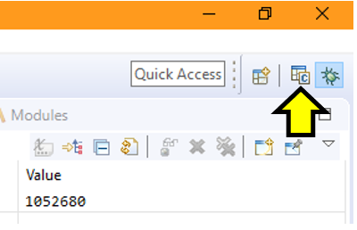

Step 2:

A. Expand **testcdmaslave**

B. Expand **src**

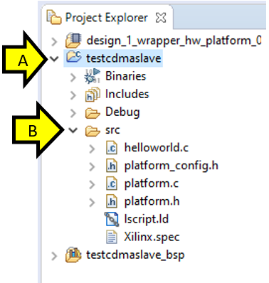

Step 3:

A. Right-click on **src**

B. Hover over **New**

C. Click **File**

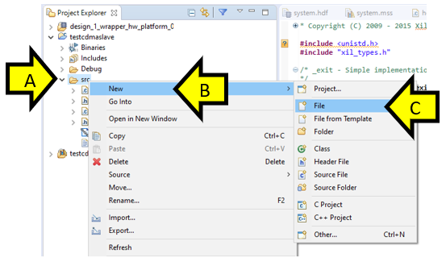

D. Type **testcdma.c**

E. Click **Finish**

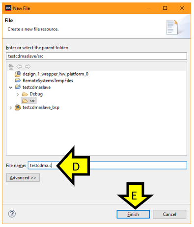

F. Copy and paste the following code into **testcdma.c**. Note that this code comes directly from this \[[link](http://secure.xilinx.com/webreg/clickthrough.do?cid=1ffa3437-b232-4129-8435-d11d1a2a1ad9)\] and has some minor modifications to conform with Linux Kernel Code Convention and to be able to use a header file in future steps.

```
/*
 * Copyright (c) 2015 Xilinx, Inc.  All rights reserved.
 *
 * Xilinx, Inc.
 * XILINX IS PROVIDING THIS DESIGN, CODE, OR INFORMATION "AS IS" AS A
 * COURTESY TO YOU.  BY PROVIDING THIS DESIGN, CODE, OR INFORMATION AS
 * ONE POSSIBLE   IMPLEMENTATION OF THIS FEATURE, APPLICATION OR
 * STANDARD, XILINX IS MAKING NO REPRESENTATION THAT THIS IMPLEMENTATION
 * IS FREE FROM ANY CLAIMS OF INFRINGEMENT, AND YOU ARE RESPONSIBLE
 * FOR OBTAINING ANY RIGHTS YOU MAY REQUIRE FOR YOUR IMPLEMENTATION.
 * XILINX EXPRESSLY DISCLAIMS ANY WARRANTY WHATSOEVER WITH RESPECT TO
 * THE ADEQUACY OF THE IMPLEMENTATION, INCLUDING BUT NOT LIMITED TO
 * ANY WARRANTIES OR REPRESENTATIONS THAT THIS IMPLEMENTATION IS FREE
 * FROM CLAIMS OF INFRINGEMENT, IMPLIED WARRANTIES OF MERCHANTABILITY
 * AND FITNESS FOR A PARTICULAR PURPOSE.
 *
 */

#include <stdio.h>
#include "xaxicdma.h"
#include "xdebug.h"
#include "xil_exception.h"
#include "xil_cache.h"
#include "xparameters.h"
#include "xscugic.h"

#define NUMBER_OF_TRANSFERS	2	/* Number of simple transfers to do */
#define DMA_CTRL_DEVICE_ID	XPAR_AXICDMA_0_DEVICE_ID
#define INTC_DEVICE_ID		XPAR_SCUGIC_SINGLE_DEVICE_ID
#define DMA_CTRL_IRPT_INTR	XPAR_FABRIC_AXI_CDMA_0_CDMA_INTROUT_INTR

static int Done;	/* Dma transfer is done */
static int Error;	/* Dma Bus Error occurs */

static u32 SourceAddr = 0x20000000;
static u32 DestAddr	= 0x30000000;

static XAxiCdma AxiCdmaInstance;	/* Instance of the XAxiCdma */
static XScuGic IntcController;	/* Instance of the Interrupt Controller */


//Array and 3 and 4 store data to be sent to DDR memory
static int Array_3[32][16];
static int Array_4[32][16];

//interemdiate stored data
static int Array_1[32][16];
static int Array_2[32][16];

//input seeds for psuedo random data
int const input[16] = {0xb504f33, 0xabeb4a0, 0xa267994, 0x987fbfc, 0x8e39d9c,
		0x839c3cc, 0x78ad74c, 0x6d743f4, 0x61f78a8, 0x563e6a8,
		0x4a5018c, 0x3e33f2c, 0x31f1704, 0x259020c, 0x1917a64,
		0xc8fb2c};
/* Length of the buffers for DMA transfer */
static u32 BUFFER_BYTESIZE	= (XPAR_AXI_CDMA_0_M_AXI_DATA_WIDTH
			* XPAR_AXI_CDMA_0_M_AXI_MAX_BURST_LEN);


static int CDMATransfer(XAxiCdma *InstancePtr, int Length, int Retries);

static void DisableIntrSystem(XScuGic *IntcInstancePtr, u32 IntrId)
{
		XScuGic_Disable(IntcInstancePtr, IntrId);
		XScuGic_Disconnect(IntcInstancePtr, IntrId);
}

//Multiply and Shift
int MUL_SHIFT_30(int x, int y)
{
	return ((int) (((long long) (x) * (y)) >> 30));
}


void MULT_SHIFT_LOOP(int Value)
{
	int i, j;

	for (i = 0; i < 32; i++) {
		for (j = 0; j < 16; j++) {
			Array_3[i][j] = (int)((MUL_SHIFT_30(input[j],
						Array_1[j][i])) + Value);
			Array_4[i][j] = (int)((MUL_SHIFT_30(input[j],
						Array_2[j][i])) + Value);
		}
	}
}

void TestPattern_Initialization(void)
{
	int i, j;

	for (i = 0; i < 32; i++) {
		for (j = 0; j < 16; j++) {
			Array_1[i][j] =  (int) ((0xA5A5A5A5 >> 1) * i);
			Array_2[i][j] =  (int) ((0xA5A5A5A5 << 1) * i);
		}
	}
}

/******************************************************************************
 *
 * Callback function for the simple transfer. It is called by the driver's
 * interrupt handler.
 *
 * @param	CallBackRef is the reference pointer registered through
 *		transfer submission. In this case, it is the pointer to the
 *		driver instance
 * @param	IrqMask is the interrupt mask the driver interrupt handler
 *		passes to the callback function.
 * @param	IgnorePtr is a pointer that is ignored by simple callback
 *		function
 *
 * @return	None
 *
 * @note		None
 *
 *****************************************************************************/
static void Cdma_CallBack(void *CallBackRef, u32 IrqMask, int *IgnorePtr)
{

	if (IrqMask & XAXICDMA_XR_IRQ_ERROR_MASK) {
		Error = TRUE;
		printf("--- Transfer Error --- \r\n");
	}

	if (IrqMask & XAXICDMA_XR_IRQ_IOC_MASK) {
		printf("--- Transfer Done --- \r\n");
		Done = TRUE;
	}

}

static int SetupIntrSystem(XScuGic *IntcInstancePtr, XAxiCdma *InstancePtr,
		u32 IntrId)
{
	int Status;


	/*
	 * Initialize the interrupt controller driver
	 */
	XScuGic_Config *IntcConfig;


	/*
	 * Initialize the interrupt controller driver so that it is ready to
	 * use.
	 */
	IntcConfig = XScuGic_LookupConfig(INTC_DEVICE_ID);
	if (IntcConfig == NULL)
		return XST_FAILURE;

	Status = XScuGic_CfgInitialize(IntcInstancePtr, IntcConfig,
					IntcConfig->CpuBaseAddress);
	if (Status != XST_SUCCESS)
		return XST_FAILURE;

	XScuGic_SetPriorityTriggerType(IntcInstancePtr, IntrId, 0xA0, 0x3);

	/*
	 * Connect the device driver handler that will be called when an
	 * interrupt for the device occurs, the handler defined above performs
	 * the specific interrupt processing for the device.
	 */
	Status = XScuGic_Connect(IntcInstancePtr, IntrId,
				(Xil_InterruptHandler)XAxiCdma_IntrHandler,
				InstancePtr);

	if (Status != XST_SUCCESS)
		return Status;

	/*
	 * Enable the interrupt for the DMA device.
	 */
	XScuGic_Enable(IntcInstancePtr, IntrId);


	Xil_ExceptionInit();

	/*
	 * Connect the interrupt controller interrupt handler to the hardware
	 * interrupt handling logic in the processor.
	 */
	Xil_ExceptionRegisterHandler(XIL_EXCEPTION_ID_IRQ_INT,
				(Xil_ExceptionHandler)XScuGic_InterruptHandler,
				IntcInstancePtr);


	/*
	 * Enable interrupts in the Processor.
	 */
	Xil_ExceptionEnable();


	return XST_SUCCESS;
}


int XAxiCdma_Interrupt(XScuGic *IntcInstancePtr, XAxiCdma *InstancePtr,
		u16 DeviceId, u32 IntrId)
{
	XAxiCdma_Config *CfgPtr;
	int Status;
	int SubmitTries = 1;		/* Retry to submit */
	int Tries = NUMBER_OF_TRANSFERS;
	int Index;

	/* Initialize the XAxiCdma device. */
	CfgPtr = XAxiCdma_LookupConfig(DeviceId);
	if (!CfgPtr)
		return XST_FAILURE;

	Status = XAxiCdma_CfgInitialize(InstancePtr,
			CfgPtr,
			CfgPtr->BaseAddress);
	if (Status != XST_SUCCESS)
		return XST_FAILURE;

	/* Setup the interrupt system */
	Status = SetupIntrSystem(IntcInstancePtr, InstancePtr, IntrId);
	if (Status != XST_SUCCESS)
		return XST_FAILURE;

	/* Enable all (completion/error/delay) interrupts */
	XAxiCdma_IntrEnable(InstancePtr, XAXICDMA_XR_IRQ_ALL_MASK);

	for (Index = 0; Index < Tries; Index++) {
		Status = CDMATransfer(InstancePtr,
			   BUFFER_BYTESIZE, SubmitTries);

		if (Status != XST_SUCCESS) {
			DisableIntrSystem(IntcInstancePtr, IntrId);
			return XST_FAILURE;
		}
	}

	/* Test finishes successfully, clean up and return */
	DisableIntrSystem(IntcInstancePtr, IntrId);

	return XST_SUCCESS;
}

/******************************************************************************
 *
 *
 * This function does CDMA transfer
 *
 * @param	InstancePtr is a pointer to the XAxiCdma instance
 * @param	Length is the transfer length
 * @param	Retries is how many times to retry on submission
 *
 * @return
 *		- XST_SUCCESS if transfer is successful
 *		- XST_FAILURE if either the transfer fails or the data has
 *		  error
 *
 * @note	None
 *
 *****************************************************************************/
static int CDMATransfer(XAxiCdma *InstancePtr, int Length, int Retries)
{
	int Status;

	printf("Start Transfer \r\n");

	/* Try to start the DMA transfer */
	Done = FALSE;
	Error = FALSE;

	/* Flush the SrcBuffer before the DMA transfer, in case the Data Cache
	 *	is enabled
	 */
	Xil_DCacheFlushRange((u32)SourceAddr, Length);

	Status = XAxiCdma_SimpleTransfer(InstancePtr,
				(u32)(u8 *) (SourceAddr),
				(u32)(DestAddr),
				Length,
				Cdma_CallBack,
				(void *)InstancePtr);

	if (Status == XST_FAILURE) {
		printf("Error in Transfer  \r\n");
		return 1;
	}

	/* Wait until the DMA transfer is done */
	while (!Done && !Error)
		;

	if (Error) {
		return XST_FAILURE;
		return 1;
	}


	/* Invalidate the DestBuffer before receiving the data, in case the
	 * Data Cache is enabled
	 */
	Xil_DCacheInvalidateRange((u32)DestAddr, Length);

	return XST_SUCCESS;
}


int testcdmaexample(void)
{
	int Status;
	u32 *SrcPtr;
	u32 *DestPtr;
	unsigned int  Index;
	int i, j;

	printf("--- Entering %s --- \r\n", __func__);

	/**********************************************************************
	 * Step : 1 :	Initialization of the Source Memory with the Specified
	 *			test pattern
	 *		Clear Destination memory
	 *********************************************************************/
	TestPattern_Initialization();

	/* Initialize the source buffer bytes with a pattern and the
	 * destination buffer bytes to zero
	 */
	SrcPtr = (u32 *)SourceAddr;
	DestPtr = (u32 *)DestAddr;
	for (Index = 0; Index < (BUFFER_BYTESIZE/1024); Index++) {
		MULT_SHIFT_LOOP((Index*100));
		for (i = 0; i < 32; i++) {
			for (j = 0; j < 16; j++) {
				SrcPtr[((i+j))*(Index+1)]	= Array_3[i][j];
				SrcPtr[((i+j)*(Index+1)) + 1]	= Array_4[i][j];
				DestPtr[(i+j)*(Index+1)]	= 0;
				DestPtr[((i+j)*(Index+1)) + 1]	= 0;
			}
		}
	}

	/**********************************************************************
	 * Step : 2 :	AXI CDMA Initialization
	 *		Association of the CDMA ISR with the Interrupt
	 *		Enable the CDMA Interrupt
	 *		Provide Source and destination location to CDMA
	 *		Specified Number of byte to be transfer to CDMA
	 *			register
	 *		Start the CDMA
	 *		Wait for the Interrupt and return the status
	 *********************************************************************/

	Status = XAxiCdma_Interrupt(&IntcController,
					&AxiCdmaInstance,
					DMA_CTRL_DEVICE_ID,
					DMA_CTRL_IRPT_INTR);

	if (Status != XST_SUCCESS) {
		printf("XAxiCdma_Interrupt: Failed\r\n");
		return XST_FAILURE;
	}

	xil_printf("XAxiCdma_Interrupt: Passed\r\n");


	/**********************************************************************
	 * Step : 3 :	Compare Source memory with Destination memory
	 *		Return the Status
	 *********************************************************************/
	for (Index = 0; Index < (BUFFER_BYTESIZE/4); Index++) {
		if (DestPtr[Index] != SrcPtr[Index]) {
			printf("Error in Comparison : Index : %x \r\n", Index);
			return XST_FAILURE;
		}
	}

	printf("DMA Transfer is Successful \r\n");
	return XST_SUCCESS;
}
```

Step 4:

A. Right-click on **src**

B. Hover over **New**

C. Click **File**

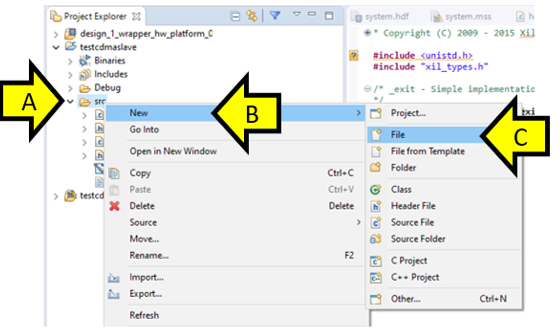

Step 5:

A. Type **testcdma.h**

B. Click **Finish**

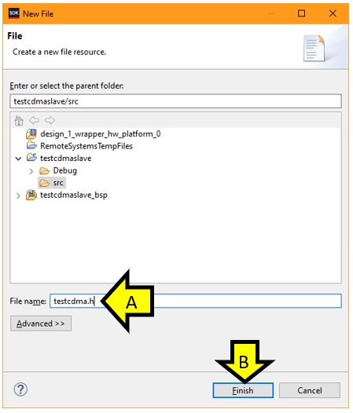

Step 6: Copy and paste the following code into **testexample.h**

**int testcdmaexample(void);**

Step 9: Update **helloworld.c**

A. Double-click **helloworld.c**

B. Add [#include](https://www.centennialsoftwaresolutions.com/blog/search/.hash.include) "testcdma.h” as shown

C. Add testcdmaexample(); as shown

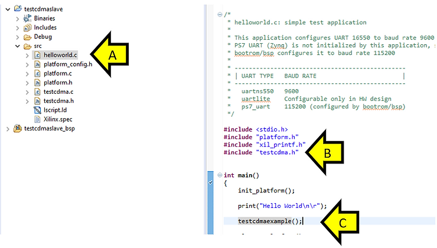

D. Click save-all

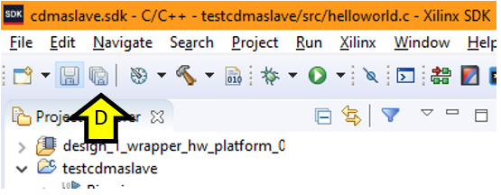

Step 7: Run it

A. Click on the bug

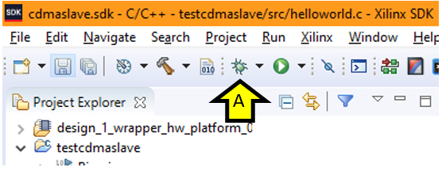

If you see **WARNING** pop-up this click **OK**

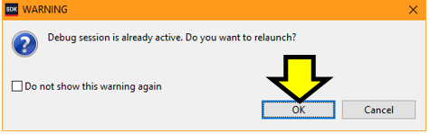

B. Click **Yes** to confirm the switch to the Debug perspective

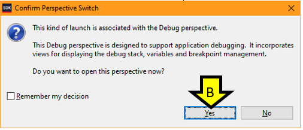

C. You should see execution stopped at main(

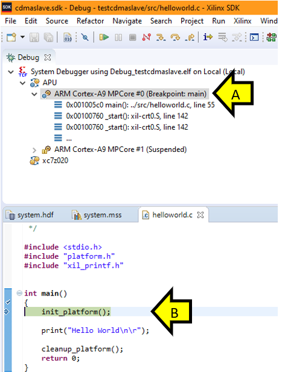

D. Click **Resume**

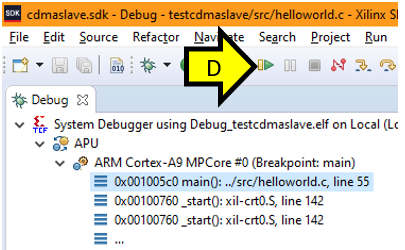

E. You should see that the DMA transfer was successful.

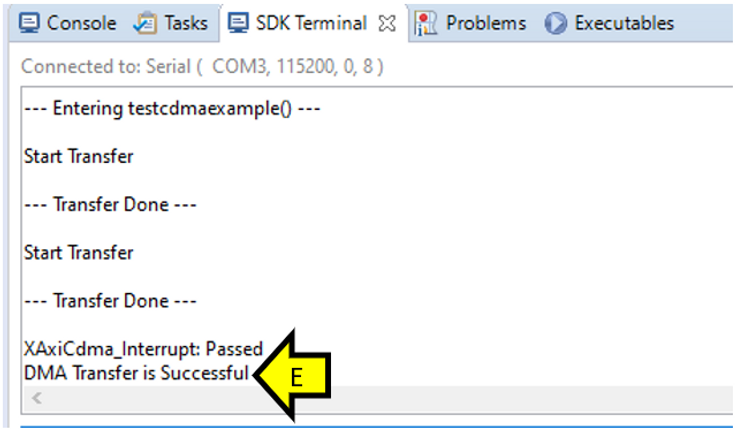

**<u><span>References</span></u>**

· Zynq-7000 All Programable SoC: Embedded Design Tutorial \[[link](https://www.xilinx.com/support/documentation/sw_manuals/xilinx2018_2/ug1165-zynq-embedded-design-tutorial.pdf)\]

· Xilinx Design Files \[[link](http://secure.xilinx.com/webreg/clickthrough.do?cid=1ffa3437-b232-4129-8435-d11d1a2a1ad9)\]