# Zynq-7000 + AXI Slave Hello World

This post shows how to create a Xilinx Zynq-7000 + AXI slave in Vivado 2018.2 and read/write the AXI slave from the ARM9 of the Zynq-7000 using bare-metal code built with the SDK on the ZC702.

**<u>Versions Used</u>**

Xilinx Vivado 2018.2 & SDK 2018.2

ZC702 Rev 1.1

Windows 7 SP1

**<u>Before you Start</u>**

Review ZC702 JTAG and serial port set up instructions @ \[[link](https://www.centennialsoftwaresolutions.com/blog/set-up-the-jtag-and-serial-port-on-the-zc702)\]. These instructions are also reviewed below.

**<u>Contents</u>**

Part 1: Create the Vivado Project

Part 2: Create the AXI Slave IP and Add it to the Repo

Part 3: Create the Zynq-7000 in IP Integrator

Part 4: Connect the AXI Slave

Part 5: Build the Bitstream (to Program the FPGA)

Part 6: Export the Design and Open the SDK

Part 7: Install the USB-to-UART Driver and Get the COM Assignment

Part 8: Configure the Board to Boot from JTAG, Connect it to the PC and Power it On

Part 9: Create the Test App and BSP

Part 10: Test Debug Run + Further Config

Part 11: Test the AXI module

**<u>Part 1: Create the Vivado Project</u>**

Step 1: Start Vivado

Step 2: Click **Create Project**

Step 3: Click Next

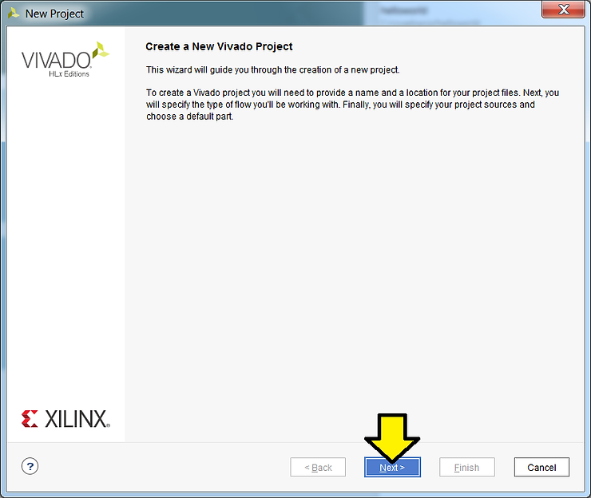

Step 4:

A. Set **Project name** to axislave

B: Set **Project location** to C:/vivadoprjs (create C:/vivadoprjs if it doesn't exist)

C. Click the **Create project subdirectory** checkbox

D. Click **Next**

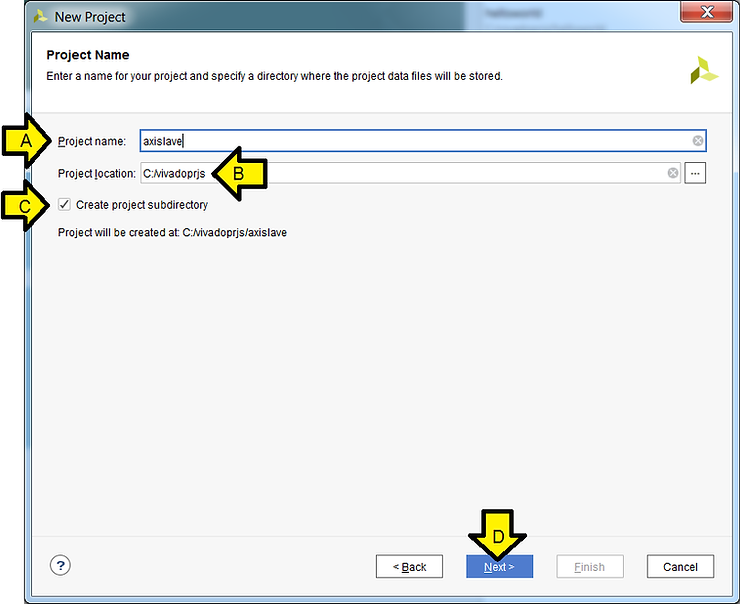

Step 5:

A. Select **RTL Project**

B. Check the **Do not specify sources at this time** check box

C. Click **Next**

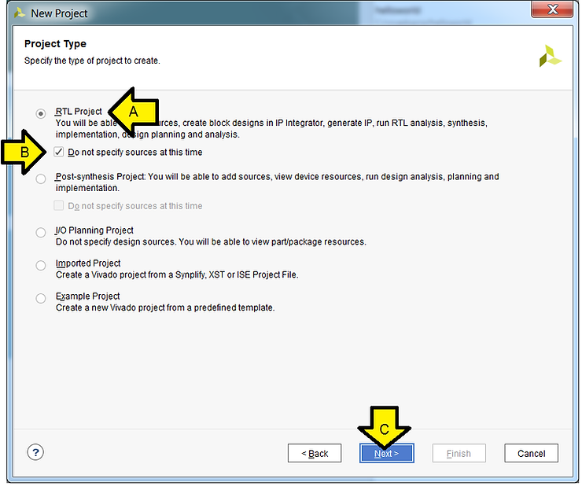

Step 6:

A. Click **Boards**

B. Type **ZC702**

C. Click on the **ZYNQ-7 ZC702 Evaluation Board** box

D. Click **Next**

Step 7: Click **Finish**

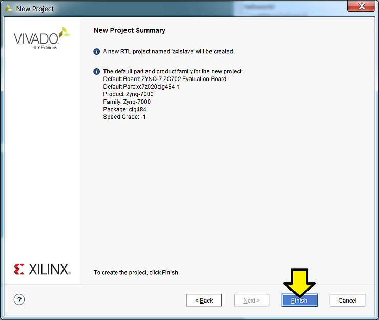

**<u>Part 2: Create the AXI Slave IP and Add it to the Repo</u>**

Step 1:

A. Click **Tools**

B. Click **Create and Package New IP...**

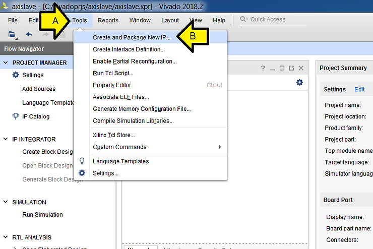

Step 2: Click **Next**

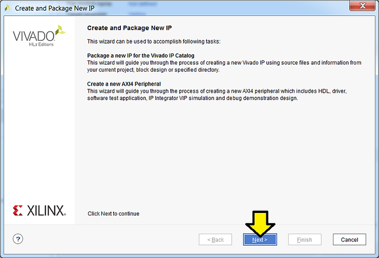

Step 3:

A. Select **Create a new AXI4 peripheral**

B. Click **Next**

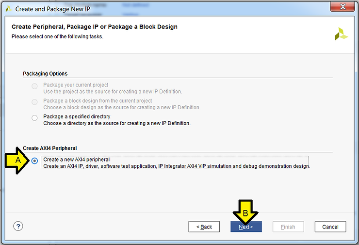

Step 4:

A. Use defaults except, set IP location to: C:/vivadoprjs/axislave/ip\_repo

B. Click Next

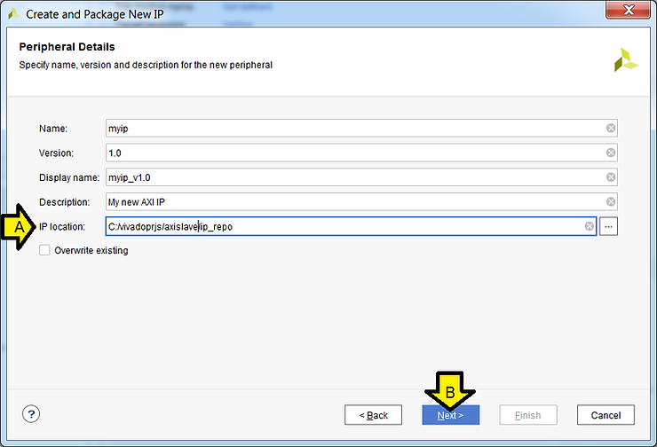

Step 5: Use defaults, click **Next**

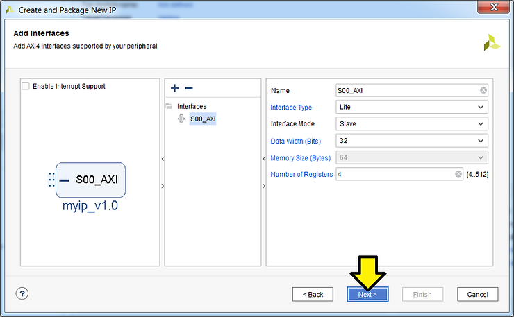

Step 6: Use defaults, click **Finish**

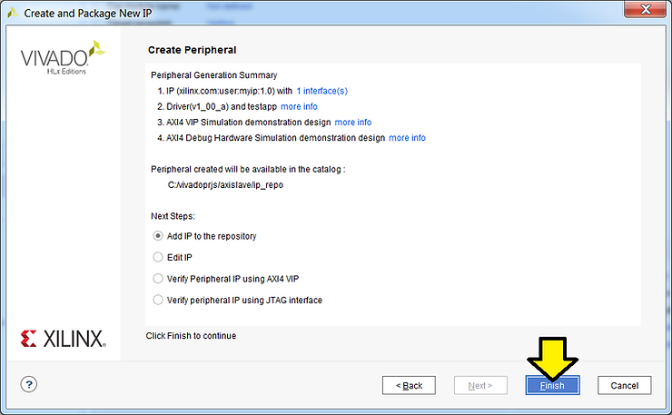

**<u>Part 3: Create the Zynq-7000 in IP Integrator</u>**

Step 1: Click **Create Block Design**

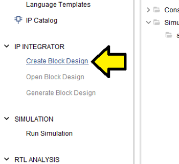

Step 2: Use defaults, click **OK**

Step 3: Click **+**

Step 4:

A. Type **Zynq**

B. Double-click on **ZYNQ7 Processing System**

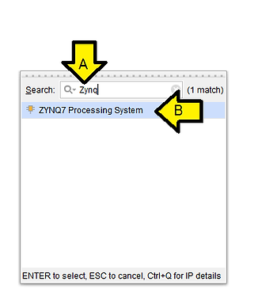

Step 5: Click **Run Block Automation**

Step 6: Use defaults, click **OK**

You should see:

**<u>Part 4: Connect the AXI Slave</u>**

Step 1: Click **+**

Step 2:

A. Type **myIP**

B. Double-click **myip\_v1.0**

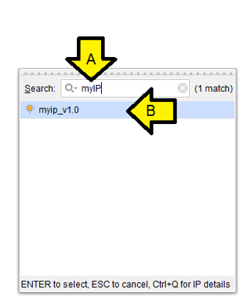

Step 3: Click **Run Connection Automation**

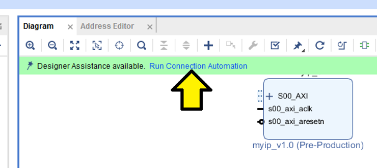

Step 4: Use defaults, click **OK**

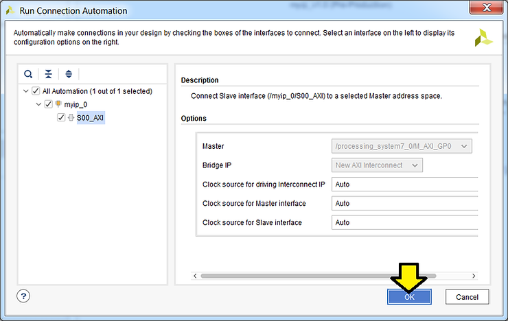

You should see:

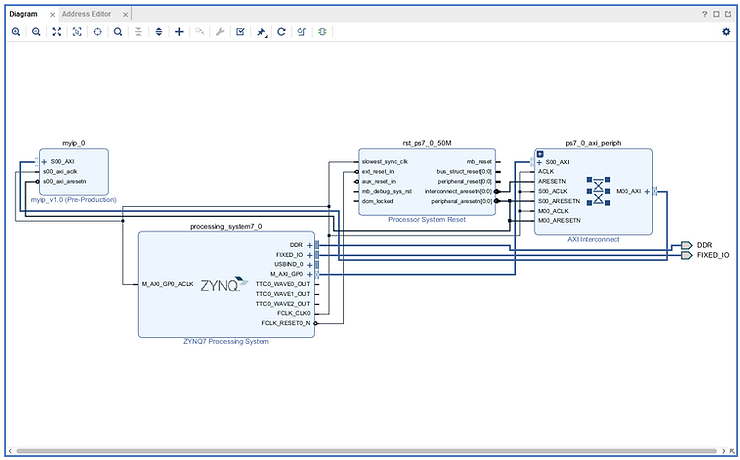

Step 5: Click **Sources**

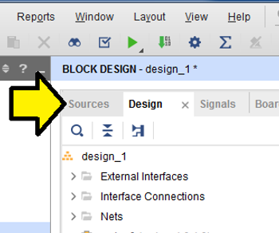

Step 6:

A. Right-click **design\_1 (design\_1.bd)**

B. Click **Create HDL Wrapper...**

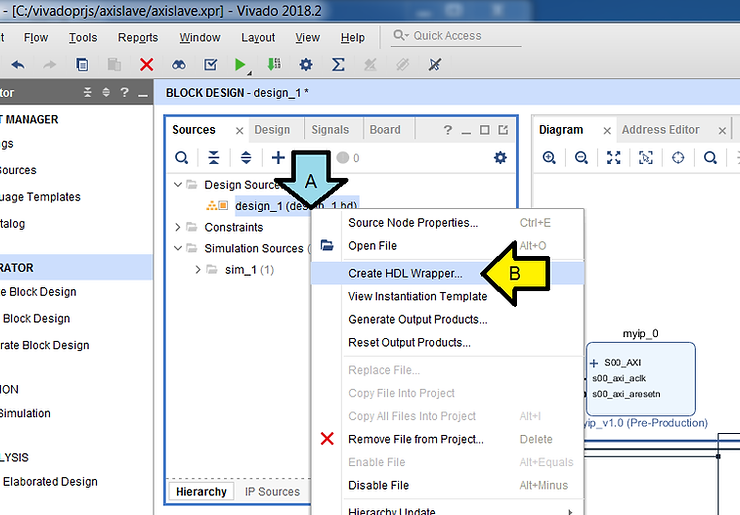

Step 7: Use default, click **OK**

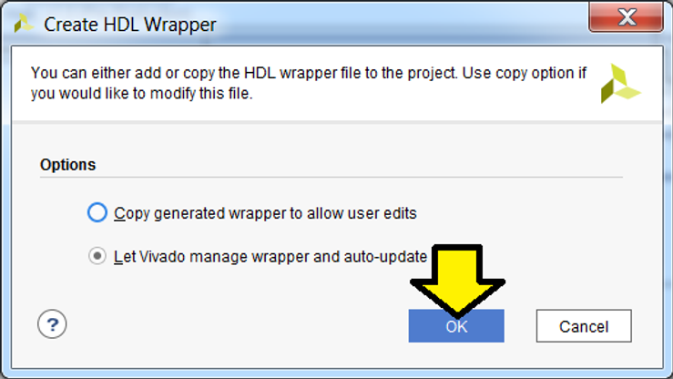

You should see:

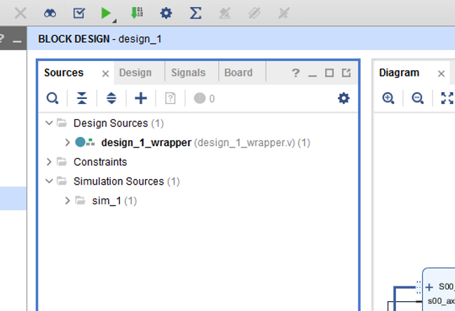

Step 8:

A. Click to expand **design\_1\_wrapper (design\_1\_wrapper.v)(1)**

B. Right-click on **design\_1\_i: design\_1 (design\_1.bd)(1)**

C. Click **Generate Output Products...**

<u>Step 7</u>:

A. Leave selected or select **Out of context per IP**

B. Leave **Number of jobs** at 2

C. Click **Generate**

<u>Step 8</u>: Click **OK** and let the operation complete

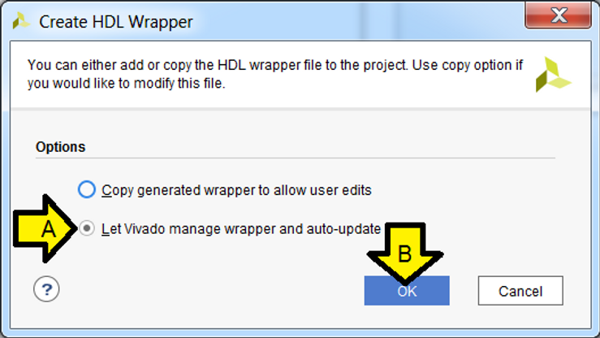

**<u>Part 5: Build the Bitstream (to Program the FPGA)</u>**

Step 1: Click **Run Synthesis**

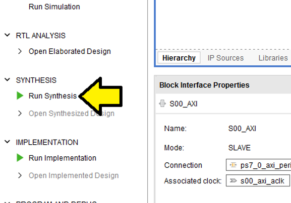

Step 2: Use defaults, click **OK**

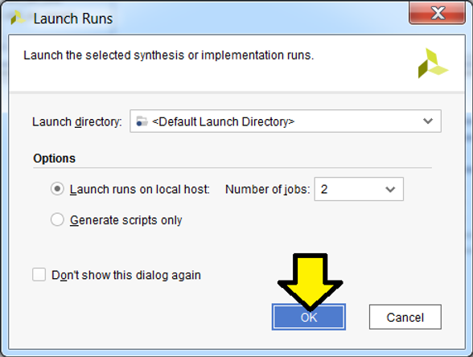

You'll see the status in the upper right corner:

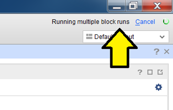

Step 3:

Wait approximately 1 to 5 min until you see **Synthesis Complete** in the upper right corner...

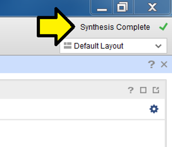

...and click **OK** to Run Implementation:

Step 4: Use defaults, click **OK**

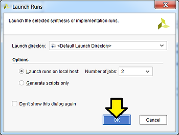

Again, you'll see status in the upper right:

Step 5:

Wait approximately 1 to 5 min until you see **Implementation Complete** in the upper right corner...

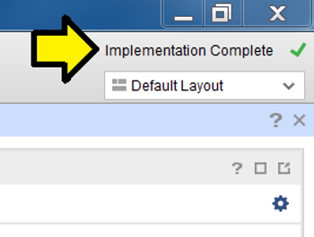

A. Select **Generate Bitstream**

B. Click **OK**

Step 6: Use defaults, click **OK**

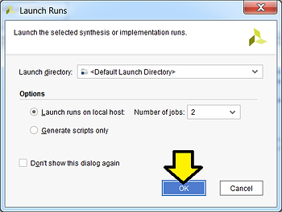

Again, you should see the status in the upper right:

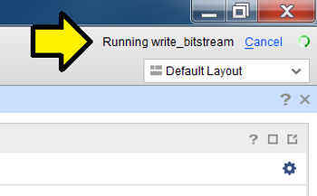

Step 7: Click **Cancel**

You may see this window pop-up:

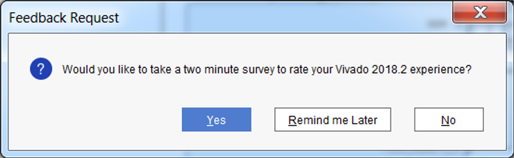

Feel free to send feedback, set a reminder or click **No**. If you click **No** you may see:

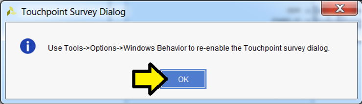

...click **OK** to dismiss.

**<u>Part 6: Export the Design and Open the SDK</u>**

Step 1:

A. Click **File**

B. Click **Export**

C. Click **Export Hardware...**

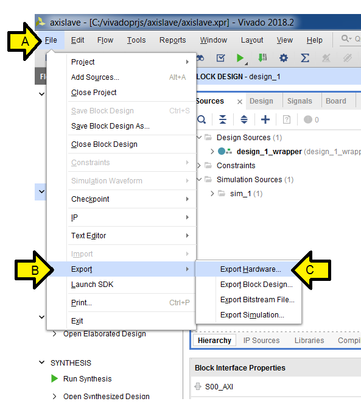

Step 2:

A. Click the **Include bitstream** checkbox

B. Click **OK**

Step 3:

A. Click **File**

B. Click **Launch SDK**

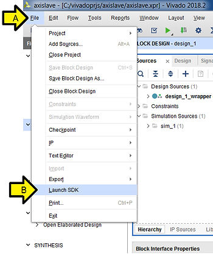

Note: you can open up the workspace from the SDK by launching the SDK and selecting C:\\vivadoprjs\\axislave\\axislave.sdk as the workspace.

Step 4: Use defaults, click **OK**

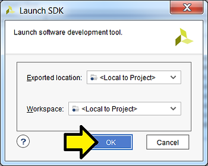

Step 5: After the SDK launches, note the Base Addr of myip\_0:

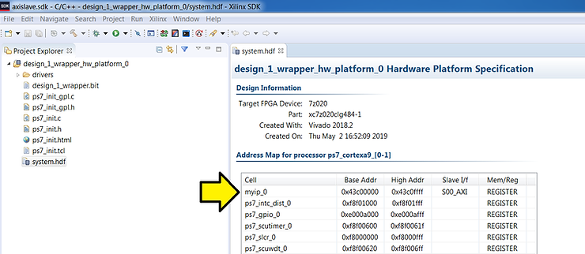

**<u>Part 7: Install the USB-to-UART Driver and Get the COM Assignment</u>**

Steps:

A. Goto \[[link](https://www.silabs.com/products/development-tools/software/usb-to-uart-bridge-vcp-drivers)\] for the Silicon Labs CP210x USB to UART Bridge VCP Drivers

B. Download and unzip the correct installer for your OS

C. Install the driver (I did not need to restart on Windows 7 SP1)

D. Click **Windows**

E. Click **Devices and Printers**

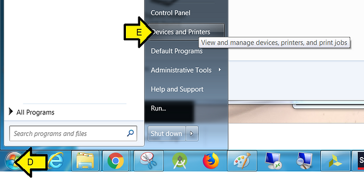

F. You should see Silicon Labs CP210x USB to UART BridgeG. Note the COM port (you'll need this later)

**<u>Part 8: Configure the Board to Boot from JTAG, Connect it to the PC and Power it On</u>**

Step 1: Set SW16 to JTAG mode [[mode documentation](https://www.xilinx.com/support/documentation/boards_and_kits/zc702_zvik/ug850-zc702-eval-bd.pdf) see p.16]

For the rest of the jumpers see the high-resolution photo of the board in the correct state at \[[link](https://photos.app.goo.gl/DddmM8T5QkTXwA7u5)\]. Step 2: Connect a **Micro-B to Type-A** (host connection) USB cable from U23 (Diglent USB JTAG interface) to the host PC

Step 2: Connect a **Micro-B to Type-A** (host connection) USB cable from U23 (Diglent USB JTAG interface) to the host PC

U23:

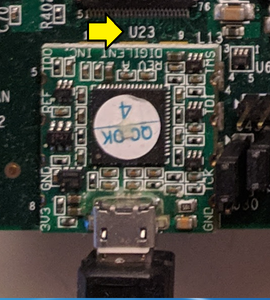

Micro-B connector:

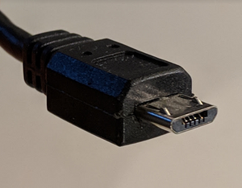

Type-A connector:

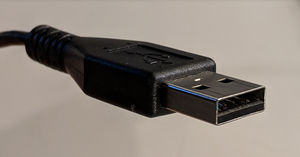

Step 3: Connect a **Mini-B to Type-A** (host connection) USB cable from J17 (CP2103GM USB-to\_UART Bridge) to the host PC.

J17:

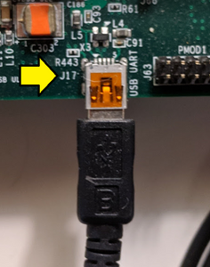

Mini-B connector:

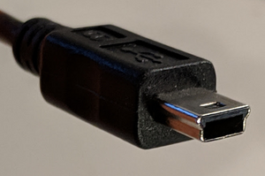

Type-A connector:

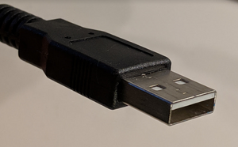

Step 4: Turn on the board

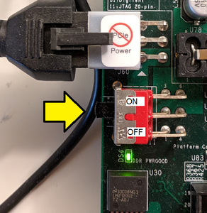

**<u>Part 9: Create the Test App and BSP</u>**

Step 1:

A. Click **File**

B. Click **New**

C. Click **Application Project**

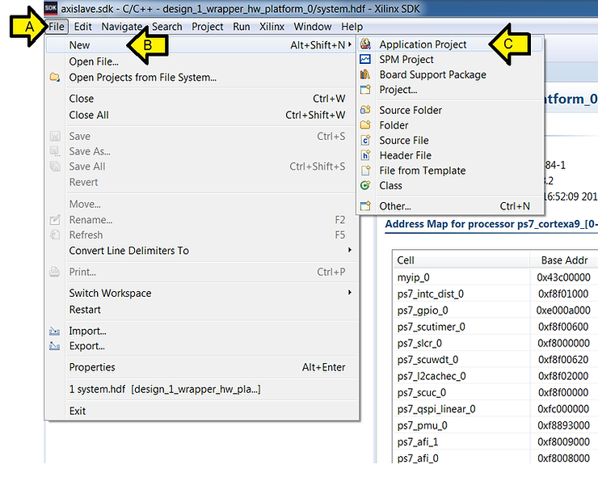

Step 2:

A. Type testaxislave

B. Ensure the **Board Support Package: Create New** radio button is clicked and the name given is **testaxislave\_bsp**

C. Click **Next**

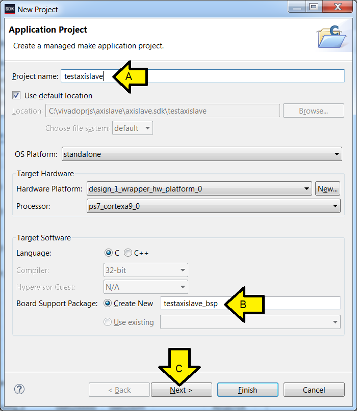

Step 3:

A. Click **Hello World**

B. Click **Finish**

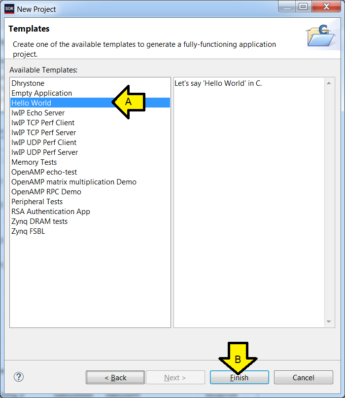

**<u>Part 10: Test Debug Run + Further Config</u>**

_These instructions allow debug to be set up more easily than entering in the details manually. After running a debug session, the Debug Configuration is fixed up to reset the FPGA and program the bitstream. The debugger COM port is also configured so that output can be read and the steps to test it and see_ **_Hello World_** _are listed._

Step 1:

A. Right-click **testaxislave**

B. Click **Debug As**

C. Click **Launch on Hardware (System Debugger)**

Step 2: Click **OK**

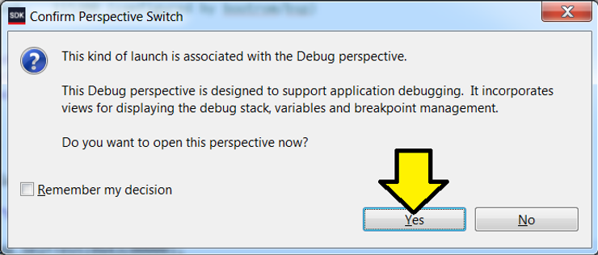

If you see this message click Yes. We'll handle this in the next part.

You should see the Debug Perspective display the code broken on init\_platform():

A. Debug context on main()

B. helloworld.c on init\_platform()

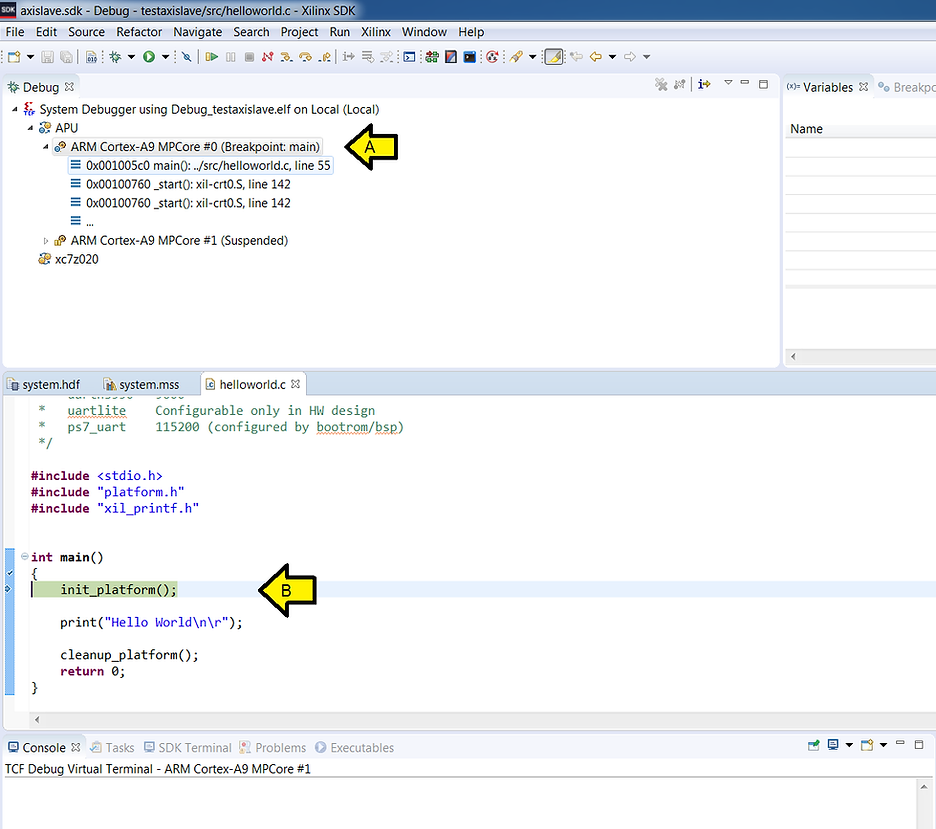

Step 3:

A. Click **Run**

B. Click **Debug Configurations...**

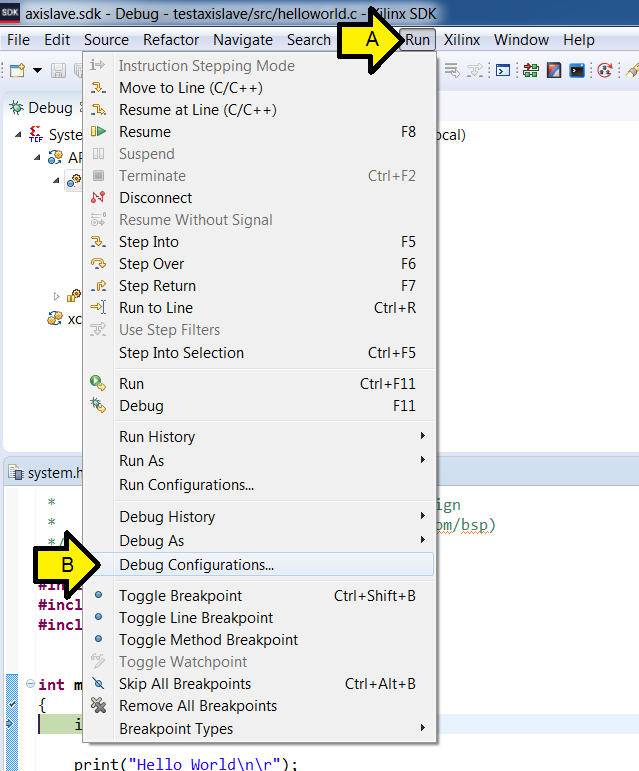

Step 4:

A. Ensure **System Debugger using Debug\_testaxislave** is selected (it should be)

B. Click the **Reset entire system** checkbox

C. Click the **Program FPGA** checkbox

D. Click **Apply**

E. Click **Close**

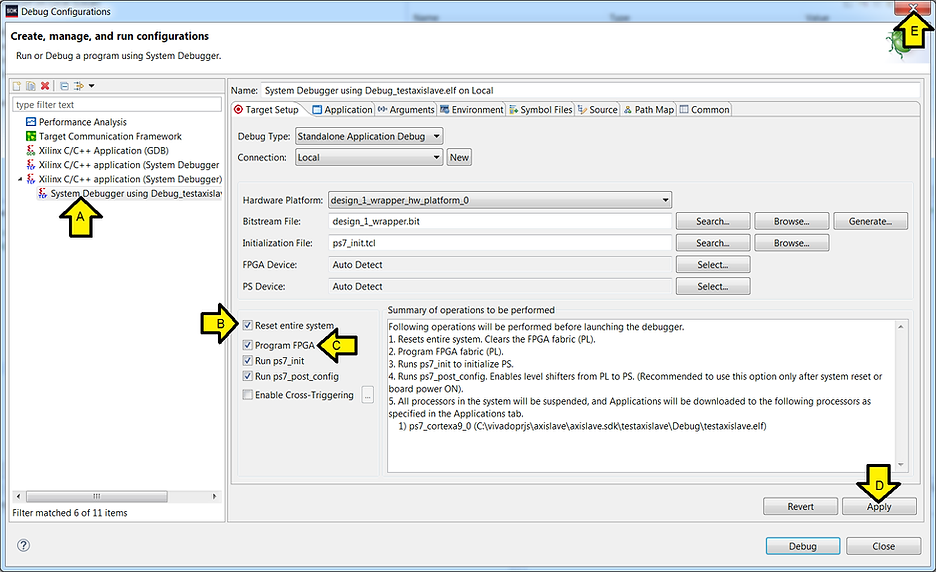

Step 5: Configure Debug View COM

A. Click **SDK Terminal**

B. Click the **'+'** (Connect to serial port.)


Step 6: Set Debug View COM settings

A. Enter the COM# from above

B. Click **OK**

Step 7: Make sure you see Hello World on the console

Click on the bug


Step 8: Click **OK**


Step 9: Wait for the system to hit the breakpoint on main()


Step 10: Click Resume


...and wait until you see exit():


Step 11: Click on SDK Terminal...


...to see Hello World:


**<u>Part 11: Test the AXI module</u>**

Step 1: Click on the C/C++ view


Step 2: Show myip tests

A. Right-click on **design\_1\_wrapper\_hw\_platform**

B. Click **Refresh**


Step 3:

A. Expand **design\_1\_wrapper\_hw\_platform, drivers, myip\_v1\_0, src**

B. Double click on **myip\_selftest.c**


Step 4: Select **XStatus MYIP\_Reg\_SelfTest(void \* baseaddr\_p)**


Step 5:

A. Click **Edit**

B. Click **Copy**


Step 6:

A. Expand testaxislave

B. Expand src

C. Double-click helloworld.c


Step 7:

A. Press **ENTER** to make room

B. Click **Edit**

C. Click **Paste**


Step 8: Get the base address of myip\_0

A. Double-click the system.hdf file

B. Note the address (it won't let you copy-paste it)


Step 9:

A. Double-click on helloworld.c

B. Fix up the code so it reads: **MYIP\_Reg\_SelfTest(0x43c00000);**


Step 10: Click the **bug** to restart debugging


Step 11: Click **OK**


Step 12: Click **OK**


Step 13: Click **Yes**

You should see the code stopped at the breakpoint on main()


Step 14: Click **Resume**


You should see:


**<u>References</u>**

-   Xilinx logo found via [https://twitter.com/xilinxinc](https://twitter.com/xilinxinc) at \[[link](https://pbs.twimg.com/profile_images/535545777020338176/pEWdIYq__400x400.png)\]