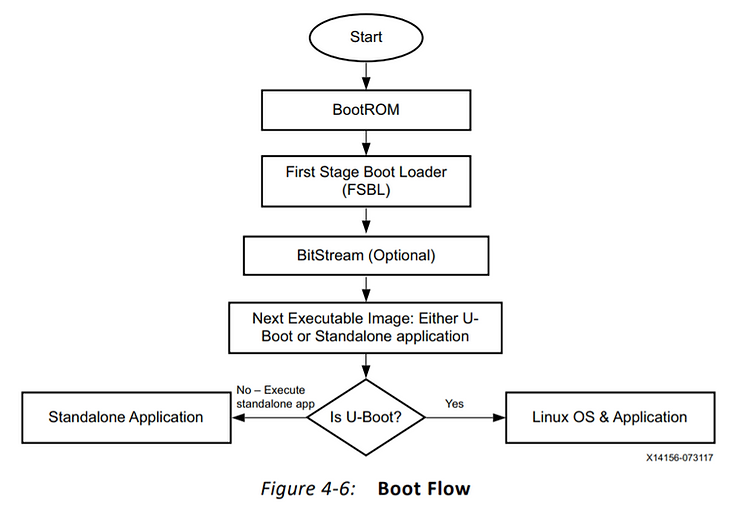
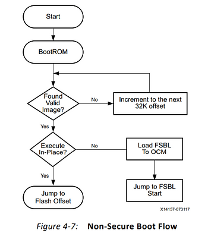
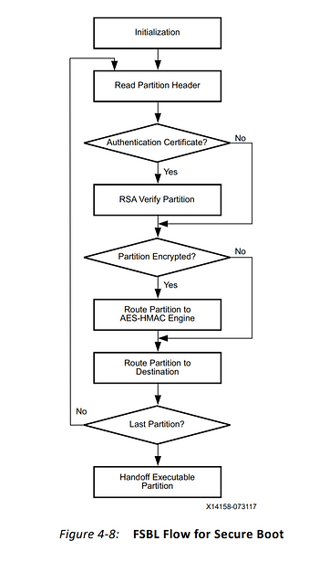
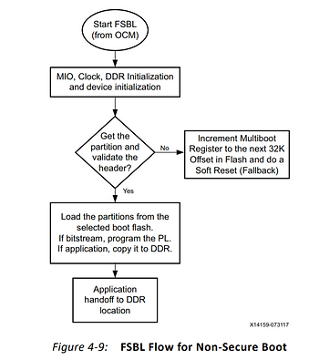

# Zynq-7000 Boot Process

This post lists the Zynq-7000 boot process as documented in the **UltraFast Embedded Design Methodology Guide UG1046 (v2.3) April 20, 2018** at \[[<u>link</u>](https://www.xilinx.com/support/documentation/sw_manuals/ug1046-ultrafast-design-methodology-guide.pdf)\] on pages 156-161.

**<u>From Doc</u>**

The Zynq-7000 AP SoC boot process can be a multistage boot, depending on the system

requirements. This section describes three broadly divided stages of booting and their role

in the booting process.

**Figure 4-6** shows the steps while booting embedded Linux and

application code on a Zynq-7000 AP SoC:

When power is applied to the SoC, the boot process starts from the BootROM. This process loads and then starts executing the first-stage boot loader (FSBL) from on-chip memory (OCM). The FSBL configures the specific initialization. Then, based on the software architecture, the second-stage boot loader (SSBL), such as U-Boot in the case of embedded Linux, is initialized and executed. The FSBL and/or SSBL start the RTOS or embedded Linux and the application code.

**Stage 0**

At power-on or reset, the ARM core runs initialization code from the BootROM. The

BootROM code cannot be changed; it is a factory pre-programmed code that comes with

each Zynq-7000 AP SoC. The BootROM code determines the device on which the next-level

loader is located by reading the boot-mode pins. Depending on the boot-mode setting, the

FSBL is copied from either NAND, parallel NOR, serial NOR (Quad-SPI), or Secure Digital

(SD) flash memories to the OCM.

**Figure 4-7** shows the standard (non-secure) boot flow. The secure boot flow is described in

**Embedded Device Security** (see the doc for this, pages 46-50)**:**

**Stage 1**

The FSBL gets execution control from the BootROM and either runs from the OCM or

execute-in-place flash based on the boot mode settings. The FSBL initializes the PS and

looks for a bit file in the boot device. If found, the FSBL writes the bit file to the PL. Whether

or not a bit file is found, the FSBL loads application binaries and data files into memory until

the complete image has been read from the boot device. Then the FSBL starts executing the

first application binary that was loaded.

Typically, the FSBL initializes the external RAM and loads the second-stage boot loader

(SSBL) or a stand-alone application. Based on the software architecture, if it is a full featured

OS like embedded Linux the SSBL (such as U-Boot in the case of embedded Linux) is

initialized and executed. The FSBL and/or SSBL start the RTOS or embedded Linux and the

application. Then, the FSBL hands over control by jumping to the start address of the SSBL,

in the case of a full-featured OS like embedded Linux, or to an RTOS or application.

Stage 1 can include the user application if it is small enough to fit in OCM memory.

The Zynq-7000 AP SoC supports both secure and non-secure boot methods. The boot-ROM

code flow for both methods is described below.

For secure boot, the principal security objective of the SoC is to lay a foundation of trust. It

does this using integrity, confidentiality, and authentication from the time power is applied

to the time control is asserted. The SoC also provides a method for maintaining this trust.

The SoC does this by using the PL's built-in Advanced Encryption Standard (AES-256) and

hashed message authentication code (HMAC) engines, and the RSA authentication

capability of the PS.

The SoC boots securely unless it is changed from a secure to a non-secure mode. The first

decision point is the initial load of the FSBL. If the FSBL is encrypted, the BootROM code

boots securely and hands control off to the FSBL securely, while disabling JTAG. If the FSBL

is not encrypted, the AES 256 and HMAC engines are disabled and the JTAG ports can be

accessed. To enable RSA authentication, the RSA Enable eFUSE must be programmed.

The Xilinx design tools allow specifying whether the software and bit-stream partitions are

authenticated using the public-key RSA algorithm and whether subsequent images are

encrypted and authenticated using the AES and HMAC engines. An unencrypted partition

can also be specified. This allows use of both public- and private-key algorithms on a

partition basis.

Alternatively, when configuration time is critical, a trade off can be made between security

and boot time, because configuration speed is faster for unencrypted partitions than for

encrypted partitions. A relatively large, open-source U-Boot or Linux image, for example,

loads faster if the image is unencrypted. If any of the secure features are selected, the initial

FSBL, at a minimum, must be encrypted with AES-256 and authenticated with the HMAC

algorithm.

**Figure 4-8** shows the FSBL flow for secure boot mode.

**Figure 4-9** shows the FSBL flow for non-secure boot mode.

For more information about secure boot of the Zynq-7000 AP SoC, refer to the following

documents:

-   Secure Boot in the Zynq-7000 All Programmable SoC (WP426) \[[<u>Ref 35</u>](https://www.xilinx.com/support/documentation/white_papers/wp426-zynq-7000-secure-boot.pdf)\]
    
-   Secure Boot of Zynq-7000 All Programmable SoC (XAPP1175) \[[<u>Ref 42</u>](https://www.xilinx.com/support/documentation/application_notes/xapp1175_zynq_secure_boot.pdf)\]
    

**Stage 2**

This stage could be a second-stage boot loader (SSBL) like U-Boot, or it could be an RTOS

or application. In the case of a full-featured OS like embedded Linux, the SSBL U-Boot runs

in CPU0 to initialize and set up the environment in which the OS will boot. The initialization

includes configuring the MMU to use flat memory (that is, virtual and physical locations are

the same). The boot loader then fetches the kernel image (per the boot-mode setting) and

other information, such as boot arguments, into RAM. Then the loader passes control to the

OS, such as embedded Linux.

In the case of Linux, the OS detects and enables the second processor core, configures and

activates the MMU and data caches, and performs other actions to make a complete system

available to applications.

There is no limit to what each stage can actually do, although some things can be done

more easily in one stage than in others. For example, reading a file from an NTFS USB drive

is possible from Linux, but it requires some development effort to do it from the boot

loader. U-Boot can be adapted to such requirements.

Zynq-7000 All Programmable SoC Software Developers Guide (UG821) \[[<u>Ref 7</u>](https://www.xilinx.com/support/documentation/user_guides/ug821-zynq-7000-swdev.pdf)\] covers the

architecture details, programming model, OS considerations, and complete development

steps for running Linux and applications on Zynq-7000 AP SoC.

**<u>Reference</u>**

Xilinx logo found via https://twitter.com/xilinxinc at [[link](https://pbs.twimg.com/profile_images/535545777020338176/pEWdIYq__400x400.png)]   